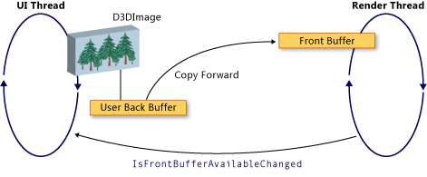

# WPF and Direct3D9 Interoperation
You can include Direct3D9 content in a Windows Presentation Foundation (WPF) application. This topic describes how to create Direct3D9 content so that it efficiently interoperates with WPF.  
  
> [!NOTE]
>  When using Direct3D9 content in WPF, you also need to think about performance. For more information about how to optimize for performance, see [Performance Considerations for Direct3D9 and WPF Interoperability](../../../../docs/framework/wpf/advanced/performance-considerations-for-direct3d9-and-wpf-interoperability.md).  
  
## Display Buffers  
 The <xref:System.Windows.Interop.D3DImage> class manages two display buffers, which are called the *back buffer* and the *front buffer*. The back buffer is your Direct3D9 surface. Changes to the back buffer are copied forward to the front buffer when you call the <xref:System.Windows.Interop.D3DImage.Unlock%2A> method.  
  
 The following illustration shows the relationship between the back buffer and the front buffer.  
  
   
  
## Direct3D9 Device Creation  
 To render Direct3D9 content, you must create a Direct3D9 device. There are two Direct3D9 objects that you can use to create a device, `IDirect3D9` and `IDirect3D9Ex`. Use these objects to create `IDirect3DDevice9` and `IDirect3DDevice9Ex` devices, respectively.  
  
 Create a device by calling one of the following methods.  
  
-   `IDirect3D9 * Direct3DCreate9(UINT SDKVersion);`  
  
-   `HRESULT Direct3DCreate9Ex(UINT SDKVersion, IDirect3D9Ex **ppD3D);`  
  
 On Windows Vista or later operating system, use the `Direct3DCreate9Ex` method with a display that is configured to use the Windows Display Driver Model (WDDM). Use the `Direct3DCreate9` method on any other platform.  
  
### Availability of the Direct3DCreate9Ex method  
 The d3d9.dll has the `Direct3DCreate9Ex` method only on Windows Vista or later operating system. If you directly link the function on Windows XP, your application fails to load. To determine whether the `Direct3DCreate9Ex` method is supported, load the DLL and look for the proc address. The following code shows how to test for the `Direct3DCreate9Ex` method. For a full code example, see [Walkthrough: Creating Direct3D9 Content for Hosting in WPF](../../../../docs/framework/wpf/advanced/walkthrough-creating-direct3d9-content-for-hosting-in-wpf.md).  
  
 [!code-cpp[System.Windows.Interop.D3DImage#RendererManager_EnsureD3DObjects](../../../../samples/snippets/cpp/VS_Snippets_Wpf/System.Windows.Interop.D3DImage/cpp/renderermanager.cpp#renderermanager_ensured3dobjects)]  
  
### HWND Creation  
 Creating a device requires an HWND. In general, you create a dummy HWND for Direct3D9 to use. The following code example shows how to create a dummy HWND.  
  
 [!code-cpp[System.Windows.Interop.D3DImage#RendererManager_EnsureHWND](../../../../samples/snippets/cpp/VS_Snippets_Wpf/System.Windows.Interop.D3DImage/cpp/renderermanager.cpp#renderermanager_ensurehwnd)]  
  
### Present Parameters  
 Creating a device also requires a `D3DPRESENT_PARAMETERS` struct, but only a few parameters are important. These parameters are chosen to minimize the memory footprint.  
  
 Set the `BackBufferHeight` and `BackBufferWidth` fields to 1. Setting them to 0 causes them to be set to the dimensions of the HWND.  
  
 Always set the `D3DCREATE_MULTITHREADED` and `D3DCREATE_FPU_PRESERVE` flags to prevent corrupting memory used by Direct3D9 and to prevent Direct3D9 from changing FPU settings.  
  
 The following code shows how to initialize the `D3DPRESENT_PARAMETERS` struct.  
  
 [!code-cpp[System.Windows.Interop.D3DImage#Renderer_Init](../../../../samples/snippets/cpp/VS_Snippets_Wpf/System.Windows.Interop.D3DImage/cpp/renderer.cpp#renderer_init)]  
  
## Creating the Back Buffer Render Target  
 To display Direct3D9 content in a <xref:System.Windows.Interop.D3DImage>, you create a Direct3D9 surface and assign it by calling the <xref:System.Windows.Interop.D3DImage.SetBackBuffer%2A> method.  
  
### Verifying Adapter Support  
 Before creating a surface, verify that all adapters support the surface properties you require. Even if you render to only one adapter, the WPF window may be displayed on any adapter in the system. You should always write Direct3D9 code that handles multi-adapter configurations, and you should check all adapters for support, because WPF might move the surface among the available adapters.  
  
 The following code example shows how to check all adapters on the system for Direct3D9 support.  
  
 [!code-cpp[System.Windows.Interop.D3DImage#RendererManager_TestSurfaceSettings](../../../../samples/snippets/cpp/VS_Snippets_Wpf/System.Windows.Interop.D3DImage/cpp/renderermanager.cpp#renderermanager_testsurfacesettings)]  
  
### Creating the Surface  
 Before creating a surface, verify that the device capabilities support good performance on the target operating system. For more information, see [Performance Considerations for Direct3D9 and WPF Interoperability](../../../../docs/framework/wpf/advanced/performance-considerations-for-direct3d9-and-wpf-interoperability.md).  
  
 When you have verified device capabilities, you can create the surface. The following code example shows how to create the render target.  
  
 [!code-cpp[System.Windows.Interop.D3DImage#Renderer_CreateSurface](../../../../samples/snippets/cpp/VS_Snippets_Wpf/System.Windows.Interop.D3DImage/cpp/renderer.cpp#renderer_createsurface)]  
  
### WDDM  
 On Windows Vista and later operating systems, which are configured to use the WDDM, you can create a render target texture and pass the level 0 surface to the <xref:System.Windows.Interop.D3DImage.SetBackBuffer%2A> method. This approach is not recommended on Windows XP, because you cannot create a lockable render target texture and performance will be reduced.  
  
## Handling Device State  
 The <xref:System.Windows.Interop.D3DImage> class manages two display buffers, which are called the *back buffer* and the *front buffer*. The back buffer is your Direct3D surface.  Changes to the back buffer are copied forward to the front buffer when you call the <xref:System.Windows.Interop.D3DImage.Unlock%2A> method, where it is displayed on the hardware. Occasionally, the front buffer becomes unavailable. This lack of availability can be caused by screen locking, full-screen exclusive Direct3D applications, user-switching, or other system activities. When this occurs, your WPF application is notified by handling the <xref:System.Windows.Interop.D3DImage.IsFrontBufferAvailableChanged> event.  How your application responds to the front buffer becoming unavailable depends on whether WPF is enabled to fall back to software rendering. The <xref:System.Windows.Interop.D3DImage.SetBackBuffer%2A> method has an overload that takes a parameter that specifies whether WPF falls back to software rendering.  
  
 When you call the <xref:System.Windows.Interop.D3DImage.SetBackBuffer%28System.Windows.Interop.D3DResourceType%2CSystem.IntPtr%29> overload or call the <xref:System.Windows.Interop.D3DImage.SetBackBuffer%28System.Windows.Interop.D3DResourceType%2CSystem.IntPtr%2CSystem.Boolean%29> overload with the `enableSoftwareFallback` parameter set to `false`, the rendering system releases its reference to the back buffer when the front buffer becomes unavailable and nothing is displayed. When the front buffer is available again, the rendering system raises the <xref:System.Windows.Interop.D3DImage.IsFrontBufferAvailableChanged> event to notify your WPF application.  You can create an event handler for the <xref:System.Windows.Interop.D3DImage.IsFrontBufferAvailableChanged> event to restart rendering again with a valid Direct3D surface. To restart rendering, you must call <xref:System.Windows.Interop.D3DImage.SetBackBuffer%2A>.  
  
 When you call the <xref:System.Windows.Interop.D3DImage.SetBackBuffer%28System.Windows.Interop.D3DResourceType%2CSystem.IntPtr%2CSystem.Boolean%29> overload with the `enableSoftwareFallback` parameter set to `true`, the rendering system retains its reference to the back buffer when the front buffer becomes unavailable, so there is no need to call <xref:System.Windows.Interop.D3DImage.SetBackBuffer%2A> when the front buffer is available again.  
  
 When software rendering is enabled, there may be situations where the user’s device becomes unavailable, but the rendering system retains a reference to the Direct3D surface. To check whether a Direct3D9 device is unavailable, call the `TestCooperativeLevel` method. To check a Direct3D9Ex devices call the `CheckDeviceState` method, because the `TestCooperativeLevel` method is deprecated and always returns success. If the user device has become unavailable, call <xref:System.Windows.Interop.D3DImage.SetBackBuffer%2A> to release WPF’s reference to the back buffer.  If you need to reset your device, call <xref:System.Windows.Interop.D3DImage.SetBackBuffer%2A> with the `backBuffer` parameter set to `null`, and then call <xref:System.Windows.Interop.D3DImage.SetBackBuffer%2A> again with `backBuffer` set to a valid Direct3D surface.  
  
 Call the `Reset` method to recover from an invalid device only if you implement multi-adapter support. Otherwise, release all Direct3D9 interfaces and re-create them completely. If the adapter layout has changed, Direct3D9 objects created before the change are not updated.  
  
## Handling Resizing  
 If a <xref:System.Windows.Interop.D3DImage> is displayed at a resolution other than its native size, it is scaled according to the current <xref:System.Windows.Media.RenderOptions.BitmapScalingMode%2A>, except that <xref:System.Windows.Media.Effects.SamplingMode.Bilinear> is substituted for <xref:System.Windows.Media.BitmapScalingMode.Fant>.  
  
 If you require higher fidelity, you must create a new surface when the container of the <xref:System.Windows.Interop.D3DImage> changes size.  
  
 There are three possible approaches to handle resizing.  
  
-   Participate in the layout system and create a new surface when the size changes. Do not create too many surfaces, because you may exhaust or fragment video memory.  
  
-   Wait until a resize event has not occurred for a fixed period of time to create the new surface.  
  
-   Create a <xref:System.Windows.Threading.DispatcherTimer> that checks the container dimensions several times per second.  
  
## Multi-monitor Optimization  
 Significantly reduced performance can result when the rendering system moves a <xref:System.Windows.Interop.D3DImage> to another monitor.  
  
 On WDDM, as long as the monitors are on the same video card and you use `Direct3DCreate9Ex`, there is no reduction in performance. If the monitors are on separate video cards, performance is reduced. On Windows XP, performance is always reduced.  
  
 When the <xref:System.Windows.Interop.D3DImage> moves to another monitor, you can create a new surface on the corresponding adapter to restore good performance.  
  
 To avoid the performance penalty, write code specifically for the multi-monitor case. The following list shows one way to write multi-monitor code.  
  
1.  Find a point of the <xref:System.Windows.Interop.D3DImage> in screen space with the `Visual.ProjectToScreen` method.  
  
2.  Use the `MonitorFromPoint` GDI method to find the monitor that is displaying the point.  
  
3.  Use the `IDirect3D9::GetAdapterMonitor` method to find which Direct3D9 adapter the monitor is on.  
  
4.  If the adapter is not the same as the adapter with the back buffer, create a new back buffer on the new monitor and assign it to the <xref:System.Windows.Interop.D3DImage> back buffer.  
  
> [!NOTE]
>  If the <xref:System.Windows.Interop.D3DImage> straddles monitors, performance will be slow, except in the case of WDDM and `IDirect3D9Ex` on the same adapter. There is no way to improve performance in this situation.  
  
 The following code example shows how to find the current monitor.  
  
 [!code-cpp[System.Windows.Interop.D3DImage#RendererManager_SetAdapter](../../../../samples/snippets/cpp/VS_Snippets_Wpf/System.Windows.Interop.D3DImage/cpp/renderermanager.cpp#renderermanager_setadapter)]  
  
 Update the monitor when the <xref:System.Windows.Interop.D3DImage> container's size or position changes, or update the monitor by using a `DispatcherTimer` that updates a few times per second.  
  
## WPF Software Rendering  
 WPF renders synchronously on the UI thread in software in the following situations.  
  
-   Printing  
  
-   <xref:System.Windows.Media.Effects.BitmapEffect>  
  
-   <xref:System.Windows.Media.Imaging.RenderTargetBitmap>  
  
 When one of these situations occurs, the rendering system calls the <xref:System.Windows.Interop.D3DImage.CopyBackBuffer%2A> method to copy the hardware buffer to software. The default implementation calls the `GetRenderTargetData` method with your surface. Because this call occurs outside of the Lock/Unlock pattern, it may fail. In this case, the `CopyBackBuffer` method returns `null` and no image is displayed.  
  
 You can override the <xref:System.Windows.Interop.D3DImage.CopyBackBuffer%2A> method, call the base implementation, and if it returns `null`, you can return a placeholder <xref:System.Windows.Media.Imaging.BitmapSource>.  
  
 You can also implement your own software rendering instead of calling the base implementation.  
  
> [!NOTE]
>  If WPF is rendering completely in software, <xref:System.Windows.Interop.D3DImage> is not shown because WPF does not have a front buffer.  
  
## See Also  
 <xref:System.Windows.Interop.D3DImage>  
 [Performance Considerations for Direct3D9 and WPF Interoperability](../../../../docs/framework/wpf/advanced/performance-considerations-for-direct3d9-and-wpf-interoperability.md)  
 [Walkthrough: Creating Direct3D9 Content for Hosting in WPF](../../../../docs/framework/wpf/advanced/walkthrough-creating-direct3d9-content-for-hosting-in-wpf.md)  
 [Walkthrough: Hosting Direct3D9 Content in WPF](../../../../docs/framework/wpf/advanced/walkthrough-hosting-direct3d9-content-in-wpf.md)
