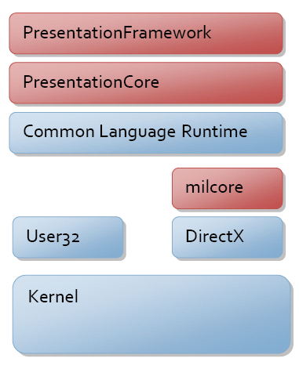
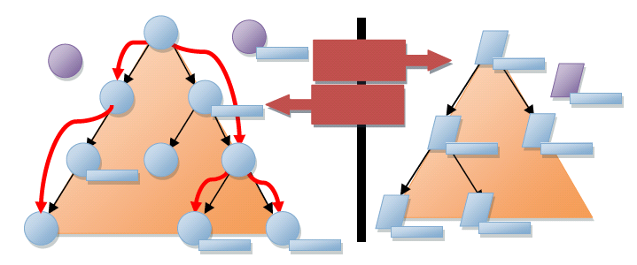

# WPF Architecture
This topic provides a guided tour of the [!INCLUDE[TLA#tla_wpf](../../../../includes/tlasharptla-wpf-md.md)] class hierarchy. It covers most of the major subsystems of [!INCLUDE[TLA2#tla_wpf](../../../../includes/tla2sharptla-wpf-md.md)], and describes how they interact. It also details some of the choices made by the architects of [!INCLUDE[TLA2#tla_wpf](../../../../includes/tla2sharptla-wpf-md.md)].  
  
  
   
## System.Object  
 The primary [!INCLUDE[TLA2#tla_wpf](../../../../includes/tla2sharptla-wpf-md.md)] programming model is exposed through managed code. Early in the design phase of [!INCLUDE[TLA2#tla_wpf](../../../../includes/tla2sharptla-wpf-md.md)] there were a number of debates about where the line should be drawn between the managed components of the system and the unmanaged ones. The [!INCLUDE[TLA2#tla_clr](../../../../includes/tla2sharptla-clr-md.md)] provides a number of features that make development more productive and robust (including memory management, error handling, common type system, etc.) but they come at a cost.  
  
 The major components of [!INCLUDE[TLA2#tla_wpf](../../../../includes/tla2sharptla-wpf-md.md)] are illustrated in the figure below. The red sections of the diagram (PresentationFramework, PresentationCore, and milcore) are the major code portions of [!INCLUDE[TLA2#tla_wpf](../../../../includes/tla2sharptla-wpf-md.md)]. Of these, only one is an unmanaged component – milcore. Milcore is written in unmanaged code in order to enable tight integration with [!INCLUDE[TLA2#tla_dx](../../../../includes/tla2sharptla-dx-md.md)]. All display in [!INCLUDE[TLA2#tla_wpf](../../../../includes/tla2sharptla-wpf-md.md)] is done through the [!INCLUDE[TLA2#tla_dx](../../../../includes/tla2sharptla-dx-md.md)] engine, allowing for efficient hardware and software rendering. [!INCLUDE[TLA2#tla_wpf](../../../../includes/tla2sharptla-wpf-md.md)] also required fine control over memory and execution. The composition engine in milcore is extremely performance sensitive, and required giving up many advantages of the [!INCLUDE[TLA2#tla_clr](../../../../includes/tla2sharptla-clr-md.md)] to gain performance.  
  
   
  
 Communication between the managed and unmanaged portions of [!INCLUDE[TLA2#tla_wpf](../../../../includes/tla2sharptla-wpf-md.md)] is discussed later in this topic. The remainder of the managed programming model is described below.  
  
   
## System.Threading.DispatcherObject  
 Most objects in [!INCLUDE[TLA2#tla_wpf](../../../../includes/tla2sharptla-wpf-md.md)] derive from <xref:System.Windows.Threading.DispatcherObject>, which provides the basic constructs for dealing with concurrency and threading. [!INCLUDE[TLA2#tla_wpf](../../../../includes/tla2sharptla-wpf-md.md)] is based on a messaging system implemented by the dispatcher. This works much like the familiar [!INCLUDE[TLA#tla_win32](../../../../includes/tlasharptla-win32-md.md)] message pump; in fact, the [!INCLUDE[TLA2#tla_wpf](../../../../includes/tla2sharptla-wpf-md.md)] dispatcher uses User32 messages for performing cross thread calls.  
  
 There are really two core concepts to understand when discussing concurrency in [!INCLUDE[TLA2#tla_wpf](../../../../includes/tla2sharptla-wpf-md.md)] – the dispatcher and thread affinity.  
  
 During the design phase of [!INCLUDE[TLA2#tla_wpf](../../../../includes/tla2sharptla-wpf-md.md)], the goal was to move to a single thread of execution, but a non-thread "affinitized" model. Thread affinity happens when a component uses the identity of the executing thread to store some type of state. The most common form of this is to use the thread local store (TLS) to store state. Thread affinity requires that each logical thread of execution be owned by only one physical thread in the operating system, which can become memory intensive. In the end, WPF’s threading model was kept in sync with the existing User32 threading model of single threaded execution with thread affinity. The primary reason for this was interoperability – systems like [!INCLUDE[TLA2#tla_ole2.0](../../../../includes/tla2sharptla-ole2-0-md.md)], the clipboard, and Internet Explorer all require single thread affinity (STA) execution.  
  
 Given that you have objects with STA threading, you need a way to communicate between threads, and validate that you are on the correct thread. Herein lies the role of the dispatcher. The dispatcher is a basic message dispatching system, with multiple prioritized queues. Examples of messages include raw input notifications (mouse moved), framework functions (layout), or user commands (execute this method). By deriving from <xref:System.Windows.Threading.DispatcherObject>, you create a [!INCLUDE[TLA2#tla_clr](../../../../includes/tla2sharptla-clr-md.md)] object that has STA behavior, and will be given a pointer to a dispatcher at creation time.  
  
   
## System.Windows.DependencyObject  
 One of the primary architectural philosophies used in building [!INCLUDE[TLA2#tla_wpf](../../../../includes/tla2sharptla-wpf-md.md)] was a preference for properties over methods or events. Properties are declarative and allow you to more easily specify intent instead of action. This also supported a model driven, or data driven, system for displaying user interface content. This philosophy had the intended effect of creating more properties that you could bind to, in order to better control the behavior of an application.  
  
 In order to have more of the system driven by properties, a richer property system than what the [!INCLUDE[TLA2#tla_clr](../../../../includes/tla2sharptla-clr-md.md)] provides was needed. A simple example of this richness is change notifications. In order to enable two way binding, you need both sides of the bind to support change notification. In order to have behavior tied to property values, you need to be notified when the property value changes. The [!INCLUDE[TLA#tla_netframewk](../../../../includes/tlasharptla-netframewk-md.md)] has an interface, **INotifyPropertyChange**, which allows an object to publish change notifications, however it is optional.  
  
 [!INCLUDE[TLA2#tla_wpf](../../../../includes/tla2sharptla-wpf-md.md)] provides a richer property system, derived from the <xref:System.Windows.DependencyObject> type. The property system is truly a "dependency" property system in that it tracks dependencies between property expressions and automatically revalidates property values when dependencies change. For example, if you have a property that inherits (like <xref:System.Windows.Controls.Control.FontSize%2A>), the system is automatically updated if the property changes on a parent of an element that inherits the value.  
  
 The foundation of the [!INCLUDE[TLA2#tla_wpf](../../../../includes/tla2sharptla-wpf-md.md)] property system is the concept of a property expression. In this first release of [!INCLUDE[TLA2#tla_wpf](../../../../includes/tla2sharptla-wpf-md.md)], the property expression system is closed, and the expressions are all provided as part of the framework. Expressions are why the property system doesn’t have data binding, styling, or inheritance hard coded, but rather provided by later layers within the framework.  
  
 The property system also provides for sparse storage of property values. Because objects can have dozens (if not hundreds) of properties, and most of the values are in their default state (inherited, set by styles, etc.), not every instance of an object needs to have the full weight of every property defined on it.  
  
 The final new feature of the property system is the notion of attached properties. [!INCLUDE[TLA2#tla_wpf](../../../../includes/tla2sharptla-wpf-md.md)] elements are built on the principle of composition and component reuse. It is often the case that some containing element (like a <xref:System.Windows.Controls.Grid> layout element) needs additional data on child elements to control its behavior (like the Row/Column information). Instead of associating all of these properties with every element, any object is allowed to provide property definitions for any other object. This is similar to the "expando" features of JavaScript.  
  
   
## System.Windows.Media.Visual  
 With a system defined, the next step is getting pixels drawn to the screen. The <xref:System.Windows.Media.Visual> class provides for building a tree of visual objects, each optionally containing drawing instructions and metadata about how to render those instructions (clipping, transformation, etc.). <xref:System.Windows.Media.Visual> is designed to be extremely lightweight and flexible, so most of the features have no public [!INCLUDE[TLA2#tla_api](../../../../includes/tla2sharptla-api-md.md)] exposure and rely heavily on protected callback functions.  
  
 <xref:System.Windows.Media.Visual> is really the entry point to the [!INCLUDE[TLA2#tla_wpf](../../../../includes/tla2sharptla-wpf-md.md)] composition system. <xref:System.Windows.Media.Visual> is the point of connection between these two subsystems, the managed [!INCLUDE[TLA#tla_api](../../../../includes/tlasharptla-api-md.md)] and the unmanaged milcore.  
  
 [!INCLUDE[TLA2#tla_wpf](../../../../includes/tla2sharptla-wpf-md.md)] displays data by traversing the unmanaged data structures managed by the milcore. These structures, called composition nodes, represent a hierarchical display tree with rendering instructions at each node. This tree, illustrated on the right hand side of the figure below, is only accessible through a messaging protocol.  
  
 When programming [!INCLUDE[TLA2#tla_wpf](../../../../includes/tla2sharptla-wpf-md.md)], you create <xref:System.Windows.Media.Visual> elements, and derived types, which internally communicate to the composition tree through this messaging protocol. Each <xref:System.Windows.Media.Visual> in [!INCLUDE[TLA2#tla_wpf](../../../../includes/tla2sharptla-wpf-md.md)] may create one, none, or several composition nodes.  
  
   
  
 There is a very important architectural detail to notice here – the entire tree of visuals and drawing instructions is cached. In graphics terms, [!INCLUDE[TLA2#tla_wpf](../../../../includes/tla2sharptla-wpf-md.md)] uses a retained rendering system. This enables the system to repaint at high refresh rates without the composition system blocking on callbacks to user code. This helps prevent the appearance of an unresponsive application.  
  
 Another important detail that isn’t really noticeable in the diagram is how the system actually performs composition.  
  
 In User32 and [!INCLUDE[TLA2#tla_gdi](../../../../includes/tla2sharptla-gdi-md.md)], the system works on an immediate mode clipping system. When a component needs to be rendered, the system establishes a clipping bounds outside of which the component isn’t allowed to touch the pixels, and then the component is asked to paint pixels in that box. This system works very well in memory constrained systems because when something changes you only have to touch the affected component – no two components ever contribute to the color of a single pixel.  
  
 [!INCLUDE[TLA2#tla_wpf](../../../../includes/tla2sharptla-wpf-md.md)] uses a "painter's algorithm" painting model. This means that instead of clipping each component, each component is asked to render from the back to the front of the display. This allows each component to paint over the previous component's display. The advantage of this model is that you can have complex, partially transparent shapes. With today’s modern graphics hardware, this model is relatively fast (which wasn’t the case when User32/ [!INCLUDE[TLA2#tla_gdi](../../../../includes/tla2sharptla-gdi-md.md)] were created).  
  
 As mentioned previously, a core philosophy of [!INCLUDE[TLA2#tla_wpf](../../../../includes/tla2sharptla-wpf-md.md)] is to move to a more declarative, "property centric" model of programming. In the visual system, this shows up in a couple of interesting places.  
  
 First, if you think about the retained mode graphic system, this is really moving away from an imperative DrawLine/DrawLine type model, to a data oriented model – new Line()/new Line(). This move to data driven rendering allows complex operations on the drawing instructions to be expressed using properties. The types deriving from <xref:System.Windows.Media.Drawing> are effectively the object model for rendering.  
  
 Second, if you evaluate the animation system, you'll see that it is almost completely declarative. Instead of requiring a developer to compute the next location, or next color, you can express animations as a set of properties on an animation object. These animations can then express the intent of the developer or designer (move this button from here to there in 5 seconds), and the system can determine the most efficient way to accomplish that.  
  
   
## System.Windows.UIElement  
 <xref:System.Windows.UIElement> defines core subsystems including Layout, Input, and Events.  
  
 Layout is a core concept in [!INCLUDE[TLA2#tla_wpf](../../../../includes/tla2sharptla-wpf-md.md)]. In many systems there is either a fixed set of layout models (HTML supports three models for layout; flow, absolute, and tables) or no model for layout (User32 really only supports absolute positioning). [!INCLUDE[TLA2#tla_wpf](../../../../includes/tla2sharptla-wpf-md.md)] started with the assumption that developers and designers wanted a flexible, extensible layout model, which could be driven by property values rather than imperative logic. At the <xref:System.Windows.UIElement> level, the basic contract for layout is introduced – a two phase model with <xref:System.Windows.UIElement.Measure%2A> and <xref:System.Windows.UIElement.Arrange%2A> passes.  
  
 <xref:System.Windows.UIElement.Measure%2A> allows a component to determine how much size it would like to take. This is a separate phase from <xref:System.Windows.UIElement.Arrange%2A> because there are many situations where a parent element will ask a child to measure several times to determine its optimal position and size. The fact that parent elements ask child elements to measure demonstrates another key philosophy of [!INCLUDE[TLA2#tla_wpf](../../../../includes/tla2sharptla-wpf-md.md)] – size to content. All controls in [!INCLUDE[TLA2#tla_wpf](../../../../includes/tla2sharptla-wpf-md.md)] support the ability to size to the natural size of their content. This makes localization much easier, and allows for dynamic layout of elements as things resize. The <xref:System.Windows.UIElement.Arrange%2A> phase allows a parent to position and determine the final size of each child.  
  
 A lot of time is often spent talking about the output side of [!INCLUDE[TLA2#tla_wpf](../../../../includes/tla2sharptla-wpf-md.md)] – <xref:System.Windows.Media.Visual> and related objects. However there is a tremendous amount of innovation on the input side as well. Probably the most fundamental change in the input model for [!INCLUDE[TLA2#tla_wpf](../../../../includes/tla2sharptla-wpf-md.md)] is the consistent model by which input events are routed through the system.  
  
 Input originates as a signal on a kernel mode device driver and gets routed to the correct process and thread through an intricate process involving the Windows kernel and User32. Once the User32 message corresponding to the input is routed to [!INCLUDE[TLA2#tla_wpf](../../../../includes/tla2sharptla-wpf-md.md)], it is converted into a [!INCLUDE[TLA2#tla_wpf](../../../../includes/tla2sharptla-wpf-md.md)] raw input message and sent to the dispatcher. [!INCLUDE[TLA2#tla_wpf](../../../../includes/tla2sharptla-wpf-md.md)] allows for raw input events to be converted to multiple actual events, enabling features like "MouseEnter" to be implemented at a low level of the system with guaranteed delivery.  
  
 Each input event is converted to at least two events – a "preview" event and the actual event. All events in [!INCLUDE[TLA2#tla_wpf](../../../../includes/tla2sharptla-wpf-md.md)] have a notion of routing through the element tree. Events are said to "bubble" if they traverse from a target up the tree to the root, and are said to "tunnel" if that start at the root and traverse down to a target. Input preview events tunnel, enabling any element in the tree an opportunity to filter or take action on the event. The regular (non-preview) events then bubble from the target up to the root.  
  
 This split between the tunnel and bubble phase makes implementation of features like keyboard accelerators work in a consistent fashion in a composite world. In User32 you would implement keyboard accelerators by having a single global table containing all the accelerators you wanted to support (Ctrl+N mapping to "New"). In the dispatcher for your application you would call **TranslateAccelerator** which would sniff the input messages in User32 and determine if any matched a registered accelerator. In [!INCLUDE[TLA2#tla_wpf](../../../../includes/tla2sharptla-wpf-md.md)] this wouldn’t work because the system is fully "composable" – any element can handle and use any keyboard accelerator. Having this two phase model for input allows components to implement their own "TranslateAccelerator".  
  
 To take this one step further, <xref:System.Windows.UIElement> also introduces the notion of CommandBindings. The [!INCLUDE[TLA2#tla_wpf](../../../../includes/tla2sharptla-wpf-md.md)] command system allows developers to define functionality in terms of a command end point – something that implements <xref:System.Windows.Input.ICommand>. Command bindings enable an element to define a mapping between an input gesture (Ctrl+N) and a command (New). Both the input gestures and command definitions are extensible, and can be wired together at usage time. This makes it trivial, for example, to allow an end user to customize the key bindings that they want to use within an application.  
  
 To this point in the topic, "core" features of [!INCLUDE[TLA2#tla_wpf](../../../../includes/tla2sharptla-wpf-md.md)] – features implemented in the PresentationCore assembly, have been the focus. When building [!INCLUDE[TLA2#tla_wpf](../../../../includes/tla2sharptla-wpf-md.md)], a clean separation between foundational pieces (like the contract for layout with **Measure** and **Arrange**) and framework pieces (like the implementation of a specific layout like <xref:System.Windows.Controls.Grid>) was the desired outcome. The goal was to provide an extensibility point low in the stack that would allow external developers to create their own frameworks if needed.  
  
   
## System.Windows.FrameworkElement  
 <xref:System.Windows.FrameworkElement> can be looked at in two different ways. It introduces a set of policies and customizations on the subsystems introduced in lower layers of [!INCLUDE[TLA2#tla_wpf](../../../../includes/tla2sharptla-wpf-md.md)]. It also introduces a set of new subsystems.  
  
 The primary policy introduced by <xref:System.Windows.FrameworkElement> is around application layout. <xref:System.Windows.FrameworkElement> builds on the basic layout contract introduced by <xref:System.Windows.UIElement> and adds the notion of a layout "slot" that makes it easier for layout authors to have a consistent set of property driven layout semantics. Properties like <xref:System.Windows.FrameworkElement.HorizontalAlignment%2A>, <xref:System.Windows.FrameworkElement.VerticalAlignment%2A>, <xref:System.Windows.FrameworkElement.MinWidth%2A>, and <xref:System.Windows.FrameworkElement.Margin%2A> (to name a few) give all components derived from <xref:System.Windows.FrameworkElement> consistent behavior inside of layout containers.  
  
 <xref:System.Windows.FrameworkElement> also provides easier [!INCLUDE[TLA2#tla_api](../../../../includes/tla2sharptla-api-md.md)] exposure to many features found in the core layers of [!INCLUDE[TLA2#tla_wpf](../../../../includes/tla2sharptla-wpf-md.md)]. For example, <xref:System.Windows.FrameworkElement> provides direct access to animation through the <xref:System.Windows.FrameworkElement.BeginStoryboard%2A> method. A <xref:System.Windows.Media.Animation.Storyboard> provides a way to script multiple animations against a set of properties.  
  
 The two most critical things that <xref:System.Windows.FrameworkElement> introduces are data binding and styles.  
  
 The data binding subsystem in [!INCLUDE[TLA2#tla_wpf](../../../../includes/tla2sharptla-wpf-md.md)] should be relatively familiar to anyone that has used [!INCLUDE[TLA#tla_winforms](../../../../includes/tlasharptla-winforms-md.md)] or [!INCLUDE[TLA#tla_aspnet](../../../../includes/tlasharptla-aspnet-md.md)] for creating an application [!INCLUDE[TLA#tla_ui](../../../../includes/tlasharptla-ui-md.md)]. In each of these systems, there is a simple way to express that you want one or more properties from a given element to be bound to a piece of data. [!INCLUDE[TLA2#tla_wpf](../../../../includes/tla2sharptla-wpf-md.md)] has full support for property binding, transformation, and list binding.  
  
 One of the most interesting features of data binding in [!INCLUDE[TLA2#tla_wpf](../../../../includes/tla2sharptla-wpf-md.md)] is the introduction of data templates. Data templates allow you to declaratively specify how a piece of data should be visualized. Instead of creating a custom user interface that can be bound to data, you can instead turn the problem around and let the data determine the display that will be created.  
  
 Styling is really a lightweight form of data binding. Using styling you can bind a set of properties from a shared definition to one or more instances of an element. Styles get applied to an element either by explicit reference (by setting the <xref:System.Windows.FrameworkElement.Style%2A> property) or implicitly by associating a style with the [!INCLUDE[TLA2#tla_clr](../../../../includes/tla2sharptla-clr-md.md)] type of the element.  
  
   
## System.Windows.Controls.Control  
 Control’s most significant feature is templating. If you think about WPF’s composition system as a retained mode rendering system, templating allows a control to describe its rendering in a parameterized, declarative manner. A <xref:System.Windows.Controls.ControlTemplate> is really nothing more than a script to create a set of child elements, with bindings to properties offered by the control.  
  
 <xref:System.Windows.Controls.Control> provides a set of stock properties, <xref:System.Windows.Controls.Control.Foreground%2A>, <xref:System.Windows.Controls.Control.Background%2A>, <xref:System.Windows.Controls.Control.Padding%2A>, to name a few, which template authors can then use to customize the display of a control. The implementation of a control provides a data model and interaction model. The interaction model defines a set of commands (like Close for a window) and bindings to input gestures (like clicking the red X in the upper corner of the window). The data model provides a set of properties to either customize the interaction model or customize the display (determined by the template).  
  
 This split between the data model (properties), interaction model (commands and events), and display model (templates) enables complete customization of a control’s look and behavior.  
  
 A common aspect of the data model of controls is the content model. If you look at a control like <xref:System.Windows.Controls.Button>, you will see that it has a property named "Content" of type <xref:System.Object>. In [!INCLUDE[TLA#tla_winforms](../../../../includes/tlasharptla-winforms-md.md)] and [!INCLUDE[TLA#tla_aspnet](../../../../includes/tlasharptla-aspnet-md.md)], this property would typically be a string – however that limits the type of content you can put in a button. Content for a button can either be a simple string, a complex data object, or an entire element tree. In the case of a data object, the data template is used to construct a display.  
  
   
## Summary  
 [!INCLUDE[TLA2#tla_wpf](../../../../includes/tla2sharptla-wpf-md.md)] is designed to allow you to create dynamic, data driven presentation systems. Every part of the system is designed to create objects through property sets that drive behavior. Data binding is a fundamental part of the system, and is integrated at every layer.  
  
 Traditional applications create a display and then bind to some data. In [!INCLUDE[TLA2#tla_wpf](../../../../includes/tla2sharptla-wpf-md.md)], everything about the control, every aspect of the display, is generated by some type of data binding. The text found inside a button is displayed by creating a composed control inside of the button and binding its display to the button’s content property.  
  
 When you begin developing [!INCLUDE[TLA2#tla_wpf](../../../../includes/tla2sharptla-wpf-md.md)] based applications, it should feel very familiar. You can set properties, use objects, and data bind in much the same way that you can using [!INCLUDE[TLA#tla_winforms](../../../../includes/tlasharptla-winforms-md.md)] or [!INCLUDE[TLA#tla_aspnet](../../../../includes/tlasharptla-aspnet-md.md)]. With a deeper investigation into the architecture of [!INCLUDE[TLA2#tla_wpf](../../../../includes/tla2sharptla-wpf-md.md)], you'll find that the possibility exists for creating much richer applications that fundamentally treat data as the core driver of the application.  
  
## See Also  
 <xref:System.Windows.Media.Visual>  
 <xref:System.Windows.UIElement>  
 <xref:System.Windows.Input.ICommand>  
 <xref:System.Windows.FrameworkElement>  
 <xref:System.Windows.Threading.DispatcherObject>  
 <xref:System.Windows.Input.CommandBinding>  
 <xref:System.Windows.Controls.Control>  
 [Data Binding Overview](../../../../docs/framework/wpf/data/data-binding-overview.md)  
 [Layout](../../../../docs/framework/wpf/advanced/layout.md)  
 [Animation Overview](../../../../docs/framework/wpf/graphics-multimedia/animation-overview.md)
