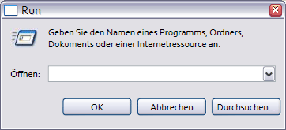
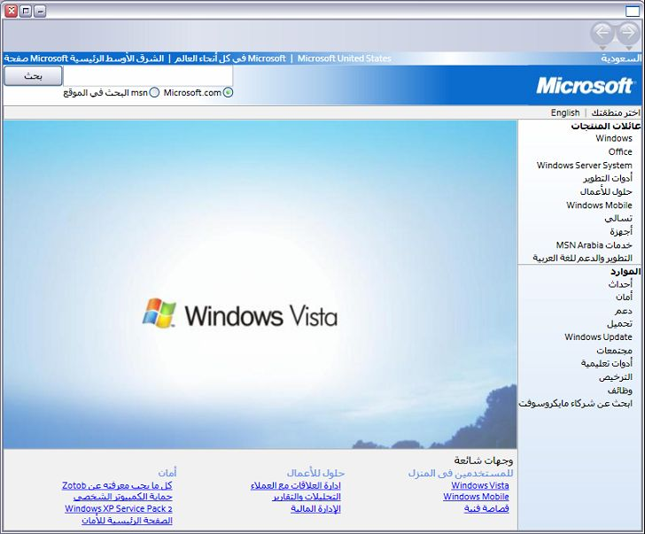

# WPF Globalization and Localization Overview
When you limit your product's availability to only one language, you limit your potential customer base to a fraction of our world’s 6.5 billion population. If you want your applications to reach a global audience, cost-effective localization of your product is one of the best and most economical ways to reach more customers.  
  
 This overview introduces globalization and localization in [!INCLUDE[TLA#tla_winclient](../../../../includes/tlasharptla-winclient-md.md)]. Globalization is the design and development of applications that perform in multiple locations. For example, globalization supports localized user interfaces and regional data for users in different cultures. [!INCLUDE[TLA2#tla_winclient](../../../../includes/tla2sharptla-winclient-md.md)] provides globalized design features, including automatic layout, satellite assemblies, and localized attributes and commenting.
  
 Localization is the translation of application resources into localized versions for the specific cultures that the application supports. When you localize in [!INCLUDE[TLA2#tla_winclient](../../../../includes/tla2sharptla-winclient-md.md)], you use the APIs in the <xref:System.Windows.Markup.Localizer> namespace. These APIs power the [LocBaml Tool Sample](http://go.microsoft.com/fwlink/?LinkID=160016) command-line tool. For information about how to build and use LocBaml, see [Localize an Application](../../../../docs/framework/wpf/advanced/how-to-localize-an-application.md).    
  
## Best Practices for Globalization and Localization in WPF  
 You can make the most of the globalization and localization functionality that is built into [!INCLUDE[TLA2#tla_winclient](../../../../includes/tla2sharptla-winclient-md.md)] by following the UI design and localization-related tips that this section provides.  
  
### Best Practices for WPF UI Design  
 When you design a [!INCLUDE[TLA2#tla_winclient](../../../../includes/tla2sharptla-winclient-md.md)]–based [!INCLUDE[TLA2#tla_ui](../../../../includes/tla2sharptla-ui-md.md)], consider implementing these best practices:  
  
-   Write your [!INCLUDE[TLA2#tla_ui](../../../../includes/tla2sharptla-ui-md.md)] in [!INCLUDE[TLA2#tla_xaml](../../../../includes/tla2sharptla-xaml-md.md)]; avoid creating [!INCLUDE[TLA2#tla_ui](../../../../includes/tla2sharptla-ui-md.md)] in code. When you create your [!INCLUDE[TLA2#tla_ui](../../../../includes/tla2sharptla-ui-md.md)] by using [!INCLUDE[TLA2#tla_xaml](../../../../includes/tla2sharptla-xaml-md.md)], you expose it through built-in localization APIs.  
  
-   Avoid using absolute positions and fixed sizes to lay out content; instead, use relative or automatic sizing.
  
    -   Use <xref:System.Windows.Window.SizeToContent%2A>; and keep widths and heights set to `Auto`.  
  
    -   Avoid using <xref:System.Windows.Controls.Canvas> to lay out [!INCLUDE[TLA2#tla_ui](../../../../includes/tla2sharptla-ui-md.md)]s.  
  
    -   Use <xref:System.Windows.Controls.Grid> and its size-sharing feature.  
  
-   Provide extra space in margins because localized text often requires more space. Extra space allows for possible overhanging characters.  
  
-   Enable <xref:System.Windows.Controls.TextBlock.TextWrapping%2A> on <xref:System.Windows.Controls.TextBlock> to avoid clipping.
  
-   Set the **xml:lang** attribute. This attribute describes the culture of a specific element and its child elements. The value of this property changes the behavior of several features in [!INCLUDE[TLA2#tla_winclient](../../../../includes/tla2sharptla-winclient-md.md)]. For example, it changes the behavior of hyphenation, spell checking, number substitution, complex script shaping, and font fallback. See [Globalization for WPF](../../../../docs/framework/wpf/advanced/globalization-for-wpf.md) for more information about setting the [xml:lang Handling in XAML](../../../../docs/framework/xaml-services/xml-lang-handling-in-xaml.md).  
  
-   Create a customized composite font to obtain better control of fonts that are used for different languages. By default, [!INCLUDE[TLA2#tla_winclient](../../../../includes/tla2sharptla-winclient-md.md)] uses the GlobalUserInterface.composite font in your Windows\Fonts directory.  
  
-   When you create navigation applications that may be localized in a culture that presents text in a right-to-left format, explicitly set the <xref:System.Windows.FlowDirection> of every page to ensure the page does not inherit <xref:System.Windows.FlowDirection> from the <xref:System.Windows.Navigation.NavigationWindow>.  
  
-   When you create stand-alone navigation applications that are hosted outside a browser, set the <xref:System.Windows.Application.StartupUri%2A> for your initial application to a <xref:System.Windows.Navigation.NavigationWindow> instead of to a page (for example, `<Application StartupUri="NavigationWindow.xaml">`). This design enables you to change the <xref:System.Windows.FlowDirection> of the Window and the navigation bar. For more information and an example, see [Globalization Homepage Sample](http://go.microsoft.com/fwlink/?LinkID=159990).  
  
### Best Practices for WPF Localization  
 When you localize [!INCLUDE[TLA2#tla_winclient](../../../../includes/tla2sharptla-winclient-md.md)]–based applications, consider implementing these best practices:  
  
-   Use localization comments to provide extra context for localizers.  
  
-   Use localization attributes to control localization instead of selectively omitting <xref:System.Windows.Markup.Localizer.BamlLocalizableResourceKey.Uid%2A> properties on elements. See [Localization Attributes and Comments](../../../../docs/framework/wpf/advanced/localization-attributes-and-comments.md) for more information.  
  
-   Use **msbuild /t:updateuid** and **/t:checkuid** to add and check <xref:System.Windows.Markup.Localizer.BamlLocalizableResourceKey.Uid%2A> properties in your [!INCLUDE[TLA2#tla_xaml](../../../../includes/tla2sharptla-xaml-md.md)]. Use <xref:System.Windows.Markup.Localizer.BamlLocalizableResourceKey.Uid%2A> properties to track changes between development and localization. <xref:System.Windows.Markup.Localizer.BamlLocalizableResourceKey.Uid%2A> properties help you localize new development changes. If you manually add <xref:System.Windows.Markup.Localizer.BamlLocalizableResourceKey.Uid%2A> properties to a [!INCLUDE[TLA2#tla_ui](../../../../includes/tla2sharptla-ui-md.md)], the task is typically tedious and less accurate.  
  
    -   Do not edit or change <xref:System.Windows.Markup.Localizer.BamlLocalizableResourceKey.Uid%2A> properties after you begin localization.  
  
    -   Do not use duplicate <xref:System.Windows.Markup.Localizer.BamlLocalizableResourceKey.Uid%2A> properties (remember this tip when you use the copy-and-paste command).  
  
    -   Set the `UltimateResourceFallback` location in AssemblyInfo.* to specify the appropriate language for fallback (for example, `[assembly: NeutralResourcesLanguage("en-US",   UltimateResourceFallbackLocation.Satellite)]`).  
  
         If you decide to include your source language in the main assembly by omitting the `<UICulture>` tag in your project file, set the `UltimateResourceFallback` location as the main assembly instead of the satellite (for example, `[assembly: NeutralResourcesLanguage("en-US", UltimateResourceFallbackLocation.MainAssembly)]`).  
  
   
## Localize a WPF Application  
 When you localize a [!INCLUDE[TLA2#tla_winclient](../../../../includes/tla2sharptla-winclient-md.md)] application, you have several options. For example, you can bind the localizable resources in your application to an [!INCLUDE[TLA2#tla_xml](../../../../includes/tla2sharptla-xml-md.md)] file, store localizable text in resx tables, or have your localizer use [!INCLUDE[TLA#tla_xaml](../../../../includes/tlasharptla-xaml-md.md)] files. This section describes a localization workflow that uses the BAML form of XAML, which provides several benefits:  
  
-   You can localize after you build .  
  
-   You can update to a newer version of the BAML form of XAMLwith localizations from an older version of the BAML form of XAML so that you can localize at the same time that you develop.  
  
-   You can validate original source elements and semantics at compile time because the BAML form of XAML is the compiled form of [!INCLUDE[TLA2#tla_xaml](../../../../includes/tla2sharptla-xaml-md.md)].  
  
### Localization Build Process  
 When you develop a [!INCLUDE[TLA2#tla_winclient](../../../../includes/tla2sharptla-winclient-md.md)] application, the build process for localization is as follows:  
  
-   The developer creates and globalizes the [!INCLUDE[TLA2#tla_winclient](../../../../includes/tla2sharptla-winclient-md.md)] application. In the project file the developer sets `<UICulture>en-US</UICulture>` so that when the application is compiled, a language-neutral main assembly is generated. This assembly has a satellite .resources.dll file that contains all the localizable resources. Optionally, you can keep the source language in the main assembly because our localization [!INCLUDE[TLA2#tla_api#plural](../../../../includes/tla2sharptla-apisharpplural-md.md)] support extraction from the main assembly.  
  
-   When the file is compiled into the build, the [!INCLUDE[TLA2#tla_xaml](../../../../includes/tla2sharptla-xaml-md.md)] is converted to the BAML form of XAML. The culturally neutral `MyDialog.exe` and the culturally dependent (English) `MyDialog.resources.dll` files are released to the English-speaking customer.  
  
### Localization Workflow  
 The localization process begins after the unlocalized `MyDialog.resources.dll` file is built. The [!INCLUDE[TLA2#tla_ui](../../../../includes/tla2sharptla-ui-md.md)] elements and properties in your original [!INCLUDE[TLA2#tla_xaml](../../../../includes/tla2sharptla-xaml-md.md)] are extracted from the BAML form of XAML into key-value pairs by using the [!INCLUDE[TLA2#tla_api#plural](../../../../includes/tla2sharptla-apisharpplural-md.md)] under <xref:System.Windows.Markup.Localizer>. Localizers use the key-value pairs to localize the application. You can generate a new .resource.dll from the new values after localization is complete.  
  
 The keys of the key-value pairs are `x:Uid` values that are placed by the developer in the original [!INCLUDE[TLA2#tla_xaml](../../../../includes/tla2sharptla-xaml-md.md)]. These `x:Uid` values enable the [!INCLUDE[TLA2#tla_api](../../../../includes/tla2sharptla-api-md.md)] to track and merge changes that happen between the developer and the localizer during localization. For example, if the developer changes the [!INCLUDE[TLA2#tla_ui](../../../../includes/tla2sharptla-ui-md.md)] after the localizer begins localizing, you can merge the development change with the already completed localization work so that minimal translation work is lost.  
  
 The following graphic shows a typical localization workflow that is based on the BAML form of XAML. This diagram assumes the developer writes the application in English. The developer creates and globalizes the WPF application. In the project file the developer sets `<UICulture>en-US</UICulture>` so that on build, a language neutral main assembly gets generated with a satellite .resources.dll containing all localizable resources. Alternately, one could keep the source language in the main assembly because WPF localization APIs support extraction from the main assembly. After the build process, the XAML get compiled into BAML. The culturally neutral MyDialog.exe.resources.dll get shipped to the English speaking customer.  
  
   
  
   
  
   
## Examples of WPF Localization  
 This section contains examples of localized applications to help you understand how to build and localize [!INCLUDE[TLA2#tla_winclient](../../../../includes/tla2sharptla-winclient-md.md)] applications.  
  
#### Run Dialog Box Example  
 The following graphics show the output of the **Run** dialog box sample.  
  
 **English:**  
  
   
  
 **German:**  
  
   
  
 **Designing a Global Run Dialog Box**  
  
 This example produces a **Run** dialog box by using [!INCLUDE[TLA2#tla_winclient](../../../../includes/tla2sharptla-winclient-md.md)] and [!INCLUDE[TLA2#tla_xaml](../../../../includes/tla2sharptla-xaml-md.md)]. This dialog box is equivalent to the **Run** dialog box that is available from the [!INCLUDE[TLA#tla_win](../../../../includes/tlasharptla-win-md.md)] Start menu.  
  
 Some highlights for making global dialog boxes are:  
  
 **Automatic Layout**  
  
 *In Window1.xaml:*  
  
 `<Window SizeToContent="WidthAndHeight">`  
  
 The previous Window property automatically resizes the window according to the size of the content. This property prevents the window from cutting off content that increases in size after localization; it also removes unneeded space when content decreases in size after localization.  
  
 `<Grid x:Uid="Grid_1">`  
  
 <xref:System.Windows.Markup.Localizer.BamlLocalizableResourceKey.Uid%2A> properties are needed in order for [!INCLUDE[TLA2#tla_winclient](../../../../includes/tla2sharptla-winclient-md.md)] localization [!INCLUDE[TLA2#tla_api#plural](../../../../includes/tla2sharptla-apisharpplural-md.md)] to work correctly.  
  
 They are used by [!INCLUDE[TLA2#tla_winclient](../../../../includes/tla2sharptla-winclient-md.md)] localization [!INCLUDE[TLA2#tla_api#plural](../../../../includes/tla2sharptla-apisharpplural-md.md)] to track changes between the development and localization of the [!INCLUDE[TLA#tla_ui](../../../../includes/tlasharptla-ui-md.md)]. <xref:System.Windows.Markup.Localizer.BamlLocalizableResourceKey.Uid%2A> properties enable you to merge a newer version of the [!INCLUDE[TLA2#tla_ui](../../../../includes/tla2sharptla-ui-md.md)] with an older localization of the [!INCLUDE[TLA2#tla_ui](../../../../includes/tla2sharptla-ui-md.md)]. You add a <xref:System.Windows.Markup.Localizer.BamlLocalizableResourceKey.Uid%2A> property by running **msbuild /t:updateuid RunDialog.csproj** in a command shell. This is the recommended method of adding <xref:System.Windows.Markup.Localizer.BamlLocalizableResourceKey.Uid%2A> properties because manually adding them is typically time-consuming and less accurate. You can check that <xref:System.Windows.Markup.Localizer.BamlLocalizableResourceKey.Uid%2A> properties are correctly set by running **msbuild /t:checkuid RunDialog.csproj**.  
  
 The [!INCLUDE[TLA2#tla_ui](../../../../includes/tla2sharptla-ui-md.md)] is structured by using the <xref:System.Windows.Controls.Grid> control, which is a useful control for taking advantage of the automatic layout in [!INCLUDE[TLA2#tla_winclient](../../../../includes/tla2sharptla-winclient-md.md)]. Note that the dialog box is split into three rows and five columns. Not one of the row and column definitions has a fixed size; hence, the [!INCLUDE[TLA2#tla_ui](../../../../includes/tla2sharptla-ui-md.md)] elements that are positioned in each cell can adapt to increases and decreases in size during localization.  
  
 [!code-xaml[GlobalizationRunDialog#GridColumnDef](../../../../samples/snippets/csharp/VS_Snippets_Wpf/GlobalizationRunDialog/CS/Window1.xaml#gridcolumndef)]  
  
 The first two columns where the **Open:** label and <xref:System.Windows.Controls.ComboBox> are placed use 10 percent of the [!INCLUDE[TLA2#tla_ui](../../../../includes/tla2sharptla-ui-md.md)] total width.  
  
 [!code-xaml[GlobalizationRunDialog#GridColumnDef2](../../../../samples/snippets/csharp/VS_Snippets_Wpf/GlobalizationRunDialog/CS/Window1.xaml#gridcolumndef2)]  
  
 Note that of the example uses the shared-sizing feature of <xref:System.Windows.Controls.Grid>. The last three columns take advantage of this by placing themselves in the same <xref:System.Windows.Controls.DefinitionBase.SharedSizeGroup%2A>. As one would expect from the name of the property, this allows the columns to share the same size. So when the "Browse…" gets localized to the longer string "Durchsuchen…", all buttons grow in width instead of having a small "OK" button and a disproportionately large "Durchsuchen…" button.  
  
 **Xml:lang**  
  
 `Xml:lang="en-US"`  
  
 Notice the [xml:lang Handling in XAML](../../../../docs/framework/xaml-services/xml-lang-handling-in-xaml.md) placed at the root element of the [!INCLUDE[TLA2#tla_ui](../../../../includes/tla2sharptla-ui-md.md)]. This property describes the culture of a given element and its children. This value is used by several features in [!INCLUDE[TLA2#tla_winclient](../../../../includes/tla2sharptla-winclient-md.md)] and should be changed appropriately during localization. This value changes what language dictionary is use to hyphenate and spell check words. It also affects the display of digits and how the font fallback system selects which font to use. Finally, the property affects the way numbers are displayed and the way texts written in complex scripts are shaped. The default value is "en-US".  
  
 **Building a Satellite Resource Assembly**  
  
 *In .csproj:*  
  
 `<UICulture>en-US</UICulture>`  
  
 Notice the addition of a `UICulture` value. When this is set to a valid <xref:System.Globalization.CultureInfo> value such as en-US, building the project will generate a satellite assembly with all localizable resources in it.  
  
 `<Resource Include="RunIcon.JPG">`  
  
 `<Localizable>False</Localizable>`  
  
 `</Resource>`  
  
 The `RunIcon.JPG` does not need to be localized because it should appear the same for all cultures. `Localizable` is set to `false` so that it remains in the language neutral main assembly instead of the satellite assembly. The default value of all noncompilable resources is `Localizable` set to `true`.  
  
 **Localizing the Run Dialog**  
  
 **Parse**  
  
 After building the application, the first step in localizing it is parsing the localizable resources out of the satellite assembly. For the purposes of this topic, use the sample LocBaml tool which can be found at [LocBaml Tool Sample](http://go.microsoft.com/fwlink/?LinkID=160016). Note that LocBaml is only a sample tool meant to help you get started in building a localization tool that fits into your localization process. Using LocBaml, run the following to parse: **LocBaml /parse RunDialog.resources.dll /out:** to generate a "RunDialog.resources.dll.CSV" file.  
  
 **Localize**  
  
 Use your favorite CSV editor that supports Unicode to edit this file. Filter out all entries with a localization category of "None". You should see the following entries:  
  
|Resource Key|Localization Category|Value|  
|-|-|-| 
|Button_1:System.Windows.Controls.Button.$Content|Button|OK|  
|Button_2:System.Windows.Controls.Button.$Content|Button|Cancel|  
|Button_3:System.Windows.Controls.Button.$Content|Button|Browse...|  
|ComboBox_1:System.Windows.Controls.ComboBox.$Content|ComboBox||  
|TextBlock_1:System.Windows.Controls.TextBlock.$Content|Text|Type the name of a program, folder, document, or Internet resource, and Windows will open it for you.|  
|TextBlock_2:System.Windows.Controls.TextBlock.$Content|Text|Open:|  
|Window_1:System.Windows.Window.Title|Title|Run|  
  
 Localizing the application to German would require the following translations:  
  
|Resource Key|Localization Category|Value|  
|-|-|-| 
|Button_1:System.Windows.Controls.Button.$Content|Button|OK|  
|Button_2:System.Windows.Controls.Button.$Content|Button|Abbrechen|  
|Button_3:System.Windows.Controls.Button.$Content|Button|Durchsuchen…|  
|ComboBox_1:System.Windows.Controls.ComboBox.$Content|ComboBox||  
|TextBlock_1:System.Windows.Controls.TextBlock.$Content|Text|Geben Sie den Namen eines Programms, Ordners, Dokuments oder einer Internetresource an.|  
|TextBlock_2:System.Windows.Controls.TextBlock.$Content|Text|Öffnen:|  
|Window_1:System.Windows.Window.Title|Title|Run|  
  
 **Generate**  
  
 The last step of localization involves creating the newly localized satellite assembly. This can be accomplished with the following LocBaml command:  
  
 **LocBaml.exe /generate RunDialog.resources.dll /trans:RunDialog.resources.dll.CSV /out: . /cul:de-DE**  
  
 On German [!INCLUDE[TLA#tla_mswin](../../../../includes/tlasharptla-mswin-md.md)], if this resources.dll is placed in a de-DE folder next to the main assembly, this resource will automatically load instead of the one in the en-US folder. If you do not have a German version of [!INCLUDE[TLA#tla_mswin](../../../../includes/tlasharptla-mswin-md.md)] to test this, set the culture to whatever culture of [!INCLUDE[TLA#tla_mswin](../../../../includes/tlasharptla-mswin-md.md)] you are using (i.e. en-US), and replace the original resources.dll.  
  
 **Satellite Resource Loading**  
  
|MyDialog.exe|en-US\MyDialog.resources.dll|de-DE\MyDialog.resources.dll|  
|------------------|------------------------------------|------------------------------------|  
|Code|Original English BAML|Localized BAML|  
|Culturally neutral resources|Other resources in English|Other resources localized to German|  
  
 The .NET framework automatically chooses which satellite resources assembly to load based on the application’s `Thread.CurrentThread.CurrentUICulture`. This defaults to the culture of your [!INCLUDE[TLA#tla_mswin](../../../../includes/tlasharptla-mswin-md.md)] OS. So if you are using German [!INCLUDE[TLA#tla_mswin](../../../../includes/tlasharptla-mswin-md.md)], the de-DE\MyDialog.resources.dll loads, if you are using English [!INCLUDE[TLA#tla_mswin](../../../../includes/tlasharptla-mswin-md.md)], the en-US\MyDialog.resources.dll loads. You can set the ultimate fallback resource for your application by specifying the NeutralResourcesLanguage in your project’s AssemblyInfo.*. For example if you specify:  
  
 `[assembly: NeutralResourcesLanguage("en-US", UltimateResourceFallbackLocation.Satellite)]`  
  
 then the en-US\MyDialog.resources.dll will be used with German Windows if a de-DE\MyDialog.resources.dll or de\MyDialog.resources.dll are both unavailable.  
  
### Microsoft Saudi Arabia Homepage  
 The following graphics show an English and Arabic Homepage. For the complete sample that produces these graphics see [Globalization Homepage Sample](http://go.microsoft.com/fwlink/?LinkID=159990).  
  
 **English:**  
  
   
  
 **Arabic:**  
  
   
  
### Designing a Global Microsoft Homepage  
 This mock up of the Microsoft Saudi Arabia web site illustrates the globalization features provided for RightToLeft languages. Languages such as Hebrew and Arabic have a right-to-left reading order so the layout of [!INCLUDE[TLA2#tla_ui](../../../../includes/tla2sharptla-ui-md.md)] must often be laid out quite differently than it would be in left-to-right languages such as English. Localizing from a left-to-right language to a right-to-left language or vice versa can be quite challenging. [!INCLUDE[TLA2#tla_winclient](../../../../includes/tla2sharptla-winclient-md.md)] has been designed to make such localizations much easier.  
  
 **FlowDirection**  
  
 *Homepage.xaml:*  
  
 [!code-xaml[GlobalizationHomepage#Homepage](../../../../samples/snippets/csharp/VS_Snippets_Wpf/GlobalizationHomepage/CS/Homepage.xaml#homepage)]  
  
 Notice the <xref:System.Windows.FrameworkElement.FlowDirection%2A> property on <xref:System.Windows.Controls.Page>. Changing this property to <xref:System.Windows.FlowDirection.RightToLeft> will change the <xref:System.Windows.FrameworkElement.FlowDirection%2A> of the <xref:System.Windows.Controls.Page> and its children elements so that the layout of this [!INCLUDE[TLA2#tla_ui](../../../../includes/tla2sharptla-ui-md.md)] is flipped to become right-to-left as an Arabic user would expect. One can override the inheritance behavior by specifying an explicit <xref:System.Windows.FrameworkElement.FlowDirection%2A> on any element. The <xref:System.Windows.FrameworkElement.FlowDirection%2A> property is available on any <xref:System.Windows.FrameworkElement> or document related element and has an implicit value of <xref:System.Windows.FlowDirection.LeftToRight>.  
  
 Observe that even the background gradient brushes are flipped correctly when the root <xref:System.Windows.FrameworkElement.FlowDirection%2A> is changed:  
  
 **FlowDirection="LeftToRight"**  
  
   
  
 **FlowDirection="RightToLeft"**  
  
   
  
 **Avoid Using Fixed Dimensions for Panels and Controls**  
  
 Take a look through Homepage.xaml, notice that aside from the fixed width and height specified for the entire [!INCLUDE[TLA2#tla_ui](../../../../includes/tla2sharptla-ui-md.md)] on the top <xref:System.Windows.Controls.DockPanel>, there are no other fixed dimensions. Avoid using fixed dimensions to prevent clipping localized text that may be longer than the source text. [!INCLUDE[TLA2#tla_winclient](../../../../includes/tla2sharptla-winclient-md.md)] panels and controls will automatically resize based on the content that they contain. Most controls also have minimum and maximum dimensions that you can set for more control (i.e. MinWidth= "20"). With <xref:System.Windows.Controls.Grid>, you can also set relative widths and heights by using ‘*’ (i.e. Width= "0.25\*") or use its cell size sharing feature.  
  
 **Localization Comments**  
  
 There are many cases where content may be ambiguous and difficult to translate. The developer or designer has the ability to provide extra context and comments to localizers through localization comments. For example the Localization.Comments below clarifies the usage of the character ‘&#124;’.  
  
 [!code-xaml[GlobalizationHomepage#LocalizationComment](../../../../samples/snippets/csharp/VS_Snippets_Wpf/GlobalizationHomepage/CS/Homepage.xaml#localizationcomment)]  
  
 This comment becomes associated with TextBlock_1’s content and in the case of the LocBaml Tool, ( see [Localize an Application](../../../../docs/framework/wpf/advanced/how-to-localize-an-application.md)), it can be seen in the 6th column of the TextBlock_1 row in the output .csv file:  
  
|Resource Key|Category|Readable|Modifiable|Comment|Value|  
|-|-|-|-|-|-|  
|TextBlock_1:System.Windows.Controls.TextBlock.$Content|Text|TRUE|TRUE|This character is used as a decorative rule.|&#124;|  
  
 Comments can be placed on the content or property of any element using the following syntax:  
  
 [!code-xaml[GlobalizationHomepage#LocalizationCommentsProp](../../../../samples/snippets/csharp/VS_Snippets_Wpf/GlobalizationHomepage/CS/Homepage.xaml#localizationcommentsprop)]  
  
 **Localization Attributes**  
  
 Often the developer or localization manager needs control of what localizers can read and modify. For example, you might not want the localizer to translate the name of your company or legal wording. [!INCLUDE[TLA2#tla_winclient](../../../../includes/tla2sharptla-winclient-md.md)] provides attributes that enable you to set the readability, modifiability, and category of an element’s content or property which your localization tool can use to lock, hide, or sort elements. For more information, see <xref:System.Windows.Localization.Attributes%2A>. For the purposes of this sample, the LocBaml Tool just outputs the values of these attributes. [!INCLUDE[TLA2#tla_winclient](../../../../includes/tla2sharptla-winclient-md.md)] controls all have default values for these attributes, but you the can override them. For example, the following example overrides the default localization attributes for `TextBlock_1` and sets the content to be readable but unmodifiable for localizers.  
  
 [!code-xaml[LocalizationComAtt#LocalizationAttributes](../../../../samples/snippets/csharp/VS_Snippets_Wpf/LocalizationComAtt/CSharp/Attributes.xaml#localizationattributes)]  
  
 In addition to the readability and modifiability attributes, [!INCLUDE[TLA2#tla_winclient](../../../../includes/tla2sharptla-winclient-md.md)] provides an enumeration of common UI categories (<xref:System.Windows.LocalizationCategory>) that can be used to give localizers more context. The [!INCLUDE[TLA2#tla_winclient](../../../../includes/tla2sharptla-winclient-md.md)] default categories for platform controls can be overridden in [!INCLUDE[TLA2#tla_xaml](../../../../includes/tla2sharptla-xaml-md.md)] as well:  
  
 [!code-xaml[LocalizationComAtt#LocalizationAttributesOverridden](../../../../samples/snippets/csharp/VS_Snippets_Wpf/LocalizationComAtt/CSharp/Attributes.xaml#localizationattributesoverridden)]  
  
 The default localization attributes that [!INCLUDE[TLA2#tla_winclient](../../../../includes/tla2sharptla-winclient-md.md)] provides can also be overridden through code, so you can correctly set the right default values for custom controls. For example:  
  
 `[Localizability(Readability = Readability.Readable, Modifiability=Modifiability.Unmodifiable, LocalizationCategory.None)]`  
  
 `public class CorporateLogo: TextBlock`  
  
 `{`  
  
 `…`  
  
 `..`  
  
 `.`  
  
 `}`  
  
 The per instance attributes set in [!INCLUDE[TLA2#tla_xaml](../../../../includes/tla2sharptla-xaml-md.md)] will take precedence over the values set in code on custom controls. For more information on attributes and comments, see [Localization Attributes and Comments](../../../../docs/framework/wpf/advanced/localization-attributes-and-comments.md).  
  
 **Font Fallback and Composite Fonts**  
  
 If you specify a font that does not support a given codepoint range, [!INCLUDE[TLA2#tla_winclient](../../../../includes/tla2sharptla-winclient-md.md)] will automatically fallback to one that does by using the Global User Interface.compositefont that is located in your Windows\Fonts directory. Composite fonts work just as any other font and can be used explicitly by setting an element’s FontFamily (i.e. FontFamily= "Global User Interface"). You can specify your own font fallback preference by creating your own composite font and specifying what font to use for specific codepoint ranges and languages.  
  
 For more information on composite fonts see <xref:System.Windows.Media.FontFamily>.  
  
 **Localizing the Microsoft Homepage**  
  
 You can follow the same steps as the Run Dialog example to localize this application. The localized .csv file for Arabic is available for you in the [Globalization Homepage Sample](http://go.microsoft.com/fwlink/?LinkID=159990).
