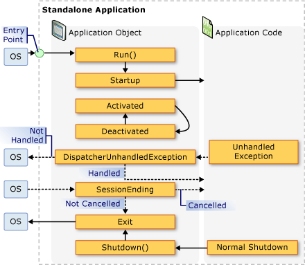
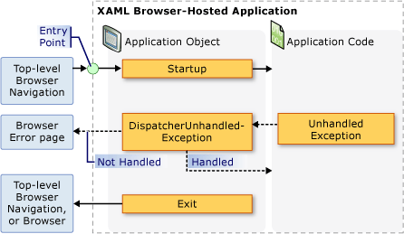

# Application Management Overview
All applications tend to share a common set of functionality that applies to application implementation and management. This topic provides an overview of the functionality in the <xref:System.Windows.Application> class for creating and managing applications.  
   
  
## The Application Class  
 In [!INCLUDE[TLA2#tla_wpf](../../../../includes/tla2sharptla-wpf-md.md)], common application-scoped functionality is encapsulated in the <xref:System.Windows.Application> class. The <xref:System.Windows.Application> class includes the following functionality:  
  
-   Tracking and interacting with application lifetime.  
  
-   Retrieving and processing command-line parameters.  
  
-   Detecting and responding to unhandled exceptions.  
  
-   Sharing application-scope properties and resources.  
  
-   Managing windows in standalone applications.  
  
-   Tracking and managing navigation.  
  
<a name="The_Application_Class"></a>   
## How to Perform Common Tasks Using the Application Class  
 If you are not interested in all of the details of the <xref:System.Windows.Application> class, the following table lists some of the common tasks for <xref:System.Windows.Application> and how to accomplish them. By viewing the related API and topics, you can find more information and sample code.  
  
|Task|Approach|  
|----------|--------------|  
|Get an object that represents the current application|Use the <xref:System.Windows.Application.Current%2A?displayProperty=nameWithType> property.|  
|Add a startup screen to an application|See [Add a Splash Screen to a WPF Application](../../../../docs/framework/wpf/app-development/how-to-add-a-splash-screen-to-a-wpf-application.md).|  
|Start an application|Use the <xref:System.Windows.Application.Run%2A?displayProperty=nameWithType> method.|  
|Stop an application|Use the <xref:System.Windows.Application.Shutdown%2A> method of the <xref:System.Windows.Application.Current%2A?displayProperty=nameWithType> object.|  
|Get arguments from the command line|Handle the <xref:System.Windows.Application.Startup?displayProperty=nameWithType> event and use the <xref:System.Windows.StartupEventArgs.Args%2A?displayProperty=nameWithType> property. For an example, see the <xref:System.Windows.Application.Startup?displayProperty=nameWithType> event.|  
|Get and set the application exit code|Set the <xref:System.Windows.ExitEventArgs.ApplicationExitCode%2A?displayProperty=nameWithType> property in the <xref:System.Windows.Application.Exit?displayProperty=nameWithType> event handler or call the <xref:System.Windows.Application.Shutdown%2A> method and pass in an integer.|  
|Detect and respond to unhandled exceptions|Handle the <xref:System.Windows.Application.DispatcherUnhandledException> event.|  
|Get and set application-scoped resources|Use the <xref:System.Windows.Application.Resources%2A?displayProperty=nameWithType> property.|  
|Use an application-scope resource dictionary|See [Use an Application-Scope Resource Dictionary](../../../../docs/framework/wpf/app-development/how-to-use-an-application-scope-resource-dictionary.md).|  
|Get and set application-scoped properties|Use the <xref:System.Windows.Application.Properties%2A?displayProperty=nameWithType> property.|  
|Get and save an application's state|See [Persist and Restore Application-Scope Properties Across Application Sessions](../../../../docs/framework/wpf/app-development/persist-and-restore-application-scope-properties.md).|  
|Manage non-code data files, including resource files, content files, and site-of-origin files.|See [WPF Application Resource, Content, and Data Files](../../../../docs/framework/wpf/app-development/wpf-application-resource-content-and-data-files.md).|  
|Manage windows in standalone applications|See [WPF Windows Overview](../../../../docs/framework/wpf/app-development/wpf-windows-overview.md).|  
|Track and manage navigation|See [Navigation Overview](../../../../docs/framework/wpf/app-development/navigation-overview.md).|  
  
<a name="The_Application_Definition"></a>   
## The Application Definition  
 To utilize the functionality of the <xref:System.Windows.Application> class, you must implement an application definition. A [!INCLUDE[TLA2#tla_wpf](../../../../includes/tla2sharptla-wpf-md.md)] application definition is a class that derives from <xref:System.Windows.Application> and is configured with a special [!INCLUDE[TLA#tla_msbuild](../../../../includes/tlasharptla-msbuild-md.md)] setting.  
  
### Implementing an Application Definition  
 A typical [!INCLUDE[TLA2#tla_wpf](../../../../includes/tla2sharptla-wpf-md.md)] application definition is implemented using both markup and code-behind. This allows you to use markup to declaratively set application properties, resources, and register events, while handling events and implementing application-specific behavior in code-behind.  
  
 The following example shows how to implement an application definition using both markup and code-behind:  
  
 [!code-xaml[ApplicationSnippets#ApplicationXAML](../../../../samples/snippets/csharp/VS_Snippets_Wpf/ApplicationSnippets/CSharp/App.xaml#applicationxaml)]  
  
 [!code-csharp[ApplicationSnippets#ApplicationCODEBEHIND](../../../../samples/snippets/csharp/VS_Snippets_Wpf/ApplicationSnippets/CSharp/App.xaml.cs#applicationcodebehind)]
 [!code-vb[ApplicationSnippets#ApplicationCODEBEHIND](../../../../samples/snippets/visualbasic/VS_Snippets_Wpf/ApplicationSnippets/visualbasic/application.xaml.vb#applicationcodebehind)]  
  
 To allow a markup file and code-behind file to work together, the following needs to happen:  
  
-   In markup, the `Application` element must include the `x:Class` attribute. When the application is built, the existence of `x:Class` in the markup file causes [!INCLUDE[TLA2#tla_msbuild](../../../../includes/tla2sharptla-msbuild-md.md)] to create a `partial` class that derives from <xref:System.Windows.Application> and has the name that is specified by the `x:Class` attribute. This requires the addition of an [!INCLUDE[TLA2#tla_xml](../../../../includes/tla2sharptla-xml-md.md)] namespace declaration for the [!INCLUDE[TLA2#tla_xaml](../../../../includes/tla2sharptla-xaml-md.md)] schema ( `xmlns:x="http://schemas.microsoft.com/winfx/2006/xaml"` ).  
  
-   In code-behind, the class must be a `partial` class with the same name that is specified by the `x:Class` attribute in markup and must derive from <xref:System.Windows.Application>. This allows the code-behind file to be associated with the `partial` class that is generated for the markup file when the application is built (see [Building a WPF Application](../../../../docs/framework/wpf/app-development/building-a-wpf-application-wpf.md)).  
  
> [!NOTE]
>  When you create a new WPF Application project or WPF Browser Application project using [!INCLUDE[TLA#tla_visualstu](../../../../includes/tlasharptla-visualstu-md.md)], an application definition is included by default and is defined using both markup and code-behind.  
  
 This code is the minimum that is required to implement an application definition. However, an additional [!INCLUDE[TLA2#tla_msbuild](../../../../includes/tla2sharptla-msbuild-md.md)] configuration needs to be made to the application definition before building and running the application.  
  
### Configuring the Application Definition for MSBuild  
 Standalone applications and [!INCLUDE[TLA#tla_xbap#plural](../../../../includes/tlasharptla-xbapsharpplural-md.md)] require the implementation of a certain level of infrastructure before they can run. The most important part of this infrastructure is the entry point. When an application is launched by a user, the operating system calls the entry point, which is a well-known function for starting applications.  
  
 Traditionally, developers have needed to write some or all of this code for themselves, depending on the technology. However, [!INCLUDE[TLA2#tla_wpf](../../../../includes/tla2sharptla-wpf-md.md)] generates this code for you when the markup file of your application definition is configured as an [!INCLUDE[TLA2#tla_msbuild](../../../../includes/tla2sharptla-msbuild-md.md)]`ApplicationDefinition` item, as shown in the following [!INCLUDE[TLA2#tla_msbuild](../../../../includes/tla2sharptla-msbuild-md.md)] project file:  
  
```xml  
<Project   
  DefaultTargets="Build"  
                        xmlns="http://schemas.microsoft.com/developer/msbuild/2003">  
  ...  
  <ApplicationDefinition Include="App.xaml" />  
  <Compile Include="App.xaml.cs" />  
  ...  
</Project>  
```  
  
 Because the code-behind file contains code, it is marked as an [!INCLUDE[TLA2#tla_msbuild](../../../../includes/tla2sharptla-msbuild-md.md)]`Compile` item, as is normal.  
  
 The application of these [!INCLUDE[TLA2#tla_msbuild](../../../../includes/tla2sharptla-msbuild-md.md)] configurations to the markup and code-behind files of an application definition causes [!INCLUDE[TLA2#tla_msbuild](../../../../includes/tla2sharptla-msbuild-md.md)] to generate code like the following:  
  
 [!code-csharp[AppDefAugSnippets#AppDefAugCODE1](../../../../samples/snippets/csharp/VS_Snippets_Wpf/AppDefAugSnippets/CSharp/App.cs#appdefaugcode1)]
 [!code-vb[AppDefAugSnippets#AppDefAugCODE1](../../../../samples/snippets/visualbasic/VS_Snippets_Wpf/AppDefAugSnippets/VisualBasic/App.vb#appdefaugcode1)]  
[!code-csharp[AppDefAugSnippets#AppDefAugCODE2](../../../../samples/snippets/csharp/VS_Snippets_Wpf/AppDefAugSnippets/CSharp/App.cs#appdefaugcode2)]
[!code-vb[AppDefAugSnippets#AppDefAugCODE2](../../../../samples/snippets/visualbasic/VS_Snippets_Wpf/AppDefAugSnippets/VisualBasic/App.vb#appdefaugcode2)]  
  
 The resulting code augments your application definition with additional infrastructure code, which includes the entry-point method `Main`. The <xref:System.STAThreadAttribute> attribute is applied to the `Main` method to indicate that the main [!INCLUDE[TLA2#tla_ui](../../../../includes/tla2sharptla-ui-md.md)] thread for the [!INCLUDE[TLA2#tla_wpf](../../../../includes/tla2sharptla-wpf-md.md)] application is an STA thread, which is required for [!INCLUDE[TLA2#tla_wpf](../../../../includes/tla2sharptla-wpf-md.md)] applications. When called, `Main` creates a new instance of `App` before calling the `InitializeComponent` method to register the events and set the properties that are implemented in markup. Because `InitializeComponent` is generated for you, you don't need to explicitly call `InitializeComponent` from an application definition like you do for <xref:System.Windows.Controls.Page> and <xref:System.Windows.Window> implementations. Finally, the <xref:System.Windows.Application.Run%2A> method is called to start the application.  
  
<a name="Getting_the_Current_Application"></a>   
## Getting the Current Application  
 Because the functionality of the <xref:System.Windows.Application> class are shared across an application, there can be only one instance of the <xref:System.Windows.Application> class per <xref:System.AppDomain>. To enforce this, the <xref:System.Windows.Application> class is implemented as a singleton class (see [Implementing Singleton in C#](http://go.microsoft.com/fwlink/?LinkId=100567)), which creates a single instance of itself and provides shared access to it with the `static`<xref:System.Windows.Application.Current%2A> property.  
  
 The following code shows how to acquire a reference to the <xref:System.Windows.Application> object for the current <xref:System.AppDomain>.  
  
 [!code-csharp[ApplicationManagementOverviewSnippets#GetCurrentAppCODE](../../../../samples/snippets/csharp/VS_Snippets_Wpf/ApplicationManagementOverviewSnippets/CSharp/MainWindow.xaml.cs#getcurrentappcode)]
 [!code-vb[ApplicationManagementOverviewSnippets#GetCurrentAppCODE](../../../../samples/snippets/visualbasic/VS_Snippets_Wpf/ApplicationManagementOverviewSnippets/VisualBasic/MainWindow.xaml.vb#getcurrentappcode)]  
  
 <xref:System.Windows.Application.Current%2A> returns a reference to an instance of the <xref:System.Windows.Application> class. If you want a reference to your <xref:System.Windows.Application> derived class you must cast the value of the <xref:System.Windows.Application.Current%2A> property, as shown in the following example.  
  
 [!code-csharp[ApplicationManagementOverviewSnippets#GetSTCurrentAppCODE](../../../../samples/snippets/csharp/VS_Snippets_Wpf/ApplicationManagementOverviewSnippets/CSharp/MainWindow.xaml.cs#getstcurrentappcode)]
 [!code-vb[ApplicationManagementOverviewSnippets#GetSTCurrentAppCODE](../../../../samples/snippets/visualbasic/VS_Snippets_Wpf/ApplicationManagementOverviewSnippets/VisualBasic/MainWindow.xaml.vb#getstcurrentappcode)]  
  
 You can inspect the value of <xref:System.Windows.Application.Current%2A> at any point in the lifetime of an <xref:System.Windows.Application> object. However, you should be careful. After the <xref:System.Windows.Application> class is instantiated, there is a period during which the state of the <xref:System.Windows.Application> object is inconsistent. During this period, <xref:System.Windows.Application> is performing the various initialization tasks that are required by your code to run, including establishing application infrastructure, setting properties, and registering events. If you try to use the <xref:System.Windows.Application> object during this period, your code may have unexpected results, particularly if it depends on the various <xref:System.Windows.Application> properties being set.  
  
 When <xref:System.Windows.Application> completes its initialization work, its lifetime truly begins.  
  
<a name="Application_Lifetime"></a>   
## Application Lifetime  
 The lifetime of a [!INCLUDE[TLA2#tla_wpf](../../../../includes/tla2sharptla-wpf-md.md)] application is marked by several events that are raised by <xref:System.Windows.Application> to let you know when your application has started, has been activated and deactivated, and has been shut down.  
  
  
<a name="Splash_Screen"></a>   
### Splash Screen  
 Starting in the [!INCLUDE[net_v35SP1_short](../../../../includes/net-v35sp1-short-md.md)], you can specify an image to be used in a startup window, or *splash screen*. The <xref:System.Windows.SplashScreen> class makes it easy to display a startup window while your application is loading. The <xref:System.Windows.SplashScreen> window is created and shown before <xref:System.Windows.Application.Run%2A> is called. For more information, see [Application Startup Time](../../../../docs/framework/wpf/advanced/application-startup-time.md) and [Add a Splash Screen to a WPF Application](../../../../docs/framework/wpf/app-development/how-to-add-a-splash-screen-to-a-wpf-application.md).  
  
<a name="Starting_an_Application"></a>   
### Starting an Application  
 After <xref:System.Windows.Application.Run%2A> is called and the application is initialized, the application is ready to run. This moment is signified when the <xref:System.Windows.Application.Startup> event is raised:  
  
 [!code-csharp[ApplicationStartupSnippets#StartupCODEBEHIND1](../../../../samples/snippets/csharp/VS_Snippets_Wpf/ApplicationStartupSnippets/CSharp/App.xaml.cs#startupcodebehind1)]
 [!code-vb[ApplicationStartupSnippets#StartupCODEBEHIND1](../../../../samples/snippets/visualbasic/VS_Snippets_Wpf/ApplicationStartupSnippets/visualbasic/application.xaml.vb#startupcodebehind1)]  
[!code-csharp[ApplicationStartupSnippets#StartupCODEBEHIND2](../../../../samples/snippets/csharp/VS_Snippets_Wpf/ApplicationStartupSnippets/CSharp/App.xaml.cs#startupcodebehind2)]
[!code-vb[ApplicationStartupSnippets#StartupCODEBEHIND2](../../../../samples/snippets/visualbasic/VS_Snippets_Wpf/ApplicationStartupSnippets/visualbasic/application.xaml.vb#startupcodebehind2)]  
  
 At this point in an application's lifetime, the most common thing to do is to show a [!INCLUDE[TLA2#tla_ui](../../../../includes/tla2sharptla-ui-md.md)].  
  
<a name="Showing_a_User_Interface"></a>   
### Showing a User Interface  
 Most standalone [!INCLUDE[TLA2#tla_mswin](../../../../includes/tla2sharptla-mswin-md.md)] applications open a <xref:System.Windows.Window> when they begin running. The <xref:System.Windows.Application.Startup> event handler is one location from which you can do this, as demonstrated by the following code.  
  
 [!code-xaml[AppShowWindowHardSnippets#StartupEventMARKUP](../../../../samples/snippets/csharp/VS_Snippets_Wpf/AppShowWindowHardSnippets/CSharp/App.xaml#startupeventmarkup)]  
  
 [!code-csharp[AppShowWindowHardSnippets#StartupEventCODEBEHIND](../../../../samples/snippets/csharp/VS_Snippets_Wpf/AppShowWindowHardSnippets/CSharp/App.xaml.cs#startupeventcodebehind)]
 [!code-vb[AppShowWindowHardSnippets#StartupEventCODEBEHIND](../../../../samples/snippets/visualbasic/VS_Snippets_Wpf/AppShowWindowHardSnippets/VisualBasic/Application.xaml.vb#startupeventcodebehind)]  
  
> [!NOTE]
>  The first <xref:System.Windows.Window> to be instantiated in a standalone application becomes the main application window by default. This <xref:System.Windows.Window> object is referenced by the <xref:System.Windows.Application.MainWindow%2A?displayProperty=nameWithType> property. The value of the <xref:System.Windows.Application.MainWindow%2A> property can be changed programmatically if a different window than the first instantiated <xref:System.Windows.Window> should be the main window.  
  
 When an [!INCLUDE[TLA2#tla_xbap](../../../../includes/tla2sharptla-xbap-md.md)] first starts, it will most likely navigate to a <xref:System.Windows.Controls.Page>. This is shown in the following code.  
  
 [!code-xaml[XBAPAppStartupSnippets#StartupXBAPMARKUP](../../../../samples/snippets/csharp/VS_Snippets_Wpf/XBAPAppStartupSnippets/CSharp/App.xaml#startupxbapmarkup)]  
  
 [!code-csharp[XBAPAppStartupSnippets#StartupXBAPCODEBEHIND](../../../../samples/snippets/csharp/VS_Snippets_Wpf/XBAPAppStartupSnippets/CSharp/App.xaml.cs#startupxbapcodebehind)]
 [!code-vb[XBAPAppStartupSnippets#StartupXBAPCODEBEHIND](../../../../samples/snippets/visualbasic/VS_Snippets_Wpf/XBAPAppStartupSnippets/VisualBasic/Application.xaml.vb#startupxbapcodebehind)]  
  
 If you handle <xref:System.Windows.Application.Startup> to only open a <xref:System.Windows.Window> or navigate to a <xref:System.Windows.Controls.Page>, you can set the `StartupUri` attribute in markup instead.  
  
 The following example shows how to use the <xref:System.Windows.Application.StartupUri%2A> from a standalone application to open a <xref:System.Windows.Window>.  
  
 [!code-xaml[ApplicationManagementOverviewSnippets#OverviewStartupUriMARKUP](../../../../samples/snippets/csharp/VS_Snippets_Wpf/ApplicationManagementOverviewSnippets/CSharp/App.xaml#overviewstartupurimarkup)]  
  
 The following example shows how to use <xref:System.Windows.Application.StartupUri%2A> from an [!INCLUDE[TLA2#tla_xbap](../../../../includes/tla2sharptla-xbap-md.md)] to navigate to a <xref:System.Windows.Controls.Page>.  
  
 [!code-xaml[PageSnippets#XBAPStartupUriMARKUP](../../../../samples/snippets/csharp/VS_Snippets_Wpf/PageSnippets/CSharp/App.xaml#xbapstartupurimarkup)]  
  
 This markup has the same effect as the previous code for opening a window.  
  
> [!NOTE]
>  For more information on navigation, see [Navigation Overview](../../../../docs/framework/wpf/app-development/navigation-overview.md).  
  
 You need to handle the <xref:System.Windows.Application.Startup> event to open a <xref:System.Windows.Window> if you need to instantiate it using a non-default constructor, or you need to set its properties or subscribe to its events before showing it, or you need to process any command-line arguments that were supplied when the application was launched.  
  
<a name="Processing_Command_Line_Arguments"></a>   
### Processing Command-Line Arguments  
 In [!INCLUDE[TLA2#tla_mswin](../../../../includes/tla2sharptla-mswin-md.md)], standalone applications can be launched from either a command prompt or the desktop. In both cases, command-line arguments can be passed to the application. The following example shows an application that is launched with a single command-line argument, "/StartMinimized":  
  
 `wpfapplication.exe /StartMinimized`  
  
 During application initialization, [!INCLUDE[TLA2#tla_wpf](../../../../includes/tla2sharptla-wpf-md.md)] retrieves the command-line arguments from the operating system and passes them to the <xref:System.Windows.Application.Startup> event handler via the <xref:System.Windows.StartupEventArgs.Args%2A> property of the <xref:System.Windows.StartupEventArgs> parameter. You can retrieve and store the command-line arguments using code like the following.  
  
 [!code-xaml[ApplicationStartupSnippets#HandleStartupXAML](../../../../samples/snippets/csharp/VS_Snippets_Wpf/ApplicationStartupSnippets/CSharp/App.xaml#handlestartupxaml)]  
  
 [!code-csharp[ApplicationStartupSnippets#HandleStartupCODEBEHIND](../../../../samples/snippets/csharp/VS_Snippets_Wpf/ApplicationStartupSnippets/CSharp/App.xaml.cs#handlestartupcodebehind)]
 [!code-vb[ApplicationStartupSnippets#HandleStartupCODEBEHIND](../../../../samples/snippets/visualbasic/VS_Snippets_Wpf/ApplicationStartupSnippets/visualbasic/application.xaml.vb#handlestartupcodebehind)]  
  
 The code handles <xref:System.Windows.Application.Startup> to check whether the **/StartMinimized** command-line argument was provided; if so, it opens the main window with a <xref:System.Windows.WindowState> of <xref:System.Windows.WindowState.Minimized>. Note that because the <xref:System.Windows.Window.WindowState%2A> property must be set programmatically, the main <xref:System.Windows.Window> must be opened explicitly in code.  
  
 [!INCLUDE[TLA2#tla_xbap#plural](../../../../includes/tla2sharptla-xbapsharpplural-md.md)] cannot retrieve and process command-line arguments because they are launched using [!INCLUDE[TLA#tla_clickonce](../../../../includes/tlasharptla-clickonce-md.md)] deployment (see [Deploying a WPF Application](../../../../docs/framework/wpf/app-development/deploying-a-wpf-application-wpf.md)). However, they can retrieve and process query string parameters from the URLs that are used to launch them.  
  
<a name="Application_Activation_and_Deactivation"></a>   
### Application Activation and Deactivation  
 [!INCLUDE[TLA2#tla_mswin](../../../../includes/tla2sharptla-mswin-md.md)] allows users to switch between applications. The most common way is to use the ALT+TAB key combination. An application can only be switched to if it has a visible <xref:System.Windows.Window> that a user can select. The currently selected <xref:System.Windows.Window> is the *active window* (also known as the *foreground window*) and is the <xref:System.Windows.Window> that receives user input. The application with the active window is the *active application* (or *foreground application*). An application becomes the active application in the following circumstances:  
  
-   It is launched and shows a <xref:System.Windows.Window>.  
  
-   A user switches from another application by selecting a <xref:System.Windows.Window> in the application.  
  
 You can detect when an application becomes active by handling the <xref:System.Windows.Application.Activated?displayProperty=nameWithType> event.  
  
 Likewise, an application can become inactive in the following circumstances:  
  
-   A user switches to another application from the current one.  
  
-   When the application shuts down.  
  
 You can detect when an application becomes inactive by handling the <xref:System.Windows.Application.Deactivated?displayProperty=nameWithType> event.  
  
 The following code shows how to handle the <xref:System.Windows.Application.Activated> and <xref:System.Windows.Application.Deactivated> events to determine whether an application is active.  
  
 [!code-xaml[ApplicationActivationSnippets#DetectActivationStateXAML](../../../../samples/snippets/csharp/VS_Snippets_Wpf/ApplicationActivationSnippets/CSharp/App.xaml#detectactivationstatexaml)]  
  
 [!code-csharp[ApplicationActivationSnippets#DetectActivationStateCODEBEHIND](../../../../samples/snippets/csharp/VS_Snippets_Wpf/ApplicationActivationSnippets/CSharp/App.xaml.cs#detectactivationstatecodebehind)]
 [!code-vb[ApplicationActivationSnippets#DetectActivationStateCODEBEHIND](../../../../samples/snippets/visualbasic/VS_Snippets_Wpf/ApplicationActivationSnippets/visualbasic/application.xaml.vb#detectactivationstatecodebehind)]  
  
 A <xref:System.Windows.Window> can also be activated and deactivated. See <xref:System.Windows.Window.Activated?displayProperty=nameWithType> and <xref:System.Windows.Window.Deactivated?displayProperty=nameWithType> for more information.  
  
> [!NOTE]
>  Neither <xref:System.Windows.Application.Activated?displayProperty=nameWithType> nor <xref:System.Windows.Application.Deactivated?displayProperty=nameWithType> is raised for [!INCLUDE[TLA2#tla_xbap#plural](../../../../includes/tla2sharptla-xbapsharpplural-md.md)].  
  
<a name="Application_Shutdown"></a>   
### Application Shutdown  
 The life of an application ends when it is shut down, which can occur for the following reasons:  
  
-   A user closes every <xref:System.Windows.Window>.  
  
-   A user closes the main <xref:System.Windows.Window>.  
  
-   A user ends the [!INCLUDE[TLA2#tla_mswin](../../../../includes/tla2sharptla-mswin-md.md)] session by logging off or shutting down.  
  
-   An application-specific condition has been met.  
  
 To help you manage application shutdown, <xref:System.Windows.Application> provides the <xref:System.Windows.Application.Shutdown%2A> method, the <xref:System.Windows.Application.ShutdownMode%2A> property, and the <xref:System.Windows.Application.SessionEnding> and <xref:System.Windows.Application.Exit> events.  
  
> [!NOTE]
>  <xref:System.Windows.Application.Shutdown%2A> can only be called from applications that have <xref:System.Security.Permissions.UIPermission>. Standalone [!INCLUDE[TLA2#tla_wpf](../../../../includes/tla2sharptla-wpf-md.md)] applications always have this permission. However, [!INCLUDE[TLA2#tla_xbap#plural](../../../../includes/tla2sharptla-xbapsharpplural-md.md)] running in the Internet zone partial-trust security sandbox do not.  
  
#### Shutdown Mode  
 Most applications shut down either when all the windows are closed or when the main window is closed. Sometimes, however, other application-specific conditions may determine when an application shuts down. You can specify the conditions under which your application will shut down by setting <xref:System.Windows.Application.ShutdownMode%2A> with one of the following <xref:System.Windows.ShutdownMode> enumeration values:  
  
-   <xref:System.Windows.ShutdownMode.OnLastWindowClose>  
  
-   <xref:System.Windows.ShutdownMode.OnMainWindowClose>  
  
-   <xref:System.Windows.ShutdownMode.OnExplicitShutdown>  
  
 The default value of <xref:System.Windows.Application.ShutdownMode%2A> is <xref:System.Windows.ShutdownMode.OnLastWindowClose>, which means that an application automatically shuts down when the last window in the application is closed by the user. However, if your application should be shut down when the main window is closed, [!INCLUDE[TLA2#tla_wpf](../../../../includes/tla2sharptla-wpf-md.md)] automatically does that if you set <xref:System.Windows.Application.ShutdownMode%2A> to <xref:System.Windows.ShutdownMode.OnMainWindowClose>. This is shown in the following example.  
  
 [!code-xaml[ApplicationShutdownModeSnippets#OnMainWindowCloseMARKUP](../../../../samples/snippets/csharp/VS_Snippets_Wpf/ApplicationShutdownModeSnippets/CS/Page1.xaml#onmainwindowclosemarkup)]  
  
 When you have application-specific shutdown conditions, you set <xref:System.Windows.Application.ShutdownMode%2A> to <xref:System.Windows.ShutdownMode.OnExplicitShutdown>. In this case, it is your responsibility to shut an application down by explicitly calling the <xref:System.Windows.Application.Shutdown%2A> method; otherwise, your application will continue running even if all the windows are closed. Note that <xref:System.Windows.Application.Shutdown%2A> is called implicitly when the <xref:System.Windows.Application.ShutdownMode%2A> is either <xref:System.Windows.ShutdownMode.OnLastWindowClose> or <xref:System.Windows.ShutdownMode.OnMainWindowClose>.  
  
> [!NOTE]
>  <xref:System.Windows.Application.ShutdownMode%2A> can be set from an [!INCLUDE[TLA2#tla_xbap](../../../../includes/tla2sharptla-xbap-md.md)], but it is ignored; an [!INCLUDE[TLA2#tla_xbap](../../../../includes/tla2sharptla-xbap-md.md)] is always shut down when it is navigated away from in a browser or when the browser that hosts the [!INCLUDE[TLA2#tla_xbap](../../../../includes/tla2sharptla-xbap-md.md)] is closed. For more information, see [Navigation Overview](../../../../docs/framework/wpf/app-development/navigation-overview.md).  
  
#### Session Ending  
 The shutdown conditions that are described by the <xref:System.Windows.Application.ShutdownMode%2A> property are specific to an application. In some cases, though, an application may shut down as a result of an external condition. The most common external condition occurs when a user ends the [!INCLUDE[TLA2#tla_mswin](../../../../includes/tla2sharptla-mswin-md.md)] session by the following actions:  
  
-   Logging off  
  
-   Shutting down  
  
-   Restarting  
  
-   Hibernating  
  
 To detect when a [!INCLUDE[TLA2#tla_mswin](../../../../includes/tla2sharptla-mswin-md.md)] session ends, you can handle the <xref:System.Windows.Application.SessionEnding> event, as illustrated in the following example.  
  
 [!code-xaml[ApplicationSessionEndingSnippets#HandlingSessionEndingXAML](../../../../samples/snippets/csharp/VS_Snippets_Wpf/ApplicationSessionEndingSnippets/CSharp/App.xaml#handlingsessionendingxaml)]  
  
 [!code-csharp[ApplicationSessionEndingSnippets#HandlingSessionEndingCODEBEHIND](../../../../samples/snippets/csharp/VS_Snippets_Wpf/ApplicationSessionEndingSnippets/CSharp/App.xaml.cs#handlingsessionendingcodebehind)]
 [!code-vb[ApplicationSessionEndingSnippets#HandlingSessionEndingCODEBEHIND](../../../../samples/snippets/visualbasic/VS_Snippets_Wpf/ApplicationSessionEndingSnippets/visualbasic/application.xaml.vb#handlingsessionendingcodebehind)]  
  
 In this example, the code inspects the <xref:System.Windows.SessionEndingCancelEventArgs.ReasonSessionEnding%2A> property to determine how the [!INCLUDE[TLA2#tla_mswin](../../../../includes/tla2sharptla-mswin-md.md)] session is ending. It uses this value to display a confirmation message to the user. If the user does not want the session to end, the code sets <xref:System.ComponentModel.CancelEventArgs.Cancel%2A> to `true` to prevent the [!INCLUDE[TLA2#tla_mswin](../../../../includes/tla2sharptla-mswin-md.md)] session from ending.  
  
> [!NOTE]
>  <xref:System.Windows.Application.SessionEnding> is not raised for [!INCLUDE[TLA2#tla_xbap#plural](../../../../includes/tla2sharptla-xbapsharpplural-md.md)].  
  
#### Exit  
 When an application shuts down, it may need to perform some final processing, such as persisting application state. For these situations, you can handle the <xref:System.Windows.Application.Exit> event.  
  
 [!code-xaml[HOWTOApplicationModelSnippets#PersistRestoreAppScopePropertiesXAML1](../../../../samples/snippets/csharp/VS_Snippets_Wpf/HOWTOApplicationModelSnippets/CSharp/App.xaml#persistrestoreappscopepropertiesxaml1)]  
[!code-xaml[HOWTOApplicationModelSnippets#PersistRestoreAppScopePropertiesXAML2](../../../../samples/snippets/csharp/VS_Snippets_Wpf/HOWTOApplicationModelSnippets/CSharp/App.xaml#persistrestoreappscopepropertiesxaml2)]  
  
 [!code-csharp[HOWTOApplicationModelSnippets#PersistAppScopePropertiesCODEBEHIND1](../../../../samples/snippets/csharp/VS_Snippets_Wpf/HOWTOApplicationModelSnippets/CSharp/App.xaml.cs#persistappscopepropertiescodebehind1)]
 [!code-vb[HOWTOApplicationModelSnippets#PersistAppScopePropertiesCODEBEHIND1](../../../../samples/snippets/visualbasic/VS_Snippets_Wpf/HOWTOApplicationModelSnippets/visualbasic/application.xaml.vb#persistappscopepropertiescodebehind1)]  
[!code-csharp[HOWTOApplicationModelSnippets#PersistAppScopePropertiesCODEBEHIND2](../../../../samples/snippets/csharp/VS_Snippets_Wpf/HOWTOApplicationModelSnippets/CSharp/App.xaml.cs#persistappscopepropertiescodebehind2)]
[!code-vb[HOWTOApplicationModelSnippets#PersistAppScopePropertiesCODEBEHIND2](../../../../samples/snippets/visualbasic/VS_Snippets_Wpf/HOWTOApplicationModelSnippets/visualbasic/application.xaml.vb#persistappscopepropertiescodebehind2)]  
  
 For the complete example, see [Persist and Restore Application-Scope Properties Across Application Sessions](../../../../docs/framework/wpf/app-development/persist-and-restore-application-scope-properties.md).  
  
 <xref:System.Windows.Application.Exit> can be handled by both standalone applications and [!INCLUDE[TLA2#tla_xbap#plural](../../../../includes/tla2sharptla-xbapsharpplural-md.md)]. For [!INCLUDE[TLA2#tla_xbap#plural](../../../../includes/tla2sharptla-xbapsharpplural-md.md)], <xref:System.Windows.Application.Exit> is raised when in the following circumstances:  
  
-   An [!INCLUDE[TLA2#tla_xbap](../../../../includes/tla2sharptla-xbap-md.md)] is navigated away from.  
  
-   In [!INCLUDE[TLA2#tla_ie7](../../../../includes/tla2sharptla-ie7-md.md)], when the tab that is hosting the [!INCLUDE[TLA2#tla_xbap](../../../../includes/tla2sharptla-xbap-md.md)] is closed.  
  
-   When the browser is closed.  
  
#### Exit Code  
 Applications are mostly launched by the operating system in response to a user request. However, an application can be launched by another application to perform some specific task. When the launched application shuts down, the launching application may want to know the condition under which the launched application shut down. In these situations, [!INCLUDE[TLA2#tla_mswin](../../../../includes/tla2sharptla-mswin-md.md)] allows applications to return an application exit code on shutdown. By default, [!INCLUDE[TLA2#tla_wpf](../../../../includes/tla2sharptla-wpf-md.md)] applications return an exit code value of 0.  
  
> [!NOTE]
>  When you debug from [!INCLUDE[TLA2#tla_visualstu](../../../../includes/tla2sharptla-visualstu-md.md)], the application exit code is displayed in the     **Output** window when the application shuts down, in a message that looks like the following:  
>   
>  `The program '[5340] AWPFApp.vshost.exe: Managed' has exited with code 0 (0x0).`  
>   
>  You open the     **Output** window by clicking     **Output** on the     **View** menu.  
  
 To change the exit code, you can call the <xref:System.Windows.Application.Shutdown%28System.Int32%29> overload, which accepts an integer argument to be the exit code:  
  
 [!code-csharp[ApplicationExitSnippets#AppExitCODE](../../../../samples/snippets/csharp/VS_Snippets_Wpf/ApplicationExitSnippets/CSharp/MainWindow.xaml.cs#appexitcode)]
 [!code-vb[ApplicationExitSnippets#AppExitCODE](../../../../samples/snippets/visualbasic/VS_Snippets_Wpf/ApplicationExitSnippets/visualbasic/mainwindow.xaml.vb#appexitcode)]  
  
 You can detect the value of the exit code, and change it, by handling the <xref:System.Windows.Application.Exit> event. The <xref:System.Windows.Application.Exit> event handler is passed an <xref:System.Windows.ExitEventArgs> which provides access to the exit code with the <xref:System.Windows.ExitEventArgs.ApplicationExitCode%2A> property. For more information, see <xref:System.Windows.Application.Exit>.  
  
> [!NOTE]
>  You can set the exit code in both standalone applications and [!INCLUDE[TLA2#tla_xbap#plural](../../../../includes/tla2sharptla-xbapsharpplural-md.md)]. However, the exit code value is ignored for [!INCLUDE[TLA2#tla_xbap#plural](../../../../includes/tla2sharptla-xbapsharpplural-md.md)].  
  
<a name="Unhandled_Exceptions"></a>   
### Unhandled Exceptions  
 Sometimes an application may shut down under abnormal conditions, such as when an unanticipated exception is thrown. In this case, the application may not have the code to detect and process the exception. This type of exception is an unhandled exception; a notification similar to that shown in the following figure is displayed before the application is closed.  
  
   
  
 From the user experience perspective, it is better for an application to avoid this default behavior by doing some or all of the following:  
  
-   Displaying user-friendly information.  
  
-   Attempting to keep an application running.  
  
-   Recording detailed, developer-friendly, exception information in the [!INCLUDE[TLA2#tla_mswin](../../../../includes/tla2sharptla-mswin-md.md)] event log.  
  
 Implementing this support depends on being able to detect unhandled exceptions, which is what the <xref:System.Windows.Application.DispatcherUnhandledException> event is raised for.  
  
 [!code-xaml[ApplicationDispatcherUnhandledExceptionSnippets#HandleDispatcherUnhandledExceptionXAML](../../../../samples/snippets/csharp/VS_Snippets_Wpf/ApplicationDispatcherUnhandledExceptionSnippets/CSharp/App.xaml#handledispatcherunhandledexceptionxaml)]  
  
 [!code-csharp[ApplicationDispatcherUnhandledExceptionSnippets#HandleDispatcherUnhandledExceptionCODEBEHIND1](../../../../samples/snippets/csharp/VS_Snippets_Wpf/ApplicationDispatcherUnhandledExceptionSnippets/CSharp/App.xaml.cs#handledispatcherunhandledexceptioncodebehind1)]
 [!code-vb[ApplicationDispatcherUnhandledExceptionSnippets#HandleDispatcherUnhandledExceptionCODEBEHIND1](../../../../samples/snippets/visualbasic/VS_Snippets_Wpf/ApplicationDispatcherUnhandledExceptionSnippets/visualbasic/application.xaml.vb#handledispatcherunhandledexceptioncodebehind1)]  
[!code-csharp[ApplicationDispatcherUnhandledExceptionSnippets#HandleDispatcherUnhandledExceptionCODEBEHIND2](../../../../samples/snippets/csharp/VS_Snippets_Wpf/ApplicationDispatcherUnhandledExceptionSnippets/CSharp/App.xaml.cs#handledispatcherunhandledexceptioncodebehind2)]
[!code-vb[ApplicationDispatcherUnhandledExceptionSnippets#HandleDispatcherUnhandledExceptionCODEBEHIND2](../../../../samples/snippets/visualbasic/VS_Snippets_Wpf/ApplicationDispatcherUnhandledExceptionSnippets/visualbasic/application.xaml.vb#handledispatcherunhandledexceptioncodebehind2)]  
  
 The <xref:System.Windows.Application.DispatcherUnhandledException> event handler is passed a <xref:System.Windows.Threading.DispatcherUnhandledExceptionEventArgs> parameter that contains contextual information regarding the unhandled exception, including the exception itself (<xref:System.Windows.Threading.DispatcherUnhandledExceptionEventArgs.Exception%2A?displayProperty=nameWithType>). You can use this information to determine how to handle the exception.  
  
 When you handle <xref:System.Windows.Application.DispatcherUnhandledException>, you should set the <xref:System.Windows.Threading.DispatcherUnhandledExceptionEventArgs.Handled%2A?displayProperty=nameWithType> property to `true`; otherwise, [!INCLUDE[TLA2#tla_wpf](../../../../includes/tla2sharptla-wpf-md.md)] still considers the exception to be unhandled and reverts to the default behavior described earlier. If an unhandled exception is raised and either the <xref:System.Windows.Application.DispatcherUnhandledException> event is not handled, or the event is handled and <xref:System.Windows.Threading.DispatcherUnhandledExceptionEventArgs.Handled%2A> is set to `false`, the application shuts down immediately. Furthermore, no other <xref:System.Windows.Application> events are raised. Consequently, you need to handle <xref:System.Windows.Application.DispatcherUnhandledException> if your application has code that must run before the application shuts down.  
  
 Although an application may shut down as a result of an unhandled exception, an application usually shuts down in response to a user request, as discussed in the next section.  
  
<a name="Application_Lifetime_Events"></a>   
### Application Lifetime Events  
 Standalone applications and [!INCLUDE[TLA2#tla_xbap#plural](../../../../includes/tla2sharptla-xbapsharpplural-md.md)] don't have exactly the same lifetimes. The following figure illustrates the key events in the lifetime of a standalone application and shows the sequence in which they are raised.  
  
   
  
 Likewise, the following figure illustrates the key events in the lifetime of an [!INCLUDE[TLA2#tla_xbap](../../../../includes/tla2sharptla-xbap-md.md)], and shows the sequence in which they are raised.  
  
   
  
## See Also  
 <xref:System.Windows.Application>  
 [WPF Windows Overview](../../../../docs/framework/wpf/app-development/wpf-windows-overview.md)  
 [Navigation Overview](../../../../docs/framework/wpf/app-development/navigation-overview.md)  
 [WPF Application Resource, Content, and Data Files](../../../../docs/framework/wpf/app-development/wpf-application-resource-content-and-data-files.md)  
 [Pack URIs in WPF](../../../../docs/framework/wpf/app-development/pack-uris-in-wpf.md)  
 [Application Model: How-to Topics](http://msdn.microsoft.com/library/76771b09-3688-4d1c-8818-9b3f4cf39a30)  
 [Application Development](../../../../docs/framework/wpf/app-development/index.md)
