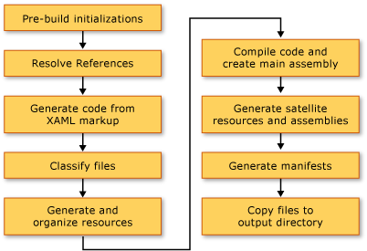

# Building a WPF Application (WPF)
[!INCLUDE[TLA#tla_wpf](../../../../includes/tlasharptla-wpf-md.md)] applications can be built as [!INCLUDE[dnprdnshort](../../../../includes/dnprdnshort-md.md)] executables (.exe), libraries (.dll), or a combination of both types of assemblies. This topic introduces how to build [!INCLUDE[TLA2#tla_wpf](../../../../includes/tla2sharptla-wpf-md.md)] applications and describes the key steps in the build process.  
  
  
<a name="Building_a_WPF_Application_using_Command_Line"></a>   
## Building a WPF Application  
 A WPF application can be compiled in the following ways:  
  
-   Command-line. The application must contain only code (no XAML) and an application definition file. For more information, see [Command-line Building With csc.exe](~/docs/csharp/language-reference/compiler-options/command-line-building-with-csc-exe.md) or [Building from the Command Line (Visual Basic)](~/docs/visual-basic/reference/command-line-compiler/building-from-the-command-line.md).  
  
-   Microsoft Build Engine (MSBuild). In addition to the code and XAML files, the application must contain an MSBuild project file. For more information, see "MSBuild".  
  
-   Visual Studio. Visual Studio is an integrated development environment that compiles WPF applications with MSBuild and includes a visual designer for creating UI. For more information, see [Application Development in Visual Studio](http://msdn.microsoft.com/library/97490c1b-a247-41fb-8f2c-bc4c201eff68) and [WPF Designer](http://msdn.microsoft.com/library/c6c65214-8411-4e16-b254-163ed4099c26).  
  
<a name="The_Windows_Presentation_Foundation_Build_Pipeline"></a>   
## WPF Build Pipeline  
 When a [!INCLUDE[TLA2#tla_wpf](../../../../includes/tla2sharptla-wpf-md.md)] project is built, the combination of language-specific and [!INCLUDE[TLA2#tla_wpf](../../../../includes/tla2sharptla-wpf-md.md)]-specific targets are invoked. The process of executing these targets is called the build pipeline, and the key steps are illustrated by the following figure.  
  
   
  
<a name="Pre_Build_Initializations"></a>   
### Pre-Build Initializations  
 Before building, [!INCLUDE[TLA2#tla_msbuild](../../../../includes/tla2sharptla-msbuild-md.md)] determines the location of important tools and libraries, including the following:  
  
-   The [!INCLUDE[TLA2#tla_winfx](../../../../includes/tla2sharptla-winfx-md.md)].  
  
-   The [!INCLUDE[TLA2#tla_wcsdk](../../../../includes/tla2sharptla-wcsdk-md.md)] directories.  
  
-   The location of [!INCLUDE[TLA2#tla_wpf](../../../../includes/tla2sharptla-wpf-md.md)] reference assemblies.  
  
-   The property for the assembly search paths.  
  
 The first location where [!INCLUDE[TLA2#tla_msbuild](../../../../includes/tla2sharptla-msbuild-md.md)] searches for assemblies is the reference assembly directory (%ProgramFiles%\Reference Assemblies\Microsoft\Framework\v3.0\\). During this step, the build process also initializes the various properties and item groups and performs any required cleanup work.  
  
<a name="Resolving_references"></a>   
### Resolving References  
 The build process locates and binds the assemblies required to build the application project. This logic is contained in the `ResolveAssemblyReference` task. All assemblies declared as `Reference` in the project file are provided to the task along with information on the search paths and metadata on assemblies already installed on the system. The task looks up assemblies and uses the installed assembly's metadata to filter out those core [!INCLUDE[TLA2#tla_wpf](../../../../includes/tla2sharptla-wpf-md.md)] assemblies that need not show up in the output manifests. This is done to avoid redundant information in the ClickOnce manifests. For example, since PresentationFramework.dll can be considered representative of an application built on and for the [!INCLUDE[TLA2#tla_wpf](../../../../includes/tla2sharptla-wpf-md.md)] and moreover since all [!INCLUDE[TLA2#tla_wpf](../../../../includes/tla2sharptla-wpf-md.md)] assemblies exist at the same location on every machine that has the [!INCLUDE[TLA2#tla_winfx](../../../../includes/tla2sharptla-winfx-md.md)] installed, there is no need to include all information on all [!INCLUDE[TLA2#tla_winfx](../../../../includes/tla2sharptla-winfx-md.md)] reference assemblies in the manifests.  
  
<a name="Markup_Compilation___Pass_1"></a>   
### Markup Compilation—Pass 1  
 In this step, [!INCLUDE[TLA2#tla_xaml](../../../../includes/tla2sharptla-xaml-md.md)] files are parsed and compiled so that the runtime does not spend time parsing [!INCLUDE[TLA2#tla_xml](../../../../includes/tla2sharptla-xml-md.md)] and validating property values. The compiled [!INCLUDE[TLA2#tla_xaml](../../../../includes/tla2sharptla-xaml-md.md)] file is pre-tokenized so that, at run time, loading it should be much faster than loading a [!INCLUDE[TLA2#tla_xaml](../../../../includes/tla2sharptla-xaml-md.md)] file.  
  
 During this step, the following activities take place for every [!INCLUDE[TLA2#tla_xaml](../../../../includes/tla2sharptla-xaml-md.md)] file that is a `Page` build item:  
  
1.  The [!INCLUDE[TLA2#tla_xaml](../../../../includes/tla2sharptla-xaml-md.md)] file is parsed by the markup compiler.  
  
2.  A compiled representation is created for that [!INCLUDE[TLA2#tla_xaml](../../../../includes/tla2sharptla-xaml-md.md)] and copied to the obj\Release folder.  
  
3.  A CodeDOM representation of a new partial class is created and copied to the obj\Release folder.  
  
 In addition, a language-specific code file is generated for every [!INCLUDE[TLA2#tla_xaml](../../../../includes/tla2sharptla-xaml-md.md)] file. For example, for a Page1.xaml page in a [!INCLUDE[TLA2#tla_visualb](../../../../includes/tla2sharptla-visualb-md.md)] project, a Page1.g.vb is generated; for a Page1.xaml page in a [!INCLUDE[TLA2#tla_cshrp](../../../../includes/tla2sharptla-cshrp-md.md)] project, a Page1.g.cs is generated. The ".g" in the file name indicates the file is generated code that has a partial class declaration for the top-level element of the markup file (such as `Page` or `Window`). The class is declared with the `partial` modifier in [!INCLUDE[TLA2#tla_cshrp](../../../../includes/tla2sharptla-cshrp-md.md)] (`Extends` in [!INCLUDE[TLA2#tla_visualb](../../../../includes/tla2sharptla-visualb-md.md)]) to indicate there is another declaration for the class elsewhere, usually in the code-behind file Page1.xaml.cs.  
  
 The partial class extends from the appropriate base class (such as <xref:System.Windows.Controls.Page> for a page) and implements the <xref:System.Windows.Markup.IComponentConnector?displayProperty=nameWithType> interface. The <xref:System.Windows.Markup.IComponentConnector> interface has methods to initialize a component and connect names and events on elements in its content. Consequently, the generated code file has a method implementation like the following:  
  
```csharp  
public void InitializeComponent() {  
    if (_contentLoaded) {  
        return;  
    }  
    _contentLoaded = true;  
    System.Uri resourceLocater =   
        new System.Uri(  
            "window1.xaml",   
            System.UriKind.RelativeOrAbsolute);  
    System.Windows.Application.LoadComponent(this, resourceLocater);  
}  
```  
  
```vb  
Public Sub InitializeComponent() _  
  
    If _contentLoaded Then  
        Return  
    End If  
  
    _contentLoaded = True  
    Dim resourceLocater As System.Uri = _  
        New System.Uri("mainwindow.xaml", System.UriKind.Relative)  
  
    System.Windows.Application.LoadComponent(Me, resourceLocater)  
  
End Sub  
```  
  
 By default, markup compilation runs in the same <xref:System.AppDomain> as the [!INCLUDE[TLA2#tla_msbuild](../../../../includes/tla2sharptla-msbuild-md.md)] engine. This provides significant performance gains. This behavior can be toggled with the `AlwaysCompileMarkupFilesInSeparateDomain` property. This has the advantage of unloading all reference assemblies by unloading the separate <xref:System.AppDomain>.  
  
<a name="Pass_2_of_Markup_Compilation"></a>   
### Markup Compilation—Pass 2  
 Not all [!INCLUDE[TLA2#tla_xaml](../../../../includes/tla2sharptla-xaml-md.md)] pages are compiled at during pass 1 of markup compilation. [!INCLUDE[TLA2#tla_xaml](../../../../includes/tla2sharptla-xaml-md.md)] files that have locally defined type references (references to types defined in code elsewhere in the same project) are exempt from compilation at this time. This is because those locally defined types exist only in source and have not yet been compiled. In order to determine this, the parser uses heuristics that involve looking for items such as `x:Name` in the markup file. When such an instance is found, that markup file’s compilation is postponed until the code files have been compiled, after which, the second markup compilation pass processes these files.  
  
<a name="File_Classification"></a>   
### File Classification  
 The build process puts output files into different resource groups based on which application assembly they will be placed in. In a typical nonlocalized application, all data files marked as `Resource` are placed in the main assembly (executable or library). When `UICulture` is set in the project, all compiled [!INCLUDE[TLA2#tla_xaml](../../../../includes/tla2sharptla-xaml-md.md)] files and those resources specifically marked as language-specific are placed in the satellite resource assembly. Furthermore, all language-neutral resources are placed in the main assembly. In this step of the build process, that determination is made.  
  
 The `ApplicationDefinition`, `Page`, and `Resource` build actions in the project file can be augmented with the `Localizable` metadata (acceptable values are `true` and `false`), which dictates whether the file is language-specific or language-neutral.  
  
<a name="Core_Compilation"></a>   
### Core Compilation  
 The core compile step involves compilation of code files. This is orchestrated by logic in the language-specific targets files Microsoft.CSharp.targets and Microsoft.VisualBasic.targets. If heuristics have determined that a single pass of the markup compiler is sufficient, then the main assembly is generated. However, if one or more [!INCLUDE[TLA2#tla_xaml](../../../../includes/tla2sharptla-xaml-md.md)] files in the project have references to locally defined types, then a temporary .dll file is generated so the final application assemblies may be created after the second pass of markup compilation is complete.  
  
<a name="Manifest_generation"></a>   
### Manifest Generation  
 At the end of the build process, after all the application assemblies and content files are ready, the [!INCLUDE[TLA2#tla_clickonce](../../../../includes/tla2sharptla-clickonce-md.md)] manifests for the application are generated.  
  
 The deployment manifest file describes the deployment model: the current version, update behavior, and publisher identity along with digital signature. This manifest is intended to be authored by administrators who handle deployment. The file extension is .xbap (for [!INCLUDE[TLA#tla_xbap#plural](../../../../includes/tlasharptla-xbapsharpplural-md.md)]) and .application for installed applications. The former is dictated by the `HostInBrowser` project property and as a result the manifest identifies the application as browser-hosted.  
  
 The application manifest (an .exe.manifest file) describes the application assemblies and dependent libraries and lists permissions required by the application. This file is intended to be authored by the application developer. In order to launch a [!INCLUDE[TLA2#tla_clickonce](../../../../includes/tla2sharptla-clickonce-md.md)] application, a user opens the application's deployment manifest file.  
  
 These manifest files are always created for [!INCLUDE[TLA2#tla_xbap#plural](../../../../includes/tla2sharptla-xbapsharpplural-md.md)]. For installed applications, they are not created unless the `GenerateManifests` property is specified in the project file with value `true`.  
  
 [!INCLUDE[TLA2#tla_xbap#plural](../../../../includes/tla2sharptla-xbapsharpplural-md.md)] get two additional permissions over and above those permissions assigned to typical Internet zone applications: <xref:System.Security.Permissions.WebBrowserPermission> and <xref:System.Security.Permissions.MediaPermission>. The [!INCLUDE[TLA2#tla_wpf](../../../../includes/tla2sharptla-wpf-md.md)] build system declares those permissions in the application manifest.  
  
<a name="Incremental_Build_Support"></a>   
## Incremental Build Support  
 The [!INCLUDE[TLA2#tla_wpf](../../../../includes/tla2sharptla-wpf-md.md)] build system provides support for incremental builds. It is fairly intelligent about detecting changes made to markup or code, and it compiles only those artifacts affected by the change. The incremental build mechanism uses the following files:  
  
-   An $(*AssemblyName*)_MarkupCompiler.Cache file to maintain current compiler state.  
  
-   An $(*AssemblyName*)_MarkupCompiler.lref file to cache the [!INCLUDE[TLA2#tla_xaml](../../../../includes/tla2sharptla-xaml-md.md)] files with references to locally defined types.  
  
 The following is a set of rules governing incremental build:  
  
-   The file is the smallest unit at which the build system detects change. So, for a code file, the build system cannot tell if a type was changed or if code was added. The same holds for project files.  
  
-   The incremental build mechanism must be cognizant that a [!INCLUDE[TLA2#tla_xaml](../../../../includes/tla2sharptla-xaml-md.md)] page either defines a class or uses other classes.  
  
-   If `Reference` entries change, then recompile all pages.  
  
-   If a code file changes, recompile all pages with locally defined type references.  
  
-   If a [!INCLUDE[TLA2#tla_xaml](../../../../includes/tla2sharptla-xaml-md.md)] file changes:  
  
    -   If [!INCLUDE[TLA2#tla_xaml](../../../../includes/tla2sharptla-xaml-md.md)] is declared as `Page` in the project: if the [!INCLUDE[TLA2#tla_xaml](../../../../includes/tla2sharptla-xaml-md.md)] does not have locally defined type references, recompile that [!INCLUDE[TLA2#tla_xaml](../../../../includes/tla2sharptla-xaml-md.md)] plus all [!INCLUDE[TLA2#tla_xaml](../../../../includes/tla2sharptla-xaml-md.md)] pages with local references; if the [!INCLUDE[TLA2#tla_xaml](../../../../includes/tla2sharptla-xaml-md.md)] has local references, recompile all [!INCLUDE[TLA2#tla_xaml](../../../../includes/tla2sharptla-xaml-md.md)] pages with local references.  
  
    -   If [!INCLUDE[TLA2#tla_xaml](../../../../includes/tla2sharptla-xaml-md.md)] is declared as `ApplicationDefinition` in the project: recompile all [!INCLUDE[TLA2#tla_xaml](../../../../includes/tla2sharptla-xaml-md.md)] pages (reason: each [!INCLUDE[TLA2#tla_xaml](../../../../includes/tla2sharptla-xaml-md.md)] has reference to an <xref:System.Windows.Application> type that may have changed).  
  
-   If the project file declares a code file as application definition instead of a [!INCLUDE[TLA2#tla_xaml](../../../../includes/tla2sharptla-xaml-md.md)] file:  
  
    -   Check if the `ApplicationClassName` value in the project file has changed (is there a new application type?). If so, recompile the entire application.  
  
    -   Otherwise, recompile all [!INCLUDE[TLA2#tla_xaml](../../../../includes/tla2sharptla-xaml-md.md)] pages with local references.  
  
-   If a project file changes: apply all preceding rules and see what needs to be recompiled. Changes to the following properties trigger a complete recompile: `AssemblyName`, `IntermediateOutputPath`, `RootNamespace`, and `HostInBrowser`.  
  
 The following recompile scenarios are possible:  
  
-   The entire application is recompiled.  
  
-   Only those [!INCLUDE[TLA2#tla_xaml](../../../../includes/tla2sharptla-xaml-md.md)] files that have locally defined type references are recompiled.  
  
-   Nothing is recompiled (if nothing in the project has changed).  
  
## See Also  
 [Deploying a WPF Application](../../../../docs/framework/wpf/app-development/deploying-a-wpf-application-wpf.md)  
 [WPF MSBuild Reference](/visualstudio/msbuild/wpf-msbuild-reference)  
 [Pack URIs in WPF](../../../../docs/framework/wpf/app-development/pack-uris-in-wpf.md)  
 [WPF Application Resource, Content, and Data Files](../../../../docs/framework/wpf/app-development/wpf-application-resource-content-and-data-files.md)
