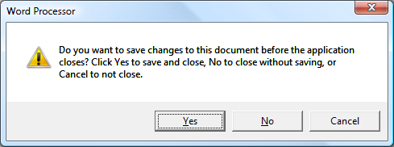
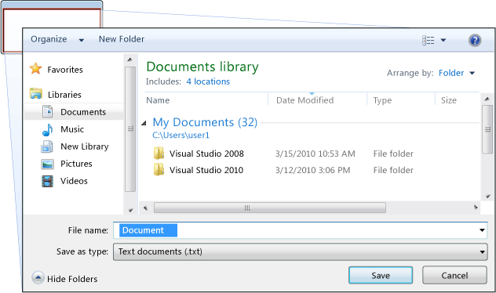
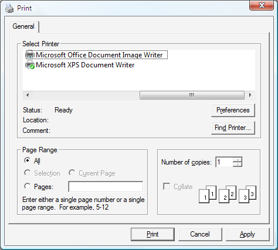

# Dialog Boxes Overview
Standalone applications typically have a main window that both displays the main data over which the application operates and exposes the functionality to process that data through [!INCLUDE[TLA#tla_ui](../../../../includes/tlasharptla-ui-md.md)] mechanisms like menu bars, tool bars, and status bars. A non-trivial application may also display additional windows to do the following:  
  
-   Display specific information to users.  
  
-   Gather information from users.  
  
-   Both display and gather information.  
  
 These types of windows are known as *dialog boxes*, and there are two types: modal and modeless.  
  
 A *modal* dialog box is displayed by a function when the function needs additional data from a user to continue. Because the function depends on the modal dialog box to gather data, the modal dialog box also prevents a user from activating other windows in the application while it remains open. In most cases, a modal dialog box allows a user to signal when they have finished with the modal dialog box by pressing either an **OK** or **Cancel** button. Pressing the **OK** button indicates that a user has entered data and wants the function to continue processing with that data. Pressing the **Cancel** button indicates that a user wants to stop the function from executing altogether. The most common examples of modal dialog boxes are shown to open, save, and print data.  
  
 A *modeless* dialog box, on the other hand, does not prevent a user from activating other windows while it is open. For example, if a user wants to find occurrences of a particular word in a document, a main window will often open a dialog box to ask a user what word they are looking for. Since finding a word doesn't prevent a user from editing the document, however, the dialog box doesn't need to be modal. A modeless dialog box at least provides a **Close** button to close the dialog box, and may provide additional buttons to execute specific functions, such as a **Find Next** button to find the next word that matches the find criteria of a word search.  
  
 [!INCLUDE[TLA#tla_wpf](../../../../includes/tlasharptla-wpf-md.md)] allows you to create several types of dialog boxes, including message boxes, common dialog boxes, and custom dialog boxes. This topic discusses each, and the [Dialog Box Sample](http://go.microsoft.com/fwlink/?LinkID=159984) provides matching examples.  
  
 
  
   
## Message Boxes  
 A *message box* is a dialog box that can be used to display textual information and to allow users to make decisions with buttons. The following figure shows a message box that displays textual information, asks a question, and provides the user with three buttons to answer the question.  
  
   
  
 To create a message box, you use the <xref:System.Windows.MessageBox> class. <xref:System.Windows.MessageBox> lets you configure the message box text, title, icon, and buttons, using code like the following.  
  
 [!code-csharp[DialogBoxesOverviewSnippets#MsgBoxConfigureCODEBEHIND](../../../../samples/snippets/csharp/VS_Snippets_Wpf/DialogBoxesOverviewSnippets/CSharp/Window1.xaml.cs#msgboxconfigurecodebehind)]
 [!code-vb[DialogBoxesOverviewSnippets#MsgBoxConfigureCODEBEHIND](../../../../samples/snippets/visualbasic/VS_Snippets_Wpf/DialogBoxesOverviewSnippets/VisualBasic/window1.xaml.vb#msgboxconfigurecodebehind)]  
  
 To show a message box, you call the `static`<xref:System.Windows.MessageBox.Show%2A> method, as demonstrated in the following code.  
  
 [!code-csharp[DialogBoxesOverviewSnippets#MsgBoxShowCODEBEHIND](../../../../samples/snippets/csharp/VS_Snippets_Wpf/DialogBoxesOverviewSnippets/CSharp/Window1.xaml.cs#msgboxshowcodebehind)]
 [!code-vb[DialogBoxesOverviewSnippets#MsgBoxShowCODEBEHIND](../../../../samples/snippets/visualbasic/VS_Snippets_Wpf/DialogBoxesOverviewSnippets/VisualBasic/window1.xaml.vb#msgboxshowcodebehind)]  
  
 When code that shows a message box needs to detect and process the user's decision (which button was pressed), the code can inspect the message box result, as shown in the following code.  
  
 [!code-csharp[DialogBoxesOverviewSnippets#MsgBoxShowAndResultCODEBEHIND1](../../../../samples/snippets/csharp/VS_Snippets_Wpf/DialogBoxesOverviewSnippets/CSharp/Window1.xaml.cs#msgboxshowandresultcodebehind1)]
 [!code-vb[DialogBoxesOverviewSnippets#MsgBoxShowAndResultCODEBEHIND1](../../../../samples/snippets/visualbasic/VS_Snippets_Wpf/DialogBoxesOverviewSnippets/VisualBasic/window1.xaml.vb#msgboxshowandresultcodebehind1)]  
  
 For more information on using message boxes, see <xref:System.Windows.MessageBox>, [MessageBox Sample](http://go.microsoft.com/fwlink/?LinkID=160023), and [Dialog Box Sample](http://go.microsoft.com/fwlink/?LinkID=159984).  
  
 Although <xref:System.Windows.MessageBox> may offer a simple dialog box user experience, the advantage of using <xref:System.Windows.MessageBox> is that is the only type of window that can be shown by applications that run within a partial trust security sandbox (see [Security](../../../../docs/framework/wpf/security-wpf.md)), such as [!INCLUDE[TLA#tla_xbap#plural](../../../../includes/tlasharptla-xbapsharpplural-md.md)].  
  
 Most dialog boxes display and gather more complex data than the result of a message box, including text, selection (check boxes), mutually exclusive selection (radio buttons), and list selection (list boxes, combo boxes, drop-down list boxes). For these, [!INCLUDE[TLA#tla_wpf](../../../../includes/tlasharptla-wpf-md.md)] provides several common dialog boxes and allows you to create your own dialog boxes, although the use of either is limited to applications running with full trust.  
  
   
## Common Dialog Boxes  
 [!INCLUDE[TLA#tla_mswin](../../../../includes/tlasharptla-mswin-md.md)] implements a variety of reusable dialog boxes that are common to all applications, including dialog boxes for opening files, saving files, and printing. Since these dialog boxes are implemented by the operating system, they can be shared among all the applications that run on the operating system, which helps user experience consistency; when users are familiar with the use of an operating system-provided dialog box in one application, they don't need to learn how to use that dialog box in other applications. Because these dialog boxes are available to all applications and because they help provide a consistent user experience, they are known as *common dialog boxes*.  
  
 [!INCLUDE[TLA#tla_wpf](../../../../includes/tlasharptla-wpf-md.md)] encapsulates the open file, save file, and print common dialog boxes and exposes them as managed classes for you to use in standalone applications. This topic provides a brief overview of each.  
  
   
### Open File Dialog  
 The open file dialog box, shown in the following figure, is used by file opening functionality to retrieve the name of a file to open.  
  
   
  
 The common open file dialog box is implemented as the <xref:Microsoft.Win32.OpenFileDialog> class and is located in the <xref:Microsoft.Win32> namespace. The following code shows how to create, configure, and show one, and how to process the result.  
  
 [!code-csharp[DialogBoxesOverviewSnippets#OpenFileDialogBoxCODEBEHIND](../../../../samples/snippets/csharp/VS_Snippets_Wpf/DialogBoxesOverviewSnippets/CSharp/Window1.xaml.cs#openfiledialogboxcodebehind)]
 [!code-vb[DialogBoxesOverviewSnippets#OpenFileDialogBoxCODEBEHIND](../../../../samples/snippets/visualbasic/VS_Snippets_Wpf/DialogBoxesOverviewSnippets/VisualBasic/window1.xaml.vb#openfiledialogboxcodebehind)]  
  
 For more information on the open file dialog box, see <xref:Microsoft.Win32.OpenFileDialog?displayProperty=nameWithType>.  
  
> [!NOTE]
>  <xref:Microsoft.Win32.OpenFileDialog> can be used to safely retrieve file names by applications running with partial trust (see [Security](../../../../docs/framework/wpf/security-wpf.md)).  
  
   
### Save File Dialog Box  
 The save file dialog box, shown in the following figure, is used by file saving functionality to retrieve the name of a file to save.  
  
   
  
 The common save file dialog box is implemented as the <xref:Microsoft.Win32.SaveFileDialog> class, and is located in the <xref:Microsoft.Win32> namespace. The following code shows how to create, configure, and show one, and how to process the result.  
  
 [!code-csharp[DialogBoxesOverviewSnippets#SaveFileDialogBoxCODEBEHIND](../../../../samples/snippets/csharp/VS_Snippets_Wpf/DialogBoxesOverviewSnippets/CSharp/Window1.xaml.cs#savefiledialogboxcodebehind)]
 [!code-vb[DialogBoxesOverviewSnippets#SaveFileDialogBoxCODEBEHIND](../../../../samples/snippets/visualbasic/VS_Snippets_Wpf/DialogBoxesOverviewSnippets/VisualBasic/window1.xaml.vb#savefiledialogboxcodebehind)]  
  
 For more information on the save file dialog box, see <xref:Microsoft.Win32.SaveFileDialog?displayProperty=nameWithType>.  
  
   
### Print Dialog Box  
 The print dialog box, shown in the following figure, is used by printing functionality to choose and configure the printer that a user would like to print data to.  
  
   
  
 The common print dialog box is implemented as the <xref:System.Windows.Controls.PrintDialog> class, and is located in the <xref:System.Windows.Controls> namespace. The following code shows how to create, configure, and show one.  
  
 [!code-csharp[DialogBoxesOverviewSnippets#PrintDialogBoxCODEBEHIND](../../../../samples/snippets/csharp/VS_Snippets_Wpf/DialogBoxesOverviewSnippets/CSharp/Window1.xaml.cs#printdialogboxcodebehind)]
 [!code-vb[DialogBoxesOverviewSnippets#PrintDialogBoxCODEBEHIND](../../../../samples/snippets/visualbasic/VS_Snippets_Wpf/DialogBoxesOverviewSnippets/VisualBasic/window1.xaml.vb#printdialogboxcodebehind)]  
  
 For more information on the print dialog box, see <xref:System.Windows.Controls.PrintDialog?displayProperty=nameWithType>. For detailed discussion of printing in [!INCLUDE[TLA2#tla_wpf](../../../../includes/tla2sharptla-wpf-md.md)], see [Printing Overview](../../../../docs/framework/wpf/advanced/printing-overview.md).  
  
   
## Custom Dialog Boxes  
 While common dialog boxes are useful, and should be used when possible, they do not support the requirements of domain-specific dialog boxes. In these cases, you need to create your own dialog boxes. As we'll see, a dialog box is a window with special behaviors. <xref:System.Windows.Window> implements those behaviors and, consequently, you use <xref:System.Windows.Window> to create custom modal and modeless dialog boxes.  
  
   
### Creating a Modal Custom Dialog Box  
 This topic shows how to use <xref:System.Windows.Window> to create a typical modal dialog box implementation, using the `Margins` dialog box as an example (see [Dialog Box Sample](http://go.microsoft.com/fwlink/?LinkID=159984)). The `Margins` dialog box is shown in the following figure.  
  
   
  
#### Configuring a Modal Dialog Box  
 The user interface for a typical dialog box includes the following:  
  
-   The various controls that are required to gather the desired data.  
  
-   Showing an **OK** button that users click to close the dialog box, return to the function, and continue processing.  
  
-   Showing a **Cancel** button that users click to close the dialog box and stop the function from further processing.  
  
-   Showing a **Close** button in the title bar.  
  
-   Showing an icon.  
  
-   Showing **Minimize**, **Maximize**, and **Restore** buttons.  
  
-   Showing a **System** menu to minimize, maximize, restore, and close the dialog box.  
  
-   Opening above and in the center of the window that opened the dialog box.  
  
-   Dialog boxes should be resizable where possible so, to prevent the dialog box from being too small, and to provide the user with a useful default size, you need to set both default and a minimum dimensions respectively.  
  
-   Pressing the ESC key should be configured as a keyboard shortcut that causes the **Cancel** button to be pressed. This is achieved by setting the <xref:System.Windows.Controls.Button.IsCancel%2A> property of the **Cancel** button to `true`.  
  
-   Pressing the ENTER (or RETURN) key should be configured as a keyboard shortcut that causes the **OK** button to be pressed. This is achieved by setting the <xref:System.Windows.Controls.Button.IsDefault%2A> property of the **OK** button `true`.  
  
 The following code demonstrates this configuration.  
  
 [!code-xaml[DialogBoxSample#MarginsDialogBoxMainBitsMARKUP1](../../../../samples/snippets/csharp/VS_Snippets_Wpf/DialogBoxSample/CSharp/MarginsDialogBox.xaml#marginsdialogboxmainbitsmarkup1)]  
[!code-xaml[DialogBoxSample#MarginsDialogBoxMainBitsMARKUP2](../../../../samples/snippets/csharp/VS_Snippets_Wpf/DialogBoxSample/CSharp/MarginsDialogBox.xaml#marginsdialogboxmainbitsmarkup2)]  
  
 [!code-csharp[DialogBoxSample#MarginsDialogBoxMainBitsCODEBEHIND1](../../../../samples/snippets/csharp/VS_Snippets_Wpf/DialogBoxSample/CSharp/MarginsDialogBox.xaml.cs#marginsdialogboxmainbitscodebehind1)]
 [!code-vb[DialogBoxSample#MarginsDialogBoxMainBitsCODEBEHIND1](../../../../samples/snippets/visualbasic/VS_Snippets_Wpf/DialogBoxSample/VisualBasic/MarginsDialogBox.xaml.vb#marginsdialogboxmainbitscodebehind1)]  
[!code-csharp[DialogBoxSample#MarginsDialogBoxMainBitsCODEBEHIND2](../../../../samples/snippets/csharp/VS_Snippets_Wpf/DialogBoxSample/CSharp/MarginsDialogBox.xaml.cs#marginsdialogboxmainbitscodebehind2)]
[!code-vb[DialogBoxSample#MarginsDialogBoxMainBitsCODEBEHIND2](../../../../samples/snippets/visualbasic/VS_Snippets_Wpf/DialogBoxSample/VisualBasic/MarginsDialogBox.xaml.vb#marginsdialogboxmainbitscodebehind2)]  
  
 The user experience for a dialog box also extends into the menu bar of the window that opens the dialog box. When a menu item runs a function that requires user interaction through a dialog box before the function can continue, the menu item for the function will have an ellipsis in its header, as shown here.  
  
 [!code-xaml[DialogBoxSample#MainWindowMarginsDialogBoxMenuItemMARKUP1](../../../../samples/snippets/csharp/VS_Snippets_Wpf/DialogBoxSample/CSharp/MainWindow.xaml#mainwindowmarginsdialogboxmenuitemmarkup1)]  
[!code-xaml[DialogBoxSample#MainWindowMarginsDialogBoxMenuItemMARKUP2](../../../../samples/snippets/csharp/VS_Snippets_Wpf/DialogBoxSample/CSharp/MainWindow.xaml#mainwindowmarginsdialogboxmenuitemmarkup2)]  
  
 When a menu item runs a function that displays a dialog box which does not require user interaction, such as an About dialog box, an ellipsis is not required.  
  
#### Opening a Modal Dialog Box  
 A dialog box is typically shown as a result of a user selecting a menu item to perform a domain-specific function, such as setting the margins of a document in a word processor. Showing a window as a dialog box is similar to showing a normal window, although it requires additional dialog box-specific configuration. The entire process of instantiating, configuring, and opening a dialog box is shown in the following code.  
  
 [!code-csharp[DialogBoxSample#OpenMarginsDialogCODEBEHIND1](../../../../samples/snippets/csharp/VS_Snippets_Wpf/DialogBoxSample/CSharp/MainWindow.xaml.cs#openmarginsdialogcodebehind1)]
 [!code-vb[DialogBoxSample#OpenMarginsDialogCODEBEHIND1](../../../../samples/snippets/visualbasic/VS_Snippets_Wpf/DialogBoxSample/VisualBasic/MainWindow.xaml.vb#openmarginsdialogcodebehind1)]  
[!code-csharp[DialogBoxSample#OpenMarginsDialogCODEBEHIND2](../../../../samples/snippets/csharp/VS_Snippets_Wpf/DialogBoxSample/CSharp/MainWindow.xaml.cs#openmarginsdialogcodebehind2)]
[!code-vb[DialogBoxSample#OpenMarginsDialogCODEBEHIND2](../../../../samples/snippets/visualbasic/VS_Snippets_Wpf/DialogBoxSample/VisualBasic/MainWindow.xaml.vb#openmarginsdialogcodebehind2)]  
[!code-csharp[DialogBoxSample#OpenMarginsDialogCODEBEHIND3](../../../../samples/snippets/csharp/VS_Snippets_Wpf/DialogBoxSample/CSharp/MainWindow.xaml.cs#openmarginsdialogcodebehind3)]
[!code-vb[DialogBoxSample#OpenMarginsDialogCODEBEHIND3](../../../../samples/snippets/visualbasic/VS_Snippets_Wpf/DialogBoxSample/VisualBasic/MainWindow.xaml.vb#openmarginsdialogcodebehind3)]  
[!code-csharp[DialogBoxSample#OpenMarginsDialogCODEBEHIND4](../../../../samples/snippets/csharp/VS_Snippets_Wpf/DialogBoxSample/CSharp/MainWindow.xaml.cs#openmarginsdialogcodebehind4)]
[!code-vb[DialogBoxSample#OpenMarginsDialogCODEBEHIND4](../../../../samples/snippets/visualbasic/VS_Snippets_Wpf/DialogBoxSample/VisualBasic/MainWindow.xaml.vb#openmarginsdialogcodebehind4)]  
  
 Here, the code is passing default information (the current margins) to the dialog box. It is also setting the <xref:System.Windows.Window.Owner%2A?displayProperty=nameWithType> property with a reference to the window that is showing the dialog box. In general, you should always set the owner for a dialog box to provide window state-related behaviors that are common to all dialog boxes (see [WPF Windows Overview](../../../../docs/framework/wpf/app-development/wpf-windows-overview.md) for more information).  
  
> [!NOTE]
>  You must provide an owner to support [!INCLUDE[TLA#tla_ui](../../../../includes/tlasharptla-ui-md.md)] automation for dialog boxes (see [UI Automation Overview](../../../../docs/framework/ui-automation/ui-automation-overview.md)).  
  
 After the dialog box is configured, it is shown modally by calling the <xref:System.Windows.Window.ShowDialog%2A> method.  
  
#### Validating User-Provided Data  
 When a dialog box is opened and the user provides the required data, a dialog box is responsible for ensuring that the provided data is valid for the following reasons:  
  
-   From a security perspective, all input should be validated.  
  
-   From a domain-specific perspective, data validation prevents erroneous data from being processed by the code, which could potentially throw exceptions.  
  
-   From a user-experience perspective, a dialog box can help users by showing them which data they have entered is invalid.  
  
-   From a performance perspective, data validation in a multi-tier application can reduce the number of round trips between the client and the application tiers, particularly when the application is composed of Web services or server-based databases.  
  
 To validate a bound control in [!INCLUDE[TLA2#tla_wpf](../../../../includes/tla2sharptla-wpf-md.md)], you need to define a validation rule and associate it with the binding. A validation rule is a custom class that derives from <xref:System.Windows.Controls.ValidationRule>. The following example shows a validation rule, `MarginValidationRule`, which checks that a bound value is a <xref:System.Double> and is within a specified range.  
  
 [!code-csharp[DialogBoxSample#MarginValidationRuleCODE](../../../../samples/snippets/csharp/VS_Snippets_Wpf/DialogBoxSample/CSharp/MarginValidationRule.cs#marginvalidationrulecode)]
 [!code-vb[DialogBoxSample#MarginValidationRuleCODE](../../../../samples/snippets/visualbasic/VS_Snippets_Wpf/DialogBoxSample/VisualBasic/MarginValidationRule.vb#marginvalidationrulecode)]  
  
 In this code, the validation logic of a validation rule is implemented by overriding the <xref:System.Windows.Controls.ValidationRule.Validate%2A> method, which validates the data and returns an appropriate <xref:System.Windows.Controls.ValidationResult>.  
  
 To associate the validation rule with the bound control, you use the following markup.  
  
 [!code-xaml[DialogBoxSample#MarginsValidationMARKUP1](../../../../samples/snippets/csharp/VS_Snippets_Wpf/DialogBoxSample/CSharp/MarginsDialogBox.xaml#marginsvalidationmarkup1)]  
[!code-xaml[DialogBoxSample#MarginsValidationMARKUP2](../../../../samples/snippets/csharp/VS_Snippets_Wpf/DialogBoxSample/CSharp/MarginsDialogBox.xaml#marginsvalidationmarkup2)]  
[!code-xaml[DialogBoxSample#MarginsValidationMARKUP3](../../../../samples/snippets/csharp/VS_Snippets_Wpf/DialogBoxSample/CSharp/MarginsDialogBox.xaml#marginsvalidationmarkup3)]  
  
 Once the validation rule is associated, [!INCLUDE[TLA2#tla_wpf](../../../../includes/tla2sharptla-wpf-md.md)] will automatically apply it when data is entered into the bound control. When a control contains invalid data, [!INCLUDE[TLA2#tla_wpf](../../../../includes/tla2sharptla-wpf-md.md)] will display a red border around the invalid control, as shown in the following figure.  
  
   
  
 [!INCLUDE[TLA2#tla_wpf](../../../../includes/tla2sharptla-wpf-md.md)] does not restrict a user to the invalid control until they have entered valid data. This is good behavior for a dialog box; a user should be able to freely navigate the controls in a dialog box whether or not data is valid. However, this means a user can enter invalid data and press the **OK** button. For this reason, your code also needs to validate all controls in a dialog box when the **OK** button is pressed by handling the <xref:System.Windows.Controls.Primitives.ButtonBase.Click> event.  
  
 [!code-csharp[DialogBoxSample#MarginsDialogBoxValidationCODEBEHIND1](../../../../samples/snippets/csharp/VS_Snippets_Wpf/DialogBoxSample/CSharp/MarginsDialogBox.xaml.cs#marginsdialogboxvalidationcodebehind1)]
 [!code-vb[DialogBoxSample#MarginsDialogBoxValidationCODEBEHIND1](../../../../samples/snippets/visualbasic/VS_Snippets_Wpf/DialogBoxSample/VisualBasic/MarginsDialogBox.xaml.vb#marginsdialogboxvalidationcodebehind1)]  
[!code-csharp[DialogBoxSample#MarginsDialogBoxValidationCODEBEHIND2](../../../../samples/snippets/csharp/VS_Snippets_Wpf/DialogBoxSample/CSharp/MarginsDialogBox.xaml.cs#marginsdialogboxvalidationcodebehind2)]
[!code-vb[DialogBoxSample#MarginsDialogBoxValidationCODEBEHIND2](../../../../samples/snippets/visualbasic/VS_Snippets_Wpf/DialogBoxSample/VisualBasic/MarginsDialogBox.xaml.vb#marginsdialogboxvalidationcodebehind2)]  
[!code-csharp[DialogBoxSample#MarginsDialogBoxValidationCODEBEHIND3](../../../../samples/snippets/csharp/VS_Snippets_Wpf/DialogBoxSample/CSharp/MarginsDialogBox.xaml.cs#marginsdialogboxvalidationcodebehind3)]
[!code-vb[DialogBoxSample#MarginsDialogBoxValidationCODEBEHIND3](../../../../samples/snippets/visualbasic/VS_Snippets_Wpf/DialogBoxSample/VisualBasic/MarginsDialogBox.xaml.vb#marginsdialogboxvalidationcodebehind3)]  
  
 This code enumerates all dependency objects on a window and, if any are invalid (as returned by <xref:System.Windows.Controls.Validation.GetHasError%2A>, the invalid control gets the focus, the `IsValid` method returns `false`, and the window is considered invalid.  
  
 Once a dialog box is valid, it can safely close and return. As part of the return process, it needs to return a result to the calling function.  
  
#### Setting the Modal Dialog Result  
 Opening a dialog box using <xref:System.Windows.Window.ShowDialog%2A> is fundamentally like calling a method: the code that opened the dialog box using <xref:System.Windows.Window.ShowDialog%2A> waits until <xref:System.Windows.Window.ShowDialog%2A> returns. When <xref:System.Windows.Window.ShowDialog%2A> returns, the code that called it needs to decide whether to continue processing or stop processing, based on whether the user pressed the **OK** button or the **Cancel** button. To facilitate this decision, the dialog box needs to return the user's choice as a <xref:System.Boolean> value that is returned from the <xref:System.Windows.Window.ShowDialog%2A> method.  
  
 When the **OK** button is clicked, <xref:System.Windows.Window.ShowDialog%2A> should return `true`. This is achieved by setting the <xref:System.Windows.Window.DialogResult%2A> property of the dialog box when the **OK** button is clicked.  
  
 [!code-csharp[DialogBoxSample#MarginsDialogBoxOKResultSetCODEBEHIND1](../../../../samples/snippets/csharp/VS_Snippets_Wpf/DialogBoxSample/CSharp/MarginsDialogBox.xaml.cs#marginsdialogboxokresultsetcodebehind1)]
 [!code-vb[DialogBoxSample#MarginsDialogBoxOKResultSetCODEBEHIND1](../../../../samples/snippets/visualbasic/VS_Snippets_Wpf/DialogBoxSample/VisualBasic/MarginsDialogBox.xaml.vb#marginsdialogboxokresultsetcodebehind1)]  
[!code-csharp[DialogBoxSample#MarginsDialogBoxOKResultSetCODEBEHIND2](../../../../samples/snippets/csharp/VS_Snippets_Wpf/DialogBoxSample/CSharp/MarginsDialogBox.xaml.cs#marginsdialogboxokresultsetcodebehind2)]
[!code-vb[DialogBoxSample#MarginsDialogBoxOKResultSetCODEBEHIND2](../../../../samples/snippets/visualbasic/VS_Snippets_Wpf/DialogBoxSample/VisualBasic/MarginsDialogBox.xaml.vb#marginsdialogboxokresultsetcodebehind2)]  
[!code-csharp[DialogBoxSample#MarginsDialogBoxOKResultSetCODEBEHIND3](../../../../samples/snippets/csharp/VS_Snippets_Wpf/DialogBoxSample/CSharp/MarginsDialogBox.xaml.cs#marginsdialogboxokresultsetcodebehind3)]
[!code-vb[DialogBoxSample#MarginsDialogBoxOKResultSetCODEBEHIND3](../../../../samples/snippets/visualbasic/VS_Snippets_Wpf/DialogBoxSample/VisualBasic/MarginsDialogBox.xaml.vb#marginsdialogboxokresultsetcodebehind3)]  
[!code-csharp[DialogBoxSample#MarginsDialogBoxOKResultSetCODEBEHIND4](../../../../samples/snippets/csharp/VS_Snippets_Wpf/DialogBoxSample/CSharp/MarginsDialogBox.xaml.cs#marginsdialogboxokresultsetcodebehind4)]
[!code-vb[DialogBoxSample#MarginsDialogBoxOKResultSetCODEBEHIND4](../../../../samples/snippets/visualbasic/VS_Snippets_Wpf/DialogBoxSample/VisualBasic/MarginsDialogBox.xaml.vb#marginsdialogboxokresultsetcodebehind4)]  
  
 Note that setting the <xref:System.Windows.Window.DialogResult%2A> property also causes the window to close automatically, which alleviates the need to explicitly call <xref:System.Windows.Window.Close%2A>.  
  
 When the **Cancel** button is clicked, <xref:System.Windows.Window.ShowDialog%2A> should return `false`, which also requires setting the <xref:System.Windows.Window.DialogResult%2A> property.  
  
 [!code-csharp[DialogBoxSample#MarginsDialogBoxCancelResultSetCODEBEHIND1](../../../../samples/snippets/csharp/VS_Snippets_Wpf/DialogBoxSample/CSharp/MarginsDialogBox.xaml.cs#marginsdialogboxcancelresultsetcodebehind1)]
 [!code-vb[DialogBoxSample#MarginsDialogBoxCancelResultSetCODEBEHIND1](../../../../samples/snippets/visualbasic/VS_Snippets_Wpf/DialogBoxSample/VisualBasic/MarginsDialogBox.xaml.vb#marginsdialogboxcancelresultsetcodebehind1)]  
[!code-csharp[DialogBoxSample#MarginsDialogBoxCancelResultSetCODEBEHIND2](../../../../samples/snippets/csharp/VS_Snippets_Wpf/DialogBoxSample/CSharp/MarginsDialogBox.xaml.cs#marginsdialogboxcancelresultsetcodebehind2)]
[!code-vb[DialogBoxSample#MarginsDialogBoxCancelResultSetCODEBEHIND2](../../../../samples/snippets/visualbasic/VS_Snippets_Wpf/DialogBoxSample/VisualBasic/MarginsDialogBox.xaml.vb#marginsdialogboxcancelresultsetcodebehind2)]  
[!code-csharp[DialogBoxSample#MarginsDialogBoxCancelResultSetCODEBEHIND3](../../../../samples/snippets/csharp/VS_Snippets_Wpf/DialogBoxSample/CSharp/MarginsDialogBox.xaml.cs#marginsdialogboxcancelresultsetcodebehind3)]
[!code-vb[DialogBoxSample#MarginsDialogBoxCancelResultSetCODEBEHIND3](../../../../samples/snippets/visualbasic/VS_Snippets_Wpf/DialogBoxSample/VisualBasic/MarginsDialogBox.xaml.vb#marginsdialogboxcancelresultsetcodebehind3)]  
  
 When a button's <xref:System.Windows.Controls.Button.IsCancel%2A> property is set to `true` and the user presses either the **Cancel** button or the ESC key, <xref:System.Windows.Window.DialogResult%2A> is automatically set to `false`. The following markup has the same effect as the preceding code, without the need to handle the <xref:System.Windows.Controls.Primitives.ButtonBase.Click> event.  
  
 [!code-xaml[DialogBoxSample#MarginsDialogDefaultCancelMARKUP](../../../../samples/snippets/csharp/VS_Snippets_Wpf/DialogBoxSample/CSharp/MarginsDialogBox.xaml#marginsdialogdefaultcancelmarkup)]  
  
 A dialog box automatically returns `false` when a user presses the **Close** button in the title bar or chooses the **Close** menu item from the **System** menu.  
  
#### Processing Data Returned from a Modal Dialog Box  
 When <xref:System.Windows.Window.DialogResult%2A> is set by a dialog box, the function that opened it can get the dialog box result by inspecting the <xref:System.Windows.Window.DialogResult%2A> property when <xref:System.Windows.Window.ShowDialog%2A> returns.  
  
 [!code-csharp[DialogBoxSample#OpenMarginsDialogProcessReturnCODEBEHIND1](../../../../samples/snippets/csharp/VS_Snippets_Wpf/DialogBoxSample/CSharp/MainWindow.xaml.cs#openmarginsdialogprocessreturncodebehind1)]
 [!code-vb[DialogBoxSample#OpenMarginsDialogProcessReturnCODEBEHIND1](../../../../samples/snippets/visualbasic/VS_Snippets_Wpf/DialogBoxSample/VisualBasic/MainWindow.xaml.vb#openmarginsdialogprocessreturncodebehind1)]  
[!code-csharp[DialogBoxSample#OpenMarginsDialogProcessReturnCODEBEHIND2](../../../../samples/snippets/csharp/VS_Snippets_Wpf/DialogBoxSample/CSharp/MainWindow.xaml.cs#openmarginsdialogprocessreturncodebehind2)]
[!code-vb[DialogBoxSample#OpenMarginsDialogProcessReturnCODEBEHIND2](../../../../samples/snippets/visualbasic/VS_Snippets_Wpf/DialogBoxSample/VisualBasic/MainWindow.xaml.vb#openmarginsdialogprocessreturncodebehind2)]  
[!code-csharp[DialogBoxSample#OpenMarginsDialogProcessReturnCODEBEHIND3](../../../../samples/snippets/csharp/VS_Snippets_Wpf/DialogBoxSample/CSharp/MainWindow.xaml.cs#openmarginsdialogprocessreturncodebehind3)]
[!code-vb[DialogBoxSample#OpenMarginsDialogProcessReturnCODEBEHIND3](../../../../samples/snippets/visualbasic/VS_Snippets_Wpf/DialogBoxSample/VisualBasic/MainWindow.xaml.vb#openmarginsdialogprocessreturncodebehind3)]  
[!code-csharp[DialogBoxSample#OpenMarginsDialogProcessReturnCODEBEHIND4](../../../../samples/snippets/csharp/VS_Snippets_Wpf/DialogBoxSample/CSharp/MainWindow.xaml.cs#openmarginsdialogprocessreturncodebehind4)]
[!code-vb[DialogBoxSample#OpenMarginsDialogProcessReturnCODEBEHIND4](../../../../samples/snippets/visualbasic/VS_Snippets_Wpf/DialogBoxSample/VisualBasic/MainWindow.xaml.vb#openmarginsdialogprocessreturncodebehind4)]  
  
 If the dialog result is `true`, the function uses that as a cue to retrieve and process the data provided by the user.  
  
> [!NOTE]
>  After <xref:System.Windows.Window.ShowDialog%2A> has returned, a dialog box cannot be reopened. Instead, you need to create a new instance.  
  
 If the dialog result is `false`, the function should end processing appropriately.  
  
   
### Creating a Modeless Custom Dialog Box  
 A modeless dialog box, such as the Find Dialog Box shown in the following figure, has the same fundamental appearance as the modal dialog box.  
  
   
  
 However, the behavior is slightly different, as described in the following sections.  
  
#### Opening a Modeless Dialog Box  
 A modeless dialog box is opened by calling the <xref:System.Windows.Window.Show%2A> method.  
  
 [!code-xaml[DialogBoxSample#OpenFindDialogMARKUP1](../../../../samples/snippets/csharp/VS_Snippets_Wpf/DialogBoxSample/CSharp/MainWindow.xaml#openfinddialogmarkup1)]  
  
 [!code-csharp[DialogBoxSample#OpenFindDialogCODEBEHIND1](../../../../samples/snippets/csharp/VS_Snippets_Wpf/DialogBoxSample/CSharp/MainWindow.xaml.cs#openfinddialogcodebehind1)]
 [!code-vb[DialogBoxSample#OpenFindDialogCODEBEHIND1](../../../../samples/snippets/visualbasic/VS_Snippets_Wpf/DialogBoxSample/VisualBasic/MainWindow.xaml.vb#openfinddialogcodebehind1)]  
[!code-csharp[DialogBoxSample#OpenFindDialogCODEBEHIND2](../../../../samples/snippets/csharp/VS_Snippets_Wpf/DialogBoxSample/CSharp/MainWindow.xaml.cs#openfinddialogcodebehind2)]
[!code-vb[DialogBoxSample#OpenFindDialogCODEBEHIND2](../../../../samples/snippets/visualbasic/VS_Snippets_Wpf/DialogBoxSample/VisualBasic/MainWindow.xaml.vb#openfinddialogcodebehind2)]  
[!code-csharp[DialogBoxSample#OpenFindDialogCODEBEHIND3](../../../../samples/snippets/csharp/VS_Snippets_Wpf/DialogBoxSample/CSharp/MainWindow.xaml.cs#openfinddialogcodebehind3)]
[!code-vb[DialogBoxSample#OpenFindDialogCODEBEHIND3](../../../../samples/snippets/visualbasic/VS_Snippets_Wpf/DialogBoxSample/VisualBasic/MainWindow.xaml.vb#openfinddialogcodebehind3)]  
  
 Unlike <xref:System.Windows.Window.ShowDialog%2A>, <xref:System.Windows.Window.Show%2A> returns immediately. Consequently, the calling window cannot tell when the modeless dialog box is closed and, therefore, does not know when to check for a dialog box result or get data from the dialog box for further processing. Instead, the dialog box needs to create an alternative way to return data to the calling window for processing.  
  
#### Processing Data Returned from a Modeless Dialog Box  
 In this example, the `FindDialogBox` may return one or more find results to the main window, depending on the text being searched for without any specific frequency. As with a modal dialog box, a modeless dialog box can return results using properties. However, the window that owns the dialog box needs to know when to check those properties. One way to enable this is for the dialog box to implement an event that is raised whenever text is found. `FindDialogBox` implements the `TextFoundEvent` for this purpose, which first requires a delegate.  
  
 [!code-csharp[DialogBoxSample#TextFoundEventHandlerCODE](../../../../samples/snippets/csharp/VS_Snippets_Wpf/DialogBoxSample/CSharp/TextFoundEventHandler.cs#textfoundeventhandlercode)]
 [!code-vb[DialogBoxSample#TextFoundEventHandlerCODE](../../../../samples/snippets/visualbasic/VS_Snippets_Wpf/DialogBoxSample/VisualBasic/TextFoundEventHandler.vb#textfoundeventhandlercode)]  
  
 Using the `TextFoundEventHandler` delegate, `FindDialogBox` implements the `TextFoundEvent`.  
  
 [!code-csharp[DialogBoxSample#TextFoundEventCODEBEHIND1](../../../../samples/snippets/csharp/VS_Snippets_Wpf/DialogBoxSample/CSharp/FindDialogBox.xaml.cs#textfoundeventcodebehind1)]
 [!code-vb[DialogBoxSample#TextFoundEventCODEBEHIND1](../../../../samples/snippets/visualbasic/VS_Snippets_Wpf/DialogBoxSample/VisualBasic/FindDialogBox.xaml.vb#textfoundeventcodebehind1)]  
[!code-csharp[DialogBoxSample#TextFoundEventCODEBEHIND2](../../../../samples/snippets/csharp/VS_Snippets_Wpf/DialogBoxSample/CSharp/FindDialogBox.xaml.cs#textfoundeventcodebehind2)]
[!code-vb[DialogBoxSample#TextFoundEventCODEBEHIND2](../../../../samples/snippets/visualbasic/VS_Snippets_Wpf/DialogBoxSample/VisualBasic/FindDialogBox.xaml.vb#textfoundeventcodebehind2)]  
  
 Consequently, `Find` can raise the event when a search result is found.  
  
 [!code-csharp[DialogBoxSample#TextFoundEventRaiseCODEBEHIND1](../../../../samples/snippets/csharp/VS_Snippets_Wpf/DialogBoxSample/CSharp/FindDialogBox.xaml.cs#textfoundeventraisecodebehind1)]
 [!code-vb[DialogBoxSample#TextFoundEventRaiseCODEBEHIND1](../../../../samples/snippets/visualbasic/VS_Snippets_Wpf/DialogBoxSample/VisualBasic/FindDialogBox.xaml.vb#textfoundeventraisecodebehind1)]  
[!code-csharp[DialogBoxSample#TextFoundEventRaiseCODEBEHIND2](../../../../samples/snippets/csharp/VS_Snippets_Wpf/DialogBoxSample/CSharp/FindDialogBox.xaml.cs#textfoundeventraisecodebehind2)]
[!code-vb[DialogBoxSample#TextFoundEventRaiseCODEBEHIND2](../../../../samples/snippets/visualbasic/VS_Snippets_Wpf/DialogBoxSample/VisualBasic/FindDialogBox.xaml.vb#textfoundeventraisecodebehind2)]  
[!code-csharp[DialogBoxSample#TextFoundEventRaiseCODEBEHIND3](../../../../samples/snippets/csharp/VS_Snippets_Wpf/DialogBoxSample/CSharp/FindDialogBox.xaml.cs#textfoundeventraisecodebehind3)]
[!code-vb[DialogBoxSample#TextFoundEventRaiseCODEBEHIND3](../../../../samples/snippets/visualbasic/VS_Snippets_Wpf/DialogBoxSample/VisualBasic/FindDialogBox.xaml.vb#textfoundeventraisecodebehind3)]  
[!code-csharp[DialogBoxSample#TextFoundEventRaiseCODEBEHIND4](../../../../samples/snippets/csharp/VS_Snippets_Wpf/DialogBoxSample/CSharp/FindDialogBox.xaml.cs#textfoundeventraisecodebehind4)]
[!code-vb[DialogBoxSample#TextFoundEventRaiseCODEBEHIND4](../../../../samples/snippets/visualbasic/VS_Snippets_Wpf/DialogBoxSample/VisualBasic/FindDialogBox.xaml.vb#textfoundeventraisecodebehind4)]  
[!code-csharp[DialogBoxSample#TextFoundEventRaiseCODEBEHIND5](../../../../samples/snippets/csharp/VS_Snippets_Wpf/DialogBoxSample/CSharp/FindDialogBox.xaml.cs#textfoundeventraisecodebehind5)]
[!code-vb[DialogBoxSample#TextFoundEventRaiseCODEBEHIND5](../../../../samples/snippets/visualbasic/VS_Snippets_Wpf/DialogBoxSample/VisualBasic/FindDialogBox.xaml.vb#textfoundeventraisecodebehind5)]  
  
 The owner window then needs to register with and handle this event.  
  
 [!code-csharp[DialogBoxSample#OpenFindDialogResultCODEBEHIND1](../../../../samples/snippets/csharp/VS_Snippets_Wpf/DialogBoxSample/CSharp/MainWindow.xaml.cs#openfinddialogresultcodebehind1)]
 [!code-vb[DialogBoxSample#OpenFindDialogResultCODEBEHIND1](../../../../samples/snippets/visualbasic/VS_Snippets_Wpf/DialogBoxSample/VisualBasic/MainWindow.xaml.vb#openfinddialogresultcodebehind1)]  
[!code-csharp[DialogBoxSample#OpenFindDialogResultCODEBEHIND2](../../../../samples/snippets/csharp/VS_Snippets_Wpf/DialogBoxSample/CSharp/MainWindow.xaml.cs#openfinddialogresultcodebehind2)]
[!code-vb[DialogBoxSample#OpenFindDialogResultCODEBEHIND2](../../../../samples/snippets/visualbasic/VS_Snippets_Wpf/DialogBoxSample/VisualBasic/MainWindow.xaml.vb#openfinddialogresultcodebehind2)]  
  
#### Closing a Modeless Dialog Box  
 Because <xref:System.Windows.Window.DialogResult%2A> does not need to be set, a modeless dialog can be closed using system provide mechanisms, including the following:  
  
-   Clicking the **Close** button in the title bar.  
  
-   Pressing ALT+F4.  
  
-   Choosing **Close** from the **System** menu.  
  
 Alternatively, your code can call <xref:System.Windows.Window.Close%2A> when the **Close** button is clicked.  
  
 [!code-csharp[DialogBoxSample#FindDialogCloseCODEBEHIND1](../../../../samples/snippets/csharp/VS_Snippets_Wpf/DialogBoxSample/CSharp/FindDialogBox.xaml.cs#finddialogclosecodebehind1)]
 [!code-vb[DialogBoxSample#FindDialogCloseCODEBEHIND1](../../../../samples/snippets/visualbasic/VS_Snippets_Wpf/DialogBoxSample/VisualBasic/FindDialogBox.xaml.vb#finddialogclosecodebehind1)]  
[!code-csharp[DialogBoxSample#FindDialogCloseCODEBEHIND2](../../../../samples/snippets/csharp/VS_Snippets_Wpf/DialogBoxSample/CSharp/FindDialogBox.xaml.cs#finddialogclosecodebehind2)]
[!code-vb[DialogBoxSample#FindDialogCloseCODEBEHIND2](../../../../samples/snippets/visualbasic/VS_Snippets_Wpf/DialogBoxSample/VisualBasic/FindDialogBox.xaml.vb#finddialogclosecodebehind2)]  
  
## See Also  
 [Popup Overview](../../../../docs/framework/wpf/controls/popup-overview.md)  
 [Dialog Box Sample](http://go.microsoft.com/fwlink/?LinkID=159984)  
 [ColorPicker Custom Control Sample](http://go.microsoft.com/fwlink/?LinkID=159977)
