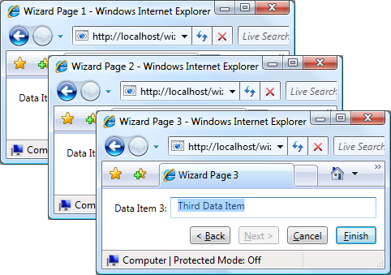
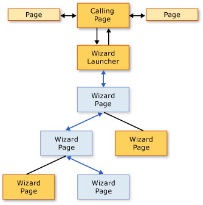
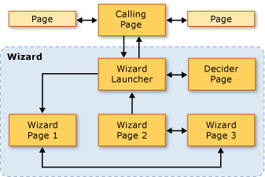

# Navigation Topologies Overview
 This overview provides an introduction to navigation topologies in [!INCLUDE[TLA2#tla_wpf](../../../../includes/tla2sharptla-wpf-md.md)]. Three common navigation topologies, with samples, are subsequently discussed.  
  
> [!NOTE]
>  Before reading this topic, you should be familiar with the concept of structured navigation in [!INCLUDE[TLA2#tla_wpf](../../../../includes/tla2sharptla-wpf-md.md)] using page functions. For more information on both of these topics, see [Structured Navigation Overview](../../../../docs/framework/wpf/app-development/structured-navigation-overview.md).  
  
 This topic contains the following sections:  
  
-   [Navigation Topologies](#Navigation_Topologies)  
  
-   [Structured Navigation Topologies](#Structured_Navigation_Topologies)  
  
-   [Navigation over a Fixed Linear Topology](#Navigation_over_a_Fixed_Linear_Topology)  
  
-   [Dynamic Navigation over a Fixed Hierarchical Topology](#Dynamic_Navigation_over_a_Fixed_Hierarchical_Topology)  
  
-   [Navigation over a Dynamically Generated Topology](#Navigation_over_a_Dynamically_Generated_Topology)  
  
   
## Navigation Topologies  
 In [!INCLUDE[TLA2#tla_wpf](../../../../includes/tla2sharptla-wpf-md.md)], navigation typically consists of pages (<xref:System.Windows.Controls.Page>) with hyperlinks (<xref:System.Windows.Documents.Hyperlink>) that navigate to other pages when clicked. Pages that are navigated to are identified by [!INCLUDE[TLA#tla_uri#plural](../../../../includes/tlasharptla-urisharpplural-md.md)] (see [Pack URIs in WPF](../../../../docs/framework/wpf/app-development/pack-uris-in-wpf.md)). Consider the following simple example that shows pages, hyperlinks, and [!INCLUDE[TLA#tla_uri#plural](../../../../includes/tlasharptla-urisharpplural-md.md)]:  
  
 [!code-xaml[NavigationTopologiesOverviewSnippets#Page1](../../../../samples/snippets/csharp/VS_Snippets_Wpf/NavigationTopologiesOverviewSnippets/CS/Page1.xaml#page1)]  
  
 [!code-xaml[NavigationTopologiesOverviewSnippets#Page2](../../../../samples/snippets/csharp/VS_Snippets_Wpf/NavigationTopologiesOverviewSnippets/CS/Page2.xaml#page2)]  
  
 These pages are arranged in a *navigation topology* whose structure is determined by how you can navigate between the pages. This particular navigation topology is suitable in simple scenarios, although navigation can require more complex topologies, some of which can only be defined when an application is running.  
  
 This topic covers three common navigation topologies: *fixed linear*, *fixed hierarchical*, and *dynamically generated*. Each navigation topology is demonstrated with a sample that has a [!INCLUDE[TLA2#tla_ui](../../../../includes/tla2sharptla-ui-md.md)] like the one that is shown in the following figure:  
  
   
  
   
## Structured Navigation Topologies  
 There are two broad types of navigation topologies:  
  
-   **Fixed Topology**: defined at compile time and does not change at run time. Fixed topologies are useful for navigation through a fixed sequence of pages in either a linear or hierarchical order.  
  
-   **Dynamic Topology**: defined at run time based on input that is collected from the user, the application, or the system. Dynamic topologies are useful when pages can be navigated in different sequences.  
  
 Although it is possible to create navigation topologies using pages, the samples use page functions because they provide additional support that simplifies support for passing and returning data through the pages of a topology.  
  
   
## Navigation over a Fixed Linear Topology  
 A fixed linear topology is analogous to the structure of a wizard that has one or more wizard pages that are navigated in a fixed sequence. The following figure shows the high-level structure and flow of a wizard with a fixed linear topology.  
  
   
  
 The typical behaviors for navigating over a fixed linear topology include the following:  
  
-   Navigating from the calling page to a launcher page that initializes the wizard and navigates to the first wizard page. A launcher page (a [!INCLUDE[TLA2#tla_ui](../../../../includes/tla2sharptla-ui-md.md)]-less <xref:System.Windows.Navigation.PageFunction%601>) is not required, since a calling page can call the first wizard page directly. Using a launcher page, however, can simplify wizard initialization, particularly if initialization is complex.  
  
-   Users can navigate between pages by using Back and Forward buttons (or hyperlinks).  
  
-   Users can navigate between pages using the journal.  
  
-   Users can cancel the wizard from any wizard page by pressing a Cancel button.  
  
-   Users can accept the wizard on the last wizard page by pressing a Finish button.  
  
-   If a wizard is canceled, the wizard returns an appropriate result, and does not return any data.  
  
-   If a user accepts a wizard, the wizard returns an appropriate result, and returns the data it collected.  
  
-   When the wizard is complete (accepted or canceled), the pages that the wizard comprises are removed from the journal. This keeps each instance of the wizard isolated, thereby avoiding potential data or state anomalies.  
  
   
## Dynamic Navigation over a Fixed Hierarchical Topology  
 In some applications, pages allow navigation to two or more other pages, as shown in the following figure.  
  
   
  
 This structure is known as a fixed hierarchical topology, and the sequence in which the hierarchy is traversed is often determined at run time by either the application or the user. At run time, each page in the hierarchy that allows navigation to two or more other pages gathers the data required to determine which page to navigate to. The following figure illustrates one of several possible navigation sequences based on the previous figure.  
  
   
  
 Even though the sequence in which pages in a fixed hierarchical structure are navigated is determined at run time, the user experience is the same as the user experience for a fixed linear topology:  
  
-   Navigating from the calling page to a launcher page that initializes the wizard and navigates to the first wizard page. A launcher page (a [!INCLUDE[TLA2#tla_ui](../../../../includes/tla2sharptla-ui-md.md)]-less <xref:System.Windows.Navigation.PageFunction%601>) is not required, since a calling page can call the first wizard page directly. Using a launcher page, however, can simplify wizard initialization, particularly if initialization is complex.  
  
-   Users can navigate between pages by using Back and Forward buttons (or hyperlinks).  
  
-   Users can navigate between pages using the journal.  
  
-   Users can change the navigation sequence if they navigate back through the journal.  
  
-   Users can cancel the wizard from any wizard page by pressing a Cancel button.  
  
-   Users can accept the wizard on the last wizard page by pressing a Finish button.  
  
-   If a wizard is canceled, the wizard returns an appropriate result, and does not return any data.  
  
-   If a user accepts a wizard, the wizard returns an appropriate result, and returns the data it collected.  
  
-   When the wizard is complete (accepted or canceled), the pages that the wizard comprises are removed from the journal. This keeps each instance of the wizard isolated, thereby avoiding potential data or state anomalies.  
  
   
## Navigation over a Dynamically Generated Topology  
 In some applications, the sequence in which two or more pages are navigated can only be determined at run time, whether by the user, the application, or external data. The following figure illustrates a set of pages with an undetermined navigation sequence.  
  
   
  
 The next figure illustrates a navigation sequence that was chosen by the user at run time.  
  
   
  
 The navigation sequence is known as a dynamically generated topology. For the user, as with the other navigation topologies, the user experience is the same as it is for the previous topologies:  
  
-   Navigating from the calling page to a launcher page that initializes the wizard and navigates to the first wizard page. A launcher page (a [!INCLUDE[TLA2#tla_ui](../../../../includes/tla2sharptla-ui-md.md)]-less <xref:System.Windows.Navigation.PageFunction%601>) is not required, since a calling page can call the first wizard page directly. Using a launcher page, however, can simplify wizard initialization, particularly if initialization is complex.  
  
-   Users can navigate between pages by using Back and Forward buttons (or hyperlinks).  
  
-   Users can navigate between pages using the journal.  
  
-   Users can cancel the wizard from any wizard page by pressing a Cancel button.  
  
-   Users can accept the wizard on the last wizard page by pressing a Finish button.  
  
-   If a wizard is canceled, the wizard returns an appropriate result, and does not return any data.  
  
-   If a user accepts a wizard, the wizard returns an appropriate result, and returns the data it collected.  
  
-   When the wizard is complete (accepted or canceled), the pages that the wizard comprises are removed from the journal. This keeps each instance of the wizard isolated, thereby avoiding potential data or state anomalies.  
  
## See Also  
 <xref:System.Windows.Controls.Page>  
 <xref:System.Windows.Navigation.PageFunction%601>  
 <xref:System.Windows.Navigation.NavigationService>  
 [Structured Navigation Overview](../../../../docs/framework/wpf/app-development/structured-navigation-overview.md)
