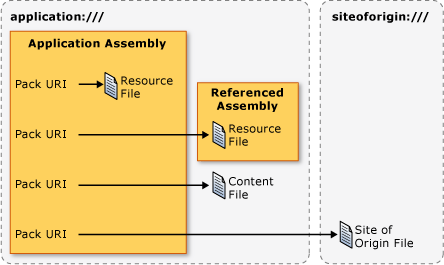

# Pack URIs in WPF
In [!INCLUDE[TLA#tla_wpf](../../../../includes/tlasharptla-wpf-md.md)], [!INCLUDE[TLA#tla_uri#plural](../../../../includes/tlasharptla-urisharpplural-md.md)] are used to identify and load files in many ways, including the following:  
  
-   Specifying the [!INCLUDE[TLA#tla_ui](../../../../includes/tlasharptla-ui-md.md)] to show when an application first starts.  
  
-   Loading images.  
  
-   Navigating to pages.  
  
-   Loading non-executable data files.  
  
 Furthermore, [!INCLUDE[TLA2#tla_uri#plural](../../../../includes/tla2sharptla-urisharpplural-md.md)] can be used to identify and load files from a variety of locations, including the following:  
  
-   The current assembly.  
  
-   A referenced assembly.  
  
-   A location relative to an assembly.  
  
-   The application's site of origin.  
  
 To provide a consistent mechanism for identifying and loading these types of files from these locations, [!INCLUDE[TLA2#tla_wpf](../../../../includes/tla2sharptla-wpf-md.md)] leverages the extensibility of the *pack URI scheme*. This topic provides an overview of the scheme, covers how to construct pack [!INCLUDE[TLA2#tla_uri#plural](../../../../includes/tla2sharptla-urisharpplural-md.md)] for a variety of scenarios, discusses absolute and relative [!INCLUDE[TLA2#tla_uri#plural](../../../../includes/tla2sharptla-urisharpplural-md.md)] and [!INCLUDE[TLA2#tla_uri](../../../../includes/tla2sharptla-uri-md.md)] resolution, before showing how to use pack [!INCLUDE[TLA2#tla_uri#plural](../../../../includes/tla2sharptla-urisharpplural-md.md)] from both markup and code.  
  
  
<a name="The_Pack_URI_Scheme"></a>   
## The Pack URI Scheme  
 The pack [!INCLUDE[TLA2#tla_uri](../../../../includes/tla2sharptla-uri-md.md)] scheme is used by the [Open Packaging Conventions](http://go.microsoft.com/fwlink/?LinkID=71255) (OPC) specification, which describes a model for organizing and identifying content. The key elements of this model are packages and parts, where a *package* is a logical container for one or more logical *parts*. The following figure illustrates this concept.  
  
   
  
 To identify parts, the OPC specification leverages the extensibility of RFC 2396 (Uniform Resource Identifiers (URI): Generic Syntax) to define the pack [!INCLUDE[TLA2#tla_uri](../../../../includes/tla2sharptla-uri-md.md)] scheme.  
  
 The scheme that is specified by a [!INCLUDE[TLA2#tla_uri](../../../../includes/tla2sharptla-uri-md.md)] is defined by its prefix; http, ftp, and file are well-known examples. The pack [!INCLUDE[TLA2#tla_uri](../../../../includes/tla2sharptla-uri-md.md)] scheme uses "pack" as its scheme, and contains two components: authority and path. The following is the format for a pack [!INCLUDE[TLA2#tla_uri](../../../../includes/tla2sharptla-uri-md.md)].  
  
 pack://*authority*/*path*
  
 The *authority* specifies the type of package that a part is contained by, while the *path* specifies the location of a part within a package.  
  
 This concept is illustrated by the following figure:  
  
   
  
 Packages and parts are analogous to applications and files, where an application (package) can include one or more files (parts), including:  
  
-   Resource files that are compiled into the local assembly.  
  
-   Resource files that are compiled into a referenced assembly.  
  
-   Resource files that are compiled into a referencing assembly.  
  
-   Content files.  
  
-   Site of origin files.  
  
 To access these types of files, [!INCLUDE[TLA2#tla_wpf](../../../../includes/tla2sharptla-wpf-md.md)] supports two authorities: application:/// and siteoforigin:///. The application:/// authority identifies application data files that are known at compile time, including resource and content files. The siteoforigin:/// authority identifies site of origin files. The scope of each authority is shown in the following figure.  
  
   
  
> [!NOTE]
>  The authority component of a pack [!INCLUDE[TLA2#tla_uri](../../../../includes/tla2sharptla-uri-md.md)] is an embedded [!INCLUDE[TLA2#tla_uri](../../../../includes/tla2sharptla-uri-md.md)] that points to a package and must conform to RFC 2396. Additionally, the "/" character must be replaced with the "," character, and reserved characters such as "%" and "?" must be escaped. See the OPC for details.  
  
 The following sections explain how to construct pack [!INCLUDE[TLA2#tla_uri#plural](../../../../includes/tla2sharptla-urisharpplural-md.md)] using these two authorities in conjunction with the appropriate paths for identifying resource, content, and site of origin files.  
  
<a name="Resource_File_Pack_URIs___Local_Assembly"></a>   
## Resource File Pack URIs  
 Resource files are configured as [!INCLUDE[TLA2#tla_msbuild](../../../../includes/tla2sharptla-msbuild-md.md)]`Resource` items and are compiled into assemblies. [!INCLUDE[TLA2#tla_wpf](../../../../includes/tla2sharptla-wpf-md.md)] supports the construction of pack [!INCLUDE[TLA2#tla_uri#plural](../../../../includes/tla2sharptla-urisharpplural-md.md)] that can be used to identify resource files that are either compiled into the local assembly or compiled into an assembly that is referenced from the local assembly.  
  
<a name="Local_Assembly_Resource_File"></a>   
### Local Assembly Resource File  
 The pack [!INCLUDE[TLA2#tla_uri](../../../../includes/tla2sharptla-uri-md.md)] for a resource file that is compiled into the local assembly uses the following authority and path:  
  
-   **Authority**: application:///.  
  
-   **Path**: The name of the resource file, including its path, relative to the local assembly project folder root.  
  
 The following example shows the pack [!INCLUDE[TLA2#tla_uri](../../../../includes/tla2sharptla-uri-md.md)] for a [!INCLUDE[TLA2#tla_xaml](../../../../includes/tla2sharptla-xaml-md.md)] resource file that is located in the root of the local assembly's project folder.  
  
 `pack://application:,,,/ResourceFile.xaml`  
  
 The following example shows the pack [!INCLUDE[TLA2#tla_uri](../../../../includes/tla2sharptla-uri-md.md)] for a [!INCLUDE[TLA2#tla_xaml](../../../../includes/tla2sharptla-xaml-md.md)] resource file that is located in a subfolder of the local assembly's project folder.  
  
 `pack://application:,,,/Subfolder/ResourceFile.xaml`  
  
<a name="Resource_File_Pack_URIs___Referenced_Assembly"></a>   
### Referenced Assembly Resource File  
 The pack [!INCLUDE[TLA2#tla_uri](../../../../includes/tla2sharptla-uri-md.md)] for a resource file that is compiled into a referenced assembly uses the following authority and path:  
  
-   **Authority**: application:///.  
  
-   **Path**: The name of a resource file that is compiled into a referenced assembly. The path must conform to the following format:  
  
     *AssemblyShortName*{*;Version*]{*;PublicKey*];component/*Path*  
  
    -   **AssemblyShortName**: the short name for the referenced assembly.  
  
    -   **;Version** [optional]: the version of the referenced assembly that contains the resource file. This is used when two or more referenced assemblies with the same short name are loaded.  
  
    -   **;PublicKey** [optional]: the public key that was used to sign the referenced assembly. This is used when two or more referenced assemblies with the same short name are loaded.  
  
    -   **;component**: specifies that the assembly being referred to is referenced from the local assembly.  
  
    -   **/Path**: the name of the resource file, including its path, relative to the root of the referenced assembly's project folder.  
  
 The following example shows the pack [!INCLUDE[TLA2#tla_uri](../../../../includes/tla2sharptla-uri-md.md)] for a [!INCLUDE[TLA2#tla_xaml](../../../../includes/tla2sharptla-xaml-md.md)] resource file that is located in the root of the referenced assembly's project folder.  
  
 `pack://application:,,,/ReferencedAssembly;component/ResourceFile.xaml`  
  
 The following example shows the pack [!INCLUDE[TLA2#tla_uri](../../../../includes/tla2sharptla-uri-md.md)] for a [!INCLUDE[TLA2#tla_xaml](../../../../includes/tla2sharptla-xaml-md.md)] resource file that is located in a subfolder of the referenced assembly's project folder.  
  
 `pack://application:,,,/ReferencedAssembly;component/Subfolder/ResourceFile.xaml`  
  
 The following example shows the pack [!INCLUDE[TLA2#tla_uri](../../../../includes/tla2sharptla-uri-md.md)] for a [!INCLUDE[TLA2#tla_xaml](../../../../includes/tla2sharptla-xaml-md.md)] resource file that is located in the root folder of a referenced, version-specific assembly's project folder.  
  
 `pack://application:,,,/ReferencedAssembly;v1.0.0.1;component/ResourceFile.xaml`  
  
 Note that the pack [!INCLUDE[TLA2#tla_uri](../../../../includes/tla2sharptla-uri-md.md)] syntax for referenced assembly resource files can be used only with the application:/// authority. For example, the following is not supported in [!INCLUDE[TLA2#tla_wpf](../../../../includes/tla2sharptla-wpf-md.md)].  
  
 `pack://siteoforigin:,,,/SomeAssembly;component/ResourceFile.xaml`  
  
<a name="Content_File_Pack_URIs"></a>   
## Content File Pack URIs  
 The pack [!INCLUDE[TLA2#tla_uri](../../../../includes/tla2sharptla-uri-md.md)] for a content file uses the following authority and path:  
  
-   **Authority**: application:///.  
  
-   **Path**: The name of the content file, including its path relative to the file system location of the application's main executable assembly.  
  
 The following example shows the pack [!INCLUDE[TLA2#tla_uri](../../../../includes/tla2sharptla-uri-md.md)] for a [!INCLUDE[TLA2#tla_xaml](../../../../includes/tla2sharptla-xaml-md.md)] content file, located in the same folder as the executable assembly.  
  
 `pack://application:,,,/ContentFile.xaml`  
  
 The following example shows the pack [!INCLUDE[TLA2#tla_uri](../../../../includes/tla2sharptla-uri-md.md)] for a [!INCLUDE[TLA2#tla_xaml](../../../../includes/tla2sharptla-xaml-md.md)] content file, located in a subfolder that is relative to the application's executable assembly.  
  
 `pack://application:,,,/Subfolder/ContentFile.xaml`  
  
> [!NOTE]
>  [!INCLUDE[TLA2#tla_html](../../../../includes/tla2sharptla-html-md.md)] content files cannot be navigated to. The [!INCLUDE[TLA2#tla_uri](../../../../includes/tla2sharptla-uri-md.md)] scheme only supports navigation to [!INCLUDE[TLA2#tla_html](../../../../includes/tla2sharptla-html-md.md)] files that are located at the site of origin.  
  
<a name="The_siteoforigin_____Authority"></a>   
## Site of Origin Pack URIs  
 The pack [!INCLUDE[TLA2#tla_uri](../../../../includes/tla2sharptla-uri-md.md)] for a site of origin file uses the following authority and path:  
  
-   **Authority**: siteoforigin:///.  
  
-   **Path**: The name of the site of origin file, including its path relative to the location from which the executable assembly was launched.  
  
 The following example shows the pack [!INCLUDE[TLA2#tla_uri](../../../../includes/tla2sharptla-uri-md.md)] for a [!INCLUDE[TLA2#tla_xaml](../../../../includes/tla2sharptla-xaml-md.md)] site of origin file, stored in the location from which the executable assembly is launched.  
  
 `pack://siteoforigin:,,,/SiteOfOriginFile.xaml`  
  
 The following example shows the pack [!INCLUDE[TLA2#tla_uri](../../../../includes/tla2sharptla-uri-md.md)] for a [!INCLUDE[TLA2#tla_xaml](../../../../includes/tla2sharptla-xaml-md.md)] site of origin file, stored in subfolder that is relative to the location from which the application's executable assembly is launched.  
  
 `pack://siteoforigin:,,,/Subfolder/SiteOfOriginFile.xaml`  
  
<a name="Page_Files"></a>   
## Page Files  
 [!INCLUDE[TLA2#tla_xaml](../../../../includes/tla2sharptla-xaml-md.md)] files that are configured as [!INCLUDE[TLA2#tla_msbuild](../../../../includes/tla2sharptla-msbuild-md.md)]`Page` items are compiled into assemblies in the same way as resource files. Consequently, [!INCLUDE[TLA2#tla_msbuild](../../../../includes/tla2sharptla-msbuild-md.md)]`Page` items can be identified using pack [!INCLUDE[TLA2#tla_uri#plural](../../../../includes/tla2sharptla-urisharpplural-md.md)] for resource files.  
  
 The types of [!INCLUDE[TLA2#tla_xaml](../../../../includes/tla2sharptla-xaml-md.md)] files that are commonly configured as [!INCLUDE[TLA2#tla_msbuild](../../../../includes/tla2sharptla-msbuild-md.md)]`Page` items have one of the following as their root element:  
  
-   <xref:System.Windows.Window?displayProperty=nameWithType>  
  
-   <xref:System.Windows.Controls.Page?displayProperty=nameWithType>  
  
-   <xref:System.Windows.Navigation.PageFunction%601?displayProperty=nameWithType>  
  
-   <xref:System.Windows.ResourceDictionary?displayProperty=nameWithType>  
  
-   <xref:System.Windows.Documents.FlowDocument?displayProperty=nameWithType>  
  
-   <xref:System.Windows.Controls.UserControl?displayProperty=nameWithType>  
  
<a name="Absolute_vs_Relative_Pack_URIs"></a>   
## Absolute vs. Relative Pack URIs  
 A fully qualified pack [!INCLUDE[TLA2#tla_uri](../../../../includes/tla2sharptla-uri-md.md)] includes the scheme, the authority, and the path, and it is considered an absolute pack [!INCLUDE[TLA2#tla_uri](../../../../includes/tla2sharptla-uri-md.md)]. As a simplification for developers, [!INCLUDE[TLA2#tla_xaml](../../../../includes/tla2sharptla-xaml-md.md)] elements typically allow you to set appropriate attributes with a relative pack [!INCLUDE[TLA2#tla_uri](../../../../includes/tla2sharptla-uri-md.md)], which includes only the path.  
  
 For example, consider the following absolute pack [!INCLUDE[TLA2#tla_uri](../../../../includes/tla2sharptla-uri-md.md)] for a resource file in the local assembly.  
  
 `pack://application:,,,/ResourceFile.xaml`  
  
 The relative pack [!INCLUDE[TLA2#tla_uri](../../../../includes/tla2sharptla-uri-md.md)] that refers to this resource file would be the following.  
  
 `/ResourceFile.xaml`  
  
> [!NOTE]
>  Because site of origin files are not associated with assemblies, they can only be referred to with absolute pack [!INCLUDE[TLA2#tla_uri#plural](../../../../includes/tla2sharptla-urisharpplural-md.md)].  
  
 By default, a relative pack [!INCLUDE[TLA2#tla_uri](../../../../includes/tla2sharptla-uri-md.md)] is considered relative to the location of the markup or code that contains the reference. If a leading backslash is used, however, the relative pack [!INCLUDE[TLA2#tla_uri](../../../../includes/tla2sharptla-uri-md.md)] reference is then considered relative to the root of the application. For example, consider the following project structure.  
  
 `App.xaml`  
  
 `Page2.xaml`  
  
 `\SubFolder`  
  
 `+ Page1.xaml`  
  
 `+ Page2.xaml`  
  
 If Page1.xaml contains a [!INCLUDE[TLA2#tla_uri](../../../../includes/tla2sharptla-uri-md.md)] that references *Root*\SubFolder\Page2.xaml, the reference can use the following relative pack [!INCLUDE[TLA2#tla_uri](../../../../includes/tla2sharptla-uri-md.md)].  
  
 `Page2.xaml`  
  
 If Page1.xaml contains a [!INCLUDE[TLA2#tla_uri](../../../../includes/tla2sharptla-uri-md.md)] that references *Root*\Page2.xaml, the reference can use the following relative pack [!INCLUDE[TLA2#tla_uri](../../../../includes/tla2sharptla-uri-md.md)].  
  
 `/Page2.xaml`  
  
<a name="Pack_URI_Resolution"></a>   
## Pack URI Resolution  
 The format of pack [!INCLUDE[TLA2#tla_uri#plural](../../../../includes/tla2sharptla-urisharpplural-md.md)] makes it is possible for pack [!INCLUDE[TLA2#tla_uri#plural](../../../../includes/tla2sharptla-urisharpplural-md.md)] for different types of files to look the same. For example, consider the following absolute pack [!INCLUDE[TLA2#tla_uri](../../../../includes/tla2sharptla-uri-md.md)].  
  
 `pack://application:,,,/ResourceOrContentFile.xaml`  
  
 This absolute pack [!INCLUDE[TLA2#tla_uri](../../../../includes/tla2sharptla-uri-md.md)] could refer to either a resource file in the local assembly or a content file. The same is true for the following relative [!INCLUDE[TLA2#tla_uri](../../../../includes/tla2sharptla-uri-md.md)].  
  
 `/ResourceOrContentFile.xaml`  
  
 In order to determine the type of file that a pack [!INCLUDE[TLA2#tla_uri](../../../../includes/tla2sharptla-uri-md.md)] refers to, [!INCLUDE[TLA2#tla_wpf](../../../../includes/tla2sharptla-wpf-md.md)] resolves [!INCLUDE[TLA2#tla_uri#plural](../../../../includes/tla2sharptla-urisharpplural-md.md)] for resource files in local assemblies and content files by using the following heuristics:  
  
1.  Probe the assembly metadata for an <xref:System.Windows.Resources.AssemblyAssociatedContentFileAttribute> attribute that matches the pack [!INCLUDE[TLA2#tla_uri](../../../../includes/tla2sharptla-uri-md.md)].  
  
2.  If the <xref:System.Windows.Resources.AssemblyAssociatedContentFileAttribute> attribute is found, the path of the pack [!INCLUDE[TLA2#tla_uri](../../../../includes/tla2sharptla-uri-md.md)] refers to a content file.  
  
3.  If the <xref:System.Windows.Resources.AssemblyAssociatedContentFileAttribute> attribute is not found, probe the set resource files that are compiled into the local assembly.  
  
4.  If a resource file that matches the path of the pack [!INCLUDE[TLA2#tla_uri](../../../../includes/tla2sharptla-uri-md.md)] is found, the path of the pack [!INCLUDE[TLA2#tla_uri](../../../../includes/tla2sharptla-uri-md.md)] refers to a resource file.  
  
5.  If the resource is not found, the internally created <xref:System.Uri> is invalid.  
  
 [!INCLUDE[TLA2#tla_uri](../../../../includes/tla2sharptla-uri-md.md)] resolution does not apply for [!INCLUDE[TLA2#tla_uri#plural](../../../../includes/tla2sharptla-urisharpplural-md.md)] that refer to the following:  
  
-   Content files in referenced assemblies: these file types are not supported by [!INCLUDE[TLA2#tla_wpf](../../../../includes/tla2sharptla-wpf-md.md)].  
  
-   Embedded files in referenced assemblies: [!INCLUDE[TLA2#tla_uri#plural](../../../../includes/tla2sharptla-urisharpplural-md.md)] that identify them are unique because they include both the name of the referenced assembly and the `;component` suffix.  
  
-   Site of origin files: [!INCLUDE[TLA2#tla_uri#plural](../../../../includes/tla2sharptla-urisharpplural-md.md)] that identify them are unique because they are the only files that can be identified by pack [!INCLUDE[TLA2#tla_uri#plural](../../../../includes/tla2sharptla-urisharpplural-md.md)] that contain the siteoforigin:/// authority.  
  
 One simplification that pack [!INCLUDE[TLA2#tla_uri](../../../../includes/tla2sharptla-uri-md.md)] resolution allows is for code to be somewhat independent of the locations of resource and content files. For example, if you have a resource file in the local assembly that is reconfigured to be a content file, the pack [!INCLUDE[TLA2#tla_uri](../../../../includes/tla2sharptla-uri-md.md)] for the resource remains the same, as does the code that uses the pack [!INCLUDE[TLA2#tla_uri](../../../../includes/tla2sharptla-uri-md.md)].  
  
<a name="Programming_with_Pack_URIs"></a>   
## Programming with Pack URIs  
 Many [!INCLUDE[TLA2#tla_wpf](../../../../includes/tla2sharptla-wpf-md.md)] classes implement properties that can be set with pack [!INCLUDE[TLA2#tla_uri#plural](../../../../includes/tla2sharptla-urisharpplural-md.md)], including:  
  
-   <xref:System.Windows.Application.StartupUri%2A?displayProperty=nameWithType>  
  
-   <xref:System.Windows.Controls.Frame.Source%2A?displayProperty=nameWithType>  
  
-   <xref:System.Windows.Navigation.NavigationWindow.Source%2A?displayProperty=nameWithType>  
  
-   <xref:System.Windows.Documents.Hyperlink.NavigateUri%2A?displayProperty=nameWithType>  
  
-   <xref:System.Windows.Window.Icon%2A?displayProperty=nameWithType>  
  
-   <xref:System.Windows.Controls.Image.Source%2A?displayProperty=nameWithType>  
  
 These properties can be set from both markup and code. This section demonstrates the basic constructions for both and then shows examples of common scenarios.  
  
<a name="Using_Pack_URIs_in_Markup"></a>   
### Using Pack URIs in Markup  
 A pack [!INCLUDE[TLA2#tla_uri](../../../../includes/tla2sharptla-uri-md.md)] is specified in markup by setting the element of an attribute with the pack [!INCLUDE[TLA2#tla_uri](../../../../includes/tla2sharptla-uri-md.md)]. For example:  
  
 `<element attribute="pack://application:,,,/File.xaml" />`  
  
 Table 1 illustrates the various absolute pack [!INCLUDE[TLA2#tla_uri#plural](../../../../includes/tla2sharptla-urisharpplural-md.md)] that you can specify in markup.  
  
 Table 1: Absolute Pack URIs in Markup  
  
|File|Absolute pack [!INCLUDE[TLA2#tla_uri](../../../../includes/tla2sharptla-uri-md.md)]|  
|----------|-------------------------------------------------------------------------------------------------------------------------|  
|Resource file - local assembly|`"pack://application:,,,/ResourceFile.xaml"`|  
|Resource file in subfolder - local assembly|`"pack://application:,,,/Subfolder/ResourceFile.xaml"`|  
|Resource file - referenced assembly|`"pack://application:,,,/ReferencedAssembly;component/ResourceFile.xaml"`|  
|Resource file in subfolder of referenced assembly|`"pack://application:,,,/ReferencedAssembly;component/Subfolder/ResourceFile.xaml"`|  
|Resource file in versioned referenced assembly|`"pack://application:,,,/ReferencedAssembly;v1.0.0.0;component/ResourceFile.xaml"`|  
|Content file|`"pack://application:,,,/ContentFile.xaml"`|  
|Content file in subfolder|`"pack://application:,,,/Subfolder/ContentFile.xaml"`|  
|Site of origin file|`"pack://siteoforigin:,,,/SOOFile.xaml"`|  
|Site of origin file in subfolder|`"pack://siteoforigin:,,,/Subfolder/SOOFile.xaml"`|  
  
 Table 2 illustrates the various relative pack [!INCLUDE[TLA2#tla_uri#plural](../../../../includes/tla2sharptla-urisharpplural-md.md)] that you can specify in markup.  
  
 Table 2: Relative Pack URIs in Markup  
  
|File|Relative pack [!INCLUDE[TLA2#tla_uri](../../../../includes/tla2sharptla-uri-md.md)]|  
|----------|-------------------------------------------------------------------------------------------------------------------------|  
|Resource file in local assembly|`"/ResourceFile.xaml"`|  
|Resource file in subfolder of local assembly|`"/Subfolder/ResourceFile.xaml"`|  
|Resource file in referenced assembly|`"/ReferencedAssembly;component/ResourceFile.xaml"`|  
|Resource file in subfolder of referenced assembly|`"/ReferencedAssembly;component/Subfolder/ResourceFile.xaml"`|  
|Content file|`"/ContentFile.xaml"`|  
|Content file in subfolder|`"/Subfolder/ContentFile.xaml"`|  
  
<a name="Using_Pack_URIs_in_Code"></a>   
### Using Pack URIs in Code  
 You specify a pack [!INCLUDE[TLA2#tla_uri](../../../../includes/tla2sharptla-uri-md.md)] in code by instantiating the <xref:System.Uri> class and passing the pack [!INCLUDE[TLA2#tla_uri](../../../../includes/tla2sharptla-uri-md.md)] as a parameter to the constructor. This is demonstrated in the following example.  
  
```csharp  
Uri uri = new Uri("pack://application:,,,/File.xaml");  
```  
  
 By default, the <xref:System.Uri> class considers pack [!INCLUDE[TLA2#tla_uri#plural](../../../../includes/tla2sharptla-urisharpplural-md.md)] to be absolute. Consequently, an exception is raised when an instance of the <xref:System.Uri> class is created with a relative pack [!INCLUDE[TLA2#tla_uri](../../../../includes/tla2sharptla-uri-md.md)].  
  
```csharp  
Uri uri = new Uri("/File.xaml");  
```  
  
 Fortunately, the <xref:System.Uri.%23ctor%28System.String%2CSystem.UriKind%29> overload of the <xref:System.Uri> class constructor accepts a parameter of type <xref:System.UriKind> to allow you to specify whether a pack [!INCLUDE[TLA2#tla_uri](../../../../includes/tla2sharptla-uri-md.md)] is either absolute or relative.  
  
```csharp  
// Absolute URI (default)  
Uri absoluteUri = new Uri("pack://application:,,,/File.xaml", UriKind.Absolute);  
// Relative URI  
Uri relativeUri = new Uri("/File.xaml",   
                        UriKind.Relative);  
```  
  
 You should specify only <xref:System.UriKind.Absolute> or <xref:System.UriKind.Relative> when you are certain that the provided pack [!INCLUDE[TLA2#tla_uri](../../../../includes/tla2sharptla-uri-md.md)] is one or the other. If you don't know the type of pack [!INCLUDE[TLA2#tla_uri](../../../../includes/tla2sharptla-uri-md.md)] that is used, such as when a user enters a pack [!INCLUDE[TLA2#tla_uri](../../../../includes/tla2sharptla-uri-md.md)] at run time, use <xref:System.UriKind.RelativeOrAbsolute> instead.  
  
```csharp  
// Relative or Absolute URI provided by user via a text box  
TextBox userProvidedUriTextBox = new TextBox();  
Uri uri = new Uri(userProvidedUriTextBox.Text, UriKind.RelativeOrAbsolute);  
```  
  
 Table 3 illustrates the various relative pack [!INCLUDE[TLA2#tla_uri#plural](../../../../includes/tla2sharptla-urisharpplural-md.md)] that you can specify in code by using <xref:System.Uri?displayProperty=nameWithType>.  
  
 Table 3: Absolute Pack URIs in Code  
  
|File|Absolute pack [!INCLUDE[TLA2#tla_uri](../../../../includes/tla2sharptla-uri-md.md)]|  
|----------|-------------------------------------------------------------------------------------------------------------------------|  
|Resource file - local assembly|`Uri uri = new Uri("pack://application:,,,/ResourceFile.xaml", UriKind.Absolute);`|  
|Resource file in subfolder - local assembly|`Uri uri = new Uri("pack://application:,,,/Subfolder/ResourceFile.xaml", UriKind.Absolute);`|  
|Resource file - referenced assembly|`Uri uri = new Uri("pack://application:,,,/ReferencedAssembly;component/ResourceFile.xaml", UriKind.Absolute);`|  
|Resource file in subfolder of referenced assembly|`Uri uri = new Uri("pack://application:,,,/ReferencedAssembly;component/Subfolder/ResourceFile.xaml", UriKind.Absolute);`|  
|Resource file in versioned referenced assembly|`Uri uri = new Uri("pack://application:,,,/ReferencedAssembly;v1.0.0.0;component/ResourceFile.xaml", UriKind.Absolute);`|  
|Content file|`Uri uri = new Uri("pack://application:,,,/ContentFile.xaml", UriKind.Absolute);`|  
|Content file in subfolder|`Uri uri = new Uri("pack://application:,,,/Subfolder/ContentFile.xaml", UriKind.Absolute);`|  
|Site of origin file|`Uri uri = new Uri("pack://siteoforigin:,,,/SOOFile.xaml", UriKind.Absolute);`|  
|Site of origin file in subfolder|`Uri uri = new Uri("pack://siteoforigin:,,,/Subfolder/SOOFile.xaml", UriKind.Absolute);`|  
  
 Table 4 illustrates the various relative pack [!INCLUDE[TLA2#tla_uri#plural](../../../../includes/tla2sharptla-urisharpplural-md.md)] that you can specify in code using <xref:System.Uri?displayProperty=nameWithType>.  
  
 Table 4: Relative Pack URIs in Code  
  
|File|Relative pack [!INCLUDE[TLA2#tla_uri](../../../../includes/tla2sharptla-uri-md.md)]|  
|----------|-------------------------------------------------------------------------------------------------------------------------|  
|Resource file - local assembly|`Uri uri = new Uri("/ResourceFile.xaml", UriKind.Relative);`|  
|Resource file in subfolder - local assembly|`Uri uri = new Uri("/Subfolder/ResourceFile.xaml", UriKind.Relative);`|  
|Resource file - referenced assembly|`Uri uri = new Uri("/ReferencedAssembly;component/ResourceFile.xaml", UriKind.Relative);`|  
|Resource file in subfolder - referenced assembly|`Uri uri = new Uri("/ReferencedAssembly;component/Subfolder/ResourceFile.xaml", UriKind.Relative);`|  
|Content file|`Uri uri = new Uri("/ContentFile.xaml", UriKind.Relative);`|  
|Content file in subfolder|`Uri uri = new Uri("/Subfolder/ContentFile.xaml", UriKind.Relative);`|  
  
<a name="Common_Pack_URI_Scenarios"></a>   
### Common Pack URI Scenarios  
 The preceding sections have discussed how to construct pack [!INCLUDE[TLA2#tla_uri#plural](../../../../includes/tla2sharptla-urisharpplural-md.md)] to identify resource, content, and site of origin files. In [!INCLUDE[TLA2#tla_wpf](../../../../includes/tla2sharptla-wpf-md.md)], these constructions are used in a variety of ways, and the following sections cover several common usages.  
  
<a name="Specifying_the_UI_to_Show_when_an_Application_Starts"></a>   
#### Specifying the UI to Show When an Application Starts  
 <xref:System.Windows.Application.StartupUri%2A> specifies the first [!INCLUDE[TLA2#tla_ui](../../../../includes/tla2sharptla-ui-md.md)] to show when a [!INCLUDE[TLA2#tla_wpf](../../../../includes/tla2sharptla-wpf-md.md)] application is launched. For standalone applications, the [!INCLUDE[TLA2#tla_ui](../../../../includes/tla2sharptla-ui-md.md)] can be a window, as shown in the following example.  
  
 [!code-xaml[PackURIOverviewSnippets#StartupUriWindow](../../../../samples/snippets/csharp/VS_Snippets_Wpf/PackURIOverviewSnippets/CS/Copy of App.xaml#startupuriwindow)]  
  
 Standalone applications and [!INCLUDE[TLA#tla_xbap#plural](../../../../includes/tlasharptla-xbapsharpplural-md.md)] can also specify a page as the initial UI, as shown in the following example.  
  
 [!code-xaml[PackURIOverviewSnippets#StartupUriPage](../../../../samples/snippets/csharp/VS_Snippets_Wpf/PackURIOverviewSnippets/CS/App.xaml#startupuripage)]  
  
 If the application is a standalone application and a page is specified with <xref:System.Windows.Application.StartupUri%2A>, [!INCLUDE[TLA2#tla_wpf](../../../../includes/tla2sharptla-wpf-md.md)] opens a <xref:System.Windows.Navigation.NavigationWindow> to host the page. For [!INCLUDE[TLA2#tla_xbap#plural](../../../../includes/tla2sharptla-xbapsharpplural-md.md)], the page is shown in the host browser.  
  
<a name="Navigating_to_a_Page"></a>   
#### Navigating to a Page  
 The following example shows how to navigate to a page.  
  
 [!code-xaml[NavigationOverviewSnippets#HyperlinkXAML1](../../../../samples/snippets/csharp/VS_Snippets_Wpf/NavigationOverviewSnippets/CSharp/PageWithHyperlink.xaml#hyperlinkxaml1)]  
[!code-xaml[NavigationOverviewSnippets#HyperlinkXAML2](../../../../samples/snippets/csharp/VS_Snippets_Wpf/NavigationOverviewSnippets/CSharp/PageWithHyperlink.xaml#hyperlinkxaml2)]  
[!code-xaml[NavigationOverviewSnippets#HyperlinkXAML3](../../../../samples/snippets/csharp/VS_Snippets_Wpf/NavigationOverviewSnippets/CSharp/PageWithHyperlink.xaml#hyperlinkxaml3)]  
  
 For more information on the various ways to navigate in [!INCLUDE[TLA2#tla_wpf](../../../../includes/tla2sharptla-wpf-md.md)], see [Navigation Overview](../../../../docs/framework/wpf/app-development/navigation-overview.md).  
  
<a name="Specifying_a_Window_Icon"></a>   
#### Specifying a Window Icon  
 The following example shows how to use a URI to specify a window's icon.  
  
 [!code-xaml[WindowIconSnippets#WindowIconSetXAML](../../../../samples/snippets/xaml/VS_Snippets_Wpf/WindowIconSnippets/XAML/MainWindow.xaml#windowiconsetxaml)]  
  
 For more information, see <xref:System.Windows.Window.Icon%2A>.  
  
<a name="Loading_Image__Audio__and_Video_Files"></a>   
#### Loading Image, Audio, and Video Files  
 [!INCLUDE[TLA2#tla_wpf](../../../../includes/tla2sharptla-wpf-md.md)] allows applications to use a wide variety of media types, all of which can be identified and loaded with pack [!INCLUDE[TLA2#tla_uri#plural](../../../../includes/tla2sharptla-urisharpplural-md.md)], as shown in the following examples.  
  
 [!code-xaml[MediaPlayerVideoSample#VideoPackURIAtSOO](../../../../samples/snippets/csharp/VS_Snippets_Wpf/MediaPlayerVideoSample/CS/HomePage.xaml#videopackuriatsoo)]  
  
 [!code-xaml[MediaPlayerAudioSample#AudioPackURIAtSOO](../../../../samples/snippets/csharp/VS_Snippets_Wpf/MediaPlayerAudioSample/CS/HomePage.xaml#audiopackuriatsoo)]  
  
 [!code-xaml[ImageSample#ImagePackURIContent](../../../../samples/snippets/csharp/VS_Snippets_Wpf/ImageSample/CS/HomePage.xaml#imagepackuricontent)]  
  
 For more information on working with media content, see [Graphics and Multimedia](../../../../docs/framework/wpf/graphics-multimedia/index.md).  
  
<a name="Loading_a_Resource_Dictionary_from_the_Site_of_Origin"></a>   
#### Loading a Resource Dictionary from the Site of Origin  
 Resource dictionaries (<xref:System.Windows.ResourceDictionary>) can be used to support application themes. One way to create and manage themes is to create multiple themes as resource dictionaries that are located at an application's site of origin. This allows themes to be added and updated without recompiling and redeploying an application. These resource dictionaries can be identified and loaded using pack [!INCLUDE[TLA2#tla_uri#plural](../../../../includes/tla2sharptla-urisharpplural-md.md)], which is shown in the following example.  
  
 [!code-xaml[ResourceDictionarySnippets#ResourceDictionaryPackURI](../../../../samples/snippets/csharp/VS_Snippets_Wpf/ResourceDictionarySnippets/CS/App.xaml#resourcedictionarypackuri)]  
  
 For an overview of themes in [!INCLUDE[TLA2#tla_wpf](../../../../includes/tla2sharptla-wpf-md.md)], see [Styling and Templating](../../../../docs/framework/wpf/controls/styling-and-templating.md).  
  
## See Also  
 [WPF Application Resource, Content, and Data Files](../../../../docs/framework/wpf/app-development/wpf-application-resource-content-and-data-files.md)
