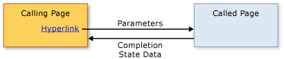

# Structured Navigation Overview
Content that can be hosted by an [!INCLUDE[TLA#tla_xbap](../../../../includes/tlasharptla-xbap-md.md)], a <xref:System.Windows.Controls.Frame>, or a <xref:System.Windows.Navigation.NavigationWindow> is composed of pages that can be identified by pack [!INCLUDE[TLA#tla_uri#plural](../../../../includes/tlasharptla-urisharpplural-md.md)] and navigated to by hyperlinks. The structure of pages and the ways in which they can be navigated, as defined by hyperlinks, is known as a navigation topology. Such a topology suits a variety of application types, particularly those that navigate through documents. For such applications, the user can navigate from one page to another page without either page needing to know anything about the other.  
  
 However, other types of applications have pages that do need to know when they have been navigated between. For example, consider a human resources application that has one page to list all the employees in an organization—the "List Employees" page. This page could also allow users to add a new employee by clicking a hyperlink. When clicked, the page navigates to an "Add an Employee" page to gather the new employee's details and return them to the "List Employees" page to create the new employee and update the list. This style of navigation is similar to calling a method to perform some processing and return a value, which is known as structured programming. As such, this style of navigation is known as *structured navigation*.  
  
 The <xref:System.Windows.Controls.Page> class doesn't implement support for structured navigation. Instead, the <xref:System.Windows.Navigation.PageFunction%601> class derives from <xref:System.Windows.Controls.Page> and extends it with the basic constructs required for structured navigation. This topic shows how to establish structured navigation using <xref:System.Windows.Navigation.PageFunction%601>.  
  
 
  
   
## Structured Navigation  
 When one page calls another page in a structured navigation, some or all of the following behaviors are required:  
  
-   The calling page navigates to the called page, optionally passing parameters required by the called page.  
  
-   The called page, when a user has completed using the calling page, returns specifically to the calling page, optionally:  
  
    -   Returning state information that describes how the calling page was completed (for example, whether a user pressed an OK button or a Cancel button).  
  
    -   Returning that data that was collected from the user (for example, new employee details).  
  
-   When the calling page returns to the called page, the called page is removed from navigation history to isolate one instance of a called page from another.  
  
 These behaviors are illustrated by the following figure.  
  
   
  
 You can implement these behaviors by using a <xref:System.Windows.Navigation.PageFunction%601> as the called page.  
  
   
## Structured Navigation with PageFunction  
 This topic shows how to implement the basic mechanics of structured navigation involving a single <xref:System.Windows.Navigation.PageFunction%601>. In this sample, a <xref:System.Windows.Controls.Page> calls a <xref:System.Windows.Navigation.PageFunction%601> to get a <xref:System.String> value from the user and return it.  
  
### Creating a Calling Page  
 The page that calls a <xref:System.Windows.Navigation.PageFunction%601> can be either a <xref:System.Windows.Controls.Page> or a <xref:System.Windows.Navigation.PageFunction%601>. In this example, it is a <xref:System.Windows.Controls.Page>, as shown in the following code.  
  
 [!code-xaml[StructuredNavigationSample#CallingPageDefaultMARKUP1](../../../../samples/snippets/csharp/VS_Snippets_Wpf/StructuredNavigationSample/CSharp/CallingPage.xaml#callingpagedefaultmarkup1)]  
[!code-xaml[StructuredNavigationSample#CallingPageDefaultMARKUP2](../../../../samples/snippets/csharp/VS_Snippets_Wpf/StructuredNavigationSample/CSharp/CallingPage.xaml#callingpagedefaultmarkup2)]  
  
 [!code-csharp[StructuredNavigationSample#CallingPageDefaultCODEBEHIND1](../../../../samples/snippets/csharp/VS_Snippets_Wpf/StructuredNavigationSample/CSharp/CallingPage.xaml.cs#callingpagedefaultcodebehind1)]
 [!code-vb[StructuredNavigationSample#CallingPageDefaultCODEBEHIND1](../../../../samples/snippets/visualbasic/VS_Snippets_Wpf/StructuredNavigationSample/VisualBasic/CallingPage.xaml.vb#callingpagedefaultcodebehind1)]  
[!code-csharp[StructuredNavigationSample#CallingPageDefaultCODEBEHIND2](../../../../samples/snippets/csharp/VS_Snippets_Wpf/StructuredNavigationSample/CSharp/CallingPage.xaml.cs#callingpagedefaultcodebehind2)]
[!code-vb[StructuredNavigationSample#CallingPageDefaultCODEBEHIND2](../../../../samples/snippets/visualbasic/VS_Snippets_Wpf/StructuredNavigationSample/VisualBasic/CallingPage.xaml.vb#callingpagedefaultcodebehind2)]  
[!code-csharp[StructuredNavigationSample#CallingPageDefaultCODEBEHIND3](../../../../samples/snippets/csharp/VS_Snippets_Wpf/StructuredNavigationSample/CSharp/CallingPage.xaml.cs#callingpagedefaultcodebehind3)]
[!code-vb[StructuredNavigationSample#CallingPageDefaultCODEBEHIND3](../../../../samples/snippets/visualbasic/VS_Snippets_Wpf/StructuredNavigationSample/VisualBasic/CallingPage.xaml.vb#callingpagedefaultcodebehind3)]  
  
### Creating a Page Function to Call  
 Because the calling page can use the called page to collect and return data from the user, <xref:System.Windows.Navigation.PageFunction%601> is implemented as a generic class whose type argument specifies the type of the value that the called page will return. The following code shows the initial implementation of the called page, using a <xref:System.Windows.Navigation.PageFunction%601>, which returns a <xref:System.String>.  
  
 [!code-xaml[StructuredNavigationSample#CalledPageFunctionMARKUP](../../../../samples/snippets/csharp/VS_Snippets_Wpf/StructuredNavigationSample/CSharp/CalledPageFunction.xaml#calledpagefunctionmarkup)]  
  
 [!code-csharp[StructuredNavigationSample#CalledPageFunctionCODEBEHIND1](../../../../samples/snippets/csharp/VS_Snippets_Wpf/StructuredNavigationSample/CSharp/CalledPageFunction.xaml.cs#calledpagefunctioncodebehind1)]
 [!code-vb[StructuredNavigationSample#CalledPageFunctionCODEBEHIND1](../../../../samples/snippets/visualbasic/VS_Snippets_Wpf/StructuredNavigationSample/VisualBasic/CalledPageFunction.xaml.vb#calledpagefunctioncodebehind1)]  
[!code-csharp[StructuredNavigationSample#CalledPageFunctionCODEBEHIND2](../../../../samples/snippets/csharp/VS_Snippets_Wpf/StructuredNavigationSample/CSharp/CalledPageFunction.xaml.cs#calledpagefunctioncodebehind2)]
[!code-vb[StructuredNavigationSample#CalledPageFunctionCODEBEHIND2](../../../../samples/snippets/visualbasic/VS_Snippets_Wpf/StructuredNavigationSample/VisualBasic/CalledPageFunction.xaml.vb#calledpagefunctioncodebehind2)]  
  
 The declaration of a <xref:System.Windows.Navigation.PageFunction%601> is similar to the declaration of a <xref:System.Windows.Controls.Page> with the addition of the type arguments. As you can see from the code example, the type arguments are specified in both [!INCLUDE[TLA2#tla_xaml](../../../../includes/tla2sharptla-xaml-md.md)] markup, using the `x:TypeArguments` attribute, and code-behind, using standard generic type argument syntax.  
  
 You don't have to use only [!INCLUDE[dnprdnshort](../../../../includes/dnprdnshort-md.md)] classes as type arguments. A <xref:System.Windows.Navigation.PageFunction%601> could be called to gather domain-specific data that is abstracted as a custom type. The following code shows how to use a custom type as a type argument for a <xref:System.Windows.Navigation.PageFunction%601>.  
  
 [!code-csharp[CustomTypePageFunctionSnippets#CustomTypeCODE1](../../../../samples/snippets/csharp/VS_Snippets_Wpf/CustomTypePageFunctionSnippets/CSharp/CustomType.cs#customtypecode1)]
 [!code-vb[CustomTypePageFunctionSnippets#CustomTypeCODE1](../../../../samples/snippets/visualbasic/VS_Snippets_Wpf/CustomTypePageFunctionSnippets/VisualBasic/CustomType.vb#customtypecode1)]  
[!code-csharp[CustomTypePageFunctionSnippets#CustomTypeCODE2](../../../../samples/snippets/csharp/VS_Snippets_Wpf/CustomTypePageFunctionSnippets/CSharp/CustomType.cs#customtypecode2)]
[!code-vb[CustomTypePageFunctionSnippets#CustomTypeCODE2](../../../../samples/snippets/visualbasic/VS_Snippets_Wpf/CustomTypePageFunctionSnippets/VisualBasic/CustomType.vb#customtypecode2)]  
  
 [!code-xaml[CustomTypePageFunctionSnippets#CustomTypePageFunctionMARKUP1](../../../../samples/snippets/csharp/VS_Snippets_Wpf/CustomTypePageFunctionSnippets/CSharp/CustomTypePageFunction.xaml#customtypepagefunctionmarkup1)]  
[!code-xaml[CustomTypePageFunctionSnippets#CustomTypePageFunctionMARKUP2](../../../../samples/snippets/csharp/VS_Snippets_Wpf/CustomTypePageFunctionSnippets/CSharp/CustomTypePageFunction.xaml#customtypepagefunctionmarkup2)]  
  
 [!code-csharp[CustomTypePageFunctionSnippets#CustomTypePageFunctionCODEBEHIND1](../../../../samples/snippets/csharp/VS_Snippets_Wpf/CustomTypePageFunctionSnippets/CSharp/CustomTypePageFunction.xaml.cs#customtypepagefunctioncodebehind1)]
 [!code-vb[CustomTypePageFunctionSnippets#CustomTypePageFunctionCODEBEHIND1](../../../../samples/snippets/visualbasic/VS_Snippets_Wpf/CustomTypePageFunctionSnippets/VisualBasic/CustomTypePageFunction.xaml.vb#customtypepagefunctioncodebehind1)]  
[!code-csharp[CustomTypePageFunctionSnippets#CustomTypePageFunctionCODEBEHIND2](../../../../samples/snippets/csharp/VS_Snippets_Wpf/CustomTypePageFunctionSnippets/CSharp/CustomTypePageFunction.xaml.cs#customtypepagefunctioncodebehind2)]
[!code-vb[CustomTypePageFunctionSnippets#CustomTypePageFunctionCODEBEHIND2](../../../../samples/snippets/visualbasic/VS_Snippets_Wpf/CustomTypePageFunctionSnippets/VisualBasic/CustomTypePageFunction.xaml.vb#customtypepagefunctioncodebehind2)]  
  
 The type arguments for the <xref:System.Windows.Navigation.PageFunction%601> provide the foundation for the communication between a calling page and the called page, which are discussed in the following sections.  
  
 As you'll see, the type that is identified with the declaration of a <xref:System.Windows.Navigation.PageFunction%601> plays an important role in returning data from a <xref:System.Windows.Navigation.PageFunction%601> to the calling page.  
  
### Calling a PageFunction and Passing Parameters  
 To call a page, the calling page must instantiate the called page and navigate to it using the <xref:System.Windows.Navigation.NavigationService.Navigate%2A> method. This allows the calling page to pass initial data to the called page, such as default values for the data being gathered by the called page.  
  
 The following code shows the called page with a non-default constructor to accept parameters from the calling page.  
  
 [!code-csharp[StructuredNavigationSample#AcceptsInitialDataCODEBEHIND1](../../../../samples/snippets/csharp/VS_Snippets_Wpf/StructuredNavigationSample/CSharp/CalledPageFunction.xaml.cs#acceptsinitialdatacodebehind1)]
 [!code-vb[StructuredNavigationSample#AcceptsInitialDataCODEBEHIND1](../../../../samples/snippets/visualbasic/VS_Snippets_Wpf/StructuredNavigationSample/VisualBasic/CalledPageFunction.xaml.vb#acceptsinitialdatacodebehind1)]  
[!code-csharp[StructuredNavigationSample#AcceptsInitialDataCODEBEHIND2](../../../../samples/snippets/csharp/VS_Snippets_Wpf/StructuredNavigationSample/CSharp/CalledPageFunction.xaml.cs#acceptsinitialdatacodebehind2)]
[!code-vb[StructuredNavigationSample#AcceptsInitialDataCODEBEHIND2](../../../../samples/snippets/visualbasic/VS_Snippets_Wpf/StructuredNavigationSample/VisualBasic/CalledPageFunction.xaml.vb#acceptsinitialdatacodebehind2)]  
[!code-csharp[StructuredNavigationSample#AcceptsInitialDataCODEBEHIND3](../../../../samples/snippets/csharp/VS_Snippets_Wpf/StructuredNavigationSample/CSharp/CalledPageFunction.xaml.cs#acceptsinitialdatacodebehind3)]
[!code-vb[StructuredNavigationSample#AcceptsInitialDataCODEBEHIND3](../../../../samples/snippets/visualbasic/VS_Snippets_Wpf/StructuredNavigationSample/VisualBasic/CalledPageFunction.xaml.vb#acceptsinitialdatacodebehind3)]  
[!code-csharp[StructuredNavigationSample#AcceptsInitialDataCODEBEHIND4](../../../../samples/snippets/csharp/VS_Snippets_Wpf/StructuredNavigationSample/CSharp/CalledPageFunction.xaml.cs#acceptsinitialdatacodebehind4)]
[!code-vb[StructuredNavigationSample#AcceptsInitialDataCODEBEHIND4](../../../../samples/snippets/visualbasic/VS_Snippets_Wpf/StructuredNavigationSample/VisualBasic/CalledPageFunction.xaml.vb#acceptsinitialdatacodebehind4)]  
  
 The following code shows the calling page handling the <xref:System.Windows.Documents.Hyperlink.Click> event of the <xref:System.Windows.Documents.Hyperlink> to instantiate the called page and pass it an initial string value.  
  
 [!code-xaml[StructuredNavigationSample#PassingDataMARKUP2](../../../../samples/snippets/csharp/VS_Snippets_Wpf/StructuredNavigationSample/CSharp/CallingPage.xaml#passingdatamarkup2)]  
[!code-csharp[StructuredNavigationSample#PassingDataCODEBEHIND1](../../../../samples/snippets/csharp/VS_Snippets_Wpf/StructuredNavigationSample/CSharp/CallingPage.xaml.cs#passingdatacodebehind1)]
[!code-vb[StructuredNavigationSample#PassingDataCODEBEHIND1](../../../../samples/snippets/visualbasic/VS_Snippets_Wpf/StructuredNavigationSample/VisualBasic/CallingPage.xaml.vb#passingdatacodebehind1)]  
[!code-csharp[StructuredNavigationSample#PassingDataCODEBEHIND2](../../../../samples/snippets/csharp/VS_Snippets_Wpf/StructuredNavigationSample/CSharp/CallingPage.xaml.cs#passingdatacodebehind2)]
[!code-vb[StructuredNavigationSample#PassingDataCODEBEHIND2](../../../../samples/snippets/visualbasic/VS_Snippets_Wpf/StructuredNavigationSample/VisualBasic/CallingPage.xaml.vb#passingdatacodebehind2)]  
[!code-csharp[StructuredNavigationSample#PassingDataCODEBEHIND3](../../../../samples/snippets/csharp/VS_Snippets_Wpf/StructuredNavigationSample/CSharp/CallingPage.xaml.cs#passingdatacodebehind3)]
[!code-vb[StructuredNavigationSample#PassingDataCODEBEHIND3](../../../../samples/snippets/visualbasic/VS_Snippets_Wpf/StructuredNavigationSample/VisualBasic/CallingPage.xaml.vb#passingdatacodebehind3)]  
  
 You are not required to pass parameters to the called page. Instead, you could do the following:  
  
-   From the calling page:  
  
    1.  Instantiate the called <xref:System.Windows.Navigation.PageFunction%601> using the default constructor.  
  
    2.  Store the parameters in <xref:System.Windows.Application.Properties%2A>.  
  
    3.  Navigate to the called <xref:System.Windows.Navigation.PageFunction%601>.  
  
-   From the called <xref:System.Windows.Navigation.PageFunction%601>:  
  
    -   Retrieve and use the parameters stored in <xref:System.Windows.Application.Properties%2A>.  
  
 But, as you'll see shortly, you'll still need use code to instantiate and navigate to the called page to collect the data returned by the called page. For this reason, the <xref:System.Windows.Navigation.PageFunction%601> needs to be kept alive; otherwise, the next time you navigate to the <xref:System.Windows.Navigation.PageFunction%601>, [!INCLUDE[TLA2#tla_wpf](../../../../includes/tla2sharptla-wpf-md.md)] instantiates the <xref:System.Windows.Navigation.PageFunction%601> using the default constructor.  
  
 Before the called page can return, however, it needs to return data that can be retrieved by the calling page.  
  
### Returning Task Result and Task Data from a Task to a Calling Page  
 Once the user has finished using the called page, signified in this example by pressing either the OK or Cancel buttons, the called page needs to return. Since the calling page used the called page to collect data from the user, the calling page requires two types of information:  
  
1.  Whether the user canceled the called page (by pressing either the OK button or the Cancel button in this example). This allows the calling page to determine whether to process the data that the calling page gathered from the user.  
  
2.  The data that was provided by the user.  
  
 To return information, <xref:System.Windows.Navigation.PageFunction%601> implements the <xref:System.Windows.Navigation.PageFunction%601.OnReturn%2A> method. The following code shows how to call it.  
  
 [!code-csharp[StructuredNavigationSample#ReturnCODEBEHIND1](../../../../samples/snippets/csharp/VS_Snippets_Wpf/StructuredNavigationSample/CSharp/CalledPageFunction.xaml.cs#returncodebehind1)]
 [!code-vb[StructuredNavigationSample#ReturnCODEBEHIND1](../../../../samples/snippets/visualbasic/VS_Snippets_Wpf/StructuredNavigationSample/VisualBasic/CalledPageFunction.xaml.vb#returncodebehind1)]  
[!code-csharp[StructuredNavigationSample#ReturnCODEBEHIND2](../../../../samples/snippets/csharp/VS_Snippets_Wpf/StructuredNavigationSample/CSharp/CalledPageFunction.xaml.cs#returncodebehind2)]
[!code-vb[StructuredNavigationSample#ReturnCODEBEHIND2](../../../../samples/snippets/visualbasic/VS_Snippets_Wpf/StructuredNavigationSample/VisualBasic/CalledPageFunction.xaml.vb#returncodebehind2)]  
  
 In this example, if a user presses the Cancel button, a value of `null` is returned to the calling page. If the OK button is pressed instead, the string value provided by the user is returned. <xref:System.Windows.Navigation.PageFunction%601.OnReturn%2A> is a `protected``virtual` method that you call to return your data to the calling page. Your data needs to be packaged in an instance of the generic <xref:System.Windows.Navigation.ReturnEventArgs%601> type, whose type argument specifies the type of value that <xref:System.Windows.Navigation.ReturnEventArgs%601.Result%2A> returns. In this way, when you declare a <xref:System.Windows.Navigation.PageFunction%601> with a particular type argument, you are stating that a <xref:System.Windows.Navigation.PageFunction%601> will return an instance of the type that is specified by the type argument. In this example, the type argument and, consequently, the return value is of type <xref:System.String>.  
  
 When <xref:System.Windows.Navigation.PageFunction%601.OnReturn%2A> is called, the calling page needs some way of receiving the return value of the <xref:System.Windows.Navigation.PageFunction%601>. For this reason, <xref:System.Windows.Navigation.PageFunction%601> implements the <xref:System.Windows.Navigation.PageFunction%601.Return> event for calling pages to handle. When <xref:System.Windows.Navigation.PageFunction%601.OnReturn%2A> is called, <xref:System.Windows.Navigation.PageFunction%601.Return> is raised, so the calling page can register with <xref:System.Windows.Navigation.PageFunction%601.Return> to receive the notification.  
  
 [!code-csharp[StructuredNavigationSample#ProcessResultCODEBEHIND1](../../../../samples/snippets/csharp/VS_Snippets_Wpf/StructuredNavigationSample/CSharp/CallingPage.xaml.cs#processresultcodebehind1)]
 [!code-vb[StructuredNavigationSample#ProcessResultCODEBEHIND1](../../../../samples/snippets/visualbasic/VS_Snippets_Wpf/StructuredNavigationSample/VisualBasic/CallingPage.xaml.vb#processresultcodebehind1)]  
[!code-csharp[StructuredNavigationSample#ProcessResultCODEBEHIND2](../../../../samples/snippets/csharp/VS_Snippets_Wpf/StructuredNavigationSample/CSharp/CallingPage.xaml.cs#processresultcodebehind2)]
[!code-vb[StructuredNavigationSample#ProcessResultCODEBEHIND2](../../../../samples/snippets/visualbasic/VS_Snippets_Wpf/StructuredNavigationSample/VisualBasic/CallingPage.xaml.vb#processresultcodebehind2)]  
  
### Removing Task Pages When a Task Completes  
 When a called page returns, and the user didn't cancel the called page, the calling page will process the data that was provided by the user and also returned from the called page. Data acquisition in this way is usually an isolated activity; when the called page returns, the calling page needs to create and navigate to a new calling page to capture more data.  
  
 However, unless a called page is removed from the journal, a user will be able to navigate back to a previous instance of the calling page. Whether a <xref:System.Windows.Navigation.PageFunction%601> is retained in the journal is determined by the <xref:System.Windows.Navigation.PageFunctionBase.RemoveFromJournal%2A> property. By default, a page function is automatically removed when <xref:System.Windows.Navigation.PageFunction%601.OnReturn%2A> is called because <xref:System.Windows.Navigation.PageFunctionBase.RemoveFromJournal%2A> is set to `true`. To keep a page function in navigation history after <xref:System.Windows.Navigation.PageFunction%601.OnReturn%2A> is called, set <xref:System.Windows.Navigation.PageFunctionBase.RemoveFromJournal%2A> to `false`.  
  
   
## Other Types of Structured Navigation  
 This topic illustrates the most basic use of a <xref:System.Windows.Navigation.PageFunction%601> to support call/return structured navigation. This foundation provides you with the ability to create more complex types of structured navigation.  
  
 For example, sometimes multiple pages are required by a calling page to gather enough data from a user or to perform a task. The use of multiple pages is referred to as a "wizard".  
  
 In other cases, applications may have complex navigation topologies that depend on structured navigation to operate effectively. For more information, see [Navigation Topologies Overview](../../../../docs/framework/wpf/app-development/navigation-topologies-overview.md).  
  
## See Also  
 <xref:System.Windows.Navigation.PageFunction%601>  
 <xref:System.Windows.Navigation.NavigationService>  
 [Navigation Topologies Overview](../../../../docs/framework/wpf/app-development/navigation-topologies-overview.md)
