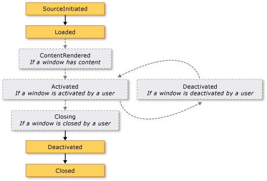

# WPF Windows Overview
Users interact with [!INCLUDE[TLA#tla_wpf](../../../../includes/tlasharptla-wpf-md.md)] standalone applications through windows. The primary purpose of a window is to host content that visualizes data and enables users to interact with data. Standalone [!INCLUDE[TLA2#tla_wpf](../../../../includes/tla2sharptla-wpf-md.md)] applications provide their own windows by using the <xref:System.Windows.Window> class. This topic introduces <xref:System.Windows.Window> before covering the fundamentals of creating and managing windows in standalone applications.  
  
> [!NOTE]
>  Browser-hosted [!INCLUDE[TLA2#tla_wpf](../../../../includes/tla2sharptla-wpf-md.md)] applications, including [!INCLUDE[TLA#tla_xbap#plural](../../../../includes/tlasharptla-xbapsharpplural-md.md)] and loose [!INCLUDE[TLA#tla_xaml](../../../../includes/tlasharptla-xaml-md.md)] pages, don't provide their own windows. Instead, they are hosted in windows provided by [!INCLUDE[TLA#tla_iegeneric](../../../../includes/tlasharptla-iegeneric-md.md)]. See [WPF XAML Browser Applications Overview](../../../../docs/framework/wpf/app-development/wpf-xaml-browser-applications-overview.md).  
  
  
<a name="TheWindowClass"></a>   
## The Window Class  
 The following figure illustrates the constituent parts of a window.  
  
   
  
 A window is divided into two areas: the non-client area and client area.  
  
 The *non-client area* of a window is implemented by [!INCLUDE[TLA2#tla_wpf](../../../../includes/tla2sharptla-wpf-md.md)] and includes the parts of a window that are common to most windows, including the following:  
  
-   A border.  
  
-   A title bar.  
  
-   An icon.  
  
-   Minimize, Maximize, and Restore buttons.  
  
-   A Close button.  
  
-   A System menu with menu items that allow users to minimize, maximize, restore, move, resize, and close a window.  
  
 The *client area* of a window is the area within a window's non-client area and is used by developers to add application-specific content, such as menu bars, tool bars, and controls.  
  
 In [!INCLUDE[TLA2#tla_wpf](../../../../includes/tla2sharptla-wpf-md.md)], a window is encapsulated by the <xref:System.Windows.Window> class that you use to do the following:  
  
-   Display a window.  
  
-   Configure the size, position, and appearance of a window.  
  
-   Host application-specific content.  
  
-   Manage the lifetime of a window.  
  
<a name="DefiningAWindow"></a>   
## Implementing a Window  
 The implementation of a typical window comprises both appearance and behavior, where *appearance* defines how a window looks to users and *behavior* defines the way a window functions as users interact with it. In [!INCLUDE[TLA2#tla_wpf](../../../../includes/tla2sharptla-wpf-md.md)], you can implement the appearance and behavior of a window using either code or [!INCLUDE[TLA2#tla_xaml](../../../../includes/tla2sharptla-xaml-md.md)] markup.  
  
 In general, however, the appearance of a window is implemented using [!INCLUDE[TLA2#tla_xaml](../../../../includes/tla2sharptla-xaml-md.md)] markup, and its behavior is implemented using code-behind, as shown in the following example.  
  
 [!code-xaml[WindowsOverviewSnippets#MarkupAndCodeBehindWindowMARKUP](../../../../samples/snippets/csharp/VS_Snippets_Wpf/WindowsOverviewSnippets/CSharp/MarkupAndCodeBehindWindow.xaml#markupandcodebehindwindowmarkup)]  
  
 [!code-csharp[WindowsOverviewSnippets#MarkupAndCodeBehindWindowCODEBEHIND](../../../../samples/snippets/csharp/VS_Snippets_Wpf/WindowsOverviewSnippets/CSharp/MarkupAndCodeBehindWindow.xaml.cs#markupandcodebehindwindowcodebehind)]
 [!code-vb[WindowsOverviewSnippets#MarkupAndCodeBehindWindowCODEBEHIND](../../../../samples/snippets/visualbasic/VS_Snippets_Wpf/WindowsOverviewSnippets/VisualBasic/MarkupAndCodeBehindWindow.xaml.vb#markupandcodebehindwindowcodebehind)]  
  
 To enable a [!INCLUDE[TLA2#tla_xaml](../../../../includes/tla2sharptla-xaml-md.md)] markup file and code-behind file to work together, the following are required:  
  
-   In markup, the `Window` element must include the `x:Class` attribute. When the application is built, the existence of `x:Class` in the markup file causes [!INCLUDE[TLA#tla_msbuild](../../../../includes/tlasharptla-msbuild-md.md)] to create a `partial` class that derives from <xref:System.Windows.Window> and has the name that is specified by the `x:Class` attribute. This requires the addition of an [!INCLUDE[TLA2#tla_xml](../../../../includes/tla2sharptla-xml-md.md)] namespace declaration for the [!INCLUDE[TLA2#tla_xaml](../../../../includes/tla2sharptla-xaml-md.md)] schema ( `xmlns:x="http://schemas.microsoft.com/winfx/2006/xaml"` ). The generated `partial` class implements the `InitializeComponent` method, which is called to register the events and set the properties that are implemented in markup.  
  
-   In code-behind, the class must be a `partial` class with the same name that is specified by the `x:Class` attribute in markup, and it must derive from <xref:System.Windows.Window>. This allows the code-behind file to be associated with the `partial` class that is generated for the markup file when the application is built (see [Building a WPF Application](../../../../docs/framework/wpf/app-development/building-a-wpf-application-wpf.md)).  
  
-   In code-behind, the <xref:System.Windows.Window> class must implement a constructor that calls the `InitializeComponent` method. `InitializeComponent` is implemented by the markup file's generated `partial` class to register events and set properties that are defined in markup.  
  
> [!NOTE]
>  When you add a new <xref:System.Windows.Window> to your project by using [!INCLUDE[TLA#tla_visualstu](../../../../includes/tlasharptla-visualstu-md.md)], the <xref:System.Windows.Window> is implemented using both markup and code-behind, and includes the necessary configuration to create the association between the markup and code-behind files as described here.  
  
 With this configuration in place, you can focus on defining the appearance of the window in [!INCLUDE[TLA2#tla_xaml](../../../../includes/tla2sharptla-xaml-md.md)] markup and implementing its behavior in code-behind. The following example shows a window with a button, implemented in [!INCLUDE[TLA2#tla_xaml](../../../../includes/tla2sharptla-xaml-md.md)] markup, and an event handler for the button's <xref:System.Windows.Controls.Primitives.ButtonBase.Click> event, implemented in code-behind.  
  
 [!code-xaml[WindowsOverviewWindowWithButtonSnippets#MarkupAndCodeBehindWindowMARKUP](../../../../samples/snippets/csharp/VS_Snippets_Wpf/WindowsOverviewWindowWithButtonSnippets/CSharp/MarkupAndCodeBehindWindow.xaml#markupandcodebehindwindowmarkup)]  
  
 [!code-csharp[WindowsOverviewWindowWithButtonSnippets#MarkupAndCodeBehindWindowCODEBEHIND](../../../../samples/snippets/csharp/VS_Snippets_Wpf/WindowsOverviewWindowWithButtonSnippets/CSharp/MarkupAndCodeBehindWindow.xaml.cs#markupandcodebehindwindowcodebehind)]
 [!code-vb[WindowsOverviewWindowWithButtonSnippets#MarkupAndCodeBehindWindowCODEBEHIND](../../../../samples/snippets/visualbasic/VS_Snippets_Wpf/WindowsOverviewWindowWithButtonSnippets/VisualBasic/MarkupAndCodeBehindWindow.xaml.vb#markupandcodebehindwindowcodebehind)]  
  
<a name="ConfiguringWindowForMSBuild"></a>   
## Configuring a Window Definition for MSBuild  
 How you implement your window determines how it is configured for [!INCLUDE[TLA2#tla_msbuild](../../../../includes/tla2sharptla-msbuild-md.md)]. For a window that is defined using both [!INCLUDE[TLA2#tla_xaml](../../../../includes/tla2sharptla-xaml-md.md)] markup and code-behind:  
  
-   [!INCLUDE[TLA2#tla_xaml](../../../../includes/tla2sharptla-xaml-md.md)] markup files are configured as [!INCLUDE[TLA2#tla_msbuild](../../../../includes/tla2sharptla-msbuild-md.md)]`Page` items.  
  
-   Code-behind files are configured as [!INCLUDE[TLA2#tla_msbuild](../../../../includes/tla2sharptla-msbuild-md.md)]`Compile` items.  
  
 This is shown in the following [!INCLUDE[TLA2#tla_msbuild](../../../../includes/tla2sharptla-msbuild-md.md)] project file.  
  
```xml  
<Project ...  
                xmlns="http://schemas.microsoft.com/developer/msbuild/2003">  
    ...  
    <Page Include="MarkupAndCodeBehindWindow.xaml" />  
    <Compile Include=" MarkupAndCodeBehindWindow.xaml.cs" />  
    ...  
</Project>  
```  
  
 For information about building [!INCLUDE[TLA2#tla_wpf](../../../../includes/tla2sharptla-wpf-md.md)] applications, see [Building a WPF Application](../../../../docs/framework/wpf/app-development/building-a-wpf-application-wpf.md).  
  
<a name="WindowLifetime"></a>   
## Window Lifetime  
 As with any class, a window has a lifetime that begins when it is first instantiated, after which it is opened, activated and deactivated, and eventually closed.  
  
  
<a name="Opening_a_Window"></a>   
### Opening a Window  
 To open a window, you first create an instance of it, which is demonstrated in the following example.  
  
 [!code-xaml[WindowsOverviewStartupEventSnippets#AppMARKUP](../../../../samples/snippets/csharp/VS_Snippets_Wpf/WindowsOverviewStartupEventSnippets/CSharp/App.xaml#appmarkup)]  
  
 [!code-csharp[WindowsOverviewStartupEventSnippets#AppCODEBEHIND](../../../../samples/snippets/csharp/VS_Snippets_Wpf/WindowsOverviewStartupEventSnippets/CSharp/App.xaml.cs#appcodebehind)]  
  
 In this example, the `MarkupAndCodeBehindWindow` is instantiated when the application starts, which occurs when the <xref:System.Windows.Application.Startup> event is raised.  
  
 When a window is instantiated, a reference to it is automatically added to a list of windows that is managed by the <xref:System.Windows.Application> object (see <xref:System.Windows.Application.Windows%2A?displayProperty=nameWithType>). Additionally, the first window to be instantiated is, by default, set by <xref:System.Windows.Application> as the main application window (see <xref:System.Windows.Application.MainWindow%2A?displayProperty=nameWithType>).  
  
 The window is finally opened by calling the <xref:System.Windows.Window.Show%2A> method; the result is shown in the following figure.  
  
   
  
 A window that is opened by calling <xref:System.Windows.Window.Show%2A> is a modeless window, which means that the application operates in a mode that allows users to activate other windows in the same application.  
  
> [!NOTE]
>  <xref:System.Windows.Window.ShowDialog%2A> is called to open windows such as dialog boxes modally. See [Dialog Boxes Overview](../../../../docs/framework/wpf/app-development/dialog-boxes-overview.md) for more information.  
  
 When <xref:System.Windows.Window.Show%2A> is called, a window performs initialization work before it is shown to establish infrastructure that allows it to receive user input. When the window is initialized, the <xref:System.Windows.Window.SourceInitialized> event is raised and the window is shown.  
  
 As a shortcut, <xref:System.Windows.Application.StartupUri%2A> can be set to specify the first window that is opened automatically when an application starts.  
  
 [!code-xaml[WindowsOverviewSnippets#ApplicationStartupUriMARKUP](../../../../samples/snippets/csharp/VS_Snippets_Wpf/WindowsOverviewSnippets/CSharp/App.xaml#applicationstartupurimarkup)]  
  
 When the application starts, the window specified by the value of <xref:System.Windows.Application.StartupUri%2A> is opened modelessly; internally, the window is opened by calling its <xref:System.Windows.Window.Show%2A> method.  
  
<a name="Ownership"></a>   
#### Window Ownership  
 A window that is opened by using the <xref:System.Windows.Window.Show%2A> method does not have an implicit relationship with the window that created it; users can interact with either window independently of the other, which means that either window can do the following:  
  
-   Cover the other (unless one of the windows has its <xref:System.Windows.Window.Topmost%2A> property set to `true`).  
  
-   Be minimized, maximized, and restored without affecting the other.  
  
 Some windows require a relationship with the window that opens them. For example, an [!INCLUDE[TLA#tla_ide](../../../../includes/tlasharptla-ide-md.md)] application may open property windows and tool windows whose typical behavior is to cover the window that creates them. Furthermore, such windows should always close, minimize, maximize, and restore in concert with the window that created them. Such a relationship can be established by making one window *own* another, and is achieved by setting the <xref:System.Windows.Window.Owner%2A> property of the *owned window* with a reference to the *owner window*. This is shown in the following example.  
  
 [!code-csharp[WindowOwnerOwnedWindowsSnippets#SetWindowOwnerCODE](../../../../samples/snippets/csharp/VS_Snippets_Wpf/WindowOwnerOwnedWindowsSnippets/CSharp/MainWindow.xaml.cs#setwindowownercode)]
 [!code-vb[WindowOwnerOwnedWindowsSnippets#SetWindowOwnerCODE](../../../../samples/snippets/visualbasic/VS_Snippets_Wpf/WindowOwnerOwnedWindowsSnippets/visualbasic/mainwindow.xaml.vb#setwindowownercode)]  
  
 After ownership is established:  
  
-   The owned window can reference its owner window by inspecting the value of its <xref:System.Windows.Window.Owner%2A> property.  
  
-   The owner window can discover all the windows it owns by inspecting the value of its <xref:System.Windows.Window.OwnedWindows%2A> property.  
  
<a name="Preventing"></a>   
#### Preventing Window Activation  
 There are scenarios where windows should not be activated when shown, such as conversation windows of an Internet messenger-style application or notification windows of an email application.  
  
 If your application has a window that shouldn't be activated when shown, you can set its <xref:System.Windows.Window.ShowActivated%2A> property to `false` before calling the <xref:System.Windows.Window.Show%2A> method for the first time. As a consequence:  
  
-   The window is not activated.  
  
-   The window's <xref:System.Windows.Window.Activated> event is not raised.  
  
-   The currently activated window remains activated.  
  
 The window will become activated, however, as soon as the user activates it by clicking either the client or non-client area. In this case:  
  
-   The window is activated.  
  
-   The window's <xref:System.Windows.Window.Activated> event is raised.  
  
-   The previously activated window is deactivated.  
  
-   The window's <xref:System.Windows.Window.Deactivated> and <xref:System.Windows.Window.Activated> events are subsequently raised as expected in response to user actions.  
  
<a name="Window_Activation"></a>   
### Window Activation  
 When a window is first opened, it becomes the active window (unless it is shown with <xref:System.Windows.Window.ShowActivated%2A> set to `false`). The *active window* is the window that is currently capturing user input, such as key strokes and mouse clicks. When a window becomes active, it raises the <xref:System.Windows.Window.Activated> event.  
  
> [!NOTE]
>  When a window is first opened, the <xref:System.Windows.FrameworkElement.Loaded> and <xref:System.Windows.Window.ContentRendered> events are raised only after the <xref:System.Windows.Window.Activated> event is raised. With this in mind, a window can effectively be considered opened when <xref:System.Windows.Window.ContentRendered> is raised.  
  
 After a window becomes active, a user can activate another window in the same application, or activate another application. When that happens, the currently active window becomes deactivated and raises the <xref:System.Windows.Window.Deactivated> event. Likewise, when the user selects a currently deactivated window, the window becomes active again and <xref:System.Windows.Window.Activated> is raised.  
  
 One common reason to handle <xref:System.Windows.Window.Activated> and <xref:System.Windows.Window.Deactivated> is to enable and disable functionality that can only run when a window is active. For example, some windows display interactive content that requires constant user input or attention, including games and video players. The following example is a simplified video player that demonstrates how to handle <xref:System.Windows.Window.Activated> and <xref:System.Windows.Window.Deactivated> to implement this behavior.  
  
 [!code-xaml[WindowsOverviewSnippets#ActivationDeactivationMARKUP](../../../../samples/snippets/csharp/VS_Snippets_Wpf/WindowsOverviewSnippets/CSharp/CustomMediaPlayerWindow.xaml#activationdeactivationmarkup)]  
  
 [!code-csharp[WindowsOverviewSnippets#ActivationDeactivationCODEBEHIND](../../../../samples/snippets/csharp/VS_Snippets_Wpf/WindowsOverviewSnippets/CSharp/CustomMediaPlayerWindow.xaml.cs#activationdeactivationcodebehind)]
 [!code-vb[WindowsOverviewSnippets#ActivationDeactivationCODEBEHIND](../../../../samples/snippets/visualbasic/VS_Snippets_Wpf/WindowsOverviewSnippets/VisualBasic/CustomMediaPlayerWindow.xaml.vb#activationdeactivationcodebehind)]  
  
 Other types of applications may still run code in the background when a window is deactivated. For example, a mail client may continue polling the mail server while the user is using other applications. Applications like these often provide different or additional behavior while the main window is deactivated. With respect to the mail program, this may mean both adding the new mail item to the inbox and adding a notification icon to the system tray. A notification icon need only be displayed when the mail window isn't active, which can be determined by inspecting the <xref:System.Windows.Window.IsActive%2A> property.  
  
 If a background task completes, a window may want to notify the user more urgently by calling <xref:System.Windows.Window.Activate%2A> method. If the user is interacting with another application activated when <xref:System.Windows.Window.Activate%2A> is called, the window's taskbar button flashes. If a user is interacting with the current application, calling <xref:System.Windows.Window.Activate%2A> will bring the window to the foreground.  
  
> [!NOTE]
>  You can handle application-scope activation using the <xref:System.Windows.Application.Activated?displayProperty=nameWithType> and <xref:System.Windows.Application.Deactivated?displayProperty=nameWithType> events.  
  
<a name="Closing_a_Window"></a>   
### Closing a Window  
 The life of a window starts coming to an end when a user closes it. A window can be closed by using elements in the non-client area, including the following:  
  
-   The **Close** item of the **System** menu.  
  
-   Pressing ALT+F4.  
  
-   Pressing the **Close** button.  
  
 You can provide additional mechanisms to the client area to close a window, the more common of which include the following:  
  
-   An **Exit** item in the **File** menu, typically for main application windows.  
  
-   A **Close** item in the **File** menu, typically on a secondary application window.  
  
-   A **Cancel** button, typically on a modal dialog box.  
  
-   A **Close** button, typically on a modeless dialog box.  
  
 To close a window in response to one of these custom mechanisms, you need to call the <xref:System.Windows.Window.Close%2A> method. The following example implements the ability to close a window by choosing the **Exit** on the **File** menu.  
  
 [!code-xaml[WindowsOverviewSnippets#WindowWithFileExitMARKUP](../../../../samples/snippets/csharp/VS_Snippets_Wpf/WindowsOverviewSnippets/CSharp/WindowWithFileExit.xaml#windowwithfileexitmarkup)]  
  
 [!code-csharp[WindowsOverviewSnippets#WindowWithFileExitCODEBEHIND](../../../../samples/snippets/csharp/VS_Snippets_Wpf/WindowsOverviewSnippets/CSharp/WindowWithFileExit.xaml.cs#windowwithfileexitcodebehind)]
 [!code-vb[WindowsOverviewSnippets#WindowWithFileExitCODEBEHIND](../../../../samples/snippets/visualbasic/VS_Snippets_Wpf/WindowsOverviewSnippets/VisualBasic/WindowWithFileExit.xaml.vb#windowwithfileexitcodebehind)]  
  
 When a window closes, it raises two events: <xref:System.Windows.Window.Closing> and <xref:System.Windows.Window.Closed>.  
  
 <xref:System.Windows.Window.Closing> is raised before the window closes, and it provides a mechanism by which window closure can be prevented. One common reason to prevent window closure is if window content contains modified data. In this situation, the <xref:System.Windows.Window.Closing> event can be handled to determine whether data is dirty and, if so, to ask the user whether to either continue closing the window without saving the data or to cancel window closure. The following example shows the key aspects of handling <xref:System.Windows.Window.Closing>.  
  
 [!code-csharp[WindowClosingSnippets](../../../../samples/snippets/csharp/VS_Snippets_Wpf/WindowClosingSnippets/CSharp/DataWindow.xaml.cs)]
 [!code-vb[WindowClosingSnippets](../../../../samples/snippets/visualbasic/VS_Snippets_Wpf/WindowClosingSnippets/visualbasic/datawindow.xaml.vb)]  
 
  
 The <xref:System.Windows.Window.Closing> event handler is passed a <xref:System.ComponentModel.CancelEventArgs>, which implements the `Boolean`<xref:System.ComponentModel.CancelEventArgs.Cancel%2A> property that you set to `true` to prevent a window from closing.  
  
 If <xref:System.Windows.Window.Closing> is not handled, or it is handled but not canceled, the window will close. Just before a window actually closes, <xref:System.Windows.Window.Closed> is raised. At this point, a window cannot be prevented from closing.  
  
> [!NOTE]
>  An application can be configured to shut down automatically when either the main application window closes (see <xref:System.Windows.Application.MainWindow%2A>) or the last window closes. For details, see <xref:System.Windows.Application.ShutdownMode%2A>.  
  
 While a window can be explicitly closed through mechanisms provided in the non-client and client areas, a window can also be implicitly closed as a result of behavior in other parts of the application or [!INCLUDE[TLA#tla_mswin](../../../../includes/tlasharptla-mswin-md.md)], including the following:  
  
-   A user logs off or shuts down [!INCLUDE[TLA2#tla_mswin](../../../../includes/tla2sharptla-mswin-md.md)].  
  
-   A window's owner closes (see <xref:System.Windows.Window.Owner%2A>).  
  
-   The main application window is closed and <xref:System.Windows.Application.ShutdownMode%2A> is <xref:System.Windows.ShutdownMode.OnMainWindowClose>.  
  
-   <xref:System.Windows.Application.Shutdown%2A> is called.  
  
> [!NOTE]
>  A window cannot be reopened after it is closed.  
  
<a name="Window_Lifetime_Events"></a>   
### Window Lifetime Events  
 The following illustration shows the sequence of the principal events in the lifetime of a window.  
  
   
  
 The following illustration shows the sequence of the principal events in the lifetime of a window that is shown without activation (<xref:System.Windows.Window.ShowActivated%2A> is set to `false` before the window is shown).  
  
   
  
<a name="WindowLocation"></a>   
## Window Location  
 While a window is open, it has a location in the x and y dimensions relative to the desktop. This location can be determined by inspecting the <xref:System.Windows.Window.Left%2A> and <xref:System.Windows.Window.Top%2A> properties, respectively. You can set these properties to change the location of the window.  
  
 You can also specify the initial location of a <xref:System.Windows.Window> when it first appears by setting the <xref:System.Windows.Window.WindowStartupLocation%2A> property with one of the following <xref:System.Windows.WindowStartupLocation> enumeration values:  
  
-   <xref:System.Windows.WindowStartupLocation.CenterOwner> (default)  
  
-   <xref:System.Windows.WindowStartupLocation.CenterScreen>  
  
-   <xref:System.Windows.WindowStartupLocation.Manual>  
  
 If the startup location is specified as <xref:System.Windows.WindowStartupLocation.Manual>, and the <xref:System.Windows.Window.Left%2A> and <xref:System.Windows.Window.Top%2A> properties have not been set, <xref:System.Windows.Window> will ask [!INCLUDE[TLA2#tla_mswin](../../../../includes/tla2sharptla-mswin-md.md)] for a location to appear in.  
  
<a name="Topmost_Windows_and_Z_Order"></a>   
### Topmost Windows and Z-Order  
 Besides having an x and y location, a window also has a location in the z dimension, which determines its vertical position with respect to other windows. This is known as the window's z-order, and there are two types: normal z-order and topmost z-order. The location of a window in the *normal z-order* is determined by whether it is currently active or not. By default, a window is located in the normal z-order. The location of a window in the *topmost z-order* is also determined by whether it is currently active or not. Furthermore, windows in the topmost z-order are always located above windows in the normal z-order. A window is located in the topmost z-order by setting its <xref:System.Windows.Window.Topmost%2A> property to `true`.  
  
 [!code-xaml[WindowsOverviewSnippets#TopmostWindowMARKUP1](../../../../samples/snippets/csharp/VS_Snippets_Wpf/WindowsOverviewSnippets/CSharp/TopmostWindow.xaml#topmostwindowmarkup1)]  
  
 Within each z-order, the currently active window appears above all other windows in the same z-order.  
  
<a name="WindowSize"></a>   
## Window Size  
 Besides having a desktop location, a window has a size that is determined by several properties, including the various width and height properties and <xref:System.Windows.Window.SizeToContent%2A>.  
  
 <xref:System.Windows.FrameworkElement.MinWidth%2A>, <xref:System.Windows.FrameworkElement.Width%2A>, and <xref:System.Windows.FrameworkElement.MaxWidth%2A> are used to manage the range of widths that a window can have during its lifetime, and are configured as shown in the following example.  
  
 [!code-xaml[WindowsOverviewSnippets#WidthWindowMARKUP1](../../../../samples/snippets/csharp/VS_Snippets_Wpf/WindowsOverviewSnippets/CSharp/WidthWindow.xaml#widthwindowmarkup1)]  
  
 Window height is managed by <xref:System.Windows.FrameworkElement.MinHeight%2A>, <xref:System.Windows.FrameworkElement.Height%2A>, and <xref:System.Windows.FrameworkElement.MaxHeight%2A>, and are configured as shown in the following example.  
  
 [!code-xaml[WindowsOverviewSnippets#HeightWindowMARKUP1](../../../../samples/snippets/csharp/VS_Snippets_Wpf/WindowsOverviewSnippets/CSharp/HeightWindow.xaml#heightwindowmarkup1)]  
  
 Because the various width values and height values each specify a range, it is possible for the width and height of a resizable window to be anywhere within the specified range for the respective dimension. To detect its current width and height, inspect <xref:System.Windows.FrameworkElement.ActualWidth%2A> and <xref:System.Windows.FrameworkElement.ActualHeight%2A>, respectively.  
  
 If you'd like the width and height of your window to have a size that fits to the size of the window's content, you can use the <xref:System.Windows.Window.SizeToContent%2A> property, which has the following values:  
  
-   <xref:System.Windows.SizeToContent.Manual>. No effect (default).  
  
-   <xref:System.Windows.SizeToContent.Width>. Fit to content width, which has the same effect as setting both <xref:System.Windows.FrameworkElement.MinWidth%2A> and <xref:System.Windows.FrameworkElement.MaxWidth%2A> to the width of the content.  
  
-   <xref:System.Windows.SizeToContent.Height>. Fit to content height, which has the same effect as setting both <xref:System.Windows.FrameworkElement.MinHeight%2A> and <xref:System.Windows.FrameworkElement.MaxHeight%2A> to the height of the content.  
  
-   <xref:System.Windows.SizeToContent.WidthAndHeight>. Fit to content width and height, which has the same effect as setting both <xref:System.Windows.FrameworkElement.MinHeight%2A> and <xref:System.Windows.FrameworkElement.MaxHeight%2A> to the height of the content, and setting both <xref:System.Windows.FrameworkElement.MinWidth%2A> and <xref:System.Windows.FrameworkElement.MaxWidth%2A> to the width of the content.  
  
 The following example shows a window that automatically sizes to fit its content, both vertically and horizontally, when first shown.  
  
 [!code-xaml[WindowsOverviewSnippets#SizeToContentWindowMARKUP1](../../../../samples/snippets/csharp/VS_Snippets_Wpf/WindowsOverviewSnippets/CSharp/SizeToContentWindow.xaml#sizetocontentwindowmarkup1)]  
  
 The following example shows how to set the <xref:System.Windows.Window.SizeToContent%2A> property in code to specify how a window resizes to fit its content    .
  
 [!code-csharp[HOWTOWindowManagementSnippets#SetWindowSizeToContentPropertyCODE](../../../../samples/snippets/csharp/VS_Snippets_Wpf/HOWTOWindowManagementSnippets/CSharp/MainWindow.xaml.cs#setwindowsizetocontentpropertycode)]
 [!code-vb[HOWTOWindowManagementSnippets#SetWindowSizeToContentPropertyCODE](../../../../samples/snippets/visualbasic/VS_Snippets_Wpf/HOWTOWindowManagementSnippets/visualbasic/mainwindow.xaml.vb#setwindowsizetocontentpropertycode)]  
  
<a name="OrderOfPrecedence"></a>   
## Order of Precedence for Sizing Properties  
 Essentially, the various sizes properties of a window combine to define the range of width and height for a resizable window. To ensure a valid range is maintained, <xref:System.Windows.Window> evaluates the values of the size properties using the following orders of precedence.  
  
 **For Height Properties:**  
  
1.  <xref:System.Windows.FrameworkElement.MinHeight%2A?displayProperty=nameWithType> >  
  
2.  <xref:System.Windows.FrameworkElement.MaxHeight%2A?displayProperty=nameWithType> >  
  
3.  <xref:System.Windows.SizeToContent.Height?displayProperty=nameWithType>/<xref:System.Windows.SizeToContent.WidthAndHeight?displayProperty=nameWithType> >  
  
4.  <xref:System.Windows.FrameworkElement.Height%2A?displayProperty=nameWithType>  
  
 **For Width Properties:**  
  
1.  <xref:System.Windows.FrameworkElement.MinWidth%2A?displayProperty=nameWithType> >  
  
2.  <xref:System.Windows.FrameworkElement.MaxWidth%2A?displayProperty=nameWithType> >  
  
3.  <xref:System.Windows.SizeToContent.Width?displayProperty=nameWithType>/<xref:System.Windows.SizeToContent.WidthAndHeight?displayProperty=nameWithType> >  
  
4.  <xref:System.Windows.FrameworkElement.Width%2A?displayProperty=nameWithType>  
  
 The order of precedence can also determine the size of a window when it is maximized, which is managed with the <xref:System.Windows.Window.WindowState%2A> property.  
  
<a name="WindowState"></a>   
## Window State  
 During the lifetime of a resizable window, it can have three states: normal, minimized, and maximized. A window with a *normal* state is the default state of a window. A window with this state allows a user to move and resize it by using a resize grip or the border, if it is resizable.  
  
 A window with a *minimized* state collapses to its task bar button if <xref:System.Windows.Window.ShowInTaskbar%2A> is set to `true`; otherwise, it collapses to the smallest possible size it can be and relocates itself to the bottom-left corner of the desktop. Neither type of minimized window can be resized using a border or resize grip, although a minimized window that isn't shown in the task bar can be dragged around the desktop.  
  
 A window with a *maximized* state expands to the maximum size it can be, which will only be as large as its <xref:System.Windows.FrameworkElement.MaxWidth%2A>, <xref:System.Windows.FrameworkElement.MaxHeight%2A>, and <xref:System.Windows.Window.SizeToContent%2A> properties dictate. Like a minimized window, a maximized window cannot be resized by using a resize grip or by dragging the border.  
  
> [!NOTE]
>  The values of the <xref:System.Windows.Window.Top%2A>, <xref:System.Windows.Window.Left%2A>, <xref:System.Windows.FrameworkElement.Width%2A>, and <xref:System.Windows.FrameworkElement.Height%2A> properties of a window always represent the values for the normal state, even when the window is currently maximized or minimized.  
  
 The state of a window can be configured by setting its <xref:System.Windows.Window.WindowState%2A> property, which can have one of the following <xref:System.Windows.WindowState> enumeration values:  
  
-   <xref:System.Windows.WindowState.Normal> (default)  
  
-   <xref:System.Windows.WindowState.Maximized>  
  
-   <xref:System.Windows.WindowState.Minimized>  
  
 The following example shows how to create a window that is shown as maximized when it opens.  
  
 [!code-xaml[WindowsOverviewSnippets#WindowStateWindowMARKUP1](../../../../samples/snippets/csharp/VS_Snippets_Wpf/WindowsOverviewSnippets/CSharp/WindowStateWindow.xaml#windowstatewindowmarkup1)]  
  
 In general, you should set <xref:System.Windows.Window.WindowState%2A> to configure the initial state of a window. Once a resizable window is shown, users can press the minimize, maximize, and restore buttons on the window's title bar to change the window state.  
  
<a name="WindowAppearance"></a>   
## Window Appearance  
 You change the appearance of the client area of a window by adding window-specific content to it, such as buttons, labels, and text boxes. To configure the non-client area, <xref:System.Windows.Window> provides several properties, which include <xref:System.Windows.Window.Icon%2A> to set a window's icon and <xref:System.Windows.Window.Title%2A> to set its title.  
  
 You can also change the appearance and behavior of non-client area border by configuring a window's resize mode, window style, and whether it appears as a button in the desktop task bar.  
  
  
<a name="Resize_Mode"></a>   
### Resize Mode  
 Depending on the <xref:System.Windows.Window.WindowStyle%2A> property, you can control how (and if) users can resize the window. The choice of window style affects whether a user can resize the window by dragging its border with the mouse, whether the **Minimize**, **Maximize**, and **Resize** buttons appear on the non-client area, and, if they do appear, whether they are enabled.  
  
 You can configure how a window resizes by setting its <xref:System.Windows.Window.ResizeMode%2A> property, which can be one of the following <xref:System.Windows.ResizeMode> enumeration values:  
  
-   <xref:System.Windows.ResizeMode.NoResize>  
  
-   <xref:System.Windows.ResizeMode.CanMinimize>  
  
-   <xref:System.Windows.ResizeMode.CanResize> (default)  
  
-   <xref:System.Windows.ResizeMode.CanResizeWithGrip>  
  
 As with <xref:System.Windows.Window.WindowStyle%2A>, the resize mode of a window is unlikely to change during its lifetime, which means that you'll most likely set it from [!INCLUDE[TLA2#tla_xaml](../../../../includes/tla2sharptla-xaml-md.md)] markup.  
  
 [!code-xaml[WindowsOverviewSnippets#ResizeModeWindowMARKUP1](../../../../samples/snippets/csharp/VS_Snippets_Wpf/WindowsOverviewSnippets/CSharp/ResizeModeWindow.xaml#resizemodewindowmarkup1)]  
  
 Note that you can detect whether a window is maximized, minimized, or restored by inspecting the <xref:System.Windows.Window.WindowState%2A> property.  
  
<a name="Window_Style"></a>   
### Window Style  
 The border that is exposed from the non-client area of a window is suitable for most applications. However, there are circumstances where different types of borders are needed, or no borders are needed at all, depending on the type of window.  
  
 To control what type of border a window gets, you set its <xref:System.Windows.Window.WindowStyle%2A> property with one of the following values of the <xref:System.Windows.WindowStyle> enumeration:  
  
-   <xref:System.Windows.WindowStyle.None>  
  
-   <xref:System.Windows.WindowStyle.SingleBorderWindow> (default)  
  
-   <xref:System.Windows.WindowStyle.ThreeDBorderWindow>  
  
-   <xref:System.Windows.WindowStyle.ToolWindow>  
  
 The effect of these window styles are illustrated in the following figure.  
  
   
  
 You can set <xref:System.Windows.Window.WindowStyle%2A> using either [!INCLUDE[TLA2#tla_xaml](../../../../includes/tla2sharptla-xaml-md.md)] markup or code; because it is unlikely to change during the lifetime of a window, you will most likely configure it using [!INCLUDE[TLA2#tla_xaml](../../../../includes/tla2sharptla-xaml-md.md)] markup.  
  
 [!code-xaml[WindowsOverviewSnippets#WindowStyleWindowMARKUP1](../../../../samples/snippets/csharp/VS_Snippets_Wpf/WindowsOverviewSnippets/CSharp/WindowStyleWindow.xaml#windowstylewindowmarkup1)]  
  
#### Non-Rectangular Window Style  
 There are also situations where the border styles that <xref:System.Windows.Window.WindowStyle%2A> allows you to have are not sufficient. For example, you may want to create an application with a non-rectangular border, like [!INCLUDE[TLA#tla_wmp](../../../../includes/tlasharptla-wmp-md.md)] uses.  
  
 For example, consider the speech bubble window shown in the following figure.  
  
   
  
 This type of window can be created by setting the <xref:System.Windows.Window.WindowStyle%2A> property to <xref:System.Windows.WindowStyle.None>, and by using special support that <xref:System.Windows.Window> has for transparency.  
  
 [!code-xaml[WindowsOverviewSnippets#TransparentWindowMARKUP1](../../../../samples/snippets/csharp/VS_Snippets_Wpf/WindowsOverviewSnippets/CSharp/TransparentWindow.xaml#transparentwindowmarkup1)]  
  
 This combination of values instructs the window to render completely transparent. In this state, the window's non-client area adornments (the Close menu, Minimize, Maximize, and Restore buttons, and so on) cannot be used. Consequently, you need to provide your own.  
  
<a name="Task_Bar_Presence"></a>   
### Task Bar Presence  
 The default appearance of a window includes a task bar button, like the one shown in the following figure.  
  
   
  
 Some types of windows don't have a task bar button, such as message boxes and dialog boxes (see [Dialog Boxes Overview](../../../../docs/framework/wpf/app-development/dialog-boxes-overview.md)). You can control whether the task bar button for a window is shown by setting the <xref:System.Windows.Window.ShowInTaskbar%2A> property (`true` by default).  
  
 [!code-xaml[WindowsOverviewSnippets#ShowInTaskbarWindowMARKUP1](../../../../samples/snippets/csharp/VS_Snippets_Wpf/WindowsOverviewSnippets/CSharp/ShowInTaskbarWindow.xaml#showintaskbarwindowmarkup1)]  
  
<a name="SecurityConsiderations"></a>   
## Security Considerations  
 <xref:System.Windows.Window> requires `UnmanagedCode` security permission to be instantiated. For applications installed on and launched from the local machine, this falls within the set of permissions that are granted to the application.  
  
 However, this falls outside the set of permissions granted to applications that are launched from the Internet or Local intranet zone using [!INCLUDE[TLA#tla_clickonce](../../../../includes/tlasharptla-clickonce-md.md)]. Consequently, users will receive a [!INCLUDE[TLA2#tla_clickonce](../../../../includes/tla2sharptla-clickonce-md.md)] security warning and will need to elevate the permission set for the application to full trust.  
  
 Additionally, [!INCLUDE[TLA2#tla_xbap#plural](../../../../includes/tla2sharptla-xbapsharpplural-md.md)] cannot show windows or dialog boxes by default. For a discussion on standalone application security considerations, see [WPF Security Strategy - Platform Security](../../../../docs/framework/wpf/wpf-security-strategy-platform-security.md).  
  
<a name="Other_Types_of_Windows"></a>   
## Other Types of Windows  
 <xref:System.Windows.Navigation.NavigationWindow> is a window that is designed to host navigable content. For more information, see [Navigation Overview](../../../../docs/framework/wpf/app-development/navigation-overview.md)).  
  
 Dialog boxes are windows that are often used to gather information from a user to complete a function. For example, when a user wants to open a file, the **Open File** dialog box is usually displayed by an application to get the file name from the user. For more information, see [Dialog Boxes Overview](../../../../docs/framework/wpf/app-development/dialog-boxes-overview.md).  
  
## See Also  
 <xref:System.Windows.Window>  
 <xref:System.Windows.MessageBox>  
 <xref:System.Windows.Navigation.NavigationWindow>  
 <xref:System.Windows.Application>  
 [Dialog Boxes Overview](../../../../docs/framework/wpf/app-development/dialog-boxes-overview.md)  
 [Building a WPF Application](../../../../docs/framework/wpf/app-development/building-a-wpf-application-wpf.md)
