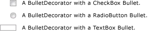

# BulletDecorator
<xref:System.Windows.Controls.Primitives.BulletDecorator> has two content properties: <xref:System.Windows.Controls.Primitives.BulletDecorator.Bullet%2A> and <xref:System.Windows.Controls.Decorator.Child%2A>. The <xref:System.Windows.Controls.Primitives.BulletDecorator.Bullet%2A> property defines the <xref:System.Windows.UIElement> to use as a bullet. The <xref:System.Windows.Controls.Decorator.Child%2A> property defines a <xref:System.Windows.UIElement> that visually aligns with the bullet.  
  
 The following illustration shows examples of controls that use a <xref:System.Windows.Controls.Primitives.BulletDecorator>.  
  
   
  
## Reference  
 <xref:System.Windows.Controls.Primitives.BulletDecorator>
