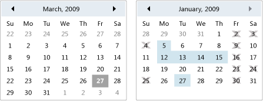

# Calendar
A calendar enables a user to select a date by using a visual calendar display.  
  
 A <xref:System.Windows.Controls.Calendar> control can be used on its own, or as a drop-down part of a <xref:System.Windows.Controls.DatePicker> control. For more information, see <xref:System.Windows.Controls.DatePicker>.  
  
 The following illustration shows two <xref:System.Windows.Controls.Calendar> controls, one with selections and blackout dates and one without.  
  
   
Calendar controls  
  
 The following table provides information about tasks that are typically associated with the <xref:System.Windows.Controls.Calendar>.  
  
|Task|Implementation|  
|----------|--------------------|  
|Specify dates that cannot be selected.|Use the <xref:System.Windows.Controls.Calendar.BlackoutDates%2A> property.|  
|Have the <xref:System.Windows.Controls.Calendar> display a month, an entire year, or a decade.|Set the <xref:System.Windows.Controls.Calendar.DisplayMode%2A> property to Month, Year, or Decade.|  
|Specify whether the user can select a date, a range of dates, or multiple ranges of dates.|Use the <xref:System.Windows.Controls.Calendar.SelectionMode%2A>.|  
|Specify the range of dates that the <xref:System.Windows.Controls.Calendar> displays.|Use the <xref:System.Windows.Controls.Calendar.DisplayDateStart%2A> and <xref:System.Windows.Controls.Calendar.DisplayDateEnd%2A> properties.|  
|Specify whether the current date is highlighted.|Use the <xref:System.Windows.Controls.Calendar.IsTodayHighlighted%2A> property. By default, <xref:System.Windows.Controls.Calendar.IsTodayHighlighted%2A> is `true`.|  
|Change the size of the <xref:System.Windows.Controls.Calendar>.|Use a <xref:System.Windows.Controls.Viewbox> or set the <xref:System.Windows.FrameworkElement.LayoutTransform%2A> property to a <xref:System.Windows.Media.ScaleTransform>. Note that if you set the <xref:System.Windows.FrameworkElement.Width%2A> and <xref:System.Windows.FrameworkElement.Height%2A> properties of a <xref:System.Windows.Controls.Calendar>, the actual calendar does not change its size.|  
  
 The <xref:System.Windows.Controls.Calendar> control provides basic navigation using either the mouse or keyboard. The following table summarizes keyboard navigation.  
  
|Key Combination|<xref:System.Windows.Controls.Calendar.DisplayMode%2A>|Action|  
|---------------------|-----------------------------------------------------------------------------------------------------------------------------------------------------------|------------|  
|ARROW|<xref:System.Windows.Controls.CalendarMode.Month>|Changes the <xref:System.Windows.Controls.Calendar.SelectedDate%2A> property if the <xref:System.Windows.Controls.Calendar.SelectionMode%2A> property is not set to <xref:System.Windows.Controls.CalendarSelectionMode.None>.|  
|ARROW|<xref:System.Windows.Controls.CalendarMode.Year>|Changes the month of the <xref:System.Windows.Controls.Calendar.DisplayDate%2A> property. Note that the <xref:System.Windows.Controls.Calendar.SelectedDate%2A> does not change.|  
|ARROW|<xref:System.Windows.Controls.CalendarMode.Decade>|Changes the year of the <xref:System.Windows.Controls.Calendar.DisplayDate%2A>. Note that the <xref:System.Windows.Controls.Calendar.SelectedDate%2A> does not change.|  
|SHIFT+ARROW|<xref:System.Windows.Controls.CalendarMode.Month>|If <xref:System.Windows.Controls.Calendar.SelectionMode%2A> is not set to <xref:System.Windows.Controls.CalendarSelectionMode.SingleDate> or <xref:System.Windows.Controls.CalendarSelectionMode.None>, extends the range of selected dates.|  
|HOME|<xref:System.Windows.Controls.CalendarMode.Month>|Changes the <xref:System.Windows.Controls.Calendar.SelectedDate%2A> to the first day of the current month.|  
|HOME|<xref:System.Windows.Controls.CalendarMode.Year>|Changes the month of the <xref:System.Windows.Controls.Calendar.DisplayDate%2A> to the first month of the year. The <xref:System.Windows.Controls.Calendar.SelectedDate%2A> does not change.|  
|HOME|<xref:System.Windows.Controls.CalendarMode.Decade>|Changes the year of the <xref:System.Windows.Controls.Calendar.DisplayDate%2A> to the first year of the decade. The <xref:System.Windows.Controls.Calendar.SelectedDate%2A> does not change.|  
|END|<xref:System.Windows.Controls.CalendarMode.Month>|Changes the <xref:System.Windows.Controls.Calendar.SelectedDate%2A> to the last day of the current month.|  
|END|<xref:System.Windows.Controls.CalendarMode.Year>|Changes the month of the <xref:System.Windows.Controls.Calendar.DisplayDate%2A> to the last month of the year. The <xref:System.Windows.Controls.Calendar.SelectedDate%2A> does not change.|  
|END|<xref:System.Windows.Controls.CalendarMode.Decade>|Changes the year of the <xref:System.Windows.Controls.Calendar.DisplayDate%2A> to the last year of the decade. The <xref:System.Windows.Controls.Calendar.SelectedDate%2A> does not change.|  
|CTRL+UP ARROW|Any|Switches to the next larger <xref:System.Windows.Controls.Calendar.DisplayMode%2A>. If <xref:System.Windows.Controls.Calendar.DisplayMode%2A> is already <xref:System.Windows.Controls.CalendarMode.Decade>, no action.|  
|CTRL+DOWN ARROW|Any|Switches to the next smaller <xref:System.Windows.Controls.Calendar.DisplayMode%2A>. If <xref:System.Windows.Controls.Calendar.DisplayMode%2A> is already <xref:System.Windows.Controls.CalendarMode.Month>, no action.|  
|SPACEBAR or ENTER|<xref:System.Windows.Controls.CalendarMode.Year> or <xref:System.Windows.Controls.CalendarMode.Decade>|Switches <xref:System.Windows.Controls.Calendar.DisplayMode%2A> to the <xref:System.Windows.Controls.CalendarMode.Month> or <xref:System.Windows.Controls.CalendarMode.Year> represented by focused item.|  
  
## See Also  
 [Controls](../../../../docs/framework/wpf/controls/index.md)  
 [Styling and Templating](../../../../docs/framework/wpf/controls/styling-and-templating.md)
