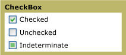

# CheckBox
You can use a <xref:System.Windows.Controls.CheckBox> in the [!INCLUDE[TLA#tla_ui](../../../../includes/tlasharptla-ui-md.md)] of your application to represent options that a user can select or clear. You can use a single check box or you can group two or more check boxes.  
  
 The following graphic shows the different states of a <xref:System.Windows.Controls.CheckBox>.  
  
   
CheckBox controls in different states  
  
## Reference  
 <xref:System.Windows.Controls.CheckBox>  
  <xref:System.Windows.Controls.RadioButton>  
  <xref:System.Windows.Controls.Primitives.ButtonBase>  
  <xref:System.Windows.Controls.Primitives.RepeatButton>  
  
## Related Sections
