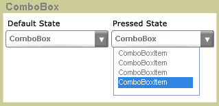

# ComboBox
The <xref:System.Windows.Controls.ComboBox> control presents users with a list of options. The list is shown and hidden as the control expands and collapses. In its default state, the list is collapsed, displaying only one choice. The user clicks a button to see the complete list of options.  
  
 The following illustration shows a <xref:System.Windows.Controls.ComboBox> in different states.  
  
   
Collapsed and expanded  
  
## In This Section  
 [How to: Get a ComboBoxItem](http://msdn.microsoft.com/library/8a0d2622-64b6-41fc-bf80-9669a1eacb53)  
  
## Reference  
 <xref:System.Windows.Controls.ComboBox>
