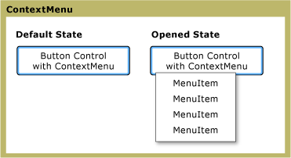

# ContextMenu
The <xref:System.Windows.Controls.ContextMenu> allows a control to display a <xref:System.Windows.Controls.Menu> that is specific to the context of the control. Typically, the <xref:System.Windows.Controls.ContextMenu> is exposed in the [!INCLUDE[TLA#tla_ui](../../../../includes/tlasharptla-ui-md.md)] through the right mouse button or through the keyboard’s menu button.  
  
 The following figure illustrates a <xref:System.Windows.Controls.ContextMenu> in two different states: the default state and the open state. In the default state, the control is collapsed. When the right mouse button is pressed over the parent of the menu, the control expands and displays the menu items.  
  
   
ContextMenu in different states  
  
## In This Section  
 [ContextMenu Overview](contextmenu-overview.md)  
  
## Reference  
 <xref:System.Windows.Controls.ContextMenu>  
  
## Related Sections
