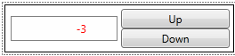

# Creating a Control That Has a Customizable Appearance

[!INCLUDE[TLA#tla_winclient](../../../../includes/tlasharptla-winclient-md.md)] gives you the ability to create a control whose appearance can be customized. For example, you can change the appearance of a <xref:System.Windows.Controls.CheckBox> beyond what setting properties will do by creating a new <xref:System.Windows.Controls.ControlTemplate>. The following illustration shows a <xref:System.Windows.Controls.CheckBox> that uses a default <xref:System.Windows.Controls.ControlTemplate> and a <xref:System.Windows.Controls.CheckBox> that uses a custom <xref:System.Windows.Controls.ControlTemplate>.  
  
   
A CheckBox that uses the default control template  
  
   
A CheckBox that uses a custom control template  
  
 If you follow the parts and states model when you create a control, your control's appearance will be customizable. Designer tools such as Microsoft Expression Blend support the parts and states model, so when you follow this model your control will be customizable in those types of applications.  This topic discusses the parts and states model and how to follow it when you create your own control. This topic uses an example of a custom control, `NumericUpDown`, to illustrate the philosophy of this model.  The `NumericUpDown` control displays a numeric value, which a user can increase or decrease by clicking on the control's buttons.  The following illustration shows the `NumericUpDown` control that is discussed in this topic.  
  
   
A custom NumericUpDown control  
  
 This topic contains the following sections:  
  
-   [Prerequisites](#prerequisites)  
  
-   [Parts and States Model](#parts_and_states_model)  
  
-   [Defining the Visual Structure and Visual Behavior of a Control in a ControlTemplate](#defining_the_visual_structure_and_visual_behavior_of_a_control_in_a_controltemplate)  
  
-   [Using Parts of the ControlTemplate in Code](#using_parts_of_the_controltemplate_in_code)  
  
-   [Providing the Control Contract](#providing_the_control_contract)  
  
-   [Complete Example](#complete_example)  
  
   
## Prerequisites  
 This topic assumes that you know how to create a new <xref:System.Windows.Controls.ControlTemplate> for an existing control, are familiar with what the elements on a control contract are, and understand the concepts discussed in [Customizing the Appearance of an Existing Control by Creating a ControlTemplate](../../../../docs/framework/wpf/controls/customizing-the-appearance-of-an-existing-control.md).  
  
> [!NOTE]
>  To create a control that can have its appearance customized, you must create a control that inherits from the <xref:System.Windows.Controls.Control> class or one of its subclasses other than <xref:System.Windows.Controls.UserControl>.  A control that inherits from <xref:System.Windows.Controls.UserControl> is a control that can be quickly created, but it does not use a <xref:System.Windows.Controls.ControlTemplate> and you cannot customize its appearance.  
  
   
## Parts and States Model  
 The parts and states model specifies how to define the visual structure and visual behavior of a control. To follow the parts and states model, you should do the following:  
  
-   Define the visual structure and visual behavior in the <xref:System.Windows.Controls.ControlTemplate> of a control.  
  
-   Follow certain best practices when your control's logic interacts with parts of the control template.  
  
-   Provide a control contract to specify what should be included in the <xref:System.Windows.Controls.ControlTemplate>.  
  
 When you define the visual structure and visual behavior in the <xref:System.Windows.Controls.ControlTemplate> of a control, application authors can change the visual structure and visual behavior of your control by creating a new <xref:System.Windows.Controls.ControlTemplate> instead of writing code.   You must provide a control contract that tells application authors which <xref:System.Windows.FrameworkElement> objects and states should be defined in the <xref:System.Windows.Controls.ControlTemplate>. You should follow some best practices when you interact with the parts in the <xref:System.Windows.Controls.ControlTemplate> so that your control properly handles an incomplete <xref:System.Windows.Controls.ControlTemplate>.  If you follow these three principles, application authors will be able to create a <xref:System.Windows.Controls.ControlTemplate> for your control just as easily as they can for the controls that ship with [!INCLUDE[TLA2#tla_winclient](../../../../includes/tla2sharptla-winclient-md.md)].  The following section explains each of these recommendations in detail.  
  
   
## Defining the Visual Structure and Visual Behavior of a Control in a ControlTemplate  
 When you create your custom control by using the parts and states model, you define the control's visual structure and visual behavior in its <xref:System.Windows.Controls.ControlTemplate> instead of in its logic.  The visual structure of a control is the composite of <xref:System.Windows.FrameworkElement> objects that make up the control.  The visual behavior is the way the control appears when it is in a certain state.   For more information about creating a <xref:System.Windows.Controls.ControlTemplate> that specifies the visual structure and visual behavior of a control, see [Customizing the Appearance of an Existing Control by Creating a ControlTemplate](../../../../docs/framework/wpf/controls/customizing-the-appearance-of-an-existing-control.md).  
  
 In the example of the `NumericUpDown` control, the visual structure includes two <xref:System.Windows.Controls.Primitives.RepeatButton> controls and a <xref:System.Windows.Controls.TextBlock>.  If you add these controls in the code of the `NumericUpDown` control--in its constructor, for example--the positions of those controls would be unalterable.  Instead of defining the control's visual structure and visual behavior in its code, you should define it in the <xref:System.Windows.Controls.ControlTemplate>.  Then an application developer to customize the position of the buttons and <xref:System.Windows.Controls.TextBlock> and specify what behavior occurs when `Value` is negative because the <xref:System.Windows.Controls.ControlTemplate> can be replaced.  
  
 The following example shows the visual structure of the `NumericUpDown` control, which includes a <xref:System.Windows.Controls.Primitives.RepeatButton> to increase `Value`, a <xref:System.Windows.Controls.Primitives.RepeatButton> to decrease `Value`, and a <xref:System.Windows.Controls.TextBlock> to display `Value`.  
  
 [!code-xaml[VSMCustomControl#VisualStructure](../../../../samples/snippets/csharp/VS_Snippets_Wpf/vsmcustomcontrol/csharp/window1.xaml#visualstructure)]  
  
 A visual behavior of the `NumericUpDown` control is that the value is in a red font if it is negative.  If you change the <xref:System.Windows.Controls.TextBlock.Foreground%2A> of the <xref:System.Windows.Controls.TextBlock> in code when the `Value` is negative, the `NumericUpDown` will always show a red negative value. You specify the visual behavior of the control in the <xref:System.Windows.Controls.ControlTemplate> by adding <xref:System.Windows.VisualState> objects to the <xref:System.Windows.Controls.ControlTemplate>.  The following example shows the <xref:System.Windows.VisualState> objects for the `Positive` and `Negative` states.  `Positive` and `Negative` are mutually exclusive (the control is always in exactly one of the two), so the example puts the <xref:System.Windows.VisualState> objects into a single <xref:System.Windows.VisualStateGroup>.  When the control goes into the `Negative` state, the <xref:System.Windows.Controls.TextBlock.Foreground%2A> of the <xref:System.Windows.Controls.TextBlock> turns red.  When the control is in the `Positive` state, the <xref:System.Windows.Controls.TextBlock.Foreground%2A> returns to it original value.  Defining <xref:System.Windows.VisualState> objects in a <xref:System.Windows.Controls.ControlTemplate> is further discussed in [Customizing the Appearance of an Existing Control by Creating a ControlTemplate](../../../../docs/framework/wpf/controls/customizing-the-appearance-of-an-existing-control.md).  
  
> [!NOTE]
>  Be sure to set the <xref:System.Windows.VisualStateManager.VisualStateGroups%2A?displayProperty=nameWithType> attached property on the root <xref:System.Windows.FrameworkElement> of the <xref:System.Windows.Controls.ControlTemplate>.  
  
 [!code-xaml[VSMCustomControl#ValueStates](../../../../samples/snippets/csharp/VS_Snippets_Wpf/vsmcustomcontrol/csharp/window1.xaml#valuestates)]  
  
   
## Using Parts of the ControlTemplate in Code  
 A <xref:System.Windows.Controls.ControlTemplate> author might omit <xref:System.Windows.FrameworkElement> or <xref:System.Windows.VisualState> objects, either purposefully or by mistake, but your control's logic might need those parts to function properly. The parts and states model specifies that your control should be resilient to a <xref:System.Windows.Controls.ControlTemplate> that is missing <xref:System.Windows.FrameworkElement> or <xref:System.Windows.VisualState> objects.  Your control should not throw an exception or report an error if a <xref:System.Windows.FrameworkElement>, <xref:System.Windows.VisualState>, or <xref:System.Windows.VisualStateGroup> is missing from the <xref:System.Windows.Controls.ControlTemplate>. This section describes the recommended practices for interacting with <xref:System.Windows.FrameworkElement> objects and managing states.  
  
### Anticipate Missing FrameworkElement Objects  
 When you define <xref:System.Windows.FrameworkElement> objects in the <xref:System.Windows.Controls.ControlTemplate>, your control's logic might need to interact with some of them.  For example, the `NumericUpDown` control subscribes to the buttons' <xref:System.Windows.Controls.Primitives.ButtonBase.Click> event to increase or decrease `Value` and sets the <xref:System.Windows.Controls.TextBlock.Text%2A> property of the <xref:System.Windows.Controls.TextBlock> to `Value`. If a custom <xref:System.Windows.Controls.ControlTemplate> omits the <xref:System.Windows.Controls.TextBlock> or buttons, it is acceptable that the control loses some of its functionality, but you should be sure that your control does not cause an error. For example, if a <xref:System.Windows.Controls.ControlTemplate> does not contain the buttons to change `Value`, the `NumericUpDown` loses that functionality, but an application that uses the <xref:System.Windows.Controls.ControlTemplate> will continue to run.  
  
 The following practices will ensure that your control responds properly to missing <xref:System.Windows.FrameworkElement> objects:  
  
1.  Set the `x:Name` attribute for each <xref:System.Windows.FrameworkElement> that you need to reference in code.  
  
2.  Define private properties for each <xref:System.Windows.FrameworkElement> that you need to interact with.  
  
3.  Subscribe to and unsubscribe from any events that your control handles in the <xref:System.Windows.FrameworkElement> property's set accessor.  
  
4.  Set the <xref:System.Windows.FrameworkElement> properties that you defined in step 2 in the <xref:System.Windows.FrameworkElement.OnApplyTemplate%2A> method. This is the earliest that the <xref:System.Windows.FrameworkElement> in the <xref:System.Windows.Controls.ControlTemplate> is available to the control. Use the `x:Name` of the <xref:System.Windows.FrameworkElement> to get it from the <xref:System.Windows.Controls.ControlTemplate>.  
  
5.  Check that the <xref:System.Windows.FrameworkElement> is not `null` before accessing its members.  If it is `null`, do not report an error.  
  
 The following examples show how the `NumericUpDown` control interacts with <xref:System.Windows.FrameworkElement> objects in accordance with the recommendations in the preceding list.  
  
 In the example that defines the visual structure of the `NumericUpDown` control in the <xref:System.Windows.Controls.ControlTemplate>, the <xref:System.Windows.Controls.Primitives.RepeatButton> that increases `Value` has its `x:Name` attribute set to `UpButton`.  The following example declares a property called `UpButtonElement` that represents the <xref:System.Windows.Controls.Primitives.RepeatButton> that is declared in the <xref:System.Windows.Controls.ControlTemplate>. The `set` accessor first unsubscribes to the button's <xref:System.Windows.Controls.Primitives.ButtonBase.Click> event if `UpDownElement` is not `null`, then it sets the property, and then it subscribes to the <xref:System.Windows.Controls.Primitives.ButtonBase.Click> event. There is also a property defined, but not shown here, for the other <xref:System.Windows.Controls.Primitives.RepeatButton>, called `DownButtonElement`.  
  
 [!code-csharp[VSMCustomControl#UpButtonProperty](../../../../samples/snippets/csharp/VS_Snippets_Wpf/vsmcustomcontrol/csharp/numericupdown.cs#upbuttonproperty)]
 [!code-vb[VSMCustomControl#UpButtonProperty](../../../../samples/snippets/visualbasic/VS_Snippets_Wpf/vsmcustomcontrol/visualbasic/numericupdown.vb#upbuttonproperty)]  
  
 The following example shows the <xref:System.Windows.FrameworkElement.OnApplyTemplate%2A> for the `NumericUpDown` control.  The example uses the <xref:System.Windows.FrameworkElement.GetTemplateChild%2A> method to get the <xref:System.Windows.FrameworkElement> objects from the <xref:System.Windows.Controls.ControlTemplate>.  Notice that the example guards against cases where <xref:System.Windows.FrameworkElement.GetTemplateChild%2A> finds a <xref:System.Windows.FrameworkElement> with the specified name that is not of the expected type. It is also a best practice to ignore elements that have the specified `x:Name` but are of the wrong type.  
  
 [!code-csharp[VSMCustomControl#ApplyTemplate](../../../../samples/snippets/csharp/VS_Snippets_Wpf/vsmcustomcontrol/csharp/numericupdown.cs#applytemplate)]
 [!code-vb[VSMCustomControl#ApplyTemplate](../../../../samples/snippets/visualbasic/VS_Snippets_Wpf/vsmcustomcontrol/visualbasic/numericupdown.vb#applytemplate)]  
  
 By following the practices that are shown in the previous examples, you ensure that your control will continue to run when the <xref:System.Windows.Controls.ControlTemplate> is missing a <xref:System.Windows.FrameworkElement>.  
  
### Use the VisualStateManager to Manage States  
 The <xref:System.Windows.VisualStateManager> keeps track of the states of a control and performs the logic necessary to transition between states. When you add <xref:System.Windows.VisualState> objects to the <xref:System.Windows.Controls.ControlTemplate>, you add them to a <xref:System.Windows.VisualStateGroup> and add the <xref:System.Windows.VisualStateGroup> to the <xref:System.Windows.VisualStateManager.VisualStateGroups%2A?displayProperty=nameWithType> attached property so that the <xref:System.Windows.VisualStateManager> has access to them.  
  
 The following example repeats the previous example that shows the <xref:System.Windows.VisualState> objects that corresponds to the `Positive` and `Negative` states of the control. The <xref:System.Windows.Media.Animation.Storyboard> in the `Negative`<xref:System.Windows.VisualState> turns the <xref:System.Windows.Controls.TextBlock.Foreground%2A> of the <xref:System.Windows.Controls.TextBlock> red.   When the `NumericUpDown` control is in the `Negative` state, the storyboard in the `Negative` state begins.  Then the <xref:System.Windows.Media.Animation.Storyboard> in the `Negative` state stops when the control returns to the `Positive` state.  The `Positive`<xref:System.Windows.VisualState> does not need to contain a <xref:System.Windows.Media.Animation.Storyboard> because when the <xref:System.Windows.Media.Animation.Storyboard> for the `Negative` stops, the <xref:System.Windows.Controls.TextBlock.Foreground%2A> returns to its original color.  
  
 [!code-xaml[VSMCustomControl#ValueStates](../../../../samples/snippets/csharp/VS_Snippets_Wpf/vsmcustomcontrol/csharp/window1.xaml#valuestates)]  
  
 Note that the <xref:System.Windows.Controls.TextBlock> is given a name, but the <xref:System.Windows.Controls.TextBlock> is not in the control contract for `NumericUpDown` because the control's logic never references the <xref:System.Windows.Controls.TextBlock>.  Elements that are referenced in the <xref:System.Windows.Controls.ControlTemplate> have names, but do not need to be part of the control contract because a new <xref:System.Windows.Controls.ControlTemplate> for the control might not need to reference that element.  For example, someone who creates a new <xref:System.Windows.Controls.ControlTemplate> for `NumericUpDown` might decide to not indicate that `Value` is negative by changing the <xref:System.Windows.Controls.Control.Foreground%2A>.  In that case, neither the code nor the <xref:System.Windows.Controls.ControlTemplate> references the <xref:System.Windows.Controls.TextBlock> by name.  
  
 The control's logic is responsible for changing the control's state. The following example shows that the `NumericUpDown` control calls the <xref:System.Windows.VisualStateManager.GoToState%2A> method to go into the `Positive` state when `Value` is 0 or greater, and the `Negative` state when `Value` is less than 0.  
  
 [!code-csharp[VSMCustomControl#ValueStateChange](../../../../samples/snippets/csharp/VS_Snippets_Wpf/vsmcustomcontrol/csharp/numericupdown.cs#valuestatechange)]
 [!code-vb[VSMCustomControl#ValueStateChange](../../../../samples/snippets/visualbasic/VS_Snippets_Wpf/vsmcustomcontrol/visualbasic/numericupdown.vb#valuestatechange)]  
  
 The <xref:System.Windows.VisualStateManager.GoToState%2A> method performs the logic necessary to start and stop the storyboards appropriately. When a control calls <xref:System.Windows.VisualStateManager.GoToState%2A> to change its state, the <xref:System.Windows.VisualStateManager> does the following:  
  
-   If the <xref:System.Windows.VisualState> that the control is going to has a <xref:System.Windows.Media.Animation.Storyboard>, the storyboard begins. Then, if the <xref:System.Windows.VisualState> that the control is coming from has a <xref:System.Windows.Media.Animation.Storyboard>, the storyboard ends.  
  
-   If the control is already in the state that is specified, <xref:System.Windows.VisualStateManager.GoToState%2A> takes no action and returns `true`.  
  
-   If state that is specified doesn't exist in the <xref:System.Windows.Controls.ControlTemplate> of `control`, <xref:System.Windows.VisualStateManager.GoToState%2A> takes no action and returns `false`.  
  
#### Best Practices for Working with the VisualStateManager  
 It is recommended that you do the following to maintain your control's states:  
  
-   Use properties to track its state.  
  
-   Create a helper method to transition between states.  
  
 The `NumericUpDown` control uses its `Value` property to track whether it is in the `Positive` or `Negative` state.  The `NumericUpDown` control also defines the `Focused` and `UnFocused` states, which tracks the <xref:System.Windows.UIElement.IsFocused%2A> property. If you use states that do not naturally correspond to a property of the control, you can define a private property to track the state.  
  
 A single method that updates all the states centralizes calls to the <xref:System.Windows.VisualStateManager> and keeps your code manageable. The following example shows the `NumericUpDown` control's helper method, `UpdateStates`. When `Value` is greater than or equal to 0, the <xref:System.Windows.Controls.Control> is in the `Positive` state.  When `Value` is less than 0, the control is in the `Negative` state.  When <xref:System.Windows.UIElement.IsFocused%2A> is `true`, the control is in the `Focused` state; otherwise, it is in the `Unfocused` state.  The control can call `UpdateStates` whenever it needs to change its state, regardless of what state changes.  
  
 [!code-csharp[VSMCustomControl#UpdateStates](../../../../samples/snippets/csharp/VS_Snippets_Wpf/vsmcustomcontrol/csharp/numericupdown.cs#updatestates)]
 [!code-vb[VSMCustomControl#UpdateStates](../../../../samples/snippets/visualbasic/VS_Snippets_Wpf/vsmcustomcontrol/visualbasic/numericupdown.vb#updatestates)]  
  
 If you pass a state name to <xref:System.Windows.VisualStateManager.GoToState%2A> when the control is already in that state, <xref:System.Windows.VisualStateManager.GoToState%2A> does nothing, so you don't need to check for the control's current state.  For example, if `Value` changes from one negative number to another negative number, the storyboard for the `Negative` state is not interrupted and the user will not see a change in the control.  
  
 The <xref:System.Windows.VisualStateManager> uses <xref:System.Windows.VisualStateGroup> objects to determine which state to exit when you call <xref:System.Windows.VisualStateManager.GoToState%2A>. The control is always in one state for each <xref:System.Windows.VisualStateGroup> that is defined in its <xref:System.Windows.Controls.ControlTemplate> and only leaves a state when it goes into another state from the same <xref:System.Windows.VisualStateGroup>. For example, the <xref:System.Windows.Controls.ControlTemplate> of the `NumericUpDown` control defines the `Positive` and `Negative`<xref:System.Windows.VisualState> objects in one <xref:System.Windows.VisualStateGroup> and the `Focused` and `Unfocused`<xref:System.Windows.VisualState> objects in another. (You can see the `Focused` and `Unfocused`<xref:System.Windows.VisualState> defined in the [Complete Example](#complete_example) section in this topic When the control goes from the `Positive` state to the `Negative` state, or vice versa, the control remains in either the `Focused` or `Unfocused` state.  
  
 There are three typical places where the state of a control might change:  
  
-   When the <xref:System.Windows.Controls.ControlTemplate> is applied to the <xref:System.Windows.Controls.Control>.  
  
-   When a property changes.  
  
-   When an event occurs.  
  
 The following examples demonstrate updating the state of the `NumericUpDown` control in these cases.  
  
 You should update the state of the control in the <xref:System.Windows.FrameworkElement.OnApplyTemplate%2A> method so that the control appears in the correct state when the <xref:System.Windows.Controls.ControlTemplate> is applied. The following example calls `UpdateStates` in <xref:System.Windows.FrameworkElement.OnApplyTemplate%2A> to ensure that the control is in the appropriate states.  For example, suppose that you create a `NumericUpDown` control, and then set its <xref:System.Windows.Controls.Control.Foreground%2A> to green and `Value` to -5.  If you do not call `UpdateStates` when the <xref:System.Windows.Controls.ControlTemplate> is applied to the `NumericUpDown` control, the control is not in the `Negative` state and the value is green instead of red.  You must call `UpdateStates` to put the control in the `Negative` state.  
  
 [!code-csharp[VSMCustomControl#ApplyTemplate](../../../../samples/snippets/csharp/VS_Snippets_Wpf/vsmcustomcontrol/csharp/numericupdown.cs#applytemplate)]
 [!code-vb[VSMCustomControl#ApplyTemplate](../../../../samples/snippets/visualbasic/VS_Snippets_Wpf/vsmcustomcontrol/visualbasic/numericupdown.vb#applytemplate)]  
  
 You often need to update the states of a control when a property changes. The following example shows the entire `ValueChangedCallback` method. Because `ValueChangedCallback` is called when `Value` changes, the method calls `UpdateStates` in case `Value` changed from positive to negative or vice versa. It is acceptable to call `UpdateStates` when `Value` changes but remains positive or negative because in that case, the control will not change states.  
  
 [!code-csharp[VSMCustomControl#EntireValueChangedCallback](../../../../samples/snippets/csharp/VS_Snippets_Wpf/vsmcustomcontrol/csharp/numericupdown.cs#entirevaluechangedcallback)]
 [!code-vb[VSMCustomControl#EntireValueChangedCallback](../../../../samples/snippets/visualbasic/VS_Snippets_Wpf/vsmcustomcontrol/visualbasic/numericupdown.vb#entirevaluechangedcallback)]  
  
 You might also need to update states when an event occurs. The following example shows that the `NumericUpDown` calls `UpdateStates` on the <xref:System.Windows.Controls.Control> to handle the <xref:System.Windows.UIElement.GotFocus> event.  
  
 [!code-csharp[VSMCustomControl#OnGotFocus](../../../../samples/snippets/csharp/VS_Snippets_Wpf/vsmcustomcontrol/csharp/numericupdown.cs#ongotfocus)]
 [!code-vb[VSMCustomControl#OnGotFocus](../../../../samples/snippets/visualbasic/VS_Snippets_Wpf/vsmcustomcontrol/visualbasic/numericupdown.vb#ongotfocus)]  
  
 The <xref:System.Windows.VisualStateManager> helps you manage your control's states. By using the <xref:System.Windows.VisualStateManager>, you ensure that your control correctly transitions between states.  If you follow the recommendations described in this section for working with the <xref:System.Windows.VisualStateManager>, your control's code will remain readable and maintainable.  
  
   
## Providing the Control Contract  
 You provide a control contract so that <xref:System.Windows.Controls.ControlTemplate> authors will know what to put in the template. A control contract has three elements:  
  
-   The visual elements that the control's logic uses.  
  
-   The states of the control and the group each state belongs to.  
  
-   The public properties that visually affect the control.  
  
 Someone that creates a new <xref:System.Windows.Controls.ControlTemplate> needs to know what <xref:System.Windows.FrameworkElement> objects the control's logic uses, what type each object is, and what its name is. A <xref:System.Windows.Controls.ControlTemplate> author also needs to know the name of each possible state the control can be in, and which <xref:System.Windows.VisualStateGroup> the state is in.  
  
 Returning to the `NumericUpDown` example, the control expects the <xref:System.Windows.Controls.ControlTemplate> to have the following <xref:System.Windows.FrameworkElement> objects:  
  
-   A <xref:System.Windows.Controls.Primitives.RepeatButton> called `UpButton`.  
  
-   A <xref:System.Windows.Controls.Primitives.RepeatButton> called `DownButton.`  
  
 The control can be in the following states:  
  
-   In the `ValueStates`<xref:System.Windows.VisualStateGroup>  
  
    -   `Positive`  
  
    -   `Negative`  
  
-   In the `FocusStates`<xref:System.Windows.VisualStateGroup>  
  
    -   `Focused`  
  
    -   `Unfocused`  
  
 To specify what <xref:System.Windows.FrameworkElement> objects the control expects, you use the <xref:System.Windows.TemplatePartAttribute>, which specifies the name and type of the expected elements.  To specify the possible states of a control, you use the <xref:System.Windows.TemplateVisualStateAttribute>, which specifies the state's name and which <xref:System.Windows.VisualStateGroup> it belongs to.  Put the <xref:System.Windows.TemplatePartAttribute> and <xref:System.Windows.TemplateVisualStateAttribute> on the class definition of the control.  
  
 Any public property that affects the appearance of your control is also a part of the control contract.  
  
 The following example specifies the <xref:System.Windows.FrameworkElement> object and states for the `NumericUpDown` control.  
  
 [!code-csharp[VSMCustomControl#ControlContract](../../../../samples/snippets/csharp/VS_Snippets_Wpf/vsmcustomcontrol/csharp/numericupdown.cs#controlcontract)]
 [!code-vb[VSMCustomControl#ControlContract](../../../../samples/snippets/visualbasic/VS_Snippets_Wpf/vsmcustomcontrol/visualbasic/numericupdown.vb#controlcontract)]  
  
   
## Complete Example  
 The following example is the entire <xref:System.Windows.Controls.ControlTemplate> for the `NumericUpDown` control.  
  
 [!code-xaml[VSMCustomControl#NUDTemplate](../../../../samples/snippets/csharp/VS_Snippets_Wpf/vsmcustomcontrol/csharp/themes/generic.xaml#nudtemplate)]  
  
 The following example shows the logic for the `NumericUpDown`.  
  
 [!code-csharp[VSMCustomControl#ControlLogic](../../../../samples/snippets/csharp/VS_Snippets_Wpf/vsmcustomcontrol/csharp/numericupdown.cs#controllogic)]
 [!code-vb[VSMCustomControl#ControlLogic](../../../../samples/snippets/visualbasic/VS_Snippets_Wpf/vsmcustomcontrol/visualbasic/numericupdown.vb#controllogic)]  
  
## See Also  
 [Customizing the Appearance of an Existing Control by Creating a ControlTemplate](../../../../docs/framework/wpf/controls/customizing-the-appearance-of-an-existing-control.md)  
 [Control Customization](../../../../docs/framework/wpf/controls/control-customization.md)
