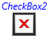

# Customizing the Appearance of an Existing Control by Creating a ControlTemplate
 A <xref:System.Windows.Controls.ControlTemplate> specifies the visual structure and visual behavior of a control. You can customize the appearance of a control by giving it a new <xref:System.Windows.Controls.ControlTemplate>. When you create a <xref:System.Windows.Controls.ControlTemplate>, you replace the appearance of an existing control without changing its functionality. For example, you can make the buttons in your application round instead of the default square shape, but the button will still raise the <xref:System.Windows.Controls.Primitives.ButtonBase.Click> event.  
  
 This topic explains the various parts of a <xref:System.Windows.Controls.ControlTemplate>, demonstrates creating a simple <xref:System.Windows.Controls.ControlTemplate> for a <xref:System.Windows.Controls.Button>, and explains how to understand the control contract of a control so that you can customize its appearance. Because you create a <xref:System.Windows.Controls.ControlTemplate> in [!INCLUDE[TLA2#tla_xaml](../../../../includes/tla2sharptla-xaml-md.md)], you can change a control's appearance without writing any code. You can also use a designer, such as Microsoft Expression Blend, to create custom control templates. This topic shows examples in the [!INCLUDE[TLA2#tla_xaml](../../../../includes/tla2sharptla-xaml-md.md)] that customize the appearance of a <xref:System.Windows.Controls.Button> and lists the complete example at the end of the topic. For more information about using Expression Blend, see [Styling a control that supports templates](http://go.microsoft.com/fwlink/?LinkId=161153).  
  
 The following illustrations show a <xref:System.Windows.Controls.Button> that uses the <xref:System.Windows.Controls.ControlTemplate> that is created in this topic.  
  
   
A button that uses a custom control template  
  
   
A button that uses a custom control template and has the mouse pointer over it  
  
  
   
## Prerequisites  
 This topic assumes that you understand how to create and use controls and styles as discussed in [Controls](../../../../docs/framework/wpf/controls/index.md). The concepts discussed in this topic apply to elements that inherit from the <xref:System.Windows.Controls.Control> class, except for the <xref:System.Windows.Controls.UserControl>. You cannot apply a <xref:System.Windows.Controls.ControlTemplate> to a <xref:System.Windows.Controls.UserControl>.  
  
   
## When You Should Create a ControlTemplate  
 Controls have many properties, such as <xref:System.Windows.Controls.Border.Background%2A>, <xref:System.Windows.Controls.Control.Foreground%2A>, and <xref:System.Windows.Controls.Control.FontFamily%2A>, that you can set to specify different aspects of the control's appearance, but the changes that you can make by setting these properties are limited. For example, you can set the <xref:System.Windows.Controls.Control.Foreground%2A> property to blue and <xref:System.Windows.Controls.Control.FontStyle%2A> to italic on a <xref:System.Windows.Controls.CheckBox>.  
  
 Without the ability to create a new <xref:System.Windows.Controls.ControlTemplate> for controls, all controls in every [!INCLUDE[TLA2#tla_winclient](../../../../includes/tla2sharptla-winclient-md.md)]-based application would have the same general appearance, which would limit the ability to create an application with a custom look and feel. By default, every <xref:System.Windows.Controls.CheckBox> has similar characteristics. For example, the content of the <xref:System.Windows.Controls.CheckBox> is always to the right of the selection indicator, and the check mark is always used to indicate that the <xref:System.Windows.Controls.CheckBox> is selected.  
  
 You create a <xref:System.Windows.Controls.ControlTemplate> when you want to customize the control's appearance beyond what setting the other properties on the control will do. In the example of the <xref:System.Windows.Controls.CheckBox>, suppose that you want the content of the check box to be above the selection indicator and you want an X to indicate that the <xref:System.Windows.Controls.CheckBox> is selected. You specify these changes in the <xref:System.Windows.Controls.ControlTemplate> of the <xref:System.Windows.Controls.CheckBox>.  
  
 The following illustration shows a <xref:System.Windows.Controls.CheckBox> that uses a default <xref:System.Windows.Controls.ControlTemplate>.  
  
   
A CheckBox that uses the default control template  
  
 The following illustration shows a <xref:System.Windows.Controls.CheckBox> that uses a custom <xref:System.Windows.Controls.ControlTemplate> to place the content of the <xref:System.Windows.Controls.CheckBox> above the selection indicator and displays an X when the <xref:System.Windows.Controls.CheckBox> is selected.  
  
   
A CheckBox that uses a custom control template  
  
 The <xref:System.Windows.Controls.ControlTemplate> for the <xref:System.Windows.Controls.CheckBox> in this sample is relatively complex, so this topic uses a simpler example of creating a <xref:System.Windows.Controls.ControlTemplate> for a <xref:System.Windows.Controls.Button>.  
  
   
## Changing the Visual Structure of a Control  
 In [!INCLUDE[TLA2#tla_winclient](../../../../includes/tla2sharptla-winclient-md.md)], a control is often a composite <xref:System.Windows.FrameworkElement> objects. When you create a <xref:System.Windows.Controls.ControlTemplate>, you combine <xref:System.Windows.FrameworkElement> objects to build a single control. A <xref:System.Windows.Controls.ControlTemplate> must have only one <xref:System.Windows.FrameworkElement> as its root element. The root element usually contains other <xref:System.Windows.FrameworkElement> objects. The combination of objects makes up the control's visual structure.  
  
 The following example creates a custom <xref:System.Windows.Controls.ControlTemplate> for the <xref:System.Windows.Controls.Button>. The <xref:System.Windows.Controls.ControlTemplate> creates the visual structure of the <xref:System.Windows.Controls.Button>. This example does not change the button's appearance when you move the mouse pointer over it or click it. Changing the button's appearance when it is in a different state is discussed later in this topic.  
  
 In this example, the visual structure consists of the following parts:  
  
-   A <xref:System.Windows.Controls.Border> named `RootElement` that serves as the template's root <xref:System.Windows.FrameworkElement>.  
  
-   A <xref:System.Windows.Controls.Grid> that is a child of `RootElement`.  
  
-   A <xref:System.Windows.Controls.ContentPresenter> that displays the button's content. The <xref:System.Windows.Controls.ContentPresenter> enables any type of object to be displayed.  
  
 [!code-xaml[VSMButtonTemplate#BasicTemplate](../../../../samples/snippets/csharp/VS_Snippets_Wpf/vsmbuttontemplate/csharp/buttonstages.xaml#basictemplate)]  
  
### Preserving the Functionality of a Control's Properties by Using TemplateBinding  
 When you create a new <xref:System.Windows.Controls.ControlTemplate>, you still might want to use the public properties to change the control's appearance. The [TemplateBinding](../../../../docs/framework/wpf/advanced/templatebinding-markup-extension.md) markup extension binds a property of an element that is in the <xref:System.Windows.Controls.ControlTemplate> to a public property that is defined by the control. When you use [TemplateBinding](../../../../docs/framework/wpf/advanced/templatebinding-markup-extension.md), you enable properties on the control to act as parameters to the template. That is, when a property on a control is set, that value is passed on to the element that has the [TemplateBinding](../../../../docs/framework/wpf/advanced/templatebinding-markup-extension.md) on it.  
  
 The following example repeats the part of the preceding example that uses the [TemplateBinding](../../../../docs/framework/wpf/advanced/templatebinding-markup-extension.md) markup extension to bind properties of elements that are in the <xref:System.Windows.Controls.ControlTemplate> to public properties that are defined by the button.  
  
 [!code-xaml[VSMButtonTemplate#TemplateBinding](../../../../samples/snippets/csharp/VS_Snippets_Wpf/vsmbuttontemplate/csharp/buttonstages.xaml#templatebinding)]  
  
 In this example, the <xref:System.Windows.Controls.Grid> has its <xref:System.Windows.Controls.Panel.Background%2A?displayProperty=nameWithType> property template bound to <xref:System.Windows.Controls.Control.Background%2A?displayProperty=nameWithType>. Because <xref:System.Windows.Controls.Panel.Background%2A?displayProperty=nameWithType> is template bound, you can create multiple buttons that use the same <xref:System.Windows.Controls.ControlTemplate> and set the <xref:System.Windows.Controls.Control.Background%2A?displayProperty=nameWithType> to different values on each button. If <xref:System.Windows.Controls.Control.Background%2A?displayProperty=nameWithType> was not template bound to a property of an element in the <xref:System.Windows.Controls.ControlTemplate>, setting the <xref:System.Windows.Controls.Control.Background%2A?displayProperty=nameWithType> of a button would have no impact on the button's appearance.  
  
 Note that the names of the two properties do not need to be identical. In the preceding example, the <xref:System.Windows.Controls.Control.HorizontalContentAlignment%2A?displayProperty=nameWithType> property of the <xref:System.Windows.Controls.Button> is template bound to the <xref:System.Windows.FrameworkElement.HorizontalAlignment%2A?displayProperty=nameWithType> property of the <xref:System.Windows.Controls.ContentPresenter>. This enables the content of the button to be positioned horizontally. <xref:System.Windows.Controls.ContentPresenter> does not have a property named `HorizontalContentAlignment`, but <xref:System.Windows.Controls.Control.HorizontalContentAlignment%2A?displayProperty=nameWithType> can be bound to <xref:System.Windows.FrameworkElement.HorizontalAlignment%2A?displayProperty=nameWithType>. When you template bind a property, be sure that the target and source properties are the same type.  
  
 The <xref:System.Windows.Controls.Control> class defines several properties that must be used by the control template to have an effect on the control when they are set. How the <xref:System.Windows.Controls.ControlTemplate> uses the property depends on the property. The <xref:System.Windows.Controls.ControlTemplate> must use the property in one of the following ways:  
  
-   An element in the <xref:System.Windows.Controls.ControlTemplate> template binds to the property.  
  
-   An element in the <xref:System.Windows.Controls.ControlTemplate> inherits the property from a parent <xref:System.Windows.FrameworkElement>.  
  
 The following table lists the visual properties inherited by a control from the <xref:System.Windows.Controls.Control> class. It also indicates whether the default control template of a control uses the inherited property value or if it must be template bound.  
  
|Property|Usage method|  
|--------------|------------------|  
|<xref:System.Windows.Controls.Control.Background%2A>|Template binding|  
|<xref:System.Windows.Controls.Control.BorderThickness%2A>|Template binding|  
|<xref:System.Windows.Controls.Control.BorderBrush%2A>|Template binding|  
|<xref:System.Windows.Controls.Control.FontFamily%2A>|Property inheritance or template binding|  
|<xref:System.Windows.Controls.Control.FontSize%2A>|Property inheritance or template binding|  
|<xref:System.Windows.Controls.Control.FontStretch%2A>|Property inheritance or template binding|  
|<xref:System.Windows.Controls.Control.FontWeight%2A>|Property inheritance or template binding|  
|<xref:System.Windows.Controls.Control.Foreground%2A>|Property inheritance or template binding|  
|<xref:System.Windows.Controls.Control.HorizontalContentAlignment%2A>|Template binding|  
|<xref:System.Windows.Controls.Control.Padding%2A>|Template binding|  
|<xref:System.Windows.Controls.Control.VerticalContentAlignment%2A>|Template binding|  
  
 The table lists only the visual properties inherited from the <xref:System.Windows.Controls.Control> class. Apart from the properties listed in the table, a control may also inherit the <xref:System.Windows.FrameworkElement.DataContext%2A>, <xref:System.Windows.FrameworkElement.Language%2A>, and <xref:System.Windows.Controls.TextBlock.TextDecorations%2A> properties from the parent framework element.  
  
 Also, if the <xref:System.Windows.Controls.ContentPresenter> is in the <xref:System.Windows.Controls.ControlTemplate> of a <xref:System.Windows.Controls.ContentControl>, the <xref:System.Windows.Controls.ContentPresenter> will automatically bind to the <xref:System.Windows.Controls.ContentControl.ContentTemplate%2A> and <xref:System.Windows.Controls.ContentControl.Content%2A> properties. Likewise, an <xref:System.Windows.Controls.ItemsPresenter> that is in the <xref:System.Windows.Controls.ControlTemplate> of an <xref:System.Windows.Controls.ItemsControl> will automatically bind to the <xref:System.Windows.Controls.ItemsControl.Items%2A> and <xref:System.Windows.Controls.ItemsPresenter> properties.  
  
 The following example creates two buttons that use the <xref:System.Windows.Controls.ControlTemplate> defined in the preceding example. The example sets the <xref:System.Windows.Controls.Control.Background%2A>, <xref:System.Windows.Controls.Control.Foreground%2A>, and <xref:System.Windows.Controls.Control.FontSize%2A> properties on each button. Setting the <xref:System.Windows.Controls.Control.Background%2A> property has an effect because it is template bound in the <xref:System.Windows.Controls.ControlTemplate>. Even though the <xref:System.Windows.Controls.Control.Foreground%2A> and <xref:System.Windows.Controls.Control.FontSize%2A> properties are not template bound, setting them has an effect because their values are inherited.  
  
 [!code-xaml[VSMButtonTemplate#ButtonDeclaration](../../../../samples/snippets/csharp/VS_Snippets_Wpf/vsmbuttontemplate/csharp/buttonstages.xaml#buttondeclaration)]  
  
 The preceding example produces output that is similar to the following illustration.  
  
   
Two buttons with different background colors  
  
   
## Changing the Appearance of a Control Depending on Its State  
 The difference between a button with its default appearance and the button in the preceding example is that the default button subtly changes when it is in different states. For example, the default button's appearance changes when the button is pressed, or when the mouse pointer is over the button. Although the <xref:System.Windows.Controls.ControlTemplate> does not change the functionality of a control, it does change the control's visual behavior. A visual behavior describes the control appearance when it is in a certain state. To understand the difference between the functionality and visual behavior of a control, consider the button example. The button's functionality is to raise the <xref:System.Windows.Controls.Primitives.ButtonBase.Click> event when it is clicked, but the button's visual behavior is to change its appearance when it is pointed to or pressed.  
  
 You use <xref:System.Windows.VisualState> objects to specify the appearance of a control when it is in a certain state. A <xref:System.Windows.VisualState> contains a <xref:System.Windows.Media.Animation.Storyboard> that changes the appearance of the elements that are in the <xref:System.Windows.Controls.ControlTemplate>. You do not have to write any code to make this occur because the control's logic changes state by using the <xref:System.Windows.VisualStateManager>. When the control enters the state that is specified by the <xref:System.Windows.VisualState.Name%2A?displayProperty=nameWithType> property, the <xref:System.Windows.Media.Animation.Storyboard> begins. When the control exits the state, the <xref:System.Windows.Media.Animation.Storyboard> stops.  
  
 The following example shows the <xref:System.Windows.VisualState> that changes the appearance of a <xref:System.Windows.Controls.Button> when the mouse pointer is over it. The <xref:System.Windows.Media.Animation.Storyboard> changes the button's border color by changing the color of the `BorderBrush`. If you refer to the <xref:System.Windows.Controls.ControlTemplate> example at the beginning of this topic, you will recall that `BorderBrush` is the name of the <xref:System.Windows.Media.SolidColorBrush> that is assigned to the <xref:System.Windows.Controls.Border.Background%2A> of the <xref:System.Windows.Controls.Border>.  
  
 [!code-xaml[VSMButtonTemplate#4](../../../../samples/snippets/csharp/VS_Snippets_Wpf/vsmbuttontemplate/csharp/skinnedbutton.xaml#4)]  
  
 The control is responsible for defining the states as part of its control contract, which is discussed in detail in [Customizing Other Controls by Understanding the Control Contract](#customizing_other_controls_by_understanding_the_control_contract) later in this topic. The following table lists the states that are specified for the <xref:System.Windows.Controls.Button>.  
  
|VisualState Name|VisualStateGroup Name|Description|  
|----------------------|---------------------------|-----------------|  
|Normal|CommonStates|The default state.|  
|MouseOver|CommonStates|The mouse pointer is positioned over the control.|  
|Pressed|CommonStates|The control is pressed.|  
|Disabled|CommonStates|The control is disabled.|  
|Focused|FocusStates|The control has focus.|  
|Unfocused|FocusStates|The control does not have focus.|  
  
 The <xref:System.Windows.Controls.Button> defines two state groups: the `CommonStates` group contains the `Normal`, `MouseOver`, `Pressed`, and `Disabled` states. The `FocusStates` group contains the `Focused` and `Unfocused` states. States in the same state group are mutually exclusive. The control is always in exactly one state per group. For example, a <xref:System.Windows.Controls.Button> can have focus even when the mouse pointer is not over it, so a <xref:System.Windows.Controls.Button> in the `Focused` state can be in the `MouseOver`, `Pressed`, or `Normal` state.  
  
 You add <xref:System.Windows.VisualState> objects to <xref:System.Windows.VisualStateGroup> objects. You add <xref:System.Windows.VisualStateGroup> objects to the <xref:System.Windows.VisualStateManager.VisualStateGroups%2A?displayProperty=nameWithType> attached property. The following example defines the <xref:System.Windows.VisualState> objects for the `Normal`, `MouseOver`, and `Pressed` states, which are all in the `CommonStates` group. The <xref:System.Windows.VisualState.Name%2A> of each <xref:System.Windows.VisualState> matches the name in the preceding table. The `Disabled` state and the states in the `FocusStates` group are omitted to keep the example short, but they are included in the entire example at the end of this topic.  
  
> [!NOTE]
>  Be sure to set the <xref:System.Windows.VisualStateManager.VisualStateGroups%2A?displayProperty=nameWithType> attached property on the root <xref:System.Windows.FrameworkElement> of the <xref:System.Windows.Controls.ControlTemplate>.  
  
 [!code-xaml[VSMButtonTemplate#VisualStates](../../../../samples/snippets/csharp/VS_Snippets_Wpf/vsmbuttontemplate/csharp/buttonstages.xaml#visualstates)]  
  
 The preceding example produces output that is similar to the following illustrations.  
  
   
A button that uses a custom control template in the normal state  
  
   
A button that uses a custom control template in the mouse over state  
  
   
A button that uses a custom control template in the pressed state  
  
 To find the visual states for controls that are included with [!INCLUDE[TLA2#tla_winclient](../../../../includes/tla2sharptla-winclient-md.md)], see [Control Styles and Templates](../../../../docs/framework/wpf/controls/control-styles-and-templates.md).  
  
   
## Specifying the Behavior of a Control When It Transitions Between States  
 In the preceding example, the appearance of the button also changes when the user clicks it, but unless the button is pressed for a full second, the user does not see the effect. By default, the animation takes one second to occur. Because users are likely to click and release a button in much less time, the visual feedback will not be effective if you leave the <xref:System.Windows.Controls.ControlTemplate> in its default state.  
  
 You can specify the amount of time that it takes an animation to occur to smoothly transition a control from one state to another by adding <xref:System.Windows.VisualTransition> objects to the <xref:System.Windows.Controls.ControlTemplate>. When you create a <xref:System.Windows.VisualTransition>, you specify one or more of the following:  
  
-   The time it takes for a transition between states to occur.  
  
-   Additional changes in the control's appearance that occur at the time of the transition.  
  
-   Which states the <xref:System.Windows.VisualTransition> is applied to.  
  
### Specifying the Duration of a Transition  
 You can specify how long a transition takes by setting the <xref:System.Windows.VisualTransition.GeneratedDuration%2A> property. The preceding example has a <xref:System.Windows.VisualState> that specifies that the button's border becomes transparent when the button is pressed, but the animation takes too long to be noticeable if the button is quickly pressed and released. You can use a <xref:System.Windows.VisualTransition> to specify the amount of time it takes the control to transition into the pressed state. The following example specifies that the control takes one hundredth of a second to go into the pressed state.  
  
 [!code-xaml[VSMButtonTemplate#PressedTransition](../../../../samples/snippets/csharp/VS_Snippets_Wpf/vsmbuttontemplate/csharp/skinnedbutton.xaml#pressedtransition)]  
  
### Specifying Changes to the Control's Appearance During a Transition  
 The <xref:System.Windows.VisualTransition> contains a <xref:System.Windows.Media.Animation.Storyboard> that begins when the control transitions between states. For example, you can specify that a certain animation occurs when the control transitions from the `MouseOver` state to the `Normal` State. The following example creates a <xref:System.Windows.VisualTransition> that specifies that when the user moves the mouse pointer away from the button, the button's border changes to blue, then to yellow, then to black in 1.5 seconds.  
  
 [!code-xaml[VSMButtonTemplate#8](../../../../samples/snippets/csharp/VS_Snippets_Wpf/vsmbuttontemplate/csharp/skinnedbutton.xaml#8)]  
  
### Specifying When a VisualTransition Is Applied  
 A <xref:System.Windows.VisualTransition> can be restricted to apply to only certain states, or it can be applied any time the control transitions between states. In the preceding example, the <xref:System.Windows.VisualTransition> is applied when the control goes from the `MouseOver` state to the `Normal` state; in the example before that, the <xref:System.Windows.VisualTransition> is applied when the control goes into the `Pressed` state. You restrict when a <xref:System.Windows.VisualTransition> is applied by setting the <xref:System.Windows.VisualTransition.To%2A> and <xref:System.Windows.VisualTransition.From%2A> properties. The following table describes the levels of restriction from most restrictive to least restrictive.  
  
|Type of restriction|Value of From|Value of To|  
|-------------------------|-------------------|-----------------|  
|From a specified state to another specified state|The name of a <xref:System.Windows.VisualState>|The name of a <xref:System.Windows.VisualState>|  
|From any state to a specified state|Not set|The name of a <xref:System.Windows.VisualState>|  
|From a specified state to any state|The name of a <xref:System.Windows.VisualState>|Not set|  
|From any state to any other state|Not set|Not set|  
  
 You can have multiple <xref:System.Windows.VisualTransition> objects in a <xref:System.Windows.VisualStateGroup> that refer to the same state, but they will be used in the order that the previous table specifies. In the following example, there are two <xref:System.Windows.VisualTransition> objects. When the control transitions from the `Pressed` state to the `MouseOver` state, the <xref:System.Windows.VisualTransition> that has both <xref:System.Windows.VisualTransition.From%2A> and <xref:System.Windows.VisualTransition.To%2A> set is used. When the control transitions from a state that is not `Pressed` to the `MouseOver` state, the other state is used.  
  
 [!code-xaml[VSMButtonTemplate#7](../../../../samples/snippets/csharp/VS_Snippets_Wpf/vsmbuttontemplate/csharp/skinnedbutton.xaml#7)]  
  
 The <xref:System.Windows.VisualStateGroup> has a <xref:System.Windows.VisualStateGroup.Transitions%2A> property that contains the <xref:System.Windows.VisualTransition> objects that apply to the <xref:System.Windows.VisualState> objects in the <xref:System.Windows.VisualStateGroup>. As the <xref:System.Windows.Controls.ControlTemplate> author, you are free to include any <xref:System.Windows.VisualTransition> you want. However, if the <xref:System.Windows.VisualTransition.To%2A> and <xref:System.Windows.VisualTransition.From%2A> properties are set to state names that are not in the <xref:System.Windows.VisualStateGroup>, the <xref:System.Windows.VisualTransition> is ignored.  
  
 The following example shows the <xref:System.Windows.VisualStateGroup> for the `CommonStates`. The example defines a <xref:System.Windows.VisualTransition> for each of the button's following transitions.  
  
-   To the `Pressed` state.  
  
-   To the `MouseOver` state.  
  
-   From the `Pressed` state to the `MouseOver` state.  
  
-   From the `MouseOver` state to the `Normal` state.  
  
 [!code-xaml[VSMButtonTemplate#VisualTransitions](../../../../samples/snippets/csharp/VS_Snippets_Wpf/vsmbuttontemplate/csharp/buttonstages.xaml#visualtransitions)]  
  
   
## Customizing Other Controls by Understanding the Control Contract  
 A control that uses a <xref:System.Windows.Controls.ControlTemplate> to specify its visual structure (by using <xref:System.Windows.FrameworkElement> objects) and visual behavior (by using <xref:System.Windows.VisualState> objects) uses the parts control model. Many of the controls that are included with [!INCLUDE[TLA2#tla_winclient](../../../../includes/tla2sharptla-winclient-md.md)] 4 use this model. The parts that a <xref:System.Windows.Controls.ControlTemplate> author needs to be aware of are communicated through the control contract. When you understand the parts of a control contract, you can customize the appearance of any control that uses the parts control model.  
  
 A control contract has three elements:  
  
-   The visual elements that the control's logic uses.  
  
-   The states of the control and the group each state belongs to.  
  
-   The public properties that visually affect the control.  
  
### Visual Elements in the Control Contract  
 Sometimes a control's logic interacts with a <xref:System.Windows.FrameworkElement> that is in the <xref:System.Windows.Controls.ControlTemplate>. For example, the control might handle an event of one of its elements. When a control expects to find a particular <xref:System.Windows.FrameworkElement> in the <xref:System.Windows.Controls.ControlTemplate>, it must convey that information to the <xref:System.Windows.Controls.ControlTemplate> author. The control uses the <xref:System.Windows.TemplatePartAttribute> to convey the type of element that is expected, and what the name of the element should be. The <xref:System.Windows.Controls.Button> does not have <xref:System.Windows.FrameworkElement> parts in its control contract, but other controls, such as the <xref:System.Windows.Controls.ComboBox>, do.  
  
 The following example shows the <xref:System.Windows.TemplatePartAttribute> objects that are specified on the <xref:System.Windows.Controls.ComboBox> class. The logic of <xref:System.Windows.Controls.ComboBox> expects to find a <xref:System.Windows.Controls.TextBox> named `PART_EditableTextBox` and a <xref:System.Windows.Controls.Primitives.Popup> named `PART_Popup` in its <xref:System.Windows.Controls.ControlTemplate>.  
  
 [!code-csharp[VSMButtonTemplate#ComboBoxContract](../../../../samples/snippets/csharp/VS_Snippets_Wpf/vsmbuttontemplate/csharp/controlcontracts.cs#comboboxcontract)]
 [!code-vb[VSMButtonTemplate#ComboBoxContract](../../../../samples/snippets/visualbasic/VS_Snippets_Wpf/vsmbuttontemplate/visualbasic/window1.xaml.vb#comboboxcontract)]  
  
 The following example shows a simplified <xref:System.Windows.Controls.ControlTemplate> for the <xref:System.Windows.Controls.ComboBox> that includes the elements that are specified by the <xref:System.Windows.TemplatePartAttribute> objects on the <xref:System.Windows.Controls.ComboBox> class.  
  
 [!code-xaml[VSMButtonTemplate#ComboBoxTemplate](../../../../samples/snippets/csharp/VS_Snippets_Wpf/vsmbuttontemplate/csharp/window1.xaml#comboboxtemplate)]  
  
### States in the Control Contract  
 The states of a control are also a part of the control contract. The example of creating a <xref:System.Windows.Controls.ControlTemplate> for a <xref:System.Windows.Controls.Button> shows how to specify the appearance of a <xref:System.Windows.Controls.Button> depending on its states. You create a <xref:System.Windows.VisualState> for each specified state and put all <xref:System.Windows.VisualState> objects that share a <xref:System.Windows.TemplateVisualStateAttribute.GroupName%2A> in a <xref:System.Windows.VisualStateGroup>, as described in [Changing the Appearance of a Control Depending on Its State](#changing_the_appearance_of_a_control_depending_on_its_state) earlier in this topic. Third-party controls should specify states by using the <xref:System.Windows.TemplateVisualStateAttribute>, which enables designer tools, such as Expression Blend, to expose the control's states for authoring control templates.  
  
 To find the control contract for controls that are included with [!INCLUDE[TLA2#tla_winclient](../../../../includes/tla2sharptla-winclient-md.md)], see [Control Styles and Templates](../../../../docs/framework/wpf/controls/control-styles-and-templates.md).  
  
### Properties in the Control Contract  
 The public properties that visually affect the control are also included in the control contract. You can set these properties to change the appearance of the control without creating a new <xref:System.Windows.Controls.ControlTemplate>. You can also use the [TemplateBinding](../../../../docs/framework/wpf/advanced/templatebinding-markup-extension.md) markup extension to bind properties of elements that are in the <xref:System.Windows.Controls.ControlTemplate> to public properties that are defined by the <xref:System.Windows.Controls.Button>.  
  
 The following example shows the control contract for the button.  
  
 [!code-csharp[VSMButtonTemplate#ButtonContract](../../../../samples/snippets/csharp/VS_Snippets_Wpf/vsmbuttontemplate/csharp/controlcontracts.cs#buttoncontract)]
 [!code-vb[VSMButtonTemplate#ButtonContract](../../../../samples/snippets/visualbasic/VS_Snippets_Wpf/vsmbuttontemplate/visualbasic/window1.xaml.vb#buttoncontract)]  
  
 When creating a <xref:System.Windows.Controls.ControlTemplate>, it is often easiest to begin with an existing <xref:System.Windows.Controls.ControlTemplate> and make changes to it. You can do one of the following to change an existing <xref:System.Windows.Controls.ControlTemplate>:  
  
-   Use a designer, such as Expression Blend, which provides a graphical user interface for creating control templates. For more information, see [Styling a control that supports templates](http://go.microsoft.com/fwlink/?LinkId=161153).  
  
-   Get the default <xref:System.Windows.Controls.ControlTemplate> and edit it. To find the default control templates that are included with [!INCLUDE[TLA2#tla_winclient](../../../../includes/tla2sharptla-winclient-md.md)], see [Default WPF Themes](http://go.microsoft.com/fwlink/?LinkID=158252).  
  
   
## Complete Example  
 The following example shows the complete <xref:System.Windows.Controls.Button><xref:System.Windows.Controls.ControlTemplate> that is discussed in this topic.  
  
 [!code-xaml[VSMButtonTemplate#3](../../../../samples/snippets/csharp/VS_Snippets_Wpf/vsmbuttontemplate/csharp/skinnedbutton.xaml#3)]  
  
## See Also  
 [Styling and Templating](../../../../docs/framework/wpf/controls/styling-and-templating.md)
