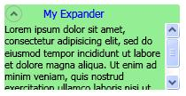

# Expander Overview
An <xref:System.Windows.Controls.Expander> control provides a way to provide content in an expandable area that resembles a window and includes a header.  
  
  
   
## Creating a Simple Expander  
 The following example shows how to create a simple <xref:System.Windows.Controls.Expander> control. This example creates an <xref:System.Windows.Controls.Expander> that looks like the previous illustration.  
  
 [!code-xaml[ExpanderExample#2](../../../../samples/snippets/csharp/VS_Snippets_Wpf/ExpanderExample/CSharp/Page1.xaml#2)]  
  
 The <xref:System.Windows.Controls.ContentControl.Content%2A> and <xref:System.Windows.Controls.HeaderedContentControl.Header%2A> of an <xref:System.Windows.Controls.Expander> can also contain complex content, such as <xref:System.Windows.Controls.RadioButton> and <xref:System.Windows.Controls.Image> objects.  
  
   
## Setting the Direction of the Expanding Content Area  
 You can set the content area of an <xref:System.Windows.Controls.Expander> control to expand in one of four directions (<xref:System.Windows.Controls.ExpandDirection.Down>, <xref:System.Windows.Controls.ExpandDirection.Up>, <xref:System.Windows.Controls.ExpandDirection.Left>, or <xref:System.Windows.Controls.ExpandDirection.Right>) by using the <xref:System.Windows.Controls.ExpandDirection> property. When the content area is collapsed, only the <xref:System.Windows.Controls.Expander><xref:System.Windows.Controls.HeaderedContentControl.Header%2A> and its toggle button appear. A <xref:System.Windows.Controls.Button> control that displays a directional arrow is used as a toggle button to expand or collapse the content area. When expanded, the <xref:System.Windows.Controls.Expander> tries to display all of its content in a window-like area.  
  
   
## Controlling the Size of an Expander in a Panel  
 If an <xref:System.Windows.Controls.Expander> control is inside a layout control that inherits from <xref:System.Windows.Controls.Panel>, such as <xref:System.Windows.Controls.StackPanel>, do not specify a <xref:System.Windows.FrameworkElement.Height%2A> on the <xref:System.Windows.Controls.Expander> when the <xref:System.Windows.Controls.Expander.ExpandDirection%2A> property is set to <xref:System.Windows.Controls.ExpandDirection.Down> or <xref:System.Windows.Controls.ExpandDirection.Up>. Similarly, do not specify a <xref:System.Windows.FrameworkElement.Width%2A> on the <xref:System.Windows.Controls.Expander> when the <xref:System.Windows.Controls.Expander.ExpandDirection%2A> property is set to <xref:System.Windows.Controls.ExpandDirection.Left> or <xref:System.Windows.Controls.ExpandDirection.Right>.  
  
 When you set a size dimension on an <xref:System.Windows.Controls.Expander> control in the direction that the expanded content is displayed, the <xref:System.Windows.Controls.Expander> takes control of the area that is used by the content and displays a border around it. The border shows even when the content is collapsed. To set the size of the expanded content area, set size dimensions on the content of the <xref:System.Windows.Controls.Expander>, or if you want scrolling capability, on the <xref:System.Windows.Controls.ScrollViewer> that encloses the content.  
  
 When an <xref:System.Windows.Controls.Expander> control is the last element in a <xref:System.Windows.Controls.DockPanel>, [!INCLUDE[TLA#tla_winclient](../../../../includes/tlasharptla-winclient-md.md)] automatically sets the <xref:System.Windows.Controls.Expander> dimensions to equal the remaining area of the <xref:System.Windows.Controls.DockPanel>. To prevent this default behavior, set the <xref:System.Windows.Controls.DockPanel.LastChildFill%2A> property on the <xref:System.Windows.Controls.DockPanel> object to `false`, or make sure that the <xref:System.Windows.Controls.Expander> is not the last element in a <xref:System.Windows.Controls.DockPanel>.  
  
   
## Creating Scrollable Content  
 If the content is too large for the size of the content area, you can wrap the content of an <xref:System.Windows.Controls.Expander> in a <xref:System.Windows.Controls.ScrollViewer> in order to provide scrollable content. The <xref:System.Windows.Controls.Expander> control does not automatically provide scrolling capability. The following illustration shows an <xref:System.Windows.Controls.Expander> control that contains a <xref:System.Windows.Controls.ScrollViewer> control.  
  
 **Expander in a ScrollViewer**  
  
   
  
 When you place an <xref:System.Windows.Controls.Expander> control in a <xref:System.Windows.Controls.ScrollViewer>, set the <xref:System.Windows.Controls.ScrollViewer> dimension property that corresponds to the direction in which the <xref:System.Windows.Controls.Expander> content opens to the size of the <xref:System.Windows.Controls.Expander> content area. For example, if you set the <xref:System.Windows.Controls.Expander.ExpandDirection%2A> property on the <xref:System.Windows.Controls.Expander> to <xref:System.Windows.Controls.ExpandDirection.Down> (the content area opens down), set the <xref:System.Windows.FrameworkElement.Height%2A> property on the <xref:System.Windows.Controls.ScrollViewer> control to the required height for the content area. If you instead set the height dimension on the content itself, <xref:System.Windows.Controls.ScrollViewer> does not recognize this setting and therefore, does not provide scrollable content.  
  
 The following example shows how to create an <xref:System.Windows.Controls.Expander> control that has complex content and that contains a <xref:System.Windows.Controls.ScrollViewer> control. This example creates an <xref:System.Windows.Controls.Expander> that is like the illustration at the beginning of this section.  
  
 [!code-csharp[ExpanderRichContent#1](../../../../samples/snippets/csharp/VS_Snippets_Wpf/ExpanderRichContent/CSharp/Window1.xaml.cs#1)]
 [!code-vb[ExpanderRichContent#1](../../../../samples/snippets/visualbasic/VS_Snippets_Wpf/ExpanderRichContent/VisualBasic/Window1.xaml.vb#1)]
 [!code-xaml[ExpanderRichContent#1](../../../../samples/snippets/csharp/VS_Snippets_Wpf/ExpanderRichContent/CSharp/Window1.xaml#1)]  
  
   
## Using the Alignment Properties  
 You can align content by setting the <xref:System.Windows.Controls.Control.HorizontalContentAlignment%2A> and <xref:System.Windows.Controls.Control.VerticalContentAlignment%2A> properties on the <xref:System.Windows.Controls.Expander> control. When you set these properties, the alignment applies to the header and also to the expanded content.  
  
## See Also  
 <xref:System.Windows.Controls.Expander>  
 <xref:System.Windows.Controls.ExpandDirection>  
 [How-to Topics](../../../../docs/framework/wpf/controls/expander-how-to-topics.md)
