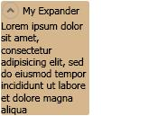

# Expander
An <xref:System.Windows.Controls.Expander> allows a user to view a header and expand that header to see further details, or to collapse a section up to a header.  
  
 The following illustration provides an example of this control in its expanded position.  
  
 
  
## In This Section  
 [Expander Overview](expander-overview.md)  
 [How-to Topics](expander-how-to-topics.md)  
  
## Reference  
 <xref:System.Windows.Controls.Expander>  
  
## Related Sections
