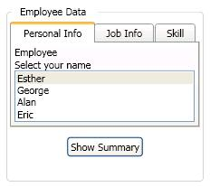

# GroupBox
The <xref:System.Windows.Controls.GroupBox> control is a <xref:System.Windows.Controls.HeaderedContentControl> that provides a titled container for [!INCLUDE[TLA#tla_gui](../../../../includes/tlasharptla-gui-md.md)] content.  
  
 The following illustration shows a <xref:System.Windows.Controls.GroupBox> that contains a <xref:System.Windows.Controls.TabControl> and a <xref:System.Windows.Controls.Button> that are enclosed in a <xref:System.Windows.Controls.StackPanel>.  
  
   
  
## In This Section  
 [Define a GroupBox Template](how-to-define-a-groupbox-template.md)  
  
## Reference  
 <xref:System.Windows.Controls.GroupBox>  
  
## Related Sections
