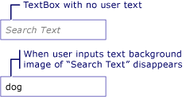

# How to: Add a Watermark to a TextBox
The following example shows how to aid usability of a <xref:System.Windows.Controls.TextBox> by displaying an explanatory background image inside of the <xref:System.Windows.Controls.TextBox> until the user inputs text, at which point the image is removed. In addition, the background image is restored again if the user removes their input. See illustration below.  
  
   
  
> [!NOTE]
>  The reason a background image is used in this example rather then simply manipulating the <xref:System.Windows.Controls.TextBox.Text%2A> property of <xref:System.Windows.Controls.TextBox>, is that a background image will not interfere with data binding.  
  
## Example  
 [!code-xaml[TextBoxMiscSnippets_snip#TextBoxBackgroundExampleWholePage](../../../../samples/snippets/csharp/VS_Snippets_Wpf/TextBoxMiscSnippets_snip/csharp/textbox_with_background_image.xaml#textboxbackgroundexamplewholepage)]  
  
 [!code-csharp[TextBoxMiscSnippets_snip#TextBoxBackgroundCodeExampleWholePage](../../../../samples/snippets/csharp/VS_Snippets_Wpf/TextBoxMiscSnippets_snip/csharp/textbox_with_background_image.xaml.cs#textboxbackgroundcodeexamplewholepage)]
 [!code-vb[TextBoxMiscSnippets_snip#TextBoxBackgroundCodeExampleWholePage](../../../../samples/snippets/visualbasic/VS_Snippets_Wpf/TextBoxMiscSnippets_snip/visualbasic/textbox_with_background_image.xaml.vb#textboxbackgroundcodeexamplewholepage)]  
  
## See Also  
 [TextBox Overview](../../../../docs/framework/wpf/controls/textbox-overview.md)  
 [RichTextBox Overview](../../../../docs/framework/wpf/controls/richtextbox-overview.md)
