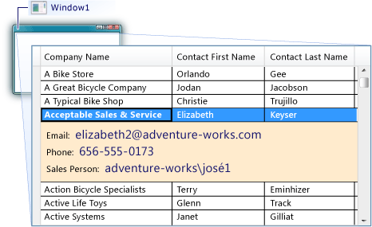

# How to: Add Row Details to a DataGrid Control
When using the <xref:System.Windows.Controls.DataGrid> control, you can customize the data presentation by adding a row details section. Adding a row details section enables you to group some data in a template that is optionally visible or collapsed. For example, you can add row details to a <xref:System.Windows.Controls.DataGrid> that presents only a summary of the data for each row in the <xref:System.Windows.Controls.DataGrid>, but presents more data fields when the user selects a row. You define the template for the row details section in the <xref:System.Windows.Controls.DataGrid.RowDetailsTemplate%2A> property. The following illustration shows an example of a row details section.  
  
   
  
 You define the row details template as either inline XAML or as a resource. Both approaches are shown in the following procedures. A data template that is added as a resource can be used throughout the project without re-creating the template. A data template that is added as inline XAML is only accessible from the control where it is defined.  
  
### To display row details by using inline XAML  
  
1.  Create a <xref:System.Windows.Controls.DataGrid> that displays data from a data source.  
  
2.  In the <xref:System.Windows.Controls.DataGrid> element, add a <xref:System.Windows.Controls.DataGrid.RowDetailsTemplate%2A> element.  
  
3.  Create a <xref:System.Windows.DataTemplate> that defines the appearance of the row details section.  
  
     The following XAML shows the <xref:System.Windows.Controls.DataGrid> and how to define the <xref:System.Windows.Controls.DataGrid.RowDetailsTemplate%2A> inline. The <xref:System.Windows.Controls.DataGrid> displays three values in each row and three more values when the row is selected.  
  
     [!code-xaml[DataGrid_RowDetails#1](../../../../samples/snippets/csharp/VS_Snippets_Wpf/datagrid_rowdetails/cs/mainwindow.xaml#1)]  
  
     The following code shows the query that is used to select the data that is displayed in the <xref:System.Windows.Controls.DataGrid>. In this example, the query selects data from an entity that contains customer information.  
  
     [!code-csharp[DataGrid_RowDetails#2](../../../../samples/snippets/csharp/VS_Snippets_Wpf/datagrid_rowdetails/cs/mainwindow.xaml.cs#2)]
     [!code-vb[DataGrid_RowDetails#2](../../../../samples/snippets/visualbasic/VS_Snippets_Wpf/datagrid_rowdetails/vb/mainwindow.xaml.vb#2)]  
  
### To display row details by using a resource  
  
1.  Create a <xref:System.Windows.Controls.DataGrid> that displays data from a data source.  
  
2.  Add a <xref:System.Windows.FrameworkElement.Resources%2A> element to the root element, such as a <xref:System.Windows.Window> control or a <xref:System.Windows.Controls.Page> control, or add a <xref:System.Windows.Application.Resources%2A> element to the <xref:System.Windows.Application> class in the App.xaml (or Application.xaml) file.  
  
3.  In the resources element, create a <xref:System.Windows.DataTemplate> that defines the appearance of the row details section.  
  
     The following XAML shows the <xref:System.Windows.Controls.DataGrid.RowDetailsTemplate%2A> defined in the <xref:System.Windows.Application> class.  
  
     [!code-xaml[DataGrid_RowDetails#3](../../../../samples/snippets/csharp/VS_Snippets_Wpf/datagrid_rowdetails/cs/app.xaml#3)]  
  
4.  On the <xref:System.Windows.DataTemplate>, set the [x:Key Directive](../../../../docs/framework/xaml-services/x-key-directive.md) to a value that uniquely identifies the data template.  
  
5.  In the <xref:System.Windows.Controls.DataGrid> element, set the <xref:System.Windows.Controls.DataGrid.RowDetailsTemplate%2A> property to the resource defined in the previous steps. Assign the resource as a static resource.  
  
     The following XAML shows the <xref:System.Windows.Controls.DataGrid.RowDetailsTemplate%2A> property set to the resource from the previous example.  
  
     [!code-xaml[DataGrid_RowDetails#4](../../../../samples/snippets/csharp/VS_Snippets_Wpf/datagrid_rowdetails/cs/window2.xaml#4)]  
  
### To set visibility and prevent horizontal scrolling for row details  
  
1.  If needed, set the <xref:System.Windows.Controls.DataGrid.RowDetailsVisibilityMode%2A> property to a <xref:System.Windows.Controls.DataGridRowDetailsVisibilityMode> value.  
  
     By default, the value is set to <xref:System.Windows.Controls.DataGridRowDetailsVisibilityMode.VisibleWhenSelected>. You can set it to <xref:System.Windows.Controls.DataGridRowDetailsVisibilityMode.Visible> to show the details for all of the rows or <xref:System.Windows.Controls.DataGridRowDetailsVisibilityMode.Collapsed> to hide the details for all rows.  
  
2.  If needed, set the <xref:System.Windows.Controls.DataGrid.AreRowDetailsFrozen%2A> property to `true` to prevent the row details section from scrolling horizontally.
