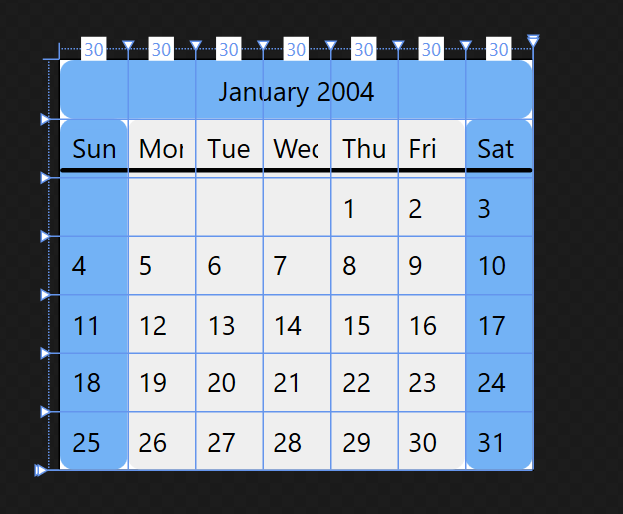

# How to create a complex Grid

This example shows how to use a <xref:System.Windows.Controls.Grid> control to create a layout that looks like a monthly calendar.

## Example

The following example defines eight rows and eight columns by using the <xref:System.Windows.Controls.RowDefinition> and <xref:System.Windows.Controls.ColumnDefinition> classes. It uses the <xref:System.Windows.Controls.Grid.ColumnSpan%2A?displayProperty=nameWithType> and <xref:System.Windows.Controls.Grid.RowSpan%2A?displayProperty=nameWithType> attached properties, together with <xref:System.Windows.Shapes.Rectangle> elements, which fill the backgrounds of various columns and rows. This design is possible because more than one element can exist in each cell in a <xref:System.Windows.Controls.Grid>, a principle difference between <xref:System.Windows.Controls.Grid> and <xref:System.Windows.Documents.Table>.

The example uses vertical gradients to <xref:System.Windows.Shapes.Shape.Fill%2A> the columns and rows to improve the visual presentation and readability of the calendar. Styled <xref:System.Windows.Controls.TextBlock> elements represent the dates and days of the week. <xref:System.Windows.Controls.TextBlock> elements are absolutely positioned within their cells by using the <xref:System.Windows.FrameworkElement.Margin%2A> property and alignment properties that are defined within the style for the application.

[!code-xaml[GridComplex#1](~/samples/snippets/csharp/VS_Snippets_Wpf/GridComplex/CS/default.xaml#1)]

The following image shows the resulting control, a customizable calendar:

## See also

- <xref:System.Windows.Controls.Grid?displayProperty=nameWithType>
- <xref:System.Windows.Documents.TableCell?displayProperty=nameWithType>
- [Painting with Solid Colors and Gradients Overview](../graphics-multimedia/painting-with-solid-colors-and-gradients-overview.md)
- [Panels Overview](panels-overview.md)
- [Table Overview](../advanced/table-overview.md)