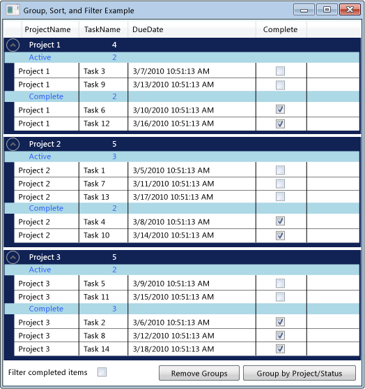

# How to: Group, Sort, and Filter Data in the DataGrid Control
It is often useful to view data in a <xref:System.Windows.Controls.DataGrid> in different ways by grouping, sorting, and filtering the data. To group, sort, and filter the data in a <xref:System.Windows.Controls.DataGrid>, you bind it to a <xref:System.Windows.Data.CollectionView> that supports these functions. You can then work with the data in the <xref:System.Windows.Data.CollectionView> without affecting the underlying source data. The changes in the collection view are reflected in the <xref:System.Windows.Controls.DataGrid> user interface (UI).  
  
 The <xref:System.Windows.Data.CollectionView> class provides grouping and sorting functionality for a data source that implements the <xref:System.Collections.IEnumerable> interface. The <xref:System.Windows.Data.CollectionViewSource> class enables you to set the properties of a <xref:System.Windows.Data.CollectionView> from XAML.  
  
 In this example, a collection of `Task` objects is bound to a <xref:System.Windows.Data.CollectionViewSource>. The <xref:System.Windows.Data.CollectionViewSource> is used as the <xref:System.Windows.Controls.ItemsControl.ItemsSource%2A> for the <xref:System.Windows.Controls.DataGrid>. Grouping, sorting, and filtering are performed on the <xref:System.Windows.Data.CollectionViewSource> and are displayed in the <xref:System.Windows.Controls.DataGrid> UI.  
  
   
Grouped Data in a DataGrid  
  
## Using a CollectionViewSource as an ItemsSource  
 To group, sort, and filter data in a <xref:System.Windows.Controls.DataGrid> control, you bind the <xref:System.Windows.Controls.DataGrid> to a <xref:System.Windows.Data.CollectionView> that supports these functions. In this example, the <xref:System.Windows.Controls.DataGrid> is bound to a <xref:System.Windows.Data.CollectionViewSource> that provides these functions for a <xref:System.Collections.Generic.List%601> of `Task` objects.  
  
#### To bind a DataGrid to a CollectionViewSource  
  
1.  Create a data collection that implements the <xref:System.Collections.IEnumerable> interface.  
  
     If you use <xref:System.Collections.Generic.List%601> to create your collection, you should create a new class that inherits from <xref:System.Collections.Generic.List%601> instead of instantiating an instance of <xref:System.Collections.Generic.List%601>. This enables you to data bind to the collection in XAML.  
  
    > [!NOTE]
    >  The objects in the collection must implement the <xref:System.ComponentModel.INotifyPropertyChanged> changed interface and the <xref:System.ComponentModel.IEditableObject> interface in order for the <xref:System.Windows.Controls.DataGrid> to respond correctly to property changes and edits. For more information, see [Implement Property Change Notification](../../../../docs/framework/wpf/data/how-to-implement-property-change-notification.md).  
  
     [!code-csharp[DataGrid_GroupSortFilter#101](../../../../samples/snippets/csharp/VS_Snippets_Wpf/DataGrid_GroupSortFilter/CS/MainWindow.xaml.cs#101)]
     [!code-vb[DataGrid_GroupSortFilter#101](../../../../samples/snippets/visualbasic/VS_Snippets_Wpf/DataGrid_GroupSortFilter/VB/MainWindow.xaml.vb#101)]  
  
2.  In XAML, create an instance of the collection class and set the [x:Key Directive](../../../../docs/framework/xaml-services/x-key-directive.md).  
  
3.  In XAML, create an instance of the <xref:System.Windows.Data.CollectionViewSource> class, set the [x:Key Directive](../../../../docs/framework/xaml-services/x-key-directive.md), and set the instance of your collection class as the <xref:System.Windows.Data.CollectionViewSource.Source%2A>.  
  
     [!code-xaml[DataGrid_GroupSortFilter#201](../../../../samples/snippets/csharp/VS_Snippets_Wpf/DataGrid_GroupSortFilter/CS/WindowSnips1.xaml#201)]  
  
4.  Create an instance of the <xref:System.Windows.Controls.DataGrid> class, and set the <xref:System.Windows.Controls.ItemsControl.ItemsSource%2A> property to the <xref:System.Windows.Data.CollectionViewSource>.  
  
     [!code-xaml[DataGrid_GroupSortFilter#002](../../../../samples/snippets/csharp/VS_Snippets_Wpf/DataGrid_GroupSortFilter/CS/MainWindow.xaml#002)]  
  
5.  To access the <xref:System.Windows.Data.CollectionViewSource> from your code, use the <xref:System.Windows.Data.CollectionViewSource.GetDefaultView%2A> method to get a reference to the <xref:System.Windows.Data.CollectionViewSource>.  
  
     [!code-csharp[DataGrid_GroupSortFilter#102](../../../../samples/snippets/csharp/VS_Snippets_Wpf/DataGrid_GroupSortFilter/CS/MainWindow.xaml.cs#102)]
     [!code-vb[DataGrid_GroupSortFilter#102](../../../../samples/snippets/visualbasic/VS_Snippets_Wpf/DataGrid_GroupSortFilter/VB/MainWindow.xaml.vb#102)]  
  
## Grouping items in a DataGrid  
 To specify how items are grouped in a <xref:System.Windows.Controls.DataGrid>, you use the <xref:System.Windows.Data.PropertyGroupDescription> type to group the items in the source view.  
  
#### To group items in a DataGrid using XAML  
  
1.  Create a <xref:System.Windows.Data.PropertyGroupDescription> that specifies the property to group by. You can specify the property in XAML or in code.  
  
    1.  In XAML, set the <xref:System.Windows.Data.PropertyGroupDescription.PropertyName%2A> to the name of the property to group by.  
  
    2.  In code, pass the name of the property to group by to the constructor.  
  
2.  Add the <xref:System.Windows.Data.PropertyGroupDescription> to the <xref:System.Windows.Data.CollectionViewSource.GroupDescriptions%2A?displayProperty=nameWithType> collection.  
  
3.  Add additional instances of <xref:System.Windows.Data.PropertyGroupDescription> to the <xref:System.Windows.Data.CollectionViewSource.GroupDescriptions%2A> collection to add more levels of grouping.  
  
     [!code-xaml[DataGrid_GroupSortFilter#012](../../../../samples/snippets/csharp/VS_Snippets_Wpf/DataGrid_GroupSortFilter/CS/MainWindow.xaml#012)]  
  
     [!code-csharp[DataGrid_GroupSortFilter#112](../../../../samples/snippets/csharp/VS_Snippets_Wpf/DataGrid_GroupSortFilter/CS/MainWindow.xaml.cs#112)]
     [!code-vb[DataGrid_GroupSortFilter#112](../../../../samples/snippets/visualbasic/VS_Snippets_Wpf/DataGrid_GroupSortFilter/VB/MainWindow.xaml.vb#112)]  
  
4.  To remove a group, remove the <xref:System.Windows.Data.PropertyGroupDescription> from the <xref:System.Windows.Data.CollectionViewSource.GroupDescriptions%2A> collection.  
  
5.  To remove all groups, call the <xref:System.Collections.ObjectModel.Collection%601.Clear%2A> method of the <xref:System.Windows.Data.CollectionViewSource.GroupDescriptions%2A> collection.  
  
     [!code-csharp[DataGrid_GroupSortFilter#114](../../../../samples/snippets/csharp/VS_Snippets_Wpf/DataGrid_GroupSortFilter/CS/MainWindow.xaml.cs#114)]
     [!code-vb[DataGrid_GroupSortFilter#114](../../../../samples/snippets/visualbasic/VS_Snippets_Wpf/DataGrid_GroupSortFilter/VB/MainWindow.xaml.vb#114)]  
  
 When items are grouped in the <xref:System.Windows.Controls.DataGrid>, you can define a <xref:System.Windows.Controls.GroupStyle> that specifies the appearance of each group. You apply the <xref:System.Windows.Controls.GroupStyle> by adding it to the <xref:System.Windows.Controls.ItemsControl.GroupStyle%2A> collection of the DataGrid. If you have multiple levels of grouping, you can apply different styles to each group level. Styles are applied in the order in which they are defined. For example, if you define two styles, the first will be applied to top level row groups. The second style will be applied to all row groups at the second level and lower. The <xref:System.Windows.FrameworkElement.DataContext%2A> of the <xref:System.Windows.Controls.GroupStyle> is the <xref:System.Windows.Data.CollectionViewGroup> that the group represents.  
  
#### To change the appearance of row group headers  
  
1.  Create a <xref:System.Windows.Controls.GroupStyle> that defines the appearance of the row group.  
  
2.  Put the <xref:System.Windows.Controls.GroupStyle> inside the `<DataGrid.GroupStyle>` tags.  
  
     [!code-xaml[DataGrid_GroupSortFilter#003](../../../../samples/snippets/csharp/VS_Snippets_Wpf/DataGrid_GroupSortFilter/CS/MainWindow.xaml#003)]  
  
## Sorting items in a DataGrid  
 To specify how items are sorted in a <xref:System.Windows.Controls.DataGrid>, you use the <xref:System.ComponentModel.SortDescription> type to sort the items in the source view.  
  
#### To sort items in a DataGrid  
  
1.  Create a <xref:System.ComponentModel.SortDescription> that specifies the property to sort by. You can specify the property in XAML or in code.  
  
    1.  In XAML, set the <xref:System.ComponentModel.SortDescription.PropertyName%2A> to the name of the property to sort by.  
  
    2.  In code, pass the name of the property to sort by and the <xref:System.ComponentModel.ListSortDirection> to the constructor.  
  
2.  Add the <xref:System.ComponentModel.SortDescription> to the <xref:System.Windows.Data.CollectionViewSource.SortDescriptions%2A?displayProperty=nameWithType> collection.  
  
3.  Add additional instances of <xref:System.ComponentModel.SortDescription> to the <xref:System.Windows.Data.CollectionViewSource.SortDescriptions%2A> collection to sort by additional properties.  
  
     [!code-xaml[DataGrid_GroupSortFilter#011](../../../../samples/snippets/csharp/VS_Snippets_Wpf/DataGrid_GroupSortFilter/CS/MainWindow.xaml#011)]  
  
     [!code-csharp[DataGrid_GroupSortFilter#211](../../../../samples/snippets/csharp/VS_Snippets_Wpf/DataGrid_GroupSortFilter/CS/WindowSnips1.xaml.cs#211)]
     [!code-vb[DataGrid_GroupSortFilter#211](../../../../samples/snippets/visualbasic/VS_Snippets_Wpf/DataGrid_GroupSortFilter/VB/MainWindow.xaml.vb#211)]  
  
## Filtering items in a DataGrid  
 To filter items in a <xref:System.Windows.Controls.DataGrid> using a <xref:System.Windows.Data.CollectionViewSource>, you provide the filtering logic in the handler for the <xref:System.Windows.Data.CollectionViewSource.Filter?displayProperty=nameWithType> event.  
  
#### To filter items in a DataGrid  
  
1.  Add a handler for the <xref:System.Windows.Data.CollectionViewSource.Filter?displayProperty=nameWithType> event.  
  
2.  In the <xref:System.Windows.Data.CollectionViewSource.Filter> event handler, define the filtering logic.  
  
     The filter will be applied every time the view is refreshed.  
  
     [!code-xaml[DataGrid_GroupSortFilter#013](../../../../samples/snippets/csharp/VS_Snippets_Wpf/DataGrid_GroupSortFilter/CS/MainWindow.xaml#013)]  
  
     [!code-csharp[DataGrid_GroupSortFilter#113](../../../../samples/snippets/csharp/VS_Snippets_Wpf/DataGrid_GroupSortFilter/CS/MainWindow.xaml.cs#113)]
     [!code-vb[DataGrid_GroupSortFilter#113](../../../../samples/snippets/visualbasic/VS_Snippets_Wpf/DataGrid_GroupSortFilter/VB/MainWindow.xaml.vb#113)]  
  
 Alternatively, you can filter items in a <xref:System.Windows.Controls.DataGrid> by creating a method that provides the filtering logic and setting the <xref:System.Windows.Data.CollectionView.Filter%2A?displayProperty=nameWithType> property to apply the filter. To see an example of this method, see [Filter Data in a View](../../../../docs/framework/wpf/data/how-to-filter-data-in-a-view.md).  
  
## Example  
 The following example demonstrates grouping, sorting, and filtering `Task` data in a <xref:System.Windows.Data.CollectionViewSource> and displaying the grouped, sorted, and filtered `Task` data in a <xref:System.Windows.Controls.DataGrid>. The <xref:System.Windows.Data.CollectionViewSource> is used as the <xref:System.Windows.Controls.ItemsControl.ItemsSource%2A> for the <xref:System.Windows.Controls.DataGrid>. Grouping, sorting, and filtering are performed on the <xref:System.Windows.Data.CollectionViewSource> and are displayed in the <xref:System.Windows.Controls.DataGrid> UI.  
  
 To test this example, you will need to adjust the DGGroupSortFilterExample name to match your project name. If you are using Visual Basic, you will need to change the class name for <xref:System.Windows.Window> to the following.  
  
 `<Window x:Class="MainWindow"`  
  
 [!code-xaml[DataGrid_GroupSortFilter#000](../../../../samples/snippets/csharp/VS_Snippets_Wpf/DataGrid_GroupSortFilter/CS/MainWindow.xaml#000)]  
  
 [!code-csharp[DataGrid_GroupSortFilter#100](../../../../samples/snippets/csharp/VS_Snippets_Wpf/DataGrid_GroupSortFilter/CS/MainWindow.xaml.cs#100)]
 [!code-vb[DataGrid_GroupSortFilter#100](../../../../samples/snippets/visualbasic/VS_Snippets_Wpf/DataGrid_GroupSortFilter/VB/MainWindow.xaml.vb#100)]  
  
## Compiling the Code  
  
-  
  
## Robust Programming  
  
## .NET Framework Security  
  
## See Also  
 [Data Binding Overview](../../../../docs/framework/wpf/data/data-binding-overview.md)  
 [Create and Bind to an ObservableCollection](../../../../docs/framework/wpf/data/how-to-create-and-bind-to-an-observablecollection.md)  
 [Filter Data in a View](../../../../docs/framework/wpf/data/how-to-filter-data-in-a-view.md)  
 [Sort Data in a View](../../../../docs/framework/wpf/data/how-to-sort-data-in-a-view.md)  
 [Sort and Group Data Using a View in XAML](../../../../docs/framework/wpf/data/how-to-sort-and-group-data-using-a-view-in-xaml.md)
