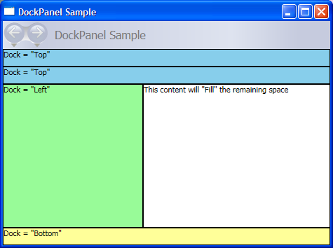

# How to: Partition Space by Using the DockPanel Element
The following example creates a simple [!INCLUDE[TLA#tla_ui](../../../../includes/tlasharptla-ui-md.md)] framework using a <xref:System.Windows.Controls.DockPanel> element. The <xref:System.Windows.Controls.DockPanel> partitions available space to its child elements.  
  
## Example  
 This example uses the <xref:System.Windows.Controls.DockPanel.Dock%2A> property, which is an attached property, to dock two identical <xref:System.Windows.Controls.Border> elements at the <xref:System.Windows.Controls.Dock.Top> of the partitioned space. A third <xref:System.Windows.Controls.Border> element is docked to the <xref:System.Windows.Controls.Dock.Left>, with its width set to 200 pixels. A fourth <xref:System.Windows.Controls.Border> is docked to the <xref:System.Windows.Controls.Dock.Bottom> of the screen. The last <xref:System.Windows.Controls.Border> element automatically fills the remaining space.  
  
 [!code-cpp[DockPanelOvwSample#1](../../../../samples/snippets/cpp/VS_Snippets_Wpf/DockPanelOvwSample/CPP/DockPanel_Ovw_Sample.cpp#1)]
 [!code-csharp[DockPanelOvwSample#1](../../../../samples/snippets/csharp/VS_Snippets_Wpf/DockPanelOvwSample/CSharp/DockPanel_Ovw_Sample.cs#1)]
 [!code-vb[DockPanelOvwSample#1](../../../../samples/snippets/visualbasic/VS_Snippets_Wpf/DockPanelOvwSample/VisualBasic/dockpanel_vb.vb#1)]
 [!code-xaml[DockPanelOvwSample#1](../../../../samples/snippets/xaml/VS_Snippets_Wpf/DockPanelOvwSample/XAML/default.xaml#1)]  
  
> [!NOTE]
>  By default, the last child of a <xref:System.Windows.Controls.DockPanel> element fills the remaining unallocated space. If you do not want this behavior, set `LastChildFill="False"`.  
  
 The compiled application yields a new UI that looks like this.  
  
   
  
## See Also  
 <xref:System.Windows.Controls.DockPanel>  
 [Panels Overview](../../../../docs/framework/wpf/controls/panels-overview.md)
