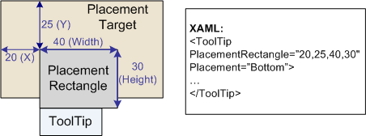
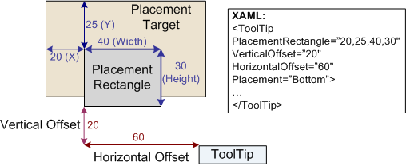

# How to: Position a ToolTip
This example shows how to specify the position of a tooltip on the screen.  
  
## Example  
 You can position a tooltip by using a set of five properties that are defined in both the <xref:System.Windows.Controls.ToolTip> and <xref:System.Windows.Controls.ToolTipService> classes. The following table shows these two sets of five properties and provides links to their reference documentation according to class.  
  
### Corresponding tooltip properties according to class  
  
|<xref:System.Windows.Controls.ToolTip?displayProperty=nameWithType> class properties|<xref:System.Windows.Controls.ToolTipService?displayProperty=nameWithType> class properties|  
|--------------------------------------------------------------------------------------------------------------------------------------------------------------|---------------------------------------------------------------------------------------------------------------------------------------------------------------------|  
|<xref:System.Windows.Controls.ToolTip.Placement%2A?displayProperty=nameWithType>|<xref:System.Windows.Controls.ToolTipService.Placement%2A?displayProperty=nameWithType>|  
|<xref:System.Windows.Controls.ToolTip.PlacementTarget%2A?displayProperty=nameWithType>|<xref:System.Windows.Controls.ToolTipService.PlacementTarget%2A?displayProperty=nameWithType>|  
|<xref:System.Windows.Controls.ToolTip.PlacementRectangle%2A?displayProperty=nameWithType>|<xref:System.Windows.Controls.ToolTipService.PlacementRectangle%2A?displayProperty=nameWithType>|  
|<xref:System.Windows.Controls.ToolTip.HorizontalOffset%2A?displayProperty=nameWithType>|<xref:System.Windows.Controls.ToolTipService.HorizontalOffset%2A?displayProperty=nameWithType>|  
|<xref:System.Windows.Controls.ToolTip.VerticalOffset%2A?displayProperty=nameWithType>|<xref:System.Windows.Controls.ToolTipService.VerticalOffset%2A?displayProperty=nameWithType>|  
  
 If you define the contents of a tooltip by using a <xref:System.Windows.Controls.ToolTip> object, you can use the properties of either class; however, the <xref:System.Windows.Controls.ToolTipService> properties take precedence. Use the <xref:System.Windows.Controls.ToolTipService> properties for tooltips that are not defined as <xref:System.Windows.Controls.ToolTip> objects.  
  
 The following illustrations show how to position a tooltip by using these properties. Although, the [!INCLUDE[TLA#tla_xaml](../../../../includes/tlasharptla-xaml-md.md)] examples in these illustrations show how to set the properties that are defined by the <xref:System.Windows.Controls.ToolTip> class, the corresponding properties of the <xref:System.Windows.Controls.ToolTipService> class follow the same layout rules. For more information about the possible values for the Placement property, see [Popup Placement Behavior](../../../../docs/framework/wpf/controls/popup-placement-behavior.md).  
  
   
ToolTip placement by using the Placement property  
  
   
ToolTip placement by using the Placement and PlacementRectangle properties  
  
   
ToolTip placement by using the Placement, PlacementRectangle, and Offset properties  
  
 The following example shows how to use the <xref:System.Windows.Controls.ToolTip> properties to specify the position of a tooltip whose content is a <xref:System.Windows.Controls.ToolTip> object.  
  
 [!code-xaml[ToolTipService#ToolTip](../../../../samples/snippets/csharp/VS_Snippets_Wpf/ToolTipService/CSharp/Pane1.xaml#tooltip)]  
  
 [!code-csharp[ToolTipService#ToolTipCode](../../../../samples/snippets/csharp/VS_Snippets_Wpf/ToolTipService/CSharp/Pane1.xaml.cs#tooltipcode)]
 [!code-vb[ToolTipService#ToolTipCode](../../../../samples/snippets/visualbasic/VS_Snippets_Wpf/ToolTipService/visualbasic/pane1.xaml.vb#tooltipcode)]  
  
 The following example shows how to use the <xref:System.Windows.Controls.ToolTipService> properties to specify the position of a tooltip whose content is not a <xref:System.Windows.Controls.ToolTip> object.  
  
 [!code-xaml[ToolTipService#NoToolTip](../../../../samples/snippets/csharp/VS_Snippets_Wpf/ToolTipService/CSharp/Pane1.xaml#notooltip)]  
  
 [!code-csharp[ToolTipService#NoToolTipCode](../../../../samples/snippets/csharp/VS_Snippets_Wpf/ToolTipService/CSharp/Pane1.xaml.cs#notooltipcode)]
 [!code-vb[ToolTipService#NoToolTipCode](../../../../samples/snippets/visualbasic/VS_Snippets_Wpf/ToolTipService/visualbasic/pane1.xaml.vb#notooltipcode)]  
  
## See Also  
 <xref:System.Windows.Controls.ToolTip>  
 <xref:System.Windows.Controls.ToolTipService>  
 [How-to Topics](../../../../docs/framework/wpf/controls/tooltip-how-to-topics.md)  
 [ToolTip Overview](../../../../docs/framework/wpf/controls/tooltip-overview.md)  
 [Use the ContextMenuService and ToolTipService](http://msdn.microsoft.com/library/809b0e9c-d612-4cda-b8af-1a698c68f4d1)
