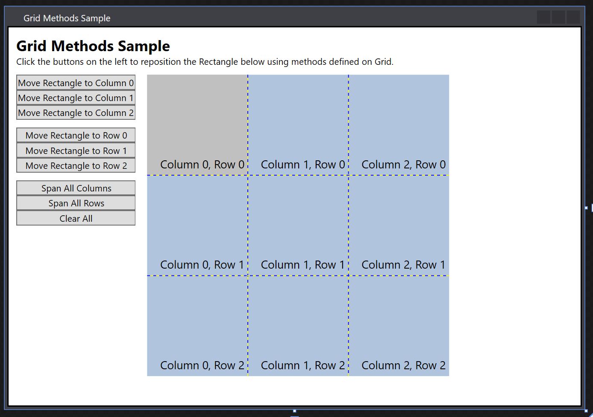

# How to: Position the Child Elements of a Grid
This example shows how to use the get and set methods that are defined on <xref:System.Windows.Controls.Grid> to position child elements.  
  
## Example  
 The following example defines a parent <xref:System.Windows.Controls.Grid> element (`grid1`) that has three columns and three rows. A child <xref:System.Windows.Shapes.Rectangle> element (`rect1`) is added to the <xref:System.Windows.Controls.Grid> in column position zero, row position zero. <xref:System.Windows.Controls.Button> elements represent methods that can be called to reposition the <xref:System.Windows.Shapes.Rectangle> element within the <xref:System.Windows.Controls.Grid>. When a user clicks a button, the related method is activated.  
  
 [!code-xaml[gridGetSetMethods](../../../../samples/snippets/csharp/VS_Snippets_Wpf/gridGetSetMethods/CSharp/Window1.xaml)]  
  
 The following code-behind example handles the methods that the button <xref:System.Windows.Controls.Primitives.ButtonBase.Click> events raise. The example writes these method calls to <xref:System.Windows.Controls.TextBlock> elements that use related get methods to output the new property values as strings.  
  
 [!code-csharp[gridGetSetMethods#2](../../../../samples/snippets/csharp/VS_Snippets_Wpf/gridGetSetMethods/CSharp/Window1.xaml.cs#2)]
 [!code-vb[gridGetSetMethods#2](../../../../samples/snippets/visualbasic/VS_Snippets_Wpf/gridGetSetMethods/VisualBasic/Window1.xaml.vb#2)]  
 Here is the finished result!
 
  
  
## See Also  
 <xref:System.Windows.Controls.Grid>  
 [Panels Overview](../../../../docs/framework/wpf/controls/panels-overview.md)
