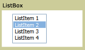

# ListBox
A <xref:System.Windows.Controls.ListBox> control provides users with a list of selectable items.  
  
 The following figure illustrates a typical <xref:System.Windows.Controls.ListBox>.  
  
   
Typical ListBox  
  
## In This Section  
 [How-to Topics](../../../../docs/framework/wpf/controls/listbox-how-to-topics.md)  
  
## Reference  
 <xref:System.Windows.Controls.ListBox>  
  <xref:System.Windows.Controls.ListBoxItem>  
  
## Related Sections
