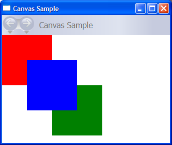
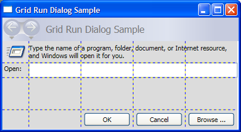
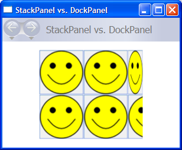
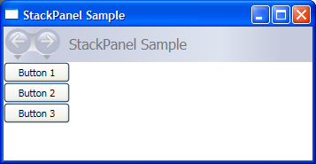
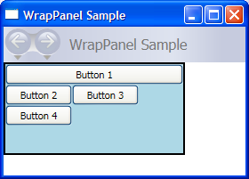
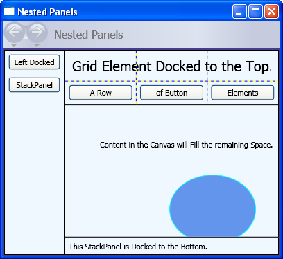

# Panels Overview
<xref:System.Windows.Controls.Panel> elements are components that control the rendering of elements—their size and dimensions, their position, and the arrangement of their child content. The [!INCLUDE[TLA#tla_winclient](../../../../includes/tlasharptla-winclient-md.md)] provides a number of predefined <xref:System.Windows.Controls.Panel> elements as well as the ability to construct custom <xref:System.Windows.Controls.Panel> elements.  
  
 This topic contains the following sections.  
  
-   [The Panel Class](#Panels_view_from_10000_feet)  
  
-   [Panel Element Common Members](#Panels_declared_members)  
  
-   [Derived Panel Elements](#Panels_derived_elements)  
  
-   [User Interface Panels](#Panels_main_UI_elements)  
  
-   [Nested Panel Elements](#Panels_nested_panel_elements)  
  
-   [Custom Panel Elements](#Panels_custom_panel_elements)  
  
-   [Localization/Globalization Support](#Panels_global_localization)  
  
   
## The Panel Class  
 <xref:System.Windows.Controls.Panel> is the base class for all elements that provide layout support in [!INCLUDE[TLA#tla_winclient](../../../../includes/tlasharptla-winclient-md.md)]. Derived <xref:System.Windows.Controls.Panel> elements are used to position and arrange elements in [!INCLUDE[TLA#tla_xaml](../../../../includes/tlasharptla-xaml-md.md)] and code.  
  
 The [!INCLUDE[TLA2#tla_winclient](../../../../includes/tla2sharptla-winclient-md.md)] includes a comprehensive suite of derived panel implementations that enable many complex layouts. These derived classes expose properties and methods that enable most standard [!INCLUDE[TLA#tla_ui](../../../../includes/tlasharptla-ui-md.md)] scenarios. Developers who are unable to find a child arrangement behavior that meets their needs can create new layouts by overriding the <xref:System.Windows.FrameworkElement.ArrangeOverride%2A> and <xref:System.Windows.FrameworkElement.MeasureOverride%2A> methods. For more information on custom layout behaviors, see [Custom Panel Elements](#Panels_custom_panel_elements).  
  
   
## Panel Common Members  
 All <xref:System.Windows.Controls.Panel> elements support the base sizing and positioning properties defined by <xref:System.Windows.FrameworkElement>, including <xref:System.Windows.FrameworkElement.Height%2A>, <xref:System.Windows.FrameworkElement.Width%2A>, <xref:System.Windows.FrameworkElement.HorizontalAlignment%2A>, <xref:System.Windows.FrameworkElement.VerticalAlignment%2A>, <xref:System.Windows.FrameworkElement.Margin%2A>, and <xref:System.Windows.FrameworkElement.LayoutTransform%2A>. For additional information on positioning properties defined by <xref:System.Windows.FrameworkElement>, see [Alignment, Margins, and Padding Overview](../../../../docs/framework/wpf/advanced/alignment-margins-and-padding-overview.md).  
  
 <xref:System.Windows.Controls.Panel> exposes additional properties that are of critical importance in understanding and using layout. The <xref:System.Windows.Controls.Panel.Background%2A> property is used to fill the area between the boundaries of a derived panel element with a <xref:System.Windows.Media.Brush>. <xref:System.Windows.Controls.Panel.Children%2A> represents the child collection of elements that the <xref:System.Windows.Controls.Panel> is comprised of. <xref:System.Windows.Controls.Panel.InternalChildren%2A> represents the content of the <xref:System.Windows.Controls.Panel.Children%2A> collection plus those members generated by data binding. Both consist of a <xref:System.Windows.Controls.UIElementCollection> of child elements hosted within the parent <xref:System.Windows.Controls.Panel>.  
  
 Panel also exposes a <xref:System.Windows.Controls.Panel.ZIndex%2A?displayProperty=nameWithType> attached property that can be used to achieve layered order in a derived <xref:System.Windows.Controls.Panel>. Members of a panel's <xref:System.Windows.Controls.Panel.Children%2A> collection with a higher <xref:System.Windows.Controls.Panel.ZIndex%2A?displayProperty=nameWithType> value appear in front of those with a lower <xref:System.Windows.Controls.Panel.ZIndex%2A?displayProperty=nameWithType> value. This is particularly useful for panels such as <xref:System.Windows.Controls.Canvas> and <xref:System.Windows.Controls.Grid> which allow children to share the same coordinate space.  
  
 <xref:System.Windows.Controls.Panel> also defines the <xref:System.Windows.Controls.Panel.OnRender%2A> method, which can be used to override the default presentation behavior of a <xref:System.Windows.Controls.Panel>.  
  
#### Attached Properties  
 Derived panel elements make extensive use of attached properties. An attached property is a specialized form of dependency property that does not have the conventional [!INCLUDE[TLA#tla_clr](../../../../includes/tlasharptla-clr-md.md)] property "wrapper". Attached properties have a specialized syntax in [!INCLUDE[TLA#tla_xaml](../../../../includes/tlasharptla-xaml-md.md)], which can be seen in several of the examples that follow.  
  
 One purpose of an attached property is to allow child elements to store unique values of a property that is actually defined by a parent element. An application of this functionality is having child elements inform the parent how they wish to be presented in the [!INCLUDE[TLA#tla_ui](../../../../includes/tlasharptla-ui-md.md)], which is extremely useful for application layout. For more information, see [Attached Properties Overview](../../../../docs/framework/wpf/advanced/attached-properties-overview.md).  
  
   
## Derived Panel Elements  
 Many objects derive from <xref:System.Windows.Controls.Panel>, but not all of them are intended for use as root layout providers. There are six defined panel classes (<xref:System.Windows.Controls.Canvas>, <xref:System.Windows.Controls.DockPanel>, <xref:System.Windows.Controls.Grid>, <xref:System.Windows.Controls.StackPanel>, <xref:System.Windows.Controls.VirtualizingStackPanel>, and <xref:System.Windows.Controls.WrapPanel>) that are designed specifically for creating application [!INCLUDE[TLA2#tla_ui](../../../../includes/tla2sharptla-ui-md.md)].  
  
 Each panel element encapsulates its own special functionality, as seen in the following table.  
  
|Element Name|UI Panel?|Description|  
|------------------|---------------|-----------------|  
|<xref:System.Windows.Controls.Canvas>|Yes|Defines an area within which you can explicitly position child elements by coordinates relative to the <xref:System.Windows.Controls.Canvas> area.|  
|<xref:System.Windows.Controls.DockPanel>|Yes|Defines an area within which you can arrange child elements either horizontally or vertically, relative to each other.|  
|<xref:System.Windows.Controls.Grid>|Yes|Defines a flexible grid area consisting of columns and rows. Child elements of a <xref:System.Windows.Controls.Grid> can be positioned precisely using the <xref:System.Windows.FrameworkElement.Margin%2A> property.|  
|<xref:System.Windows.Controls.StackPanel>|Yes|Arranges child elements into a single line that can be oriented horizontally or vertically.|  
|<xref:System.Windows.Controls.Primitives.TabPanel>|No|Handles the layout of tab buttons in a <xref:System.Windows.Controls.TabControl>.|  
|<xref:System.Windows.Controls.Primitives.ToolBarOverflowPanel>|No|Arranges content within a <xref:System.Windows.Controls.ToolBar> control.|  
|<xref:System.Windows.Controls.Primitives.UniformGrid>|No|<xref:System.Windows.Controls.Primitives.UniformGrid> is used to arrange children in a grid with all equal cell sizes.|  
|<xref:System.Windows.Controls.VirtualizingPanel>|No|Provides a base class for panels that can "virtualize" their children collection.|  
|<xref:System.Windows.Controls.VirtualizingStackPanel>|Yes|Arranges and virtualizes content on a single line oriented horizontally or vertically.|  
|<xref:System.Windows.Controls.WrapPanel>|Yes|<xref:System.Windows.Controls.WrapPanel> positions child elements in sequential position from left to right, breaking content to the next line at the edge of the containing box. Subsequent ordering happens sequentially from top to bottom or right to left, depending on the value of the <xref:System.Windows.Controls.WrapPanel.Orientation%2A> property.|  
  
   
## User Interface Panels  
 There are six panel classes available in [!INCLUDE[TLA2#tla_winclient](../../../../includes/tla2sharptla-winclient-md.md)] that are optimized to support [!INCLUDE[TLA2#tla_ui](../../../../includes/tla2sharptla-ui-md.md)] scenarios: <xref:System.Windows.Controls.Canvas>, <xref:System.Windows.Controls.DockPanel>, <xref:System.Windows.Controls.Grid>, <xref:System.Windows.Controls.StackPanel>, <xref:System.Windows.Controls.VirtualizingStackPanel>, and <xref:System.Windows.Controls.WrapPanel>. These panel elements are easy to use, versatile, and extensible enough for most applications.  
  
 Each derived <xref:System.Windows.Controls.Panel> element treats sizing constraints differently. Understanding how a <xref:System.Windows.Controls.Panel> handles constraints in either the horizontal or vertical direction can make layout more predictable.  
  
|**Panel Name**|**x-Dimension**|**y-Dimension**|  
|--------------------|----------------------|----------------------|  
|<xref:System.Windows.Controls.Canvas>|Constrained to content|Constrained to content|  
|<xref:System.Windows.Controls.DockPanel>|Constrained|Constrained|  
|<xref:System.Windows.Controls.StackPanel> (Vertical Orientation)|Constrained|Constrained to content|  
|<xref:System.Windows.Controls.StackPanel> (Horizontal Orientation)|Constrained to content|Constrained|  
|<xref:System.Windows.Controls.Grid>|Constrained|Constrained, except in cases where <xref:System.Windows.GridUnitType.Auto> apply to rows and columns|  
|<xref:System.Windows.Controls.WrapPanel>|Constrained to content|Constrained to content|  
  
 More detailed descriptions and usage examples of each of these elements can be found below.  
  
   
### Canvas  
 The <xref:System.Windows.Controls.Canvas> element enables positioning of content according to absolute *x-* and *y-*coordinates. Elements can be drawn in a unique location; or, if elements occupy the same coordinates, the order in which they appear in markup determines the order in which the elements are drawn.  
  
 <xref:System.Windows.Controls.Canvas> provides the most flexible layout support of any <xref:System.Windows.Controls.Panel>. Height and Width properties are used to define the area of the canvas, and elements inside are assigned absolute coordinates relative to the area of the parent <xref:System.Windows.Controls.Canvas>. Four attached properties, <xref:System.Windows.Controls.Canvas.Left%2A?displayProperty=nameWithType>, <xref:System.Windows.Controls.Canvas.Top%2A?displayProperty=nameWithType>, <xref:System.Windows.Controls.Canvas.Right%2A?displayProperty=nameWithType> and <xref:System.Windows.Controls.Canvas.Bottom%2A?displayProperty=nameWithType>, allow fine control of object placement within a <xref:System.Windows.Controls.Canvas>, allowing the developer to position and arrange elements precisely on the screen.  
  
#### ClipToBounds Within a Canvas  
 <xref:System.Windows.Controls.Canvas> can position child elements at any position on the screen, even at coordinates that are outside of its own defined <xref:System.Windows.FrameworkElement.Height%2A> and <xref:System.Windows.FrameworkElement.Width%2A>. Furthermore, <xref:System.Windows.Controls.Canvas> is not affected by the size of its children. As a result, it is possible for a child element to overdraw other elements outside the bounding rectangle of the parent <xref:System.Windows.Controls.Canvas>. The default behavior of a <xref:System.Windows.Controls.Canvas> is to allow children to be drawn outside the bounds of the parent <xref:System.Windows.Controls.Canvas>. If this behavior is undesirable, the <xref:System.Windows.UIElement.ClipToBounds%2A> property can be set to `true`. This causes <xref:System.Windows.Controls.Canvas> to clip to its own size. <xref:System.Windows.Controls.Canvas> is the only layout element that allows children to be drawn outside its bounds.  
  
 This behavior is graphically illustrated in the [Width Properties Comparison Sample](http://go.microsoft.com/fwlink/?LinkID=160050).  
  
#### Defining and Using a Canvas  
 A <xref:System.Windows.Controls.Canvas> can be instantiated simply by using [!INCLUDE[TLA#tla_xaml](../../../../includes/tlasharptla-xaml-md.md)] or code. The following example demonstrates how to use <xref:System.Windows.Controls.Canvas> to absolutely position content. This code produces three 100-pixel squares. The first square is red, and its top-left (*x, y*) position is specified as (0, 0). The second square is green, and its top-left position is (100, 100), just below and to the right of the first square. The third square is blue, and its top-left position is (50, 50), thus encompassing the lower-right quadrant of the first square and the upper-left quadrant of the second. Because the third square is laid out last, it appears to be on top of the other two squares—that is, the overlapping portions assume the color of the third box.  
  
 [!code-csharp[CanvasOvwSample#1](../../../../samples/snippets/csharp/VS_Snippets_Wpf/CanvasOvwSample/CSharp/Canvas_Ovw_Sample.cs#1)]
 [!code-vb[CanvasOvwSample#1](../../../../samples/snippets/visualbasic/VS_Snippets_Wpf/CanvasOvwSample/VisualBasic/canvas_vb.vb#1)]
 [!code-xaml[CanvasOvwSample#1](../../../../samples/snippets/xaml/VS_Snippets_Wpf/CanvasOvwSample/XAML/default.xaml#1)]  
  
 The compiled application yields a new [!INCLUDE[TLA2#tla_ui](../../../../includes/tla2sharptla-ui-md.md)] that looks like this.  
  
   
  
   
### DockPanel  
 The <xref:System.Windows.Controls.DockPanel> element uses the <xref:System.Windows.Controls.DockPanel.Dock%2A?displayProperty=nameWithType> attached property as set in child content elements to position content along the edges of a container. When <xref:System.Windows.Controls.DockPanel.Dock%2A?displayProperty=nameWithType> is set to <xref:System.Windows.Controls.Dock.Top> or <xref:System.Windows.Controls.Dock.Bottom>, it positions child elements above or below each other. When <xref:System.Windows.Controls.DockPanel.Dock%2A?displayProperty=nameWithType> is set to <xref:System.Windows.Controls.Dock.Left> or <xref:System.Windows.Controls.Dock.Right>, it positions child elements to the left or right of each other. The <xref:System.Windows.Controls.DockPanel.LastChildFill%2A> property determines the position of the final element added as a child of a <xref:System.Windows.Controls.DockPanel>.  
  
 You can use <xref:System.Windows.Controls.DockPanel> to position a group of related controls, such as a set of buttons. Alternately, you can use it to create a "paned" [!INCLUDE[TLA2#tla_ui](../../../../includes/tla2sharptla-ui-md.md)], similar to that found in [!INCLUDE[TLA#tla_outlook](../../../../includes/tlasharptla-outlook-md.md)].  
  
#### Sizing to Content  
 If its <xref:System.Windows.FrameworkElement.Height%2A> and <xref:System.Windows.FrameworkElement.Width%2A> properties are not specified, <xref:System.Windows.Controls.DockPanel> sizes to its content. The size can increase or decrease to accommodate the size of its child elements. However, when these properties are specified and there is no longer room for the next specified child element, <xref:System.Windows.Controls.DockPanel> does not display that child element or subsequent child elements and does not measure subsequent child elements.  
  
#### LastChildFill  
 By default, the last child of a <xref:System.Windows.Controls.DockPanel> element will "fill" the remaining, unallocated space. If this behavior is not desired, set the <xref:System.Windows.Controls.DockPanel.LastChildFill%2A> property to `false`.  
  
#### Defining and Using a DockPanel  
 The following example demonstrates how to partition space using a <xref:System.Windows.Controls.DockPanel>. Five <xref:System.Windows.Controls.Border> elements are added as children of a parent <xref:System.Windows.Controls.DockPanel>. Each uses a different positioning property of a <xref:System.Windows.Controls.DockPanel> to partition space. The final element "fills" the remaining, unallocated space.  
  
 [!code-cpp[DockPanelOvwSample#1](../../../../samples/snippets/cpp/VS_Snippets_Wpf/DockPanelOvwSample/CPP/DockPanel_Ovw_Sample.cpp#1)]
 [!code-csharp[DockPanelOvwSample#1](../../../../samples/snippets/csharp/VS_Snippets_Wpf/DockPanelOvwSample/CSharp/DockPanel_Ovw_Sample.cs#1)]
 [!code-vb[DockPanelOvwSample#1](../../../../samples/snippets/visualbasic/VS_Snippets_Wpf/DockPanelOvwSample/VisualBasic/dockpanel_vb.vb#1)]
 [!code-xaml[DockPanelOvwSample#1](../../../../samples/snippets/xaml/VS_Snippets_Wpf/DockPanelOvwSample/XAML/default.xaml#1)]  
  
 The compiled application yields a new [!INCLUDE[TLA2#tla_ui](../../../../includes/tla2sharptla-ui-md.md)] that looks like this.  
  
   
  
   
### Grid  
 The <xref:System.Windows.Controls.Grid> element merges the functionality of an absolute positioning and tabular data control. A <xref:System.Windows.Controls.Grid> enables you to easily position and style elements. <xref:System.Windows.Controls.Grid> allows you to define flexible row and column groupings, and even provides a mechanism to share sizing information between multiple <xref:System.Windows.Controls.Grid> elements.  
  
#### How is Grid Different from Table?  
 <xref:System.Windows.Documents.Table> and <xref:System.Windows.Controls.Grid> share some common functionality, but each is best suited for different scenarios. A <xref:System.Windows.Documents.Table> is designed for use within flow content (see [Flow Document Overview](../../../../docs/framework/wpf/advanced/flow-document-overview.md) for more information on flow content). Grids are best used inside of forms (basically anywhere outside of flow content). Within a <xref:System.Windows.Documents.FlowDocument>, <xref:System.Windows.Documents.Table> supports flow content behaviors like pagination, column reflow, and content selection while a <xref:System.Windows.Controls.Grid> does not. A <xref:System.Windows.Controls.Grid> on the other hand is best used outside of a <xref:System.Windows.Documents.FlowDocument> for many reasons including <xref:System.Windows.Controls.Grid> adds elements based on a row and column index, <xref:System.Windows.Documents.Table> does not. The <xref:System.Windows.Controls.Grid> element allows layering of child content, allowing more than one element to exist within a single "cell." <xref:System.Windows.Documents.Table> does not support layering. Child elements of a <xref:System.Windows.Controls.Grid> can be absolutely positioned relative to the area of their "cell" boundaries. <xref:System.Windows.Documents.Table> does not support this feature. Finally, a <xref:System.Windows.Controls.Grid> is lighter weight than a <xref:System.Windows.Documents.Table>.  
  
#### Sizing Behavior of Columns and Rows  
 Columns and rows defined within a <xref:System.Windows.Controls.Grid> can take advantage of <xref:System.Windows.GridUnitType.Star> sizing in order to distribute remaining space proportionally. When <xref:System.Windows.GridUnitType.Star> is selected as the Height or Width of a row or column, that column or row receives a weighted proportion of remaining available space. This is in contrast to <xref:System.Windows.GridUnitType.Auto>, which will distribute space evenly based on the size of the content within a column or row. This value is expressed as `*` or `2*` when using [!INCLUDE[TLA#tla_xaml](../../../../includes/tlasharptla-xaml-md.md)]. In the first case, the row or column would receive one times the available space, in the second case, two times, and so on. By combining this technique to proportionally distribute space with a <xref:System.Windows.FrameworkElement.HorizontalAlignment%2A> and <xref:System.Windows.FrameworkElement.VerticalAlignment%2A> value of `Stretch` it is possible to partition layout space by percentage of screen space. <xref:System.Windows.Controls.Grid> is the only layout panel that can distribute space in this manner.  
  
#### Defining and Using a Grid  
 The following example demonstrates how to build a [!INCLUDE[TLA2#tla_ui](../../../../includes/tla2sharptla-ui-md.md)] similar to that found on the Run dialog available on the [!INCLUDE[TLA#tla_mswin](../../../../includes/tlasharptla-mswin-md.md)] Start menu.  
  
 [!code-csharp[GridRunDialog#1](../../../../samples/snippets/csharp/VS_Snippets_Wpf/GridRunDialog/CSharp/window1.xaml.cs#1)]
 [!code-vb[GridRunDialog#1](../../../../samples/snippets/visualbasic/VS_Snippets_Wpf/GridRunDialog/VisualBasic/grid_vb.vb#1)]  
  
 The compiled application yields a new [!INCLUDE[TLA2#tla_ui](../../../../includes/tla2sharptla-ui-md.md)] that looks like this.  
  
   
  
   
### StackPanel  
 A <xref:System.Windows.Controls.StackPanel> enables you to "stack" elements in an assigned direction. The default stack direction is vertical. The <xref:System.Windows.Controls.StackPanel.Orientation%2A> property can be used to control content flow.  
  
#### StackPanel vs. DockPanel  
 Although <xref:System.Windows.Controls.DockPanel> can also "stack" child elements, <xref:System.Windows.Controls.DockPanel> and <xref:System.Windows.Controls.StackPanel> do not produce analogous results in some usage scenarios. For example, the order of child elements can affect their size in a <xref:System.Windows.Controls.DockPanel> but not in a <xref:System.Windows.Controls.StackPanel>. This is because <xref:System.Windows.Controls.StackPanel> measures in the direction of stacking at <xref:System.Double.PositiveInfinity>, whereas <xref:System.Windows.Controls.DockPanel> measures only the available size.  
  
 The following example demonstrates this key difference.  
  
 [!code-cpp[StackPanelOvw4#1](../../../../samples/snippets/cpp/VS_Snippets_Wpf/StackPanelOvw4/CPP/StackPanel_Ovw_Sample4.cpp#1)]
 [!code-csharp[StackPanelOvw4#1](../../../../samples/snippets/csharp/VS_Snippets_Wpf/StackPanelOvw4/CSharp/StackPanel_Ovw_Sample4.cs#1)]
 [!code-vb[StackPanelOvw4#1](../../../../samples/snippets/visualbasic/VS_Snippets_Wpf/StackPanelOvw4/VisualBasic/StackPanelSamp.vb#1)]
 [!code-xaml[StackPanelOvw4#1](../../../../samples/snippets/xaml/VS_Snippets_Wpf/StackPanelOvw4/XAML/default.xaml#1)]  
  
 The difference in rendering behavior can be seen in this image.  
  
   
  
#### Defining and Using a StackPanel  
 The following example demonstrates how to use a <xref:System.Windows.Controls.StackPanel> to create a set of vertically-positioned buttons. For horizontal positioning, set the <xref:System.Windows.Controls.StackPanel.Orientation%2A> property to <xref:System.Windows.Controls.Orientation.Horizontal>.  
  
 [!code-csharp[StackPanel_ovw2#1](../../../../samples/snippets/csharp/VS_Snippets_Wpf/StackPanel_ovw2/CSharp/StackPanel_Ovw_Sample2.cs#1)]
 [!code-vb[StackPanel_ovw2#1](../../../../samples/snippets/visualbasic/VS_Snippets_Wpf/StackPanel_ovw2/VisualBasic/StackPanelOvw.vb#1)]  
  
 The compiled application yields a new [!INCLUDE[TLA2#tla_ui](../../../../includes/tla2sharptla-ui-md.md)] that looks like this.  
  
   
  
   
#### VirtualizingStackPanel  
 [!INCLUDE[TLA2#tla_winclient](../../../../includes/tla2sharptla-winclient-md.md)] also provides a variation of the <xref:System.Windows.Controls.StackPanel> element that automatically "virtualizes" data-bound child content. In this context, the word virtualize refers to a technique by which a subset of elements are generated from a larger number of data items based upon which items are visible on-screen. It is intensive, both in terms of memory and processor, to generate a large number of UI elements when only a few may be on the screen at a given time. <xref:System.Windows.Controls.VirtualizingStackPanel> (through functionality provided by <xref:System.Windows.Controls.VirtualizingPanel>) calculates visible items and works with the <xref:System.Windows.Controls.ItemContainerGenerator> from an <xref:System.Windows.Controls.ItemsControl> (such as <xref:System.Windows.Controls.ListBox> or <xref:System.Windows.Controls.ListView>) to only create elements for visible items.  
  
 The <xref:System.Windows.Controls.VirtualizingStackPanel> element is automatically set as the items host for controls such as the <xref:System.Windows.Controls.ListBox>. When hosting a data bound collection, content is automatically virtualized, as long as the content is within the bounds of a <xref:System.Windows.Controls.ScrollViewer>. This greatly improves performance when hosting many child items.  
  
 The following markup demonstrates how to use a <xref:System.Windows.Controls.VirtualizingStackPanel> as an items host. The <xref:System.Windows.Controls.VirtualizingStackPanel.IsVirtualizingProperty?displayProperty=nameWithType> attached property must be set to `true` (default) for virtualization to occur.  
  
 [!code-xaml[VirtualizingStackPanel_Intro#1](../../../../samples/snippets/csharp/VS_Snippets_Wpf/VirtualizingStackPanel_Intro/CS/default.xaml#1)]  
  
   
### WrapPanel  
 <xref:System.Windows.Controls.WrapPanel> is used to position child elements in sequential position from left to right, breaking content to the next line when it reaches the edge of its parent container. Content can be oriented horizontally or vertically. <xref:System.Windows.Controls.WrapPanel> is useful for simple flowing [!INCLUDE[TLA#tla_ui](../../../../includes/tlasharptla-ui-md.md)] scenarios. It can also be used to apply uniform sizing to all of its child elements.  
  
 The following example demonstrates how to create a <xref:System.Windows.Controls.WrapPanel> to display <xref:System.Windows.Controls.Button> controls that wrap when they reach the edge of their container.  
  
 [!code-cpp[WrapPanel_Intro#1](../../../../samples/snippets/cpp/VS_Snippets_Wpf/WrapPanel_Intro/CPP/WrapPanel_Code.cpp#1)]
 [!code-csharp[WrapPanel_Intro#1](../../../../samples/snippets/csharp/VS_Snippets_Wpf/WrapPanel_Intro/CSharp/WrapPanel_Code.cs#1)]
 [!code-vb[WrapPanel_Intro#1](../../../../samples/snippets/visualbasic/VS_Snippets_Wpf/WrapPanel_Intro/VisualBasic/WrapPanel_vb.vb#1)]
 [!code-xaml[WrapPanel_Intro#1](../../../../samples/snippets/xaml/VS_Snippets_Wpf/WrapPanel_Intro/XAML/default.xaml#1)]  
  
 The compiled application yields a new [!INCLUDE[TLA2#tla_ui](../../../../includes/tla2sharptla-ui-md.md)] that looks like this.  
  
   
  
   
## Nested Panel Elements  
 <xref:System.Windows.Controls.Panel> elements can be nested within each other in order to produce complex layouts. This can prove very useful in situations where one <xref:System.Windows.Controls.Panel> is ideal for a portion of a [!INCLUDE[TLA2#tla_ui](../../../../includes/tla2sharptla-ui-md.md)], but may not meet the needs of a different portion of the [!INCLUDE[TLA2#tla_ui](../../../../includes/tla2sharptla-ui-md.md)].  
  
 There is no practical limit to the amount of nesting that your application can support, however, it is generally best to limit your application to only use those panels that are actually necessary for your desired layout. In many cases, a <xref:System.Windows.Controls.Grid> element can be used instead of nested panels due to its flexibility as a layout container. This can increase performance in your application by keeping unnecessary elements out of the tree.  
  
 The following example demonstrates how to create a [!INCLUDE[TLA2#tla_ui](../../../../includes/tla2sharptla-ui-md.md)] that takes advantage of nested <xref:System.Windows.Controls.Panel> elements in order to achieve a specific layout. In this particular case, a <xref:System.Windows.Controls.DockPanel> element is used to provide [!INCLUDE[TLA2#tla_ui](../../../../includes/tla2sharptla-ui-md.md)] structure, and nested <xref:System.Windows.Controls.StackPanel> elements, a <xref:System.Windows.Controls.Grid>, and a <xref:System.Windows.Controls.Canvas> are used to position child elements precisely within the parent <xref:System.Windows.Controls.DockPanel>.  
  
 [!code-csharp[Nested_Panels#1](../../../../samples/snippets/csharp/VS_Snippets_Wpf/Nested_Panels/CSharp/nestedpanels.cs#1)]
 [!code-vb[Nested_Panels#1](../../../../samples/snippets/visualbasic/VS_Snippets_Wpf/Nested_Panels/VisualBasic/nestedpanels.vb#1)]  
  
 The compiled application yields a new [!INCLUDE[TLA2#tla_ui](../../../../includes/tla2sharptla-ui-md.md)] that looks like this.  
  
   
  
   
## Custom Panel Elements  
 While [!INCLUDE[TLA2#tla_winclient](../../../../includes/tla2sharptla-winclient-md.md)] provides an array of flexible layout controls, custom layout behaviors can also be achieved by overriding the <xref:System.Windows.FrameworkElement.ArrangeOverride%2A> and <xref:System.Windows.FrameworkElement.MeasureOverride%2A> methods. Custom sizing and positioning can be accomplished by defining new positioning behaviors within these override methods.  
  
 Similarly, custom layout behaviors based on derived classes (such as <xref:System.Windows.Controls.Canvas> or <xref:System.Windows.Controls.Grid>) can be defined by overriding their <xref:System.Windows.FrameworkElement.ArrangeOverride%2A> and <xref:System.Windows.FrameworkElement.MeasureOverride%2A> methods.  
  
 The following markup demonstrates how to create a custom <xref:System.Windows.Controls.Panel> element. This new <xref:System.Windows.Controls.Panel>, defined as `PlotPanel`, supports the positioning of child elements through the use of hard-coded *x-* and *y-*coordinates. In this example, a <xref:System.Windows.Shapes.Rectangle> element (not shown) is positioned at plot point 50 (*x*), and 50 (*y*).  
  
 [!code-cpp[PlotPanel#1](../../../../samples/snippets/cpp/VS_Snippets_Wpf/PlotPanel/CPP/PlotPanel.cpp#1)]
 [!code-csharp[PlotPanel#1](../../../../samples/snippets/csharp/VS_Snippets_Wpf/PlotPanel/CSharp/PlotPanel.cs#1)]
 [!code-vb[PlotPanel#1](../../../../samples/snippets/visualbasic/VS_Snippets_Wpf/PlotPanel/VisualBasic/PlotPanel.vb#1)]  
  
 To view a more complex custom panel implementation, see [Create a Custom Content-Wrapping Panel Sample](http://go.microsoft.com/fwlink/?LinkID=159979).  
  
   
## Localization/Globalization Support  
 [!INCLUDE[TLA2#tla_winclient](../../../../includes/tla2sharptla-winclient-md.md)] supports a number of features that assist in the creation of localizable [!INCLUDE[TLA2#tla_ui](../../../../includes/tla2sharptla-ui-md.md)].  
  
 All panel elements natively support the <xref:System.Windows.FrameworkElement.FlowDirection%2A> property, which can be used to dynamically re-flow content based on a user's locale or language settings. For more information, see <xref:System.Windows.FrameworkElement.FlowDirection%2A>.  
  
 The <xref:System.Windows.Window.SizeToContent%2A> property provides a mechanism that enables application developers to anticipate the needs of localized [!INCLUDE[TLA2#tla_ui](../../../../includes/tla2sharptla-ui-md.md)]. Using the <xref:System.Windows.SizeToContent.WidthAndHeight> value of this property, a parent <xref:System.Windows.Window> always sizes dynamically to fit content and is not constrained by artificial height or width restrictions.  
  
 <xref:System.Windows.Controls.DockPanel>, <xref:System.Windows.Controls.Grid>, and <xref:System.Windows.Controls.StackPanel> are all good choices for localizable [!INCLUDE[TLA2#tla_ui](../../../../includes/tla2sharptla-ui-md.md)]. <xref:System.Windows.Controls.Canvas> is not a good choice, however, because it positions content absolutely, making it difficult to localize.  
  
 For additional information on creating [!INCLUDE[TLA2#tla_winclient](../../../../includes/tla2sharptla-winclient-md.md)] applications with localizable [!INCLUDE[TLA#tla_ui#plural](../../../../includes/tlasharptla-uisharpplural-md.md)]s, see the [Use Automatic Layout Overview](../../../../docs/framework/wpf/advanced/use-automatic-layout-overview.md).  
  
## See Also  
 [Walkthrough: My first WPF desktop application](../../../../docs/framework/wpf/getting-started/walkthrough-my-first-wpf-desktop-application.md)  
 [WPF Layout Gallery Sample](http://go.microsoft.com/fwlink/?LinkID=160054)  
 [Layout](../../../../docs/framework/wpf/advanced/layout.md)  
 [WPF Controls Gallery Sample](http://go.microsoft.com/fwlink/?LinkID=160053)  
 [Alignment, Margins, and Padding Overview](../../../../docs/framework/wpf/advanced/alignment-margins-and-padding-overview.md)  
 [Create a Custom Content-Wrapping Panel Sample](http://go.microsoft.com/fwlink/?LinkID=159979)  
 [Attached Properties Overview](../../../../docs/framework/wpf/advanced/attached-properties-overview.md)  
 [Use Automatic Layout Overview](../../../../docs/framework/wpf/advanced/use-automatic-layout-overview.md)  
 [Layout and Design](../../../../docs/framework/wpf/advanced/optimizing-performance-layout-and-design.md)
