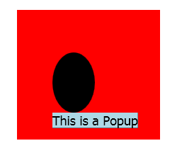
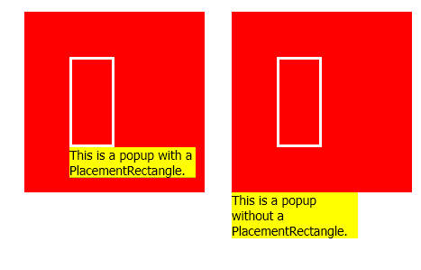
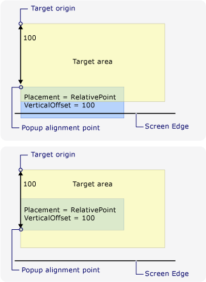
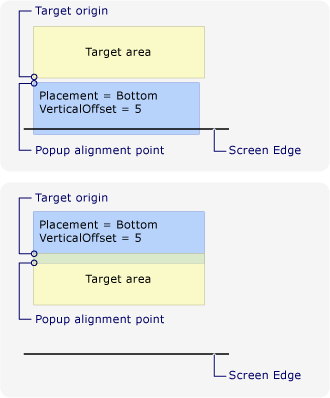
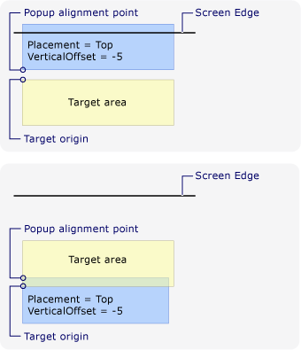
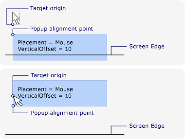

# Popup Placement Behavior
A <xref:System.Windows.Controls.Primitives.Popup> control displays content in a separate window that floats over an application. You can specify the position of a <xref:System.Windows.Controls.Primitives.Popup> relative to a control, the mouse, or the screen by using the <xref:System.Windows.Controls.Primitives.Popup.PlacementTarget%2A>, <xref:System.Windows.Controls.Primitives.Popup.Placement%2A>, <xref:System.Windows.Controls.Primitives.Popup.PlacementRectangle%2A>, <xref:System.Windows.Controls.Primitives.Popup.HorizontalOffset%2A>, and <xref:System.Windows.Controls.Primitives.Popup.VerticalOffset%2A> properties.  These properties work together to give you flexibility in specifying the position of the <xref:System.Windows.Controls.Primitives.Popup>.  
  
> [!NOTE]
>  The <xref:System.Windows.Controls.ToolTip> and <xref:System.Windows.Controls.ContextMenu> classes also define these five properties and behave similarly.  
  

  
   
## Positioning the Popup  
 The placement of a <xref:System.Windows.Controls.Primitives.Popup> can be relative to a <xref:System.Windows.UIElement> or to the entire screen.  The following example creates four <xref:System.Windows.Controls.Primitives.Popup> controls that are relative to a <xref:System.Windows.UIElement>—in this case, an image. All of the <xref:System.Windows.Controls.Primitives.Popup> controls have the <xref:System.Windows.Controls.Primitives.Popup.PlacementTarget%2A> property set to `image1`, but each <xref:System.Windows.Controls.Primitives.Popup> has a different value for the placement property.  
  
 [!code-xaml[PopupPositionSnippet#3](../../../../samples/snippets/csharp/VS_Snippets_Wpf/PopupPositionSnippet/CS/Window1.xaml#3)]  
  
 The following illustration shows the image and the <xref:System.Windows.Controls.Primitives.Popup> controls  
  
   
Image with four Popups  
  
 This simple example demonstrates how to set the <xref:System.Windows.Controls.Primitives.Popup.PlacementTarget%2A> and <xref:System.Windows.Controls.Primitives.Popup.Placement%2A> properties, but by using the <xref:System.Windows.Controls.Primitives.Popup.PlacementRectangle%2A>, <xref:System.Windows.Controls.Primitives.Popup.HorizontalOffset%2A>, and <xref:System.Windows.Controls.Primitives.Popup.VerticalOffset%2A> properties, you have even more control over where the <xref:System.Windows.Controls.Primitives.Popup> is positioned.  
  
   
## Definitions of Terms: The Anatomy of a Popup  
 The following terms are useful in understanding how the <xref:System.Windows.Controls.Primitives.Popup.PlacementTarget%2A>, <xref:System.Windows.Controls.Primitives.Popup.Placement%2A>, <xref:System.Windows.Controls.Primitives.Popup.PlacementRectangle%2A>, <xref:System.Windows.Controls.Primitives.Popup.HorizontalOffset%2A>, and <xref:System.Windows.Controls.Primitives.Popup.VerticalOffset%2A> properties relate to each other and the <xref:System.Windows.Controls.Primitives.Popup>:  
  
-   Target object  
  
-   Target area  
  
-   Target origin  
  
-   Popup alignment point  
  
 These terms provide a convenient way to refer to various aspects of the <xref:System.Windows.Controls.Primitives.Popup> and the control that it is associated with.  
  
### Target Object  
 The *target object* is the element that the <xref:System.Windows.Controls.Primitives.Popup> is associated with. If the <xref:System.Windows.Controls.Primitives.Popup.PlacementTarget%2A> property is set, it specifies the target object.  If <xref:System.Windows.Controls.Primitives.Popup.PlacementTarget%2A> is not set, and the <xref:System.Windows.Controls.Primitives.Popup> has a parent, the parent is the target object.  If there is no <xref:System.Windows.Controls.Primitives.Popup.PlacementTarget%2A> value and no parent, there is no target object, and the <xref:System.Windows.Controls.Primitives.Popup> is positioned relative to the screen.  
  
 The following example creates a <xref:System.Windows.Controls.Primitives.Popup> that is the child of a <xref:System.Windows.Controls.Canvas>.  The example does not set the <xref:System.Windows.Controls.Primitives.Popup.PlacementTarget%2A> property on the <xref:System.Windows.Controls.Primitives.Popup>. The default value for <xref:System.Windows.Controls.Primitives.Popup.Placement%2A> is <xref:System.Windows.Controls.Primitives.PlacementMode.Bottom?displayProperty=nameWithType>, so the <xref:System.Windows.Controls.Primitives.Popup> appears below the <xref:System.Windows.Controls.Canvas>.  
  
 [!code-xaml[PopupPositionSnippet#1](../../../../samples/snippets/csharp/VS_Snippets_Wpf/PopupPositionSnippet/CS/Window1.xaml#1)]  
  
 The following illustration shows that the <xref:System.Windows.Controls.Primitives.Popup> is positioned relative to the <xref:System.Windows.Controls.Canvas>.  
  
   
Popup with no PlacementTarget  
  
 The following example creates a <xref:System.Windows.Controls.Primitives.Popup> that is the child of a <xref:System.Windows.Controls.Canvas>, but this time the <xref:System.Windows.Controls.Primitives.Popup.PlacementTarget%2A> is set to `ellipse1`, so the popup appears below the <xref:System.Windows.Shapes.Ellipse>.  
  
 [!code-xaml[PopupPositionSnippet#2](../../../../samples/snippets/csharp/VS_Snippets_Wpf/PopupPositionSnippet/CS/Window1.xaml#2)]  
  
 The following illustration shows that the <xref:System.Windows.Controls.Primitives.Popup> is positioned relative to the <xref:System.Windows.Shapes.Ellipse>.  
  
   
Popup with PlacementTarget  
  
> [!NOTE]
>  For <xref:System.Windows.Controls.ToolTip>, the default value of <xref:System.Windows.Controls.Primitives.Popup.Placement%2A> is <xref:System.Windows.Controls.Primitives.PlacementMode.Mouse>.  For <xref:System.Windows.Controls.ContextMenu>, the default value of <xref:System.Windows.Controls.Primitives.Popup.Placement%2A> is <xref:System.Windows.Controls.Primitives.PlacementMode.MousePoint>. These values are explained later, in "How the Properties Work Together."  
  
### Target Area  
 The *target area* is the area on the screen that the <xref:System.Windows.Controls.Primitives.Popup> is relative to. In the previous examples, the <xref:System.Windows.Controls.Primitives.Popup> is aligned with the bounds of the target object, but in some cases, the <xref:System.Windows.Controls.Primitives.Popup> is aligned to other bounds, even if the <xref:System.Windows.Controls.Primitives.Popup> has a target object.  If the <xref:System.Windows.Controls.Primitives.Popup.PlacementRectangle%2A> property is set, the target area is different than the bounds of the target object.  
  
 The following example creates two <xref:System.Windows.Controls.Canvas> objects, each one containing a <xref:System.Windows.Shapes.Rectangle> and a <xref:System.Windows.Controls.Primitives.Popup>.  In both cases, the target object for the <xref:System.Windows.Controls.Primitives.Popup> is the <xref:System.Windows.Controls.Canvas>. The <xref:System.Windows.Controls.Primitives.Popup> in the first <xref:System.Windows.Controls.Canvas> has the <xref:System.Windows.Controls.Primitives.Popup.PlacementRectangle%2A> set, with its <xref:System.Windows.Rect.X%2A>, <xref:System.Windows.Rect.Y%2A>, <xref:System.Windows.Rect.Width%2A>, and <xref:System.Windows.Rect.Height%2A> properties set to 50, 50, 50, and 100, respectively. The <xref:System.Windows.Controls.Primitives.Popup> in the second <xref:System.Windows.Controls.Canvas> does not have the <xref:System.Windows.Controls.Primitives.Popup.PlacementRectangle%2A> set.  As a result, the first <xref:System.Windows.Controls.Primitives.Popup> is positioned below the <xref:System.Windows.Controls.Primitives.Popup.PlacementRectangle%2A> and the second <xref:System.Windows.Controls.Primitives.Popup> is positioned below the <xref:System.Windows.Controls.Canvas>. Each <xref:System.Windows.Controls.Canvas> also contains a <xref:System.Windows.Shapes.Rectangle> that has the same bounds as the <xref:System.Windows.Controls.Primitives.Popup.PlacementRectangle%2A> for the first <xref:System.Windows.Controls.Primitives.Popup>.  Note that the <xref:System.Windows.Controls.Primitives.Popup.PlacementRectangle%2A> does not create a visible element in the application; the example creates a <xref:System.Windows.Shapes.Rectangle> to represent the <xref:System.Windows.Controls.Primitives.Popup.PlacementRectangle%2A>.  
  
 [!code-xaml[PopupPositionSnippet#4](../../../../samples/snippets/csharp/VS_Snippets_Wpf/PopupPositionSnippet/CS/Window1.xaml#4)]  
  
 The following illustration shows the result of the preceding example.  
  
   
Popup with and without PlacementRectangle  
  
### Target Origin and Popup Alignment Point  
 The *target origin* and *popup alignment point* are reference points on the target area and popup, respectively, that are used for positioning. You can use the <xref:System.Windows.Controls.Primitives.Popup.HorizontalOffset%2A> and <xref:System.Windows.Controls.Primitives.Popup.VerticalOffset%2A> properties to offset the popup from the target area.  The <xref:System.Windows.Controls.Primitives.Popup.HorizontalOffset%2A> and <xref:System.Windows.Controls.Primitives.Popup.VerticalOffset%2A> are relative to the target origin and the popup alignment point. The value of the <xref:System.Windows.Controls.Primitives.Popup.Placement%2A> property determines where the target origin and popup alignment point are located.  
  
 The following example creates a <xref:System.Windows.Controls.Primitives.Popup> and sets the <xref:System.Windows.Controls.Primitives.Popup.HorizontalOffset%2A> and <xref:System.Windows.Controls.Primitives.Popup.VerticalOffset%2A> properties to 20.  The <xref:System.Windows.Controls.Primitives.Popup.Placement%2A> property is set to <xref:System.Windows.Controls.Primitives.PlacementMode.Bottom> (the default), so the target origin is the bottom-left corner of the target area and the popup alignment point is the top-left corner of the <xref:System.Windows.Controls.Primitives.Popup>.  
  
 [!code-xaml[PopupPositionSnippet#5](../../../../samples/snippets/csharp/VS_Snippets_Wpf/PopupPositionSnippet/CS/Window1.xaml#5)]  
  
 The following illustration shows the result of the preceding example.  
  
   
Popup with HorizontalOffset and VerticalOffset  
  
   
## How the Properties Work Together  
 The values of <xref:System.Windows.Controls.Primitives.Popup.PlacementTarget%2A>, <xref:System.Windows.Controls.Primitives.Popup.PlacementRectangle%2A>, and <xref:System.Windows.Controls.Primitives.Popup.Placement%2A> need to be considered together to figure out the correct target area, target origin, and popup alignment point.  For example, if the value of <xref:System.Windows.Controls.Primitives.Popup.Placement%2A> is <xref:System.Windows.Controls.Primitives.PlacementMode.Mouse>, there is no target object, the <xref:System.Windows.Controls.Primitives.Popup.PlacementRectangle%2A> is ignored, and the target area is the bounds of the mouse pointer. On the other hand, if <xref:System.Windows.Controls.Primitives.Popup.Placement%2A> is <xref:System.Windows.Controls.Primitives.PlacementMode.Bottom>, the <xref:System.Windows.Controls.Primitives.Popup.PlacementTarget%2A> or parent determines the target object and <xref:System.Windows.Controls.Primitives.Popup.PlacementRectangle%2A> determines the target area.  
  
 The following table describes the target object, target area, target origin, and popup alignment point and indicates whether <xref:System.Windows.Controls.Primitives.Popup.PlacementTarget%2A> and <xref:System.Windows.Controls.Primitives.Popup.PlacementRectangle%2A> are used for each <xref:System.Windows.Controls.Primitives.PlacementMode> enumeration value.  
  
|PlacementMode|Target object|Target area|Target origin|Popup alignment point|  
|-------------------|-------------------|-----------------|-------------------|---------------------------|  
|<xref:System.Windows.Controls.Primitives.PlacementMode.Absolute>|Not applicable. <xref:System.Windows.Controls.Primitives.Popup.PlacementTarget%2A> is ignored.|The screen, or <xref:System.Windows.Controls.Primitives.Popup.PlacementRectangle%2A> if it is set.  The <xref:System.Windows.Controls.Primitives.Popup.PlacementRectangle%2A> is relative to the screen.|The top-left corner of the target area.|The top-left corner of the <xref:System.Windows.Controls.Primitives.Popup>.|  
|<xref:System.Windows.Controls.Primitives.PlacementMode.AbsolutePoint>|Not applicable. <xref:System.Windows.Controls.Primitives.Popup.PlacementTarget%2A> is ignored.|The screen, or <xref:System.Windows.Controls.Primitives.Popup.PlacementRectangle%2A> if it is set.  The <xref:System.Windows.Controls.Primitives.Popup.PlacementRectangle%2A> is relative to the screen.|The top-left corner of the target area.|The top-left corner of the <xref:System.Windows.Controls.Primitives.Popup>.|  
|<xref:System.Windows.Controls.Primitives.PlacementMode.Bottom>|<xref:System.Windows.Controls.Primitives.Popup.PlacementTarget%2A> or parent.|The target object, or <xref:System.Windows.Controls.Primitives.Popup.PlacementRectangle%2A> if it is set.  The <xref:System.Windows.Controls.Primitives.Popup.PlacementRectangle%2A> is relative to the target object.|The bottom-left corner of the target area.|The top-left corner of the <xref:System.Windows.Controls.Primitives.Popup>.|  
|<xref:System.Windows.Controls.Primitives.PlacementMode.Center>|<xref:System.Windows.Controls.Primitives.Popup.PlacementTarget%2A> or parent.|The target object, or <xref:System.Windows.Controls.Primitives.Popup.PlacementRectangle%2A> if it is set.  The <xref:System.Windows.Controls.Primitives.Popup.PlacementRectangle%2A> is relative to the target object.|The center of the target area.|The center of the <xref:System.Windows.Controls.Primitives.Popup>.|  
|<xref:System.Windows.Controls.Primitives.PlacementMode.Custom>|<xref:System.Windows.Controls.Primitives.Popup.PlacementTarget%2A> or parent.|The target object, or <xref:System.Windows.Controls.Primitives.Popup.PlacementRectangle%2A> if it is set.  The <xref:System.Windows.Controls.Primitives.Popup.PlacementRectangle%2A> is relative to the target object.|Defined by the <xref:System.Windows.Controls.Primitives.CustomPopupPlacementCallback>.|Defined by the <xref:System.Windows.Controls.Primitives.CustomPopupPlacementCallback>.|  
|<xref:System.Windows.Controls.Primitives.PlacementMode.Left>|<xref:System.Windows.Controls.Primitives.Popup.PlacementTarget%2A> or parent.|The target object, or <xref:System.Windows.Controls.Primitives.Popup.PlacementRectangle%2A> if it is set.  The <xref:System.Windows.Controls.Primitives.Popup.PlacementRectangle%2A> is relative to the target object.|The top-left corner of the target area.|The top-right corner of the <xref:System.Windows.Controls.Primitives.Popup>.|  
|<xref:System.Windows.Controls.Primitives.PlacementMode.Mouse>|Not applicable. <xref:System.Windows.Controls.Primitives.Popup.PlacementTarget%2A> is ignored.|The bounds of the mouse pointer. <xref:System.Windows.Controls.Primitives.Popup.PlacementRectangle%2A> is ignored.|The bottom-left corner of the target area.|The top-left corner of the <xref:System.Windows.Controls.Primitives.Popup>.|  
|<xref:System.Windows.Controls.Primitives.PlacementMode.MousePoint>|Not applicable. <xref:System.Windows.Controls.Primitives.Popup.PlacementTarget%2A> is ignored.|The bounds of the mouse pointer. <xref:System.Windows.Controls.Primitives.Popup.PlacementRectangle%2A> is ignored.|The top-left corner of the target area.|The top-left corner of the <xref:System.Windows.Controls.Primitives.Popup>.|  
|<xref:System.Windows.Controls.Primitives.PlacementMode.Relative>|<xref:System.Windows.Controls.Primitives.Popup.PlacementTarget%2A> or parent.|The target object, or <xref:System.Windows.Controls.Primitives.Popup.PlacementRectangle%2A> if it is set.  The <xref:System.Windows.Controls.Primitives.Popup.PlacementRectangle%2A> is relative to the target object.|The top-left corner of the target area.|The top-left corner of the <xref:System.Windows.Controls.Primitives.Popup>.|  
|<xref:System.Windows.Controls.Primitives.PlacementMode.RelativePoint>|<xref:System.Windows.Controls.Primitives.Popup.PlacementTarget%2A> or parent.|The target object, or <xref:System.Windows.Controls.Primitives.Popup.PlacementRectangle%2A> if it is set.  The <xref:System.Windows.Controls.Primitives.Popup.PlacementRectangle%2A> is relative to the target object.|The top-left corner of the target area.|The top-left corner of the <xref:System.Windows.Controls.Primitives.Popup>.|  
|<xref:System.Windows.Controls.Primitives.PlacementMode.Right>|<xref:System.Windows.Controls.Primitives.Popup.PlacementTarget%2A> or parent.|The target object, or <xref:System.Windows.Controls.Primitives.Popup.PlacementRectangle%2A> if it is set.  The <xref:System.Windows.Controls.Primitives.Popup.PlacementRectangle%2A> is relative to the target object.|The top-right corner of the target area.|The top-left corner of the <xref:System.Windows.Controls.Primitives.Popup>.|  
|<xref:System.Windows.Controls.Primitives.PlacementMode.Top>|<xref:System.Windows.Controls.Primitives.Popup.PlacementTarget%2A> or parent.|The target object, or <xref:System.Windows.Controls.Primitives.Popup.PlacementRectangle%2A> if it is set.  The <xref:System.Windows.Controls.Primitives.Popup.PlacementRectangle%2A> is relative to the target object.|The top-left corner of the target area.|The bottom-left corner of the <xref:System.Windows.Controls.Primitives.Popup>.|  
  
 The following illustrations show the <xref:System.Windows.Controls.Primitives.Popup>, target area, target origin, and popup alignment point for each <xref:System.Windows.Controls.Primitives.PlacementMode> value. In each figure, the target area is yellow, and the <xref:System.Windows.Controls.Primitives.Popup> is blue.  
  
   
Placement is Absolute or AbsolutePoint  
  
   
Placement is Bottom  
  
   
Placement is Center  
  
   
Placement is Left  
  
   
Placement is Mouse  
  
   
Placement is MousePoint  
  
   
Placement is Relative or RelativePoint  
  
   
Placement is Right  
  
   
Placement is Top  
  
   
## When the Popup Encounters the Edge of the Screen  
 For security reasons, a <xref:System.Windows.Controls.Primitives.Popup> cannot be hidden by the edge of a screen. One of the following three things happens when the <xref:System.Windows.Controls.Primitives.Popup> encounters a screen edge:  
  
-   The popup realigns itself along the screen edge that would obscure the <xref:System.Windows.Controls.Primitives.Popup>.  
  
-   The popup uses a different popup alignment point.  
  
-   The popup uses a different target origin and popup alignment point.  
  
 These options are described further later in this section.  
  
 The behavior of the <xref:System.Windows.Controls.Primitives.Popup> when it encounters a screen edge depends on the value of the <xref:System.Windows.Controls.Primitives.Popup.Placement%2A> property and which screen edge the popup encounters. The following table summarizes the behavior when the <xref:System.Windows.Controls.Primitives.Popup> encounters a screen edge for each <xref:System.Windows.Controls.Primitives.PlacementMode> value.  
  
|PlacementMode|Top edge|Bottom edge|Left edge|Right edge|  
|-------------------|--------------|-----------------|---------------|----------------|  
|<xref:System.Windows.Controls.Primitives.PlacementMode.Absolute>|Aligns to the top edge.|Aligns to the bottom edge.|Aligns to the left edge.|Aligns to the right edge.|  
|<xref:System.Windows.Controls.Primitives.PlacementMode.AbsolutePoint>|Aligns to the top edge.|The popup alignment point changes to the bottom-left corner of the <xref:System.Windows.Controls.Primitives.Popup>.|Aligns to the left edge.|The popup alignment point changes to the top-right corner of the <xref:System.Windows.Controls.Primitives.Popup>.|  
|<xref:System.Windows.Controls.Primitives.PlacementMode.Bottom>|Aligns to the top edge.|The target origin changes to the top-left corner of the target area and the popup alignment point changes to the bottom-left corner of the <xref:System.Windows.Controls.Primitives.Popup>.|Aligns to the left edge.|Aligns to the right edge.|  
|<xref:System.Windows.Controls.Primitives.PlacementMode.Center>|Aligns to the top edge.|Aligns to the bottom edge.|Aligns to the left edge.|Aligns to the right edge.|  
|<xref:System.Windows.Controls.Primitives.PlacementMode.Left>|Aligns to the top edge.|Aligns to the bottom edge.|The target origin changes to the top-right corner of the target area and the popup alignment point changes to the top-left corner of the <xref:System.Windows.Controls.Primitives.Popup>.|Aligns to the right edge.|  
|<xref:System.Windows.Controls.Primitives.PlacementMode.Mouse>|Aligns to the top edge.|The target origin changes to the top-left corner of the target area (the bounds of the mouse pointer) and the popup alignment point changes to the bottom-left corner of the <xref:System.Windows.Controls.Primitives.Popup>.|Aligns to the left edge.|Aligns to the right edge.|  
|<xref:System.Windows.Controls.Primitives.PlacementMode.MousePoint>|Aligns to the top edge.|The popup alignment point changes to the bottom-left corner of the <xref:System.Windows.Controls.Primitives.Popup>.|Aligns to the left edge.|The popup alignment point changes to the top-right corner of the popup.|  
|<xref:System.Windows.Controls.Primitives.PlacementMode.Relative>|Aligns to the top edge.|Aligns to the bottom edge.|Aligns to the left edge.|Aligns to the right edge.|  
|<xref:System.Windows.Controls.Primitives.PlacementMode.RelativePoint>|Aligns to the top edge.|The popup alignment point changes to the bottom-left corner of the <xref:System.Windows.Controls.Primitives.Popup>.|Aligns to the left edge.|The popup alignment point changes to the top-right corner of the popup.|  
|<xref:System.Windows.Controls.Primitives.PlacementMode.Right>|Aligns to the top edge.|Aligns to the bottom edge.|Aligns to the left edge.|The target origin changes to the top-left corner of the target area and the popup alignment point changes to the top-right corner of the <xref:System.Windows.Controls.Primitives.Popup>.|  
|<xref:System.Windows.Controls.Primitives.PlacementMode.Top>|The target origin changes to the bottom-left corner of the target area and the popup alignment point changes to the top-left corner of the <xref:System.Windows.Controls.Primitives.Popup>. In effect, this is the same as when <xref:System.Windows.Controls.Primitives.Popup.Placement%2A> is <xref:System.Windows.Controls.Primitives.PlacementMode.Bottom>.|Aligns to the bottom edge.|Aligns to the left edge.|Aligns to the right edge.|  
  
### Aligning to the Screen Edge  
 A <xref:System.Windows.Controls.Primitives.Popup> can align to the edge of the screen by repositioning itself so the entire <xref:System.Windows.Controls.Primitives.Popup> is visible on the screen.  When this occurs, the distance between the target origin and popup alignment point might differ from the values of <xref:System.Windows.Controls.Primitives.Popup.HorizontalOffset%2A> and <xref:System.Windows.Controls.Primitives.Popup.VerticalOffset%2A>. When <xref:System.Windows.Controls.Primitives.Popup.Placement%2A> is <xref:System.Windows.Controls.Primitives.PlacementMode.Absolute>, <xref:System.Windows.Controls.Primitives.PlacementMode.Center>, or <xref:System.Windows.Controls.Primitives.PlacementMode.Relative>, the <xref:System.Windows.Controls.Primitives.Popup> aligns itself to every screen edge.  For example, assume that a <xref:System.Windows.Controls.Primitives.Popup> has <xref:System.Windows.Controls.Primitives.Popup.Placement%2A> set to <xref:System.Windows.Controls.Primitives.PlacementMode.Relative> and <xref:System.Windows.Controls.Primitives.Popup.VerticalOffset%2A> set to 100.  If the bottom edge of the screen hides all or part of the <xref:System.Windows.Controls.Primitives.Popup>, the <xref:System.Windows.Controls.Primitives.Popup> repositions itself along the bottom edge of the screen and the vertical distance between the target origin and popup alignment point is less than 100. The following illustration demonstrates this.  
  
   
Popup aligns to the edge of the screen  
  
### Changing the Popup Alignment Point  
 If <xref:System.Windows.Controls.Primitives.Popup.Placement%2A> is <xref:System.Windows.Controls.Primitives.PlacementMode.AbsolutePoint>, <xref:System.Windows.Controls.Primitives.PlacementMode.RelativePoint>, or <xref:System.Windows.Controls.Primitives.PlacementMode.MousePoint>, the popup alignment point changes when the popup encounters the bottom or right screen edge.  
  
 The following illustration demonstrates that when the bottom screen edge hides all or part of the <xref:System.Windows.Controls.Primitives.Popup>, the popup alignment point is the bottom-left corner of the <xref:System.Windows.Controls.Primitives.Popup>.  
  
   
Popup encounters bottom edge of the screen and changes the popup alignment point  
  
 The following illustration demonstrates that when the <xref:System.Windows.Controls.Primitives.Popup> is hidden by the right screen edge, the popup alignment point is the top-right corner of the <xref:System.Windows.Controls.Primitives.Popup>.  
  
   
Popup encounters right edge of the screen and changes the popup alignment point  
  
 If the <xref:System.Windows.Controls.Primitives.Popup> encounters the bottom and right screen edges, the popup alignment point is the bottom-right corner of the <xref:System.Windows.Controls.Primitives.Popup>.  
  
### Changing the Target Origin and Popup Alignment Point  
 When <xref:System.Windows.Controls.Primitives.Popup.Placement%2A> is <xref:System.Windows.Controls.Primitives.PlacementMode.Bottom>, <xref:System.Windows.Controls.Primitives.PlacementMode.Left>, <xref:System.Windows.Controls.Primitives.PlacementMode.Mouse>, <xref:System.Windows.Controls.Primitives.PlacementMode.Right>, or <xref:System.Windows.Controls.Primitives.PlacementMode.Top>, the target origin and popup alignment point change if a certain screen edge is encountered.  The screen edge that causes the position to change depends on the <xref:System.Windows.Controls.Primitives.PlacementMode> value.  
  
 The following illustration demonstrates that when <xref:System.Windows.Controls.Primitives.Popup.Placement%2A> is <xref:System.Windows.Controls.Primitives.PlacementMode.Bottom> and the <xref:System.Windows.Controls.Primitives.Popup> encounters the bottom screen edge, the target origin is the top-left corner of the target area and the popup alignment point is the bottom-left corner of the <xref:System.Windows.Controls.Primitives.Popup>.  
  
   
Placement is Bottom and the popup encounters the bottom edge of the screen  
  
 The following illustration demonstrates that when <xref:System.Windows.Controls.Primitives.Popup.Placement%2A> is <xref:System.Windows.Controls.Primitives.PlacementMode.Left> and the <xref:System.Windows.Controls.Primitives.Popup> encounters the left screen edge, the target origin is the top-right corner of the target area and the popup alignment point is the top-left corner of the <xref:System.Windows.Controls.Primitives.Popup>.  
  
   
Placement is Left and the popup encounters the left edge of the screen  
  
 The following illustration demonstrates that when <xref:System.Windows.Controls.Primitives.Popup.Placement%2A> is <xref:System.Windows.Controls.Primitives.PlacementMode.Right> and the <xref:System.Windows.Controls.Primitives.Popup> encounters the right screen edge, the target origin is the top-left corner of the target area and the popup alignment point is the top-right corner of the <xref:System.Windows.Controls.Primitives.Popup>.  
  
   
Placement is Right and the popup encounters the right edge of the screen  
  
 The following illustration demonstrates that when <xref:System.Windows.Controls.Primitives.Popup.Placement%2A> is <xref:System.Windows.Controls.Primitives.PlacementMode.Top> and the <xref:System.Windows.Controls.Primitives.Popup> encounters the top screen edge, the target origin is the bottom-left corner of the target area and the popup alignment point is the top-left corner of the <xref:System.Windows.Controls.Primitives.Popup>.  
  
   
Placement is Top and the popup encounters the top edge of the screen  
  
 The following illustration demonstrates that when <xref:System.Windows.Controls.Primitives.Popup.Placement%2A> is <xref:System.Windows.Controls.Primitives.PlacementMode.Mouse> and the <xref:System.Windows.Controls.Primitives.Popup> encounters the bottom screen edge, the target origin is the top-left corner of the target area (the bounds of the mouse pointer) and the popup alignment point is the bottom-left corner of the <xref:System.Windows.Controls.Primitives.Popup>.  
  
   
Placement is Mouse and the popup encounters the bottom edge of the screen  
  
### Customizing Popup Placement  
 You can customize the target origin and popup alignment point by setting the <xref:System.Windows.Controls.Primitives.Popup.Placement%2A> property to <xref:System.Windows.Controls.Primitives.PlacementMode.Custom>. Then define a <xref:System.Windows.Controls.Primitives.CustomPopupPlacementCallback> delegate that returns a set of possible placement points and primary axes (in order of preference) for the <xref:System.Windows.Controls.Primitives.Popup>. The point that shows the largest portion of the <xref:System.Windows.Controls.Primitives.Popup> is selected.  The position of the <xref:System.Windows.Controls.Primitives.Popup> is automatically adjusted if the <xref:System.Windows.Controls.Primitives.Popup> is hidden by the edge of the screen. For an example, see [Specify a Custom Popup Position](../../../../docs/framework/wpf/controls/how-to-specify-a-custom-popup-position.md).  
  
## See Also  
 [Popup Placement Sample](http://go.microsoft.com/fwlink/?LinkID=160032)
