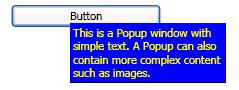

# Popup
The <xref:System.Windows.Controls.Primitives.Popup> control displays content in a separate window that floats over the current application window.  
  
 The following illustration shows a <xref:System.Windows.Controls.Primitives.Popup> control that is positioned with respect to a <xref:System.Windows.Controls.Button> that is its parent:  
  
   
  
## In This Section  
 [Popup Overview](popup-overview.md)  
 [Popup Placement Behavior](popup-placement-behavior.md)  
 [How-to Topics](popup-how-to-topics.md)  
  
## Reference  
 <xref:System.Windows.Controls.Primitives.Popup>  
  
## Related Sections
