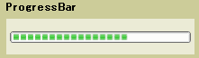

# ProgressBar
A <xref:System.Windows.Controls.ProgressBar> indicates the progress of an operation. The <xref:System.Windows.Controls.ProgressBar> control consists of a window that is filled with the system highlight color as an operation progresses.  
  
 The following illustration shows a typical <xref:System.Windows.Controls.ProgressBar>.  
  
   
  
## In This Section  
  
## Reference  
 <xref:System.Windows.Controls.ProgressBar>  
  <xref:System.Windows.Controls.Primitives.StatusBar>  
  
## Related Sections
