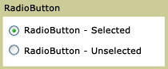

# RadioButton
<xref:System.Windows.Controls.RadioButton> controls are usually grouped together to offer users a single choice among several options; only one button at a time can be selected.  
  
 The following illustration shows an example of a <xref:System.Windows.Controls.RadioButton> control.  
  
   
Typical RadioButton  
  
## Reference  
 <xref:System.Windows.Controls.Primitives.ToggleButton>  
  
## Related Sections
