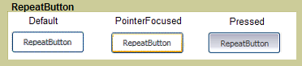

# RepeatButton
The <xref:System.Windows.Controls.Primitives.RepeatButton> is similar to a <xref:System.Windows.Controls.Button>. However, <xref:System.Windows.Controls.Primitives.RepeatButton> elements give you control over when and how the <xref:System.Windows.Controls.Primitives.ButtonBase.Click> event occurs.  
  
 The following graphic shows an example of the three states of a repeat button control, Default, PointerFocused, and Pressed. The first button shows the default state of the <xref:System.Windows.Controls.Primitives.RepeatButton>. The second shows how the appearance of the button changes when the mouse pointer hovers over the button, giving it focus. The last button shows the appearance of the <xref:System.Windows.Controls.Primitives.RepeatButton> when the user presses the mouse button over the control.  
  
   
Typical RepeatButton  
  
## In This Section  
  
## Reference  
 <xref:System.Windows.Controls.Primitives.RepeatButton>  
  
## Related Sections
