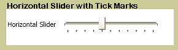

# Slider
The <xref:System.Windows.Controls.Slider> allows you select from a range of values by moving a <xref:System.Windows.Controls.Primitives.Thumb> along a <xref:System.Windows.Controls.Primitives.Track>.  
  
 The following illustration shows an example of a horizontal <xref:System.Windows.Controls.Slider> control.  
  
   
  
## In This Section  
 [Customize the Ticks on a Slider](../../../../docs/framework/wpf/controls/how-to-customize-the-ticks-on-a-slider.md)  
  
## Reference  
 <xref:System.Windows.Controls.Slider>  
  <xref:System.Windows.Controls.Primitives.Track>  
  <xref:System.Windows.Controls.Primitives.Thumb>
