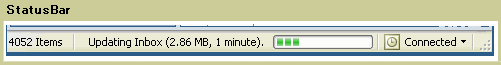

# StatusBar
A <xref:System.Windows.Controls.Primitives.StatusBar> is a horizontal area at the bottom of a window where an application can display status information.  
  
 The following illustration shows an example of a <xref:System.Windows.Controls.Primitives.StatusBar>.  
  
   
  
## In This Section  
  
## Reference  
 <xref:System.Windows.Controls.Primitives.StatusBar>  
  <xref:System.Windows.Controls.Primitives.StatusBarItem>  
  
## Related Sections
