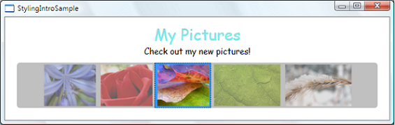
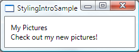
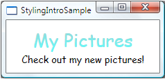
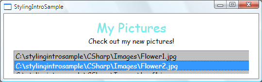
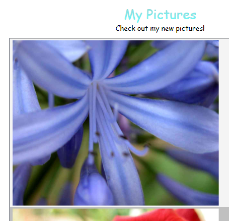
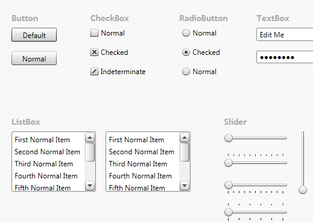

# Styling and Templating
[!INCLUDE[TLA#tla_winclient](../../../../includes/tlasharptla-winclient-md.md)] styling and templating refer to a suite of features (styles, templates, triggers, and storyboards) that allow developers and designers to create visually compelling effects and to create a consistent appearance for their product. Although developers and or designers can customize the appearance extensively on an application-by-application basis, a strong styling and templating model is necessary to allow maintenance and sharing of the appearance within and among applications. [!INCLUDE[TLA#tla_winclient](../../../../includes/tlasharptla-winclient-md.md)] provides that model.  
  
 Another feature of the [!INCLUDE[TLA2#tla_winclient](../../../../includes/tla2sharptla-winclient-md.md)] styling model is the separation of presentation and logic. This means that designers can work on the appearance of an application by using only [!INCLUDE[TLA2#tla_xaml](../../../../includes/tla2sharptla-xaml-md.md)] at the same time that developers work on the programming logic by using C# or Visual Basic.  
  
 This overview focuses on the styling and templating aspects of the application and does not discuss any data binding concepts. For information about data binding, see [Data Binding Overview](../../../../docs/framework/wpf/data/data-binding-overview.md).  
  
 In addition, it is important to understand resources, which are what enable styles and templates to be reused. For more information about resources, see [XAML Resources](../../../../docs/framework/wpf/advanced/xaml-resources.md).  
  
 
  
   
## Styling and Templating Sample  
 The code examples used in this overview are based on a simple photo sample shown in the following illustration:  
  
   
  
 This simple photo sample uses styling and templating to create a visually compelling user experience. The sample has two <xref:System.Windows.Controls.TextBlock> elements and a <xref:System.Windows.Controls.ListBox> control that is bound to a list of images. For the complete sample, see [Introduction to Styling and Templating Sample](http://go.microsoft.com/fwlink/?LinkID=160010).  
  
   
## Style Basics  
 You can think of a <xref:System.Windows.Style> as a convenient way to apply a set of property values to more than one element. For example, consider the following <xref:System.Windows.Controls.TextBlock> elements and their default appearance:  
  
 [!code-xaml[StylingIntroSample_snippet#TextBlocks](../../../../samples/snippets/csharp/VS_Snippets_Wpf/StylingIntroSample_snippet/CSharp/Window1.xaml#textblocks)]  
  
   
  
 You can change the default appearance by setting properties, such as <xref:System.Windows.Controls.Control.FontSize%2A> and <xref:System.Windows.Controls.Control.FontFamily%2A>, on each <xref:System.Windows.Controls.TextBlock> element directly. However, if you want your <xref:System.Windows.Controls.TextBlock> elements to share some properties, you can create a <xref:System.Windows.Style> in the `Resources` section of your [!INCLUDE[TLA2#tla_xaml](../../../../includes/tla2sharptla-xaml-md.md)] file, as shown here:  
  
 [!code-xaml[StylingIntroSnippet#Resources](../../../../samples/snippets/csharp/VS_Snippets_Wpf/StylingIntroSnippet/CS/window1.xaml#resources)]  
[!code-xaml[StylingIntroSnippet#tb1](../../../../samples/snippets/csharp/VS_Snippets_Wpf/StylingIntroSnippet/CS/window1.xaml#tb1)]  
[!code-xaml[StylingIntroSnippet#Resources2](../../../../samples/snippets/csharp/VS_Snippets_Wpf/StylingIntroSnippet/CS/window1.xaml#resources2)]  
  
 When you set the <xref:System.Windows.Style.TargetType%2A> of your style to the <xref:System.Windows.Controls.TextBlock> type, the style is applied to all the <xref:System.Windows.Controls.TextBlock> elements in the window.  
  
 Now the <xref:System.Windows.Controls.TextBlock> elements appear as follows:  
  
   
  
### Extending Styles  
 Perhaps you want your two <xref:System.Windows.Controls.TextBlock> elements to share some property values, such as the <xref:System.Windows.Controls.Control.FontFamily%2A> and the centered <xref:System.Windows.FrameworkElement.HorizontalAlignment%2A>, but you also want the text "My Pictures" to have some additional properties. You can do that by creating a new style that is based on the first style, as shown here:  
  
 [!code-xaml[StylingIntroSnippet#Resources](../../../../samples/snippets/csharp/VS_Snippets_Wpf/StylingIntroSnippet/CS/window1.xaml#resources)]  
[!code-xaml[StylingIntroSnippet#tb2](../../../../samples/snippets/csharp/VS_Snippets_Wpf/StylingIntroSnippet/CS/window1.xaml#tb2)]  
[!code-xaml[StylingIntroSnippet#Resources2](../../../../samples/snippets/csharp/VS_Snippets_Wpf/StylingIntroSnippet/CS/window1.xaml#resources2)]  
  
 Notice that the previous style is given an `x:Key`. To apply the style, you set the <xref:System.Windows.FrameworkElement.Style%2A> property on your <xref:System.Windows.Controls.TextBlock> to the `x:Key` value, as shown here:  
  
 [!code-xaml[StylingIntroSnippet#UIText](../../../../samples/snippets/csharp/VS_Snippets_Wpf/StylingIntroSnippet/CS/window1.xaml#uitext)]  
  
 This <xref:System.Windows.Controls.TextBlock> style now has a <xref:System.Windows.FrameworkElement.HorizontalAlignment%2A> value of <xref:System.Windows.HorizontalAlignment.Center>, a <xref:System.Windows.Controls.TextBlock.FontFamily%2A> value of `Comic Sans MS`, a <xref:System.Windows.Controls.TextBlock.FontSize%2A> value of 26, and a <xref:System.Windows.Controls.TextBlock.Foreground%2A> value set to the <xref:System.Windows.Media.LinearGradientBrush> shown in the example. Notice that it overrides the <xref:System.Windows.Controls.Control.FontSize%2A> value of the base style. If there is more than one <xref:System.Windows.Setter> setting the same property in a <xref:System.Windows.Style>, the <xref:System.Windows.Setter> that is declared last takes precedence.  
  
 The following shows what the <xref:System.Windows.Controls.TextBlock> elements now look like:  
  
   
  
 This `TitleText` style extends the style that has been created for the <xref:System.Windows.Controls.TextBlock> type. You can also extend a style that has an `x:Key` by using the `x:Key` value. For an example, see the example provided for the <xref:System.Windows.Style.BasedOn%2A> property.  
  
### Relationship of the TargetType Property and the x:Key Attribute  
 As shown in the first example, setting the <xref:System.Windows.Style.TargetType%2A> property to `TextBlock` without assigning the style an `x:Key` causes the style to be applied to all <xref:System.Windows.Controls.TextBlock> elements. In this case, the `x:Key` is implicitly set to `{x:Type TextBlock}`. This means that if you explicitly set the `x:Key` value to anything other than `{x:Type TextBlock}`, the <xref:System.Windows.Style> is not applied to all <xref:System.Windows.Controls.TextBlock> elements automatically. Instead, you must apply the style (by using the `x:Key` value) to the <xref:System.Windows.Controls.TextBlock> elements explicitly. If your style is in the resources section and you do not set the <xref:System.Windows.Style.TargetType%2A> property on your style, then you must provide an `x:Key`.  
  
 In addition to providing a default value for the `x:Key`, the <xref:System.Windows.Style.TargetType%2A> property specifies the type to which setter properties apply. If you do not specify a <xref:System.Windows.Style.TargetType%2A>, you must qualify the properties in your <xref:System.Windows.Setter> objects with a class name by using the syntax `Property="ClassName.Property"`. For example, instead of setting `Property="FontSize"`, you must set <xref:System.Windows.Setter.Property%2A> to `"TextBlock.FontSize"` or `"Control.FontSize"`.  
  
 Also note that many [!INCLUDE[TLA2#tla_winclient](../../../../includes/tla2sharptla-winclient-md.md)] controls consist of a combination of other [!INCLUDE[TLA2#tla_winclient](../../../../includes/tla2sharptla-winclient-md.md)] controls. If you create a style that applies to all controls of a type, you might get unexpected results. For example, if you create a style that targets the <xref:System.Windows.Controls.TextBlock> type in a <xref:System.Windows.Window>, the style is applied to all <xref:System.Windows.Controls.TextBlock> controls in the window, even if the <xref:System.Windows.Controls.TextBlock> is part of another control, such as a <xref:System.Windows.Controls.ListBox>.  
  
### Styles and Resources  
 You can use a style on any element that derives from <xref:System.Windows.FrameworkElement> or <xref:System.Windows.FrameworkContentElement>. The most common way to declare a style is as a resource in the `Resources` section in a [!INCLUDE[TLA2#tla_xaml](../../../../includes/tla2sharptla-xaml-md.md)] file, as shown in the previous examples. Because styles are resources, they obey the same scoping rules that apply to all resources; where you declare a style affects where the style can be applied. For example, if you declare the style in the root element of your application definition [!INCLUDE[TLA2#tla_xaml](../../../../includes/tla2sharptla-xaml-md.md)] file, the style can be used anywhere in your application. If you create a navigation application and declare the style in one of the application's [!INCLUDE[TLA2#tla_xaml](../../../../includes/tla2sharptla-xaml-md.md)] files, the style can be used only in that [!INCLUDE[TLA2#tla_xaml](../../../../includes/tla2sharptla-xaml-md.md)] file. For more information about scoping rules for resources, see [XAML Resources](../../../../docs/framework/wpf/advanced/xaml-resources.md).  
  
 In addition, you can find more information about styles and resources in [Shared Resources and Themes](#styling_themes) later in this overview.  
  
### Setting Styles Programmatically  
 To assign a named style to an element programmatically, get the style from the resources collection and assign it to the element's <xref:System.Windows.FrameworkElement.Style%2A> property. Note that the items in a resources collection are of type <xref:System.Object>. Therefore, you must cast the retrieved style to a <xref:System.Windows.Style> before assigning it to the <xref:System.Windows.FrameworkElement.Style%2A> property. For example, to set the defined `TitleText` style on a <xref:System.Windows.Controls.TextBlock> named `textblock1`, do the following:  
  
 [!code-csharp[StylingIntroSample_snippet#Code](../../../../samples/snippets/csharp/VS_Snippets_Wpf/StylingIntroSample_snippet/CSharp/Window1.xaml.cs#code)]
 [!code-vb[StylingIntroSample_snippet#Code](../../../../samples/snippets/visualbasic/VS_Snippets_Wpf/StylingIntroSample_snippet/visualbasic/window1.xaml.vb#code)]  
  
 Note that once a style has been applied, it is sealed and cannot be changed. If you want to dynamically change a style that has already been applied, you must create a new style to replace the existing one. For more information, see the <xref:System.Windows.Style.IsSealed%2A> property.  
  
 You can create an object that chooses a style to apply based on custom logic. For an example, see the example provided for the <xref:System.Windows.Controls.StyleSelector> class.  
  
   
### Bindings, Dynamic Resources, and Event Handlers  
 Note that you can use the `Setter.Value` property to specify a [Binding Markup Extension](../../../../docs/framework/wpf/advanced/binding-markup-extension.md) or a [DynamicResource Markup Extension](../../../../docs/framework/wpf/advanced/dynamicresource-markup-extension.md). For more information, see the examples provided for the <xref:System.Windows.Setter.Value%2A?displayProperty=nameWithType> property.  
  
 So far, this overview only discusses the use of setters to set property value. You can also specify event handlers in a style. For more information, see <xref:System.Windows.EventSetter>.  
  
   
## Data Templates  
 In this sample application, there is a <xref:System.Windows.Controls.ListBox> control that is bound to a list of photos:  
  
 [!code-xaml[StylingIntroSnippet#UIListBox](../../../../samples/snippets/csharp/VS_Snippets_Wpf/StylingIntroSnippet/CS/window1.xaml#uilistbox)]  
  
 This <xref:System.Windows.Controls.ListBox> currently looks like the following:  
  
   
  
 Most controls have some type of content, and that content often comes from data that you are binding to. In this sample, the data is the list of photos. In [!INCLUDE[TLA2#tla_winclient](../../../../includes/tla2sharptla-winclient-md.md)], you use a <xref:System.Windows.DataTemplate> to define the visual representation of data. Basically, what you put into a <xref:System.Windows.DataTemplate> determines what the data looks like in the rendered application.  
  
 In our sample application, each custom `Photo` object has a `Source` property of type string that specifies the file path of the image. Currently, the photo objects appear as file paths.  
  
 For the photos to appear as images, you create a <xref:System.Windows.DataTemplate> as a resource:  
  
 [!code-xaml[StylingIntroSnippet#Resources](../../../../samples/snippets/csharp/VS_Snippets_Wpf/StylingIntroSnippet/CS/window1.xaml#resources)]  
[!code-xaml[StylingIntroSnippet#DataTemplate](../../../../samples/snippets/csharp/VS_Snippets_Wpf/StylingIntroSnippet/CS/window1.xaml#datatemplate)]  
[!code-xaml[StylingIntroSnippet#Resources2](../../../../samples/snippets/csharp/VS_Snippets_Wpf/StylingIntroSnippet/CS/window1.xaml#resources2)]  
  
 Notice that the <xref:System.Windows.DataTemplate.DataType%2A> property is very similar to the <xref:System.Windows.Style.TargetType%2A> property of the <xref:System.Windows.Style>. If your <xref:System.Windows.DataTemplate> is in the resources section, when you specify the <xref:System.Windows.DataTemplate.DataType%2A> property to a type and not assign it an `x:Key`, the <xref:System.Windows.DataTemplate> is applied whenever that type appears. You always have the option to assign the <xref:System.Windows.DataTemplate> with an `x:Key` and then set it as a `StaticResource` for properties that take <xref:System.Windows.DataTemplate> types, such as the <xref:System.Windows.Controls.ItemsControl.ItemTemplate%2A> property or the <xref:System.Windows.Controls.ContentControl.ContentTemplate%2A> property.  
  
 Essentially, the <xref:System.Windows.DataTemplate> in the above example defines that whenever there is a `Photo` object, it should appear as an <xref:System.Windows.Controls.Image> within a <xref:System.Windows.Controls.Border>. With this <xref:System.Windows.DataTemplate>, our application now looks like this:  
  
   
  
 The data templating model provides other features. For example, if you are displaying collection data that contains other collections using a <xref:System.Windows.Controls.HeaderedItemsControl> type such as a <xref:System.Windows.Controls.Menu> or a <xref:System.Windows.Controls.TreeView>, there is the <xref:System.Windows.HierarchicalDataTemplate>. Another data templating feature is the <xref:System.Windows.Controls.DataTemplateSelector>, which allows you to choose a <xref:System.Windows.DataTemplate> to use based on custom logic. For more information, see [Data Templating Overview](../../../../docs/framework/wpf/data/data-templating-overview.md), which provides a more in-depth discussion of the different data templating features.  
  
   
## Control Templates  
 In [!INCLUDE[TLA2#tla_winclient](../../../../includes/tla2sharptla-winclient-md.md)], the <xref:System.Windows.Controls.ControlTemplate> of a control defines the appearance of the control. You can change the structure and appearance of a control by defining a new <xref:System.Windows.Controls.ControlTemplate> for the control. In many cases, this gives you enough flexibility so that you do not have to write your own custom controls. For more information, see [Customizing the Appearance of an Existing Control by Creating a ControlTemplate](../../../../docs/framework/wpf/controls/customizing-the-appearance-of-an-existing-control.md).  
  
   
## Triggers  
 A trigger sets properties or starts actions, such as an animation, when a property value changes or when an event is raised. <xref:System.Windows.Style>, <xref:System.Windows.Controls.ControlTemplate>, and <xref:System.Windows.DataTemplate> all have a `Triggers` property that can contain a set of triggers. There are various types of triggers.  
  
### Property Triggers  
 A <xref:System.Windows.Trigger> that sets property values or starts actions based on the value of a property is called a property trigger.  
  
 To demonstrate how to use property triggers, you can make each <xref:System.Windows.Controls.ListBoxItem> partially transparent unless it is selected. The following style sets the <xref:System.Windows.UIElement.Opacity%2A> value of a <xref:System.Windows.Controls.ListBoxItem> to `0.5`. When the <xref:System.Windows.Controls.ListBoxItem.IsSelected%2A> property is `true`, however, the <xref:System.Windows.UIElement.Opacity%2A> is set to `1.0`:  
  
 [!code-xaml[StylingIntroSample_snippet#Triggers](../../../../samples/snippets/csharp/VS_Snippets_Wpf/StylingIntroSample_snippet/CSharp/Window1.xaml#triggers)]  
[!code-xaml[StylingIntroSample_snippet#EndTriggers](../../../../samples/snippets/csharp/VS_Snippets_Wpf/StylingIntroSample_snippet/CSharp/Window1.xaml#endtriggers)]  
  
 This example uses a <xref:System.Windows.Trigger> to set a property value, but note that the <xref:System.Windows.Trigger> class also has the <xref:System.Windows.TriggerBase.EnterActions%2A> and <xref:System.Windows.TriggerBase.ExitActions%2A> properties that enable a trigger to perform actions.  
  
 Notice that the <xref:System.Windows.FrameworkElement.MaxHeight%2A> property of the <xref:System.Windows.Controls.ListBoxItem> is set to `75`. In the following illustration, the third item is the selected item:  
  
   
  
### EventTriggers and Storyboards  
 Another type of trigger is the <xref:System.Windows.EventTrigger>, which starts a set of actions based on the occurrence of an event. For example, the following <xref:System.Windows.EventTrigger> objects specify that when the mouse pointer enters the <xref:System.Windows.Controls.ListBoxItem>, the <xref:System.Windows.FrameworkElement.MaxHeight%2A> property animates to a value of `90` over a `0.2` second period. When the mouse moves away from the item, the property returns to the original value over a period of `1` second. Note how it is not necessary to specify a <xref:System.Windows.Media.Animation.DoubleAnimation.To%2A> value for the <xref:System.Windows.ContentElement.MouseLeave> animation. This is because the animation is able to keep track of the original value.  
  
 [!code-xaml[StylingIntroSample_snippet#EventTriggers](../../../../samples/snippets/csharp/VS_Snippets_Wpf/StylingIntroSample_snippet/CSharp/Window1.xaml#eventtriggers)]  
  
 For more information, see the [Storyboards Overview](../../../../docs/framework/wpf/graphics-multimedia/storyboards-overview.md).  
  
 In the following illustration, the mouse is pointing to the third item:  
  
   
  
### MultiTriggers, DataTriggers, and MultiDataTriggers  
 In addition to <xref:System.Windows.Trigger> and <xref:System.Windows.EventTrigger>, there are other types of triggers. <xref:System.Windows.MultiTrigger> allows you to set property values based on multiple conditions. You use <xref:System.Windows.DataTrigger> and <xref:System.Windows.MultiDataTrigger> when the property of your condition is data-bound.  
  
   
## Shared Resources and Themes  
 A typical [!INCLUDE[TLA#tla_wpf](../../../../includes/tlasharptla-wpf-md.md)] application might have multiple user interface (UI) resources that are applied throughout the application. Collectively, this set of resources can be considered the theme for the application. [!INCLUDE[TLA#tla_wpf](../../../../includes/tlasharptla-wpf-md.md)] provides support for packaging user interface (UI) resources as a theme by using a resource dictionary that is encapsulated as the <xref:System.Windows.ResourceDictionary> class.  
  
 [!INCLUDE[TLA#tla_wpf](../../../../includes/tlasharptla-wpf-md.md)] themes are defined by using the styling and templating mechanism that [!INCLUDE[TLA#tla_wpf](../../../../includes/tlasharptla-wpf-md.md)] exposes for customizing the visuals of any element.  
  
 [!INCLUDE[TLA#tla_wpf](../../../../includes/tlasharptla-wpf-md.md)] theme resources are stored in embedded resource dictionaries. These resource dictionaries must be embedded within a signed assembly, and can either be embedded in the same assembly as the code itself or in a side-by-side assembly. In the case of PresentationFramework.dll, the assembly which contains [!INCLUDE[TLA#tla_wpf](../../../../includes/tlasharptla-wpf-md.md)] controls, theme resources are in a series of side-by-side assemblies.  
  
 The theme becomes the last place to look when searching for the style of an element. Typically, the search will begin by walking up the element tree searching for an appropriate resource, then look in the application resource collection and finally query the system. This gives application developers a chance to redefine the style for any object at the tree or application level before reaching the theme.  
  
 You can define resource dictionaries as individual files that enable you to reuse a theme across multiple applications. You can also create swappable themes by defining multiple resource dictionaries that provide the same types of resources but with different values. Redefining these styles or other resources at the application level is the recommended approach for skinning an application.  
  
 To share a set of resources, including styles and templates, across applications, you can create a [!INCLUDE[TLA2#tla_xaml](../../../../includes/tla2sharptla-xaml-md.md)] file and define a <xref:System.Windows.ResourceDictionary>. For example, take a look at the following illustration that shows part of the [Styling with ControlTemplates Sample](http://go.microsoft.com/fwlink/?LinkID=160041):  
  
   
  
 If you look at the [!INCLUDE[TLA2#tla_xaml](../../../../includes/tla2sharptla-xaml-md.md)] files in the sample, you will notice that the files all have the following:  
  
 [!code-xaml[ControlTemplateExamples#MergedDictionaries](../../../../samples/snippets/csharp/VS_Snippets_Wpf/ControlTemplateExamples/CS/resources/button.xaml#mergeddictionaries)]  
  
 It is the sharing of `shared.xaml`, which defines a <xref:System.Windows.ResourceDictionary> that contains a set of style and brush resources that enables the controls in the sample to have a consistent look.  
  
 For more information, see [Merged Resource Dictionaries](../../../../docs/framework/wpf/advanced/merged-resource-dictionaries.md).  
  
 If you are creating a theme for you custom control, see the External Control Library section of the [Control Authoring Overview](../../../../docs/framework/wpf/controls/control-authoring-overview.md).  
  
## See Also  
 [Pack URIs in WPF](../../../../docs/framework/wpf/app-development/pack-uris-in-wpf.md)  
 [How to: Find ControlTemplate-Generated Elements](../../../../docs/framework/wpf/controls/how-to-find-controltemplate-generated-elements.md)  
 [Find DataTemplate-Generated Elements](../../../../docs/framework/wpf/data/how-to-find-datatemplate-generated-elements.md)
