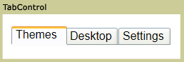

# TabControl
<xref:System.Windows.Controls.TabControl> elements display content on discrete pages accessed by selecting the appropriate tab. Each tab contains a <xref:System.Windows.Controls.TabItem>.  
  
 The following illustration shows a <xref:System.Windows.Controls.TabControl>.  
  
   
Typical TabControl  
  
## Reference  
 <xref:System.Windows.Controls.TabControl>  
  <xref:System.Windows.Controls.TabItem>  
  
## Related Sections
