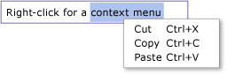

# TextBox Overview
The <xref:System.Windows.Controls.TextBox> class enables you to display or edit unformatted text. A common use of a <xref:System.Windows.Controls.TextBox> is editing unformatted text in a form. For example, a form asking for the user's name, phone number, etc would use <xref:System.Windows.Controls.TextBox> controls for text input. This topic introduces the <xref:System.Windows.Controls.TextBox> class and provides examples of how to use it in both [!INCLUDE[TLA#tla_xaml](../../../../includes/tlasharptla-xaml-md.md)] and [!INCLUDE[TLA#tla_lhcshrp](../../../../includes/tlasharptla-lhcshrp-md.md)].  
  
 
  
   
## TextBox or RichTextBox?  
 Both <xref:System.Windows.Controls.TextBox> and <xref:System.Windows.Controls.RichTextBox> allow users to input text but the two controls are used for different scenarios. A <xref:System.Windows.Controls.TextBox> requires less system resources then a <xref:System.Windows.Controls.RichTextBox> so it is ideal when only plain text needs to be edited (i.e., usage in a form). A <xref:System.Windows.Controls.RichTextBox> is a better choice when it is necessary for the user to edit formatted text, images, tables, or other supported content. For example, editing a document, article, or blog that requires formatting, images, etc is best accomplished using a <xref:System.Windows.Controls.RichTextBox>. The table below summarizes the primary features of <xref:System.Windows.Controls.TextBox> and <xref:System.Windows.Controls.TextBox>.  
  
|Control|Real-time Spellchecking|Context Menu|Formatting commands like <xref:System.Windows.Documents.EditingCommands.ToggleBold%2A> (Ctr+B)|<xref:System.Windows.Documents.FlowDocument> content like images, paragraphs, tables, etc.|  
|-------------|------------------------------|------------------|------------------------------------------------------------------------------------------------------------------------------------------------------------------------------------------------------|--------------------------------------------------------------------------------------------------------------------------------------------------------------------------------------------------|  
|<xref:System.Windows.Controls.TextBox>|Yes|Yes|No|No.|  
|<xref:System.Windows.Controls.RichTextBox>|Yes|Yes|Yes (see [RichTextBox Overview](../../../../docs/framework/wpf/controls/richtextbox-overview.md))|Yes (see [RichTextBox Overview](../../../../docs/framework/wpf/controls/richtextbox-overview.md))|  
  
> [!NOTE]
>  Although <xref:System.Windows.Controls.TextBox> does not support formatting related editing commands like <xref:System.Windows.Documents.EditingCommands.ToggleBold%2A> (Ctr+B), many basic commands are supported by both controls such as <xref:System.Windows.Documents.EditingCommands.MoveToLineEnd%2A>. See <xref:System.Windows.Documents.EditingCommands> for more information.  
  
 Features supported by <xref:System.Windows.Controls.TextBox> are covered in the sections below. For more information about <xref:System.Windows.Controls.RichTextBox>, see [RichTextBox Overview](../../../../docs/framework/wpf/controls/richtextbox-overview.md).  
  
### Real-time Spellchecking  
 You can enable real-time spellchecking in a <xref:System.Windows.Controls.TextBox> or <xref:System.Windows.Controls.RichTextBox>. When spellchecking is turned on, a red line appears underneath any misspelled words (see picture below).  
  
   
  
 See [Enable Spell Checking in a Text Editing Control](../../../../docs/framework/wpf/controls/how-to-enable-spell-checking-in-a-text-editing-control.md) to learn how to enable spellchecking.  
  
### Context Menu  
 By default, both <xref:System.Windows.Controls.TextBox> and <xref:System.Windows.Controls.RichTextBox> have a context menu that appears when a user right-clicks inside the control. The context menu allows the user to cut, copy, or paste (see picture below).  
  
   
  
 You can create your own custom context menu to override the default behavior. See [Use a Custom Context Menu with a TextBox](../../../../docs/framework/wpf/controls/how-to-use-a-custom-context-menu-with-a-textbox.md) for more information.  
  
   
## Creating TextBoxes  
 A <xref:System.Windows.Controls.TextBox> can be a single line in height or comprise multiple lines. A single line <xref:System.Windows.Controls.TextBox> is best for inputting small amounts of plain text (i.e. "Name", "Phone Number", etc. in a form). The following example shows how to create a single line <xref:System.Windows.Controls.TextBox>.  
  
 [!code-xaml[TextBoxMiscSnippets_snip#BasicTextBoxExampleWholePage](../../../../samples/snippets/csharp/VS_Snippets_Wpf/TextBoxMiscSnippets_snip/csharp/basictextboxexample.xaml#basictextboxexamplewholepage)]  
  
 You can also create a <xref:System.Windows.Controls.TextBox> that allows the user to enter multiple lines of text. For example, if your form asked for a biographical sketch of the user, you would want to use a <xref:System.Windows.Controls.TextBox> that supports multiple lines of text. The following example shows how to use [!INCLUDE[TLA#tla_xaml](../../../../includes/tlasharptla-xaml-md.md)] to define a <xref:System.Windows.Controls.TextBox> control that automatically expands to accommodate multiple lines of text.  
  
 [!code-xaml[TextBox_MiscCode#_MultilineTextBoxXAML](../../../../samples/snippets/csharp/VS_Snippets_Wpf/TextBox_MiscCode/CSharp/Window1.xaml#_multilinetextboxxaml)]  
  
 Setting the <xref:System.Windows.Controls.TextBox.TextWrapping%2A> attribute to `Wrap` causes text to wrap to a new line when the edge of the <xref:System.Windows.Controls.TextBox> control is reached, automatically expanding the <xref:System.Windows.Controls.TextBox> control to include room for a new line, if necessary.  
  
 Setting the <xref:System.Windows.Controls.Primitives.TextBoxBase.AcceptsReturn%2A> attribute to `true` causes a new line to be inserted when the RETURN key is pressed, once again automatically expanding the <xref:System.Windows.Controls.TextBox> to include room for a new line, if necessary.  
  
 The <xref:System.Windows.Controls.Primitives.TextBoxBase.VerticalScrollBarVisibility%2A> attribute adds a scroll bar to the <xref:System.Windows.Controls.TextBox>, so that the contents of the <xref:System.Windows.Controls.TextBox> can be scrolled through if the <xref:System.Windows.Controls.TextBox> expands beyond the size of the frame or window that encloses it.  
  
 For more information on different tasks associated with using a <xref:System.Windows.Controls.TextBox>, see [How-to Topics](../../../../docs/framework/wpf/controls/textbox-how-to-topics.md).  
  
   
## Detect When Content Changes  
 Usually the <xref:System.Windows.Controls.Primitives.TextBoxBase.TextChanged> event should be used to detect whenever the text in a <xref:System.Windows.Controls.TextBox> or <xref:System.Windows.Controls.RichTextBox> changes, rather then <xref:System.Windows.UIElement.KeyDown> as you might expect. See [Detect When Text in a TextBox Has Changed](../../../../docs/framework/wpf/controls/how-to-detect-when-text-in-a-textbox-has-changed.md) for an example.  
  
## See Also  
 [How-to Topics](../../../../docs/framework/wpf/controls/textbox-how-to-topics.md)  
 [RichTextBox Overview](../../../../docs/framework/wpf/controls/richtextbox-overview.md)
