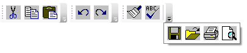

# ToolBar Overview
<xref:System.Windows.Controls.ToolBar> controls are containers for a group of commands or controls which are typically related in their function. A <xref:System.Windows.Controls.ToolBar> usually contains buttons which invoke commands.  
  
  
   
## ToolBar Control  
 The <xref:System.Windows.Controls.ToolBar> control takes its name from the bar-like arrangement of buttons or other controls into a single row or column. [!INCLUDE[TLA2#tla_winclient](../../../../includes/tla2sharptla-winclient-md.md)] <xref:System.Windows.Controls.ToolBar> controls provide an overflow mechanism which places any items that do not fit naturally within a size-constrained <xref:System.Windows.Controls.ToolBar> into a special overflow area. Also, [!INCLUDE[TLA2#tla_winclient](../../../../includes/tla2sharptla-winclient-md.md)] <xref:System.Windows.Controls.ToolBar> controls are usually used with the related <xref:System.Windows.Controls.ToolBarTray> control, which provides special layout behavior as well as support for user-initiated sizing and arranging of toolbars.  
  
   
## Specifying the Position of ToolBars in a ToolBarTray  
 Use the <xref:System.Windows.Controls.ToolBar.Band%2A> and <xref:System.Windows.Controls.ToolBar.BandIndex%2A> properties to position the <xref:System.Windows.Controls.ToolBar> in the <xref:System.Windows.Controls.ToolBarTray>. <xref:System.Windows.Controls.ToolBar.Band%2A> indicates the position in which the <xref:System.Windows.Controls.ToolBar> is placed within its parent <xref:System.Windows.Controls.ToolBarTray>. <xref:System.Windows.Controls.ToolBar.BandIndex%2A> indicates the order in which the <xref:System.Windows.Controls.ToolBar> is placed within its band. The following example shows how use this property to place <xref:System.Windows.Controls.ToolBar> controls inside a <xref:System.Windows.Controls.ToolBarTray>.  
  
 [!code-xaml[ToolBarExample#2](../../../../samples/snippets/csharp/VS_Snippets_Wpf/ToolBarExample/CS/Pane1.xaml#2)]  
  
   
## ToolBars with Overflow Items  
 Often <xref:System.Windows.Controls.ToolBar> controls contain more items than can fit into the toolbar's size. When this happens, the <xref:System.Windows.Controls.ToolBar> displays an overflow button. To see the overflow items, a user clicks the overflow button and the items are shown in a pop-up window below the <xref:System.Windows.Controls.ToolBar>. The following graphic shows a <xref:System.Windows.Controls.ToolBar> with overflow items.  
  
   
Toolbar with Overflow Items  
  
 You can specify when an item on a toolbar is placed on the overflow panel by setting the <xref:System.Windows.Controls.ToolBar.OverflowMode%2A?displayProperty=nameWithType> attached property to <xref:System.Windows.Controls.OverflowMode.Always?displayProperty=nameWithType>, <xref:System.Windows.Controls.OverflowMode.Never?displayProperty=nameWithType>, or <xref:System.Windows.Controls.OverflowMode.AsNeeded?displayProperty=nameWithType>. The following example specifies that the last four buttons on the toolbar should always be on the overflow panel.  
  
 [!code-xaml[ToolBarExample#3](../../../../samples/snippets/csharp/VS_Snippets_Wpf/ToolBarExample/CS/Pane1.xaml#3)]  
  
 The <xref:System.Windows.Controls.ToolBar> uses a <xref:System.Windows.Controls.Primitives.ToolBarPanel> and a <xref:System.Windows.Controls.Primitives.ToolBarOverflowPanel> in its <xref:System.Windows.Controls.ControlTemplate>.  The <xref:System.Windows.Controls.Primitives.ToolBarPanel> is responsible for the layout of the items on the toolbar.  The <xref:System.Windows.Controls.Primitives.ToolBarOverflowPanel> is responsible for the layout of the items that do not fit on the <xref:System.Windows.Controls.ToolBar>. For an example of a <xref:System.Windows.Controls.ControlTemplate> for a <xref:System.Windows.Controls.ToolBar>, see  
  
 [ToolBar Styles and Templates](../../../../docs/framework/wpf/controls/toolbar-styles-and-templates.md).  
  
## See Also  
 <xref:System.Windows.Controls.Primitives.ToolBarPanel>  
 <xref:System.Windows.Controls.Primitives.ToolBarOverflowPanel>  
 [Style Controls on a ToolBar](../../../../docs/framework/wpf/controls/how-to-style-controls-on-a-toolbar.md)  
 [WPF Controls Gallery Sample](http://go.microsoft.com/fwlink/?LinkID=160053)
