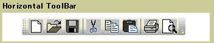

# ToolBar
The <xref:System.Windows.Controls.ToolBar> control is a container for a group of commands or controls that are typically related in their function.  
  
 The following illustrations show horizontal and vertical <xref:System.Windows.Controls.ToolBar> controls.  
  
   
Horizontal Toolbar  
  
   
Vertical Toolbar  
  
## In This Section  
 [ToolBar Overview](toolbar-overview.md)  
  [Style Controls on a ToolBar](how-to-style-controls-on-a-toolbar.md)  
  
## Reference  
 <xref:System.Windows.Controls.ToolBar>  
  <xref:System.Windows.Controls.ToolBarTray>  
  
## Related Sections
