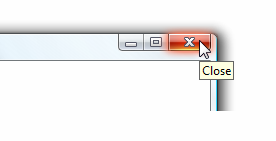

# ToolTip
A tooltip is a small pop-up window that appears when a user pauses the mouse pointer over an element, such as over a <xref:System.Windows.Controls.Button>.  
  
 The following illustration shows a mouse pointer that points to the **Close**<xref:System.Windows.Controls.Button>, which then displays its identifying <xref:System.Windows.Controls.ToolTip>.  
  
 Close button with its tooltip displayed  
  
   
  
## In This Section  
 [ToolTip Overview](../../../../docs/framework/wpf/controls/tooltip-overview.md)  
  [How-to Topics](../../../../docs/framework/wpf/controls/tooltip-how-to-topics.md)  
  
## Reference  
 <xref:System.Windows.Controls.ToolTip>  
  <xref:System.Windows.Controls.ToolTipService>  
  <xref:System.Windows.Controls.Primitives.Popup>  
  
## Related Sections  
 [Popup Overview](../../../../docs/framework/wpf/controls/popup-overview.md)  
  [How-to Topics](../../../../docs/framework/wpf/controls/popup-how-to-topics.md)
