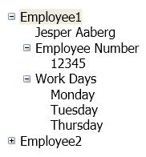

# TreeView
The <xref:System.Windows.Controls.TreeView> control displays information in a hierarchical structure by using collapsible nodes.

 The following illustration is an example of a <xref:System.Windows.Controls.TreeView> control that has nested <xref:System.Windows.Controls.TreeViewItem> controls:

 

## In This Section
 [TreeView Overview](treeview-overview.md)
 [How-to Topics](treeview-how-to-topics.md)

## Reference
 <xref:System.Windows.Controls.TreeView>
  <xref:System.Windows.Controls.TreeViewItem>

## Related Sections
 [Data Binding Overview](../../../desktop-wpf/data/data-binding-overview.md)
  [Data Templating Overview](../data/data-templating-overview.md)
