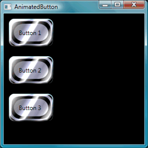
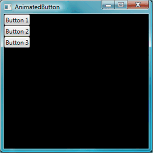
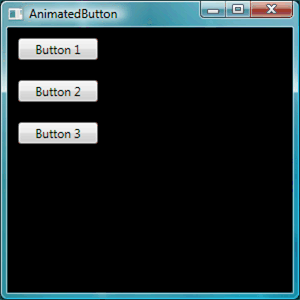
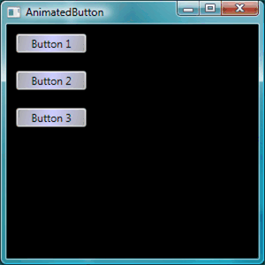
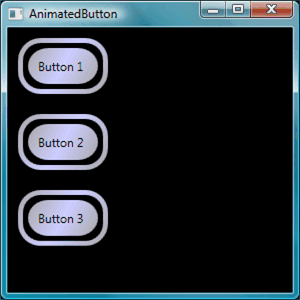

# Walkthrough: Create a Button by Using XAML
The objective of this walkthrough is to learn how to create an animated button for use in a [!INCLUDE[TLA#tla_wpf](../../../../includes/tlasharptla-wpf-md.md)] application. This walkthrough uses styles and a template to create a customized button resource that allows reuse of code and separation of button logic from the button declaration. This walkthrough is written entirely in [!INCLUDE[TLA#tla_xaml](../../../../includes/tlasharptla-xaml-md.md)].  
  
> [!IMPORTANT]
>  This walkthrough guides you through the steps for creating the application by typing or copying and pasting [!INCLUDE[TLA#tla_xaml](../../../../includes/tlasharptla-xaml-md.md)] into Microsoft [!INCLUDE[vs_current_short](../../../../includes/vs-current-short-md.md)]. If you would prefer to learn how to use a design tool (Microsoft Expression Blend) to create the same application, see [Create a Button by Using Microsoft Expression Blend](../../../../docs/framework/wpf/controls/walkthrough-create-a-button-by-using-microsoft-expression-blend.md).  
  
 The following figure shows the finished buttons.  
  
   
  
## Create Basic Buttons  
 Let's start by creating a new project and adding a few buttons to the window.  
  
#### To create a new WPF project and add buttons to the window  
  
1.  Start[!INCLUDE[vs_current_short](../../../../includes/vs-current-short-md.md)].  
  
2.  **Create a new WPF project:** On the **File** menu, point to **New**, and then click **Project**. Find the **Windows Application (WPF)** template and name the project "AnimatedButton". This will create the skeleton for the application.  
  
3.  **Add basic default buttons:** All the files you need for this walkthrough are provided by the template. Open the Window1.xaml file by double clicking it in Solution Explorer. By default, there is a <xref:System.Windows.Controls.Grid> element in Window1.xaml. Remove the <xref:System.Windows.Controls.Grid> element and add a few buttons to the [!INCLUDE[TLA#tla_xaml](../../../../includes/tlasharptla-xaml-md.md)] page by typing or copy and pasting the following highlighted code to Window1.xaml:  
  
    ```xaml  
    <Window x:Class="AnimatedButton.Window1"  
      xmlns="http://schemas.microsoft.com/winfx/2006/xaml/presentation"  
      xmlns:x="http://schemas.microsoft.com/winfx/2006/xaml"  
      Title="AnimatedButton" Height="300" Width="300"   
      Background="Black">   <!-- Buttons arranged vertically inside a StackPanel. -->   <StackPanel HorizontalAlignment="Left">     <Button>Button 1</Button>     <Button>Button 2</Button>     <Button>Button 3</Button>   </StackPanel>  
  
    </Window>  
    ```  
  
     Press F5 to run the application; you should see a set of buttons that looks like the following figure.  
  
       
  
     Now that you have created the basic buttons, you are finished working in the Window1.xaml file. The rest of the walkthrough focuses on the app.xaml file, defining styles and a template for the buttons.  
  
## Set Basic Properties  
 Next, let's set some properties on these buttons to control the button appearance and layout. Rather than setting properties on the buttons individually, you will use resources to define button properties for the entire application. Application resources are conceptually similar to external [!INCLUDE[TLA#tla_css](../../../../includes/tlasharptla-css-md.md)] for Web pages; however, resources are much more powerful than [!INCLUDE[TLA#tla_css](../../../../includes/tlasharptla-css-md.md)], as you will see by the end of this walkthrough. To learn more about resources, see [XAML Resources](../../../../docs/framework/wpf/advanced/xaml-resources.md).  
  
#### To use styles to set basic properties on the buttons  
  
1.  **Define an Application.Resources block:** Open app.xaml and add the following highlighted markup if it is not already there:  
  
    ```xaml  
    <Application x:Class="AnimatedButton.App"  
      xmlns="http://schemas.microsoft.com/winfx/2006/xaml/presentation"  
      xmlns:x="http://schemas.microsoft.com/winfx/2006/xaml"  
      StartupUri="Window1.xaml"  
      >  
      <Application.Resources>
        <!-- Resources for the entire application can be defined here. -->
      </Application.Resources>  
    </Application>  
    ```  
  
     Resource scope is determined by where you define the resource. Defining resources in `Application.Resources` in the app.xaml file enables the resource to be used from anywhere in the application. To learn more about defining the scope of your resources, see [XAML Resources](../../../../docs/framework/wpf/advanced/xaml-resources.md).  
  
2.  **Create a style and define basic property values with it:** Add the following markup to the `Application.Resources` block. This markup creates a <xref:System.Windows.Style> that applies to all buttons in the application, setting the <xref:System.Windows.FrameworkElement.Width%2A> of the buttons to 90 and the <xref:System.Windows.FrameworkElement.Margin%2A> to 10:  
  
    ```xaml  
    <Application.Resources>  
      <Style TargetType="Button">
        <Setter Property="Width" Value="90" />
        <Setter Property="Margin" Value="10" />
      </Style>  
    </Application.Resources>  
    ```  
  
     The <xref:System.Windows.Style.TargetType%2A> property specifies that the style applies to all objects of type <xref:System.Windows.Controls.Button>. Each <xref:System.Windows.Setter> sets a different property value for the <xref:System.Windows.Style>. Therefore, at this point every button in the application has a width of 90 and a margin of 10.  If you press F5 to run the application, you see the following window.  
  
       
  
     There is much more you can do with styles, including a variety of ways to fine-tune what objects are targeted, specifying complex property values, and even using styles as input for other styles. For more information, see [Styling and Templating](../../../../docs/framework/wpf/controls/styling-and-templating.md).  
  
3.  **Set a style property value to a resource:** Resources enable a simple way to reuse commonly defined objects and values. It is especially useful to define complex values using resources to make your code more modular. Add the following highlighted markup to app.xaml.  
  
    ```xaml  
    <Application.Resources>  
      <LinearGradientBrush x:Key="GrayBlueGradientBrush" StartPoint="0,0" EndPoint="1,1">
        <GradientStop Color="DarkGray" Offset="0" />
        <GradientStop Color="#CCCCFF" Offset="0.5" />
        <GradientStop Color="DarkGray" Offset="1" />
      </LinearGradientBrush>  
      <Style TargetType="{x:Type Button}">  
        <Setter Property="Background" Value="{StaticResource GrayBlueGradientBrush}" />  
        <Setter Property="Width" Value="80" />  
        <Setter Property="Margin" Value="10" />  
      </Style>  
    </Application.Resources>  
    ```  
  
     Directly under the `Application.Resources` block, you created a resource called "GrayBlueGradientBrush". This resource defines a horizontal gradient. This resource can be used as a property value from anywhere in the application, including inside the button style setter for the <xref:System.Windows.Controls.Control.Background%2A> property. Now, all the buttons have a <xref:System.Windows.Controls.Control.Background%2A> property value of this gradient.  
  
     Press F5 to run the application. It should look like the following.  
  
       
  
## Create a Template That Defines the Look of the Button  
 In this section, you create a template that customizes the appearance (presentation) of the button. The button presentation is made up of several objects including rectangles and other components to give the button a unique look.  
  
 So far, the control of how buttons look in the application has been confined to changing properties of the button. What if you want to make more radical changes to the button's appearance? Templates enable powerful control over the presentation of an object. Because templates can be used within styles, you can apply a template to all objects that the style applies to (in this walkthrough, the button).  
  
#### To use the template to define the look of the button  
  
1.  **Set up the template:** Because controls like <xref:System.Windows.Controls.Button> have a <xref:System.Windows.Controls.Control.Template%2A> property, you can define the template property value just like the other property values we have set in a <xref:System.Windows.Style> using a <xref:System.Windows.Setter>. Add the following highlighted markup to your button style.  
  
    ```xaml
    <Application.Resources>  
      <LinearGradientBrush x:Key="GrayBlueGradientBrush"   
        StartPoint="0,0" EndPoint="1,1">  
        <GradientStop Color="DarkGray" Offset="0" />  
        <GradientStop Color="#CCCCFF" Offset="0.5" />  
        <GradientStop Color="DarkGray" Offset="1" />  
      </LinearGradientBrush>  
      <Style TargetType="{x:Type Button}">  
        <Setter Property="Background" Value="{StaticResource GrayBlueGradientBrush}" />  
        <Setter Property="Width" Value="80" />  
        <Setter Property="Margin" Value="10" />  
        <Setter Property="Template">
          <Setter.Value>
            <!-- The button template is defined here. -->
          </Setter.Value>
        </Setter>  
      </Style>  
    </Application.Resources>  
    ```  
  
2.  **Alter button presentation:** At this point, you need to define the template. Add the following highlighted markup. This markup specifies two <xref:System.Windows.Shapes.Rectangle> elements with rounded edges, followed by a <xref:System.Windows.Controls.DockPanel>. The <xref:System.Windows.Controls.DockPanel> is used to host the <xref:System.Windows.Controls.ContentPresenter> of the button. A <xref:System.Windows.Controls.ContentPresenter> displays the content of the button. In this walkthrough, the content is text ("Button 1", "Button 2", "Button 3"). All of the template components (the rectangles and the <xref:System.Windows.Controls.DockPanel>) are laid out inside of a <xref:System.Windows.Controls.Grid>.  
  
    ```xaml  
    <Setter.Value>  
      <ControlTemplate TargetType="Button">
        <Grid Width="{TemplateBinding Width}" Height="{TemplateBinding Height}" ClipToBounds="True">
          <!-- Outer Rectangle with rounded corners. -->
          <Rectangle x:Name="outerRectangle" HorizontalAlignment="Stretch" VerticalAlignment="Stretch" Stroke="{TemplateBinding Background}" RadiusX="20" RadiusY="20" StrokeThickness="5" Fill="Transparent" />
          <!-- Inner Rectangle with rounded corners. -->
          <Rectangle x:Name="innerRectangle" HorizontalAlignment="Stretch" VerticalAlignment="Stretch" Stroke="Transparent" StrokeThickness="20" Fill="{TemplateBinding Background}" RadiusX="20" RadiusY="20" />
          <!-- Present Content (text) of the button. -->
          <DockPanel Name="myContentPresenterDockPanel">
            <ContentPresenter x:Name="myContentPresenter" Margin="20" Content="{TemplateBinding  Content}" TextBlock.Foreground="Black" />
          </DockPanel>
        </Grid>
      </ControlTemplate>  
    </Setter.Value>  
    ```  
  
     Press F5 to run the application. It should look like the following.  
  
       
  
3.  **Add a glasseffect to the template:** Next you will add the glass. First you create some resources that create a glass gradient effect. Add these gradient resources anywhere within the `Application.Resources` block:  
  
    ```xaml  
    <Application.Resources>  
      <GradientStopCollection x:Key="MyGlassGradientStopsResource">     <GradientStop Color="WhiteSmoke" Offset="0.2" />     <GradientStop Color="Transparent" Offset="0.4" />     <GradientStop Color="WhiteSmoke" Offset="0.5" />     <GradientStop Color="Transparent" Offset="0.75" />     <GradientStop Color="WhiteSmoke" Offset="0.9" />     <GradientStop Color="Transparent" Offset="1" />   </GradientStopCollection>   <LinearGradientBrush x:Key="MyGlassBrushResource"     StartPoint="0,0" EndPoint="1,1" Opacity="0.75"     GradientStops="{StaticResource MyGlassGradientStopsResource}" />  
    <!-- Styles and other resources below here. -->  
    ```  
  
     These resources are used as the <xref:System.Windows.Shapes.Shape.Fill%2A> for a rectangle that we insert into the <xref:System.Windows.Controls.Grid> of the button template. Add the following highlighted markup to the template.  
  
    ```  
    <Setter.Value>  
      <ControlTemplate TargetType="{x:Type Button}">  
        <Grid Width="{TemplateBinding Width}" Height="{TemplateBinding Height}"  
    ClipToBounds="True">  
  
        <!-- Outer Rectangle with rounded corners. -->  
        <Rectangle x:Name="outerRectangle" HorizontalAlignment="Stretch"   
          VerticalAlignment="Stretch" Stroke="{TemplateBinding Background}"   
          RadiusX="20" RadiusY="20" StrokeThickness="5" Fill="Transparent" />  
  
        <!-- Inner Rectangle with rounded corners. -->  
        <Rectangle x:Name="innerRectangle" HorizontalAlignment="Stretch"   
          VerticalAlignment="Stretch" Stroke="Transparent" StrokeThickness="20"   
          Fill="{TemplateBinding Background}" RadiusX="20" RadiusY="20" />  
  
        <!-- Glass Rectangle -->     <Rectangle x:Name="glassCube" HorizontalAlignment="Stretch"       VerticalAlignment="Stretch"       StrokeThickness="2" RadiusX="10" RadiusY="10" Opacity="0"       Fill="{StaticResource MyGlassBrushResource}"       RenderTransformOrigin="0.5,0.5">       <Rectangle.Stroke>         <LinearGradientBrush StartPoint="0.5,0" EndPoint="0.5,1">           <LinearGradientBrush.GradientStops>             <GradientStop Offset="0.0" Color="LightBlue" />             <GradientStop Offset="1.0" Color="Gray" />           </LinearGradientBrush.GradientStops>         </LinearGradientBrush>       </Rectangle.Stroke>       <!-- These transforms have no effect as they are declared here.             The reason the transforms are included is to be targets             for animation (see later). -->       <Rectangle.RenderTransform>         <TransformGroup>           <ScaleTransform />           <RotateTransform />         </TransformGroup>       </Rectangle.RenderTransform>       <!-- A BevelBitmapEffect is applied to give the button a             "Beveled" look. -->       <Rectangle.BitmapEffect>         <BevelBitmapEffect />       </Rectangle.BitmapEffect>     </Rectangle>  
  
        <!-- Present Text of the button. -->  
        <DockPanel Name="myContentPresenterDockPanel">  
          <ContentPresenter x:Name="myContentPresenter" Margin="20"   
            Content="{TemplateBinding  Content}" TextBlock.Foreground="Black" />  
        </DockPanel>  
      </Grid>  
    </ControlTemplate>  
    </Setter.Value>  
    ```  
  
     Notice that the <xref:System.Windows.UIElement.Opacity%2A> of the rectangle with the `x:Name` property of "glassCube" is 0, so when you run the sample, you do not see the glass rectangle overlaid on top. This is because we will later add triggers to the template for when the user interacts with the button. However, you can see what the button looks like now by changing the <xref:System.Windows.UIElement.Opacity%2A> value to 1 and running the application. See the following figure. Before proceeding to the next step, change the <xref:System.Windows.UIElement.Opacity%2A> back to 0.  
  
       
  
## Create Button Interactivity  
 In this section, you will create property triggers and event triggers to change property values and run animations in response to user actions such as moving the mouse pointer over the button and clicking.  
  
 An easy way to add interactivity (mouse-over, mouse-leave, click, and so on) is to define triggers within your template or style. To create a <xref:System.Windows.Trigger>, you define a property "condition" such as: The button <xref:System.Windows.UIElement.IsMouseOver%2A> property value is equal to `true`. You then define setters (actions) that take place when the trigger condition is true.  
  
#### To create button interactivity  
  
1.  **Add template triggers:** Add the highlighted markup to your template.  
  
    ```  
    <Setter.Value>  
      <ControlTemplate TargetType="{x:Type Button}">  
        <Grid Width="{TemplateBinding Width}"   
          Height="{TemplateBinding Height}" ClipToBounds="True">  
  
          <!-- Outer Rectangle with rounded corners. -->  
          <Rectangle x:Name="outerRectangle" HorizontalAlignment="Stretch"   
          VerticalAlignment="Stretch" Stroke="{TemplateBinding Background}"   
          RadiusX="20" RadiusY="20" StrokeThickness="5" Fill="Transparent" />  
  
          <!-- Inner Rectangle with rounded corners. -->  
          <Rectangle x:Name="innerRectangle" HorizontalAlignment="Stretch"   
            VerticalAlignment="Stretch" Stroke="Transparent"   
            StrokeThickness="20"   
            Fill="{TemplateBinding Background}" RadiusX="20" RadiusY="20"   
          />  
  
          <!-- Glass Rectangle -->  
          <Rectangle x:Name="glassCube" HorizontalAlignment="Stretch"  
            VerticalAlignment="Stretch"  
            StrokeThickness="2" RadiusX="10" RadiusY="10" Opacity="0"  
            Fill="{StaticResource MyGlassBrushResource}"  
            RenderTransformOrigin="0.5,0.5">  
            <Rectangle.Stroke>  
              <LinearGradientBrush StartPoint="0.5,0" EndPoint="0.5,1">  
                <LinearGradientBrush.GradientStops>  
                  <GradientStop Offset="0.0" Color="LightBlue" />  
                  <GradientStop Offset="1.0" Color="Gray" />  
                </LinearGradientBrush.GradientStops>  
              </LinearGradientBrush>  
            </Rectangle.Stroke>  
  
            <!-- These transforms have no effect as they   
                 are declared here.   
                 The reason the transforms are included is to be targets   
                 for animation (see later). -->  
            <Rectangle.RenderTransform>  
              <TransformGroup>  
                <ScaleTransform />  
                <RotateTransform />  
              </TransformGroup>  
            </Rectangle.RenderTransform>  
  
              <!-- A BevelBitmapEffect is applied to give the button a   
                   "Beveled" look. -->  
            <Rectangle.BitmapEffect>  
              <BevelBitmapEffect />  
            </Rectangle.BitmapEffect>  
          </Rectangle>  
  
          <!-- Present Text of the button. -->  
          <DockPanel Name="myContentPresenterDockPanel">  
            <ContentPresenter x:Name="myContentPresenter" Margin="20"   
              Content="{TemplateBinding  Content}" TextBlock.Foreground="Black" />  
          </DockPanel>  
        </Grid>  
  
        <ControlTemplate.Triggers>       <!-- Set action triggers for the buttons and define            what the button does in response to those triggers. -->     </ControlTemplate.Triggers>  
      </ControlTemplate>  
    </Setter.Value>  
    ```  
  
2.  **Add property triggers:** Add the highlighted markup to the `ControlTemplate.Triggers` block:  
  
    ```  
    <ControlTemplate.Triggers>  
  
      <!-- Set properties when mouse pointer is over the button. -->   <Trigger Property="IsMouseOver" Value="True">     <!-- Below are three property settings that occur when the           condition is met (user mouses over button).  -->     <!-- Change the color of the outer rectangle when user           mouses over it. -->     <Setter Property ="Rectangle.Stroke" TargetName="outerRectangle"       Value="{DynamicResource {x:Static SystemColors.HighlightBrushKey}}" />     <!-- Sets the glass opacity to 1, therefore, the           glass "appears" when user mouses over it. -->     <Setter Property="Rectangle.Opacity" Value="1" TargetName="glassCube" />     <!-- Makes the text slightly blurry as though you           were looking at it through blurry glass. -->     <Setter Property="ContentPresenter.BitmapEffect"        TargetName="myContentPresenter">       <Setter.Value>         <BlurBitmapEffect Radius="1" />       </Setter.Value>     </Setter>   </Trigger>  
  
    <ControlTemplate.Triggers/>  
    ```  
  
     Press F5 to run the application and see the effect as you run the mouse pointer over the buttons.  
  
3.  **Add a focus trigger:** Next, we'll add some similar setters to handle the case when the button has focus (for example, after the user clicks it).  
  
    ```  
    <ControlTemplate.Triggers>  
  
      <!-- Set properties when mouse pointer is over the button. -->  
      <Trigger Property="IsMouseOver" Value="True">  
  
        <!-- Below are three property settings that occur when the   
             condition is met (user mouses over button).  -->  
        <!-- Change the color of the outer rectangle when user          mouses over it. -->  
        <Setter Property ="Rectangle.Stroke" TargetName="outerRectangle"  
          Value="{DynamicResource {x:Static SystemColors.HighlightBrushKey}}" />  
  
        <!-- Sets the glass opacity to 1, therefore, the          glass "appears" when user mouses over it. -->  
        <Setter Property="Rectangle.Opacity" Value="1"       TargetName="glassCube" />  
  
        <!-- Makes the text slightly blurry as though you were          looking at it through blurry glass. -->  
        <Setter Property="ContentPresenter.BitmapEffect"       TargetName="myContentPresenter">  
          <Setter.Value>  
            <BlurBitmapEffect Radius="1" />  
          </Setter.Value>  
        </Setter>  
      </Trigger>  
      <!-- Set properties when button has focus. -->   <Trigger Property="IsFocused" Value="true">     <Setter Property="Rectangle.Opacity" Value="1"       TargetName="glassCube" />     <Setter Property="Rectangle.Stroke" TargetName="outerRectangle"       Value="{DynamicResource {x:Static SystemColors.HighlightBrushKey}}" />     <Setter Property="Rectangle.Opacity" Value="1" TargetName="glassCube" />   </Trigger>  
  
    </ControlTemplate.Triggers>  
    ```  
  
     Press F5 to run the application and click on one of the buttons. Notice that the button stays highlighted after you click it because it still has focus. If you click another button, the new button gains focus while the last one loses it.  
  
4.  **Add animations for**  <xref:System.Windows.UIElement.MouseEnter> **and** <xref:System.Windows.UIElement.MouseLeave> **:** Next we add some animations to the triggers. Add the following markup anywhere inside of the `ControlTemplate.Triggers` block.  
  
    ```  
    <!-- Animations that start when mouse enters and leaves button. -->  
    <EventTrigger RoutedEvent="Mouse.MouseEnter">  
      <EventTrigger.Actions>  
        <BeginStoryboard Name="mouseEnterBeginStoryboard">  
          <Storyboard>  
          <!-- This animation makes the glass rectangle shrink in the X direction. -->  
            <DoubleAnimation Storyboard.TargetName="glassCube"   
              Storyboard.TargetProperty=  
              "(Rectangle.RenderTransform).(TransformGroup.Children)[0].(ScaleTransform.ScaleX)"  
              By="-0.1" Duration="0:0:0.5" />  
            <!-- This animation makes the glass rectangle shrink in the Y direction. -->  
            <DoubleAnimation  
            Storyboard.TargetName="glassCube"   
              Storyboard.TargetProperty=  
              "(Rectangle.RenderTransform).(TransformGroup.Children)[0].(ScaleTransform.ScaleY)"   
              By="-0.1" Duration="0:0:0.5" />  
          </Storyboard>  
        </BeginStoryboard>  
      </EventTrigger.Actions>  
    </EventTrigger>  
    <EventTrigger RoutedEvent="Mouse.MouseLeave">  
      <EventTrigger.Actions>  
        <!-- Stopping the storyboard sets all animated properties back to default. -->  
        <StopStoryboard BeginStoryboardName="mouseEnterBeginStoryboard" />  
      </EventTrigger.Actions>  
    </EventTrigger>  
    ```  
  
     The glass rectangle shrinks when the mouse pointer moves over the button and returns back to normal size when the pointer leaves.  
  
     There are two animations that are triggered when the pointer goes over the button (<xref:System.Windows.UIElement.MouseEnter> event is raised). These animations shrink the glass rectangle along the X and Y axis. Notice the properties on the <xref:System.Windows.Media.Animation.DoubleAnimation> elements — <xref:System.Windows.Media.Animation.Timeline.Duration%2A> and <xref:System.Windows.Media.Animation.DoubleAnimation.By%2A>. The <xref:System.Windows.Media.Animation.Timeline.Duration%2A> specifies that the animation occurs over half a second, and <xref:System.Windows.Media.Animation.DoubleAnimation.By%2A> specifies that the glass shrinks by 10%.  
  
     The second event trigger (<xref:System.Windows.UIElement.MouseLeave>) simply stops the first one. When you stop a <xref:System.Windows.Media.Animation.Storyboard>, all the animated properties return to their default values. Therefore, when the user moves the pointer off the button, the button goes back to the way it was before the mouse pointer moved over the button. For more information about animations, see [Animation Overview](../../../../docs/framework/wpf/graphics-multimedia/animation-overview.md).  
  
5.  **Add an animation for when the button is clicked:** The final step is to add a trigger for when the user clicks the button. Add the following markup anywhere inside of the `ControlTemplate.Triggers` block:  
  
    ```  
    <!-- Animation fires when button is clicked, causing glass to spin.  -->  
    <EventTrigger RoutedEvent="Button.Click">  
      <EventTrigger.Actions>  
        <BeginStoryboard>  
          <Storyboard>  
            <DoubleAnimation Storyboard.TargetName="glassCube"   
              Storyboard.TargetProperty=  
              "(Rectangle.RenderTransform).(TransformGroup.Children)[1].(RotateTransform.Angle)"   
              By="360" Duration="0:0:0.5" />  
          </Storyboard>  
        </BeginStoryboard>  
      </EventTrigger.Actions>  
    </EventTrigger>  
    ```  
  
     Press F5 to run the application, and click one of the buttons. When you click a button, the glass rectangle spins around.  
  
## Summary  
 In this walkthrough, you performed the following exercises:  
  
-   Targeted a <xref:System.Windows.Style> to an object type (<xref:System.Windows.Controls.Button>).  
  
-   Controlled basic properties of the buttons in the entire application using the <xref:System.Windows.Style>.  
  
-   Created resources like gradients to use for property values of the <xref:System.Windows.Style> setters.  
  
-   Customized the look of buttons in the entire application by applying a template to the buttons.  
  
-   Customized behavior for the buttons in response to user actions (such as <xref:System.Windows.UIElement.MouseEnter>, <xref:System.Windows.UIElement.MouseLeave>, and <xref:System.Windows.Controls.Primitives.ButtonBase.Click>) that included animation effects.  
  
## See Also  
 [Create a Button by Using Microsoft Expression Blend](../../../../docs/framework/wpf/controls/walkthrough-create-a-button-by-using-microsoft-expression-blend.md)  
 [Styling and Templating](../../../../docs/framework/wpf/controls/styling-and-templating.md)  
 [Animation Overview](../../../../docs/framework/wpf/graphics-multimedia/animation-overview.md)  
 [Painting with Solid Colors and Gradients Overview](../../../../docs/framework/wpf/graphics-multimedia/painting-with-solid-colors-and-gradients-overview.md)  
 [Bitmap Effects Overview](../../../../docs/framework/wpf/graphics-multimedia/bitmap-effects-overview.md)
