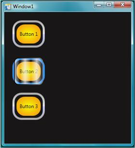

# Walkthroughs: Create a Custom Animated Button
As its name suggests, [!INCLUDE[TLA#tla_wpf](../../../../includes/tlasharptla-wpf-md.md)] is great for making rich presentation experiences for customers. These walkthroughs show you how to customize the look and behavior of a button (including animations). This customization is done using a style and template so that you can apply this custom button easily to any buttons in your application. The following illustration shows the customized button that you will create.  
  
   
  
 The vector graphics that make up the appearance of the button are created by using [!INCLUDE[TLA#tla_xaml](../../../../includes/tlasharptla-xaml-md.md)]. [!INCLUDE[TLA2#tla_xaml](../../../../includes/tla2sharptla-xaml-md.md)] is similar to HTML except it is more powerful and extensible. [!INCLUDE[TLA#tla_xaml](../../../../includes/tlasharptla-xaml-md.md)] can be typed in manually using Microsoft Visual Studio or Notepad, or you can use a visual design tool such as Microsoft Expression Blend. Expression Blend works by creating underlying [!INCLUDE[TLA2#tla_xaml](../../../../includes/tla2sharptla-xaml-md.md)] code, so both methods create the same graphics.  
  
## In This Section  
 [Create a Button by Using Microsoft Expression Blend](../../../../docs/framework/wpf/controls/walkthrough-create-a-button-by-using-microsoft-expression-blend.md)  
 Demonstrates how to create buttons with custom behavior by using the designer features of Expression Blend.  
  
 [Create a Button by Using XAML](../../../../docs/framework/wpf/controls/walkthrough-create-a-button-by-using-xaml.md)  
 Demonstrates how to create buttons with custom behavior by using [!INCLUDE[TLA2#tla_xaml](../../../../includes/tla2sharptla-xaml-md.md)] and [!INCLUDE[vs_current_short](../../../../includes/vs-current-short-md.md)].  
  
## Related Sections  
 [Styling and Templating](../../../../docs/framework/wpf/controls/styling-and-templating.md)  
 Describes how styles and templates can be used to determine the appearance and behavior of controls.  
  
 [Animation Overview](../../../../docs/framework/wpf/graphics-multimedia/animation-overview.md)  
 Describes how objects can be animated by using the [!INCLUDE[TLA2#tla_wpf](../../../../includes/tla2sharptla-wpf-md.md)] animation and timing system.  
  
 [Painting with Solid Colors and Gradients Overview](../../../../docs/framework/wpf/graphics-multimedia/painting-with-solid-colors-and-gradients-overview.md)  
 Describes how to use brush objects to paint with solid colors, linear gradients, and radial gradients.  
  
 [Bitmap Effects Overview](../../../../docs/framework/wpf/graphics-multimedia/bitmap-effects-overview.md)  
 Describes the bitmap effects supported by [!INCLUDE[TLA2#tla_wpf](../../../../includes/tla2sharptla-wpf-md.md)] and explains how to apply them.
