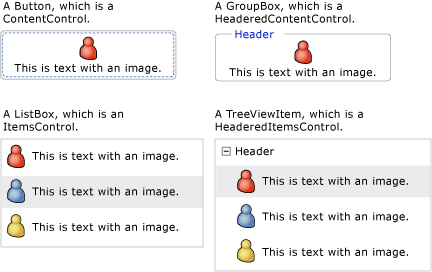
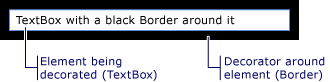

# WPF Content Model
[!INCLUDE[TLA#tla_winclient](../../../../includes/tlasharptla-winclient-md.md)] is a presentation platform that provides many controls and control-like types whose primary purpose is to display different types of content. To determine which control to use or which control to derive from, you should understand the kinds of objects a particular control can best display.  
  
 This topic summarizes the content model for [!INCLUDE[TLA2#tla_winclient](../../../../includes/tla2sharptla-winclient-md.md)] control and control-like types. The content model describes what content can be used in a control. This topic also lists the content properties for each content model. A content property is a property that is used to store the content of the object.  
  
 
  
   
## Classes That Contain Arbitrary Content  
 Some controls can contain an object of any type, such as a string, a <xref:System.DateTime> object, or a <xref:System.Windows.UIElement> that is a container for additional items. For example, a <xref:System.Windows.Controls.Button> can contain an image and some text; or a <xref:System.Windows.Controls.CheckBox> can contain the value of <xref:System.DateTime.Now%2A?displayProperty=nameWithType>.  
  
 [!INCLUDE[TLA2#tla_winclient](../../../../includes/tla2sharptla-winclient-md.md)] has four classes that can contain arbitrary content. The following table lists the classes, which inherit from <xref:System.Windows.Controls.Control>.  
  
|Class that contains arbitrary content|Content|  
|-------------------------------------------|-------------|  
|<xref:System.Windows.Controls.ContentControl>|A single arbitrary object.|  
|<xref:System.Windows.Controls.HeaderedContentControl>|A header and a single item, both of which are arbitrary objects.|  
|<xref:System.Windows.Controls.ItemsControl>|A collection of arbitrary objects.|  
|<xref:System.Windows.Controls.HeaderedItemsControl>|A header and a collection of items, all of which are arbitrary objects.|  
  
 Controls that inherit from these classes can contain the same type of content and treat the content in the same way. The following illustration shows one control from each content model that contains an image and some text.  
  
   
  
### Controls That Contain a Single Arbitrary Object  
 The <xref:System.Windows.Controls.ContentControl> class contains a single piece of arbitrary content. Its content property is <xref:System.Windows.Controls.ContentControl.Content%2A>. The following controls inherit from <xref:System.Windows.Controls.ContentControl> and use its content model:  
  
-   <xref:System.Windows.Controls.Button>  
  
-   <xref:System.Windows.Controls.Primitives.ButtonBase>  
  
-   <xref:System.Windows.Controls.CheckBox>  
  
-   <xref:System.Windows.Controls.ComboBoxItem>  
  
-   <xref:System.Windows.Controls.ContentControl>  
  
-   <xref:System.Windows.Controls.Frame>  
  
-   <xref:System.Windows.Controls.GridViewColumnHeader>  
  
-   <xref:System.Windows.Controls.GroupItem>  
  
-   <xref:System.Windows.Controls.Label>  
  
-   <xref:System.Windows.Controls.ListBoxItem>  
  
-   <xref:System.Windows.Controls.ListViewItem>  
  
-   <xref:System.Windows.Navigation.NavigationWindow>  
  
-   <xref:System.Windows.Controls.RadioButton>  
  
-   <xref:System.Windows.Controls.Primitives.RepeatButton>  
  
-   <xref:System.Windows.Controls.ScrollViewer>  
  
-   <xref:System.Windows.Controls.Primitives.StatusBarItem>  
  
-   <xref:System.Windows.Controls.Primitives.ToggleButton>  
  
-   <xref:System.Windows.Controls.ToolTip>  
  
-   <xref:System.Windows.Controls.UserControl>  
  
-   <xref:System.Windows.Window>  
  
 The following illustration shows four buttons whose <xref:System.Windows.Controls.ContentControl.Content%2A> is set to a string, a <xref:System.DateTime> object, a <xref:System.Windows.Shapes.Rectangle>, and a <xref:System.Windows.Controls.Panel> that contains an <xref:System.Windows.Shapes.Ellipse> and a <xref:System.Windows.Controls.TextBlock>.  
  
   
Four buttons that have different types of content  
  
 For an example of how to set the <xref:System.Windows.Controls.ContentControl.Content%2A> property, see <xref:System.Windows.Controls.ContentControl>.  
  
### Controls That Contain a Header and a Single Arbitrary Object  
 The <xref:System.Windows.Controls.HeaderedContentControl> class inherits from <xref:System.Windows.Controls.ContentControl> and displays content with a header. It inherits the content property, <xref:System.Windows.Controls.ContentControl.Content%2A>, from <xref:System.Windows.Controls.ContentControl> and defines the <xref:System.Windows.Controls.HeaderedContentControl.Header%2A> property that is of type <xref:System.Object>; therefore, both can be an arbitrary object.  
  
 The following controls inherit from <xref:System.Windows.Controls.HeaderedContentControl> and use its content model:  
  
-   <xref:System.Windows.Controls.Expander>  
  
-   <xref:System.Windows.Controls.GroupBox>  
  
-   <xref:System.Windows.Controls.TabItem>  
  
 The following illustration shows two <xref:System.Windows.Controls.TabItem> objects. The first <xref:System.Windows.Controls.TabItem> has <xref:System.Windows.UIElement> objects as the <xref:System.Windows.Controls.HeaderedContentControl.Header%2A> and the <xref:System.Windows.Controls.ContentControl.Content%2A>. The <xref:System.Windows.Controls.HeaderedContentControl.Header%2A> is set to a <xref:System.Windows.Controls.StackPanel> that contains an <xref:System.Windows.Shapes.Ellipse> and a <xref:System.Windows.Controls.TextBlock>. The <xref:System.Windows.Controls.ContentControl.Content%2A> is set to a <xref:System.Windows.Controls.StackPanel> that contains a <xref:System.Windows.Controls.TextBlock> and a <xref:System.Windows.Controls.Label>. The second <xref:System.Windows.Controls.TabItem> has a string in the <xref:System.Windows.Controls.HeaderedContentControl.Header%2A> and a <xref:System.Windows.Controls.TextBlock> in the <xref:System.Windows.Controls.ContentControl.Content%2A>.  
  
   
TabControl that uses different types in the Header property  
  
 For an example of how to create <xref:System.Windows.Controls.TabItem> objects, see <xref:System.Windows.Controls.HeaderedContentControl>.  
  
### Controls That Contain a Collection of Arbitrary Objects  
 The <xref:System.Windows.Controls.ItemsControl> class inherits from <xref:System.Windows.Controls.Control> and can contain multiple items, such as strings, objects, or other elements. Its content properties are <xref:System.Windows.Controls.ItemsControl.ItemsSource%2A> and <xref:System.Windows.Controls.ItemsControl.Items%2A>. <xref:System.Windows.Controls.ItemsControl.ItemsSource%2A> is typically used to populate the <xref:System.Windows.Controls.ItemsControl> with a data collection. If you do not want to use a collection to populate the <xref:System.Windows.Controls.ItemsControl>, you can add items by using the <xref:System.Windows.Controls.ItemsControl.Items%2A> property.  
  
 The following controls inherit from <xref:System.Windows.Controls.ItemsControl> and use its content model:  
  
-   <xref:System.Windows.Controls.Menu>  
  
-   <xref:System.Windows.Controls.Primitives.MenuBase>  
  
-   <xref:System.Windows.Controls.ContextMenu>  
  
-   <xref:System.Windows.Controls.ComboBox>  
  
-   <xref:System.Windows.Controls.ItemsControl>  
  
-   <xref:System.Windows.Controls.ListBox>  
  
-   <xref:System.Windows.Controls.ListView>  
  
-   <xref:System.Windows.Controls.TabControl>  
  
-   <xref:System.Windows.Controls.TreeView>  
  
-   <xref:System.Windows.Controls.Primitives.Selector>  
  
-   <xref:System.Windows.Controls.Primitives.StatusBar>  
  
 The following illustration shows a <xref:System.Windows.Controls.ListBox> that contains these types of items:  
  
-   A string.  
  
-   A <xref:System.DateTime> object.  
  
-   A <xref:System.Windows.UIElement>.  
  
-   A <xref:System.Windows.Controls.Panel> that contains an <xref:System.Windows.Shapes.Ellipse> and a <xref:System.Windows.Controls.TextBlock>.  
  
   
ListBox that contains multiple types of objects  
  
### Controls That Contain a Header and a Collection of Arbitrary Objects  
 The <xref:System.Windows.Controls.HeaderedItemsControl> class inherits from <xref:System.Windows.Controls.ItemsControl> and can contain multiple items, such as strings, objects, or other elements, and a header. It inherits the <xref:System.Windows.Controls.ItemsControl> content properties, <xref:System.Windows.Controls.ItemsControl.ItemsSource%2A>, and <xref:System.Windows.Controls.ItemsControl.Items%2A>, and it defines the <xref:System.Windows.Controls.HeaderedItemsControl.Header%2A> property that can be an arbitrary object.  
  
 The following controls inherit from <xref:System.Windows.Controls.HeaderedItemsControl> and use its content model:  
  
-   <xref:System.Windows.Controls.MenuItem>  
  
-   <xref:System.Windows.Controls.ToolBar>  
  
-   <xref:System.Windows.Controls.TreeViewItem>  
  
   
## Classes That Contain a Collection of UIElement Objects  
 The <xref:System.Windows.Controls.Panel> class positions and arranges child <xref:System.Windows.UIElement> objects. Its content property is <xref:System.Windows.Controls.Panel.Children%2A>.  
  
 The following classes inherit from the <xref:System.Windows.Controls.Panel> class and use its content model:  
  
-   <xref:System.Windows.Controls.Canvas>  
  
-   <xref:System.Windows.Controls.DockPanel>  
  
-   <xref:System.Windows.Controls.Grid>  
  
-   <xref:System.Windows.Controls.Primitives.TabPanel>  
  
-   <xref:System.Windows.Controls.Primitives.ToolBarOverflowPanel>  
  
-   <xref:System.Windows.Controls.Primitives.ToolBarPanel>  
  
-   <xref:System.Windows.Controls.Primitives.UniformGrid>  
  
-   <xref:System.Windows.Controls.StackPanel>  
  
-   <xref:System.Windows.Controls.VirtualizingPanel>  
  
-   <xref:System.Windows.Controls.VirtualizingStackPanel>  
  
-   <xref:System.Windows.Controls.WrapPanel>  
  
 For more information, see [Panels Overview](../../../../docs/framework/wpf/controls/panels-overview.md).  
  
   
## Classes That Affect the Appearance of a UIElement  
 The <xref:System.Windows.Controls.Decorator> class applies visual effects onto or around a single child <xref:System.Windows.UIElement>. Its content property is <xref:System.Windows.Controls.Decorator.Child%2A>. The following classes inherit from <xref:System.Windows.Controls.Decorator> and use its content model:  
  
-   <xref:System.Windows.Documents.AdornerDecorator>  
  
-   <xref:System.Windows.Controls.Border>  
  
-   <xref:System.Windows.Controls.Primitives.BulletDecorator>  
  
-   <xref:Microsoft.Windows.Themes.ButtonChrome>  
  
-   <xref:Microsoft.Windows.Themes.ClassicBorderDecorator>  
  
-   <xref:System.Windows.Controls.InkPresenter>  
  
-   <xref:Microsoft.Windows.Themes.ListBoxChrome>  
  
-   <xref:Microsoft.Windows.Themes.SystemDropShadowChrome>  
  
-   <xref:System.Windows.Controls.Viewbox>  
  
 The following illustration shows a <xref:System.Windows.Controls.TextBox> that has (is decorated with) a <xref:System.Windows.Controls.Border> around it.  
  
   
TextBlock that has a Border  
  
   
## Classes That Provide Visual Feedback About a UIElement  
 The <xref:System.Windows.Documents.Adorner> class provides visual cues to a user. For example, use an <xref:System.Windows.Documents.Adorner> to add functional handles to elements or provide state information about a control. The <xref:System.Windows.Documents.Adorner> class provides a framework so that you can create your own adorners. [!INCLUDE[TLA2#tla_winclient](../../../../includes/tla2sharptla-winclient-md.md)] does not provide any implemented adorners. For more information, see [Adorners Overview](../../../../docs/framework/wpf/controls/adorners-overview.md).  
  
   
## Classes That Enable Users to Enter Text  
 WPF provides three primary controls that enable users to enter text. Each control displays the text differently. The following table lists these three text-related controls, their capabilities when they display text, and their properties that contain the control's text.  
  
|Control|Text is displayed as|Content property|  
|-------------|--------------------------|----------------------|  
|<xref:System.Windows.Controls.TextBox>|Plain text|<xref:System.Windows.Controls.TextBox.Text%2A>|  
|<xref:System.Windows.Controls.RichTextBox>|Formatted text|<xref:System.Windows.Controls.RichTextBox.Document%2A>|  
|<xref:System.Windows.Controls.PasswordBox>|Hidden text (characters are masked)|<xref:System.Windows.Controls.PasswordBox.Password%2A>|  
  
   
## Classes That Display Your Text  
 Several classes can be used to display plain or formatted text. You can use <xref:System.Windows.Controls.TextBlock> to display small amounts of text. If you want to display large amounts of text, use the <xref:System.Windows.Controls.FlowDocumentReader>, <xref:System.Windows.Controls.FlowDocumentPageViewer>, or <xref:System.Windows.Controls.FlowDocumentScrollViewer> controls.  
  
 The <xref:System.Windows.Controls.TextBlock> has two content properties: <xref:System.Windows.Controls.TextBlock.Text%2A> and <xref:System.Windows.Controls.TextBlock.Inlines%2A>. When you want to display text that uses consistent formatting, the <xref:System.Windows.Controls.TextBlock.Text%2A> property is often your best choice. If you plan to use different formatting throughout the text, use the <xref:System.Windows.Controls.TextBlock.Inlines%2A> property. The <xref:System.Windows.Controls.TextBlock.Inlines%2A> property is a collection of <xref:System.Windows.Documents.Inline> objects, which specify how to format text.  
  
 The following table lists the content property for <xref:System.Windows.Controls.FlowDocumentReader>, <xref:System.Windows.Controls.FlowDocumentPageViewer>, and <xref:System.Windows.Controls.FlowDocumentScrollViewer> classes.  
  
|Control|Content property|Content property type|  
|-------------|----------------------|---------------------------|  
|<xref:System.Windows.Controls.FlowDocumentPageViewer>|Document|<xref:System.Windows.Documents.IDocumentPaginatorSource>|  
|<xref:System.Windows.Controls.FlowDocumentReader>|Document|<xref:System.Windows.Documents.FlowDocument>|  
|<xref:System.Windows.Controls.FlowDocumentScrollViewer>|Document|<xref:System.Windows.Documents.FlowDocument>|  
  
 The <xref:System.Windows.Documents.FlowDocument> implements the <xref:System.Windows.Documents.IDocumentPaginatorSource> interface; therefore, all three classes can take a <xref:System.Windows.Documents.FlowDocument> as content.  
  
   
## Classes That Format Your Text  
 <xref:System.Windows.Documents.TextElement> and its related classes allow you to format text. <xref:System.Windows.Documents.TextElement> objects contain and format text in <xref:System.Windows.Controls.TextBlock> and <xref:System.Windows.Documents.FlowDocument> objects. The two primary types of <xref:System.Windows.Documents.TextElement> objects are <xref:System.Windows.Documents.Block> elements and <xref:System.Windows.Documents.Inline> elements. A <xref:System.Windows.Documents.Block> element represents a block of text, such as a paragraph or list. An <xref:System.Windows.Documents.Inline> element represents a portion of text in a block. Many <xref:System.Windows.Documents.Inline> classes specify formatting for the text to which they are applied. Each <xref:System.Windows.Documents.TextElement> has its own content model. For more information, see the [TextElement Content Model Overview](../../../../docs/framework/wpf/advanced/textelement-content-model-overview.md).  
  
## See Also  
 [Advanced](../../../../docs/framework/wpf/advanced/index.md)
