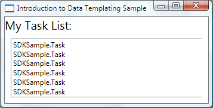
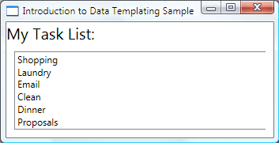
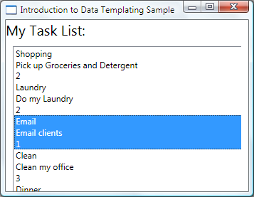
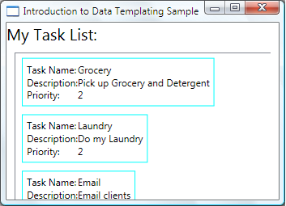
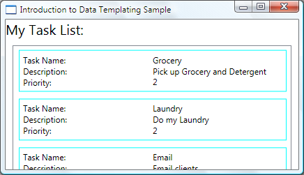
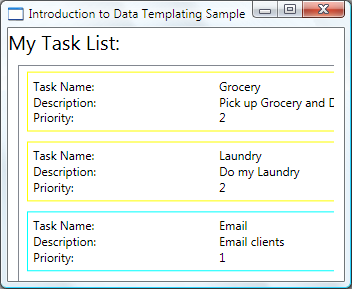
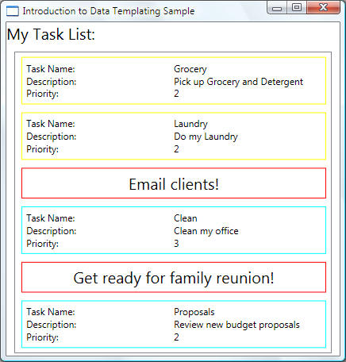
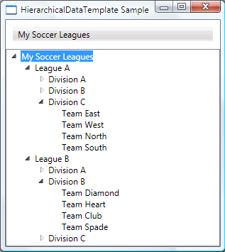

# Data Templating Overview
The WPF data templating model provides you with great flexibility to define the presentation of your data. WPF controls have built-in functionality to support the customization of data presentation. This topic first demonstrates how to define a <xref:System.Windows.DataTemplate> and then introduces other data templating features, such as the selection of templates based on custom logic and the support for the display of hierarchical data.  
  
   
## Prerequisites  
 This topic focuses on data templating features and is not an introduction of data binding concepts. For information about basic data binding concepts, see the [Data Binding Overview](../../../../docs/framework/wpf/data/data-binding-overview.md).  
  
 <xref:System.Windows.DataTemplate> is about the presentation of data and is one of the many features provided by the WPF styling and templating model. For an introduction of the WPF styling and templating model, such as how to use a <xref:System.Windows.Style> to set properties on controls, see the [Styling and Templating](../../../../docs/framework/wpf/controls/styling-and-templating.md) topic.  
  
 In addition, it is important to understand `Resources`, which are essentially what enable objects such as <xref:System.Windows.Style> and <xref:System.Windows.DataTemplate> to be reusable. For more information on resources, see [XAML Resources](../../../../docs/framework/wpf/advanced/xaml-resources.md).  
  
   
## Data Templating Basics  
  
 To demonstrate why <xref:System.Windows.DataTemplate> is important, let's walk through a data binding example. In this example, we have a <xref:System.Windows.Controls.ListBox> that is bound to a list of `Task` objects. Each `Task` object has a `TaskName` (string), a `Description` (string), a `Priority` (int), and a property of type `TaskType`, which is an `Enum` with values `Home` and `Work`.  
  
 [!code-xaml[DataTemplatingIntro_snip#Resources](../../../../samples/snippets/csharp/VS_Snippets_Wpf/DataTemplatingIntro_snip/CSharp/Window1.xaml#resources)]  
[!code-xaml[DataTemplatingIntro_snip#UI1](../../../../samples/snippets/csharp/VS_Snippets_Wpf/DataTemplatingIntro_snip/CSharp/Window1.xaml#ui1)]  
[!code-xaml[DataTemplatingIntro_snip#UI2](../../../../samples/snippets/csharp/VS_Snippets_Wpf/DataTemplatingIntro_snip/CSharp/Window1.xaml#ui2)]  
  
   
### Without a DataTemplate  
 Without a <xref:System.Windows.DataTemplate>, our <xref:System.Windows.Controls.ListBox> currently looks like this:  
  
   
  
 What's happening is that without any specific instructions, the <xref:System.Windows.Controls.ListBox> by default calls `ToString` when trying to display the objects in the collection. Therefore, if the `Task` object overrides the `ToString` method, then the <xref:System.Windows.Controls.ListBox> displays the string representation of each source object in the underlying collection.  
  
 For example, if the `Task` class overrides the `ToString` method this way, where `name` is the field for the `TaskName` property:  
  
 [!code-csharp[DataTemplatingIntro_snip#ToString](../../../../samples/snippets/csharp/VS_Snippets_Wpf/DataTemplatingIntro_snip/CSharp/Data.cs#tostring)]
 [!code-vb[DataTemplatingIntro_snip#ToString](../../../../samples/snippets/visualbasic/VS_Snippets_Wpf/DataTemplatingIntro_snip/visualbasic/data.vb#tostring)]  
  
 Then the <xref:System.Windows.Controls.ListBox> looks like the following:  
  
   
  
 However, that is limiting and inflexible. Also, if you are binding to [!INCLUDE[TLA2#tla_xml](../../../../includes/tla2sharptla-xml-md.md)] data, you wouldn't be able to override `ToString`.  
  
   
### Defining a Simple DataTemplate  
 The solution is to define a <xref:System.Windows.DataTemplate>. One way to do that is to set the <xref:System.Windows.Controls.ItemsControl.ItemTemplate%2A> property of the <xref:System.Windows.Controls.ListBox> to a <xref:System.Windows.DataTemplate>. What you specify in your <xref:System.Windows.DataTemplate> becomes the visual structure of your data object. The following <xref:System.Windows.DataTemplate> is fairly simple. We are giving instructions that each item appears as three <xref:System.Windows.Controls.TextBlock> elements within a <xref:System.Windows.Controls.StackPanel>. Each <xref:System.Windows.Controls.TextBlock> element is bound to a property of the `Task` class.  
  
 [!code-xaml[DataTemplatingIntro_snip#Inline](../../../../samples/snippets/csharp/VS_Snippets_Wpf/DataTemplatingIntro_snip/CSharp/Window1.xaml#inline)]  
  
 The underlying data for the examples in this topic is a collection of [!INCLUDE[TLA2#tla_clr](../../../../includes/tla2sharptla-clr-md.md)] objects. If you are binding to [!INCLUDE[TLA2#tla_xml](../../../../includes/tla2sharptla-xml-md.md)] data, the fundamental concepts are the same, but there is a slight syntactic difference. For example, instead of having `Path=TaskName`, you would set <xref:System.Windows.Data.Binding.XPath%2A> to `@TaskName` (if `TaskName` is an attribute of your [!INCLUDE[TLA2#tla_xml](../../../../includes/tla2sharptla-xml-md.md)] node).  
  
 Now our <xref:System.Windows.Controls.ListBox> looks like the following:  
  
   
  
   
### Creating the DataTemplate as a Resource  
 In the above example, we defined the <xref:System.Windows.DataTemplate> inline. It is more common to define it in the resources section so it can be a reusable object, as in the following example:  
  
 [!code-xaml[DataTemplatingIntro_snip#R1](../../../../samples/snippets/csharp/VS_Snippets_Wpf/DataTemplatingIntro_snip/CSharp/Window1.xaml#r1)]  
[!code-xaml[DataTemplatingIntro_snip#AsResource](../../../../samples/snippets/csharp/VS_Snippets_Wpf/DataTemplatingIntro_snip/CSharp/Window1.xaml#asresource)]  
[!code-xaml[DataTemplatingIntro_snip#R2](../../../../samples/snippets/csharp/VS_Snippets_Wpf/DataTemplatingIntro_snip/CSharp/Window1.xaml#r2)]  
  
 Now you can use `myTaskTemplate` as a resource, as in the following example:  
  
 [!code-xaml[DataTemplatingIntro_snip#MyTaskTemplate](../../../../samples/snippets/csharp/VS_Snippets_Wpf/DataTemplatingIntro_snip/CSharp/Window1.xaml#mytasktemplate)]  
  
 Because `myTaskTemplate` is a resource, you can now use it on other controls that have a property that takes a <xref:System.Windows.DataTemplate> type. As shown above, for <xref:System.Windows.Controls.ItemsControl> objects, such as the <xref:System.Windows.Controls.ListBox>, it is the <xref:System.Windows.Controls.ItemsControl.ItemTemplate%2A> property. For <xref:System.Windows.Controls.ContentControl> objects, it is the <xref:System.Windows.Controls.ContentControl.ContentTemplate%2A> property.  
  
   
### The DataType Property  
 The <xref:System.Windows.DataTemplate> class has a <xref:System.Windows.DataTemplate.DataType%2A> property that is very similar to the <xref:System.Windows.Style.TargetType%2A> property of the <xref:System.Windows.Style> class. Therefore, instead of specifying an `x:Key` for the <xref:System.Windows.DataTemplate> in the above example, you can do the following:  
  
 [!code-xaml[DataTemplatingIntro_snip#DataType](../../../../samples/snippets/csharp/VS_Snippets_Wpf/DataTemplatingIntro_snip/CSharp/Window1.xaml#datatype)]  
  
 This <xref:System.Windows.DataTemplate> gets applied automatically to all `Task` objects. Note that in this case the `x:Key` is set implicitly. Therefore, if you assign this <xref:System.Windows.DataTemplate> an `x:Key` value, you are overriding the implicit `x:Key` and the <xref:System.Windows.DataTemplate> would not be applied automatically.  
  
 If you are binding a <xref:System.Windows.Controls.ContentControl> to a collection of `Task` objects, the <xref:System.Windows.Controls.ContentControl> does not use the above <xref:System.Windows.DataTemplate> automatically. This is because the binding on a <xref:System.Windows.Controls.ContentControl> needs more information to distinguish whether you want to bind to an entire collection or the individual objects. If your <xref:System.Windows.Controls.ContentControl> is tracking the selection of an <xref:System.Windows.Controls.ItemsControl> type, you can set the <xref:System.Windows.Data.Binding.Path%2A> property of the <xref:System.Windows.Controls.ContentControl> binding to "`/`" to indicate that you are interested in the current item. For an example, see [Bind to a Collection and Display Information Based on Selection](../../../../docs/framework/wpf/data/how-to-bind-to-a-collection-and-display-information-based-on-selection.md). Otherwise, you need to specify the <xref:System.Windows.DataTemplate> explicitly by setting the <xref:System.Windows.Controls.ContentControl.ContentTemplate%2A> property.  
  
 The <xref:System.Windows.DataTemplate.DataType%2A> property is particularly useful when you have a <xref:System.Windows.Data.CompositeCollection> of different types of data objects. For an example, see [Implement a CompositeCollection](../../../../docs/framework/wpf/data/how-to-implement-a-compositecollection.md).  
  
   
## Adding More to the DataTemplate  
 Currently the data appears with the necessary information, but there's definitely room for improvement. Let's improve on the presentation by adding a <xref:System.Windows.Controls.Border>, a <xref:System.Windows.Controls.Grid>, and some <xref:System.Windows.Controls.TextBlock> elements that describe the data that is being displayed.  
  
 [!code-xaml[DataTemplatingIntro#AddingMore](../../../../samples/snippets/xaml/VS_Snippets_Wpf/DataTemplatingIntro/xaml/window1.xaml#addingmore)]  
[!code-xaml[DataTemplatingIntro#AddingMore2](../../../../samples/snippets/xaml/VS_Snippets_Wpf/DataTemplatingIntro/xaml/window1.xaml#addingmore2)]  
  
 The following screenshot shows the <xref:System.Windows.Controls.ListBox> with this modified <xref:System.Windows.DataTemplate>:  
  
   
  
 We can set <xref:System.Windows.Controls.Control.HorizontalContentAlignment%2A> to <xref:System.Windows.HorizontalAlignment.Stretch> on the <xref:System.Windows.Controls.ListBox> to make sure the width of the items takes up the entire space:  
  
 [!code-xaml[DataTemplatingIntro_snip#Stretch](../../../../samples/snippets/csharp/VS_Snippets_Wpf/DataTemplatingIntro_snip/CSharp/Window1.xaml#stretch)]  
  
 With the <xref:System.Windows.Controls.Control.HorizontalContentAlignment%2A> property set to <xref:System.Windows.HorizontalAlignment.Stretch>, the <xref:System.Windows.Controls.ListBox> now looks like this:  
  
   
  
   
### Use DataTriggers to Apply Property Values  
 The current presentation does not tell us whether a `Task` is a home task or an office task. Remember that the `Task` object has a `TaskType` property of type `TaskType`, which is an enumeration with values `Home` and `Work`.  
  
 In the following example, the <xref:System.Windows.DataTrigger> sets the <xref:System.Windows.Controls.Border.BorderBrush%2A> of the element named `border` to `Yellow` if the `TaskType` property is `TaskType.Home`.  
  
 [!code-xaml[DataTemplatingIntro#DT](../../../../samples/snippets/xaml/VS_Snippets_Wpf/DataTemplatingIntro/xaml/window1.xaml#dt)]  
[!code-xaml[DataTemplatingIntro#DataTrigger](../../../../samples/snippets/xaml/VS_Snippets_Wpf/DataTemplatingIntro/xaml/window1.xaml#datatrigger)]  
[!code-xaml[DataTemplatingIntro#AddingMore2](../../../../samples/snippets/xaml/VS_Snippets_Wpf/DataTemplatingIntro/xaml/window1.xaml#addingmore2)]  
  
 Our application now looks like the following. Home tasks appear with a yellow border and office tasks appear with an aqua border:  
  
   
  
 In this example the <xref:System.Windows.DataTrigger> uses a <xref:System.Windows.Setter> to set a property value. The trigger classes also have the <xref:System.Windows.TriggerBase.EnterActions%2A> and <xref:System.Windows.TriggerBase.ExitActions%2A> properties that allow you to start a set of actions such as animations. In addition, there is also a <xref:System.Windows.MultiDataTrigger> class that allows you to apply changes based on multiple data-bound property values.  
  
 An alternative way to achieve the same effect is to bind the <xref:System.Windows.Controls.Border.BorderBrush%2A> property to the `TaskType` property and use a value converter to return the color based on the `TaskType` value. Creating the above effect using a converter is slightly more efficient in terms of performance. Additionally, creating your own converter gives you more flexibility because you are supplying your own logic. Ultimately, which technique you choose depends on your scenario and your preference. For information about how to write a converter, see <xref:System.Windows.Data.IValueConverter>.  
  
   
### What Belongs in a DataTemplate?  
 In the previous example, we placed the trigger within the <xref:System.Windows.DataTemplate> using the <xref:System.Windows.DataTemplate>.<xref:System.Windows.DataTemplate.Triggers%2A> property. The <xref:System.Windows.Setter> of the trigger sets the value of a property of an element (the <xref:System.Windows.Controls.Border> element) that is within the <xref:System.Windows.DataTemplate>. However, if the properties that your `Setters` are concerned with are not properties of elements that are within the current <xref:System.Windows.DataTemplate>, it may be more suitable to set the properties using a <xref:System.Windows.Style> that is for the <xref:System.Windows.Controls.ListBoxItem> class (if the control you are binding is a <xref:System.Windows.Controls.ListBox>). For example, if you want your <xref:System.Windows.Trigger> to animate the <xref:System.Windows.UIElement.Opacity%2A> value of the item when a mouse points to an item, you define triggers within a <xref:System.Windows.Controls.ListBoxItem> style. For an example, see the [Introduction to Styling and Templating Sample](http://go.microsoft.com/fwlink/?LinkID=160010).  
  
 In general, keep in mind that the <xref:System.Windows.DataTemplate> is being applied to each of the generated <xref:System.Windows.Controls.ListBoxItem> (for more information about how and where it is actually applied, see the <xref:System.Windows.Controls.ItemsControl.ItemTemplate%2A> page.). Your <xref:System.Windows.DataTemplate> is concerned with only the presentation and appearance of the data objects. In most cases, all other aspects of presentation, such as what an item looks like when it is selected or how the <xref:System.Windows.Controls.ListBox> lays out the items, do not belong in the definition of a <xref:System.Windows.DataTemplate>. For an example, see the [Styling and Templating an ItemsControl](#DataTemplating_ItemsControl) section.  
  
   
## Choosing a DataTemplate Based on Properties of the Data Object  
 In [The DataType Property](#Styling_DataType) section, we discussed that you can define different data templates for different data objects. That is especially useful when you have a <xref:System.Windows.Data.CompositeCollection> of different types or collections with items of different types. In the [Use DataTriggers to Apply Property Values](#DataTrigger_to_Apply_Property_Values) section, we have shown that if you have a collection of the same type of data objects you can create a <xref:System.Windows.DataTemplate> and then use triggers to apply changes based on the property values of each data object. However, triggers allow you to apply property values or start animations but they don't give you the flexibility to reconstruct the structure of your data objects. Some scenarios may require you to create a different <xref:System.Windows.DataTemplate> for data objects that are of the same type but have different properties.  
  
 For example, when a `Task` object has a `Priority` value of `1`, you may want to give it a completely different look to serve as an alert for yourself. In that case, you create a <xref:System.Windows.DataTemplate> for the display of the high-priority `Task` objects. Let's add the following <xref:System.Windows.DataTemplate> to the resources section:  
  
 [!code-xaml[DataTemplatingIntro_snip#ImportantTemplate](../../../../samples/snippets/csharp/VS_Snippets_Wpf/DataTemplatingIntro_snip/CSharp/Window1.xaml#importanttemplate)]  
  
 Notice this example uses the <xref:System.Windows.DataTemplate>.<xref:System.Windows.FrameworkTemplate.Resources%2A> property. Resources defined in that section are shared by the elements within the <xref:System.Windows.DataTemplate>.  
  
 To supply logic to choose which <xref:System.Windows.DataTemplate> to use based on the `Priority` value of the data object, create a subclass of <xref:System.Windows.Controls.DataTemplateSelector> and override the <xref:System.Windows.Controls.DataTemplateSelector.SelectTemplate%2A> method. In the following example, the <xref:System.Windows.Controls.DataTemplateSelector.SelectTemplate%2A> method provides logic to return the appropriate template based on the value of the `Priority` property. The template to return is found in the resources of the enveloping <xref:System.Windows.Window> element.  
  
 [!code-csharp[DataTemplatingIntro_snip#DTSClass](../../../../samples/snippets/csharp/VS_Snippets_Wpf/DataTemplatingIntro_snip/CSharp/TaskListDataTemplateSelector.cs#dtsclass)]
 [!code-vb[DataTemplatingIntro_snip#DTSClass](../../../../samples/snippets/visualbasic/VS_Snippets_Wpf/DataTemplatingIntro_snip/visualbasic/tasklistdatatemplateselector.vb#dtsclass)]  
  
 We can then declare the `TaskListDataTemplateSelector` as a resource:  
  
 [!code-xaml[DataTemplatingIntro_snip#R1](../../../../samples/snippets/csharp/VS_Snippets_Wpf/DataTemplatingIntro_snip/CSharp/Window1.xaml#r1)]  
[!code-xaml[DataTemplatingIntro_snip#DTS](../../../../samples/snippets/csharp/VS_Snippets_Wpf/DataTemplatingIntro_snip/CSharp/Window1.xaml#dts)]  
[!code-xaml[DataTemplatingIntro_snip#R2](../../../../samples/snippets/csharp/VS_Snippets_Wpf/DataTemplatingIntro_snip/CSharp/Window1.xaml#r2)]  
  
 To use the template selector resource, assign it to the <xref:System.Windows.Controls.ItemsControl.ItemTemplateSelector%2A> property of the <xref:System.Windows.Controls.ListBox>. The <xref:System.Windows.Controls.ListBox> calls the <xref:System.Windows.Controls.DataTemplateSelector.SelectTemplate%2A> method of the `TaskListDataTemplateSelector` for each of the items in the underlying collection. The call passes the data object as the item parameter. The <xref:System.Windows.DataTemplate> that is returned by the method is then applied to that data object.  
  
 [!code-xaml[DataTemplatingIntro_snip#ItemTemplateSelector](../../../../samples/snippets/csharp/VS_Snippets_Wpf/DataTemplatingIntro_snip/CSharp/Window1.xaml#itemtemplateselector)]  
  
 With the template selector in place, the <xref:System.Windows.Controls.ListBox> now appears as follows:  
  
   
  
 This concludes our discussion of this example. For the complete sample, see [Introduction to Data Templating Sample](http://go.microsoft.com/fwlink/?LinkID=160009).  
  
   
## Styling and Templating an ItemsControl  
 Even though the <xref:System.Windows.Controls.ItemsControl> is not the only control type that you can use a <xref:System.Windows.DataTemplate> with, it is a very common scenario to bind an <xref:System.Windows.Controls.ItemsControl> to a collection. In the [What Belongs in a DataTemplate](#what_belongs_in_datatemplate) section we discussed that the definition of your <xref:System.Windows.DataTemplate> should only be concerned with the presentation of data. In order to know when it is not suitable to use a <xref:System.Windows.DataTemplate> it is important to understand the different style and template properties provided by the <xref:System.Windows.Controls.ItemsControl>. The following example is designed to illustrate the function of each of these properties. The <xref:System.Windows.Controls.ItemsControl> in this example is bound to the same `Tasks` collection as in the previous example. For demonstration purposes, the styles and templates in this example are all declared inline.  
  
 [!code-xaml[DataTemplatingIntro_snip#ItemsControlProperties](../../../../samples/snippets/csharp/VS_Snippets_Wpf/DataTemplatingIntro_snip/CSharp/Window1.xaml#itemscontrolproperties)]  
  
 The following is a screenshot of the example when it is rendered:  
  
   
  
 Note that instead of using the <xref:System.Windows.Controls.ItemsControl.ItemTemplate%2A>, you can use the <xref:System.Windows.Controls.ItemsControl.ItemTemplateSelector%2A>. Refer to the previous section for an example. Similarly, instead of using the <xref:System.Windows.Controls.ItemsControl.ItemContainerStyle%2A>, you have the option to use the <xref:System.Windows.Controls.ItemsControl.ItemContainerStyleSelector%2A>.  
  
 Two other style-related properties of the <xref:System.Windows.Controls.ItemsControl> that are not shown here are <xref:System.Windows.Controls.ItemsControl.GroupStyle%2A> and <xref:System.Windows.Controls.ItemsControl.GroupStyleSelector%2A>.  
  
   
## Support for Hierarchical Data  
 So far we have only looked at how to bind to and display a single collection. Sometimes you have a collection that contains other collections. The <xref:System.Windows.HierarchicalDataTemplate> class is designed to be used with <xref:System.Windows.Controls.HeaderedItemsControl> types to display such data. In the following example, `ListLeagueList` is a list of `League` objects. Each `League` object has a `Name` and a collection of `Division` objects. Each `Division` has a `Name` and a collection of `Team` objects, and each `Team` object has a `Name`.  
  
 [!code-xaml[HierarchicalDataTemplateSnippet#HDT](../../../../samples/snippets/csharp/VS_Snippets_Wpf/HierarchicalDataTemplateSnippet/CS/window1.xaml#hdt)]  
  
 The example shows that with the use of <xref:System.Windows.HierarchicalDataTemplate>, you can easily display list data that contains other lists. The following is a screenshot of the example.  
  
   
  
## See Also  
 [Data Binding](../../../../docs/framework/wpf/advanced/optimizing-performance-data-binding.md)  
 [Find DataTemplate-Generated Elements](../../../../docs/framework/wpf/data/how-to-find-datatemplate-generated-elements.md)  
 [Styling and Templating](../../../../docs/framework/wpf/controls/styling-and-templating.md)  
 [Data Binding Overview](../../../../docs/framework/wpf/data/data-binding-overview.md)  
 [GridView Column Header Styles and Templates Overview](../../../../docs/framework/wpf/controls/gridview-column-header-styles-and-templates-overview.md)
