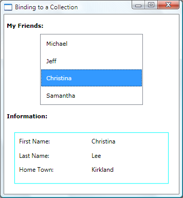

# How to: Bind to a Collection and Display Information Based on Selection
In a simple master-detail scenario, you have a data-bound <xref:System.Windows.Controls.ItemsControl> such as a <xref:System.Windows.Controls.ListBox>. Based on user selection, you display more information about the selected item. This example shows how to implement this scenario.  
  
## Example  
 In this example, `People` is an <xref:System.Collections.ObjectModel.ObservableCollection%601> of `Person` classes. This `Person` class contains three properties: `FirstName`, `LastName`, and `HomeTown`, all of type `string`.  
  
 [!code-xaml[CollectionBinding#Source](../../../../samples/snippets/csharp/VS_Snippets_Wpf/CollectionBinding/CSharp/Window1.xaml#source)]  
[!code-xaml[CollectionBinding#UI](../../../../samples/snippets/csharp/VS_Snippets_Wpf/CollectionBinding/CSharp/Window1.xaml#ui)]  
  
 The <xref:System.Windows.Controls.ContentControl> uses the following <xref:System.Windows.DataTemplate> that defines how the information of a `Person` is presented:  
  
 [!code-xaml[CollectionBinding#DetailTemplate](../../../../samples/snippets/csharp/VS_Snippets_Wpf/CollectionBinding/CSharp/Window1.xaml#detailtemplate)]  
  
 The following is a screenshot of what the example produces. The <xref:System.Windows.Controls.ContentControl> shows the other properties of the person selected.  
  
   
  
 The two things to notice in this example are:  
  
1.  The <xref:System.Windows.Controls.ListBox> and the <xref:System.Windows.Controls.ContentControl> bind to the same source. The <xref:System.Windows.Data.Binding.Path%2A> properties of both bindings are not specified because both controls are binding to the entire collection object.  
  
2.  You must set the <xref:System.Windows.Controls.Primitives.Selector.IsSynchronizedWithCurrentItem%2A> property to `true` for this to work. Setting this property ensures that the selected item is always set as the <xref:System.Windows.Controls.ItemCollection.CurrentItem%2A>. Alternatively, if the <xref:System.Windows.Controls.ListBox> gets it data from a <xref:System.Windows.Data.CollectionViewSource>, it synchronizes selection and currency automatically.  
  
 Note that the `Person` class overrides the `ToString` method the following way. By default, the <xref:System.Windows.Controls.ListBox> calls `ToString` and displays a string representation of each object in the bound collection. That is why each `Person` appears as a first name in the <xref:System.Windows.Controls.ListBox>.  
  
 [!code-csharp[CollectionBinding#ToString](../../../../samples/snippets/csharp/VS_Snippets_Wpf/CollectionBinding/CSharp/Data.cs#tostring)]
 [!code-vb[CollectionBinding#ToString](../../../../samples/snippets/visualbasic/VS_Snippets_Wpf/CollectionBinding/VisualBasic/Person.vb#tostring)]  
  
## See Also  
 [Use the Master-Detail Pattern with Hierarchical Data](../../../../docs/framework/wpf/data/how-to-use-the-master-detail-pattern-with-hierarchical-data.md)  
 [Use the Master-Detail Pattern with Hierarchical XML Data](../../../../docs/framework/wpf/data/how-to-use-the-master-detail-pattern-with-hierarchical-xml-data.md)  
 [Data Binding Overview](../../../../docs/framework/wpf/data/data-binding-overview.md)  
 [Data Templating Overview](../../../../docs/framework/wpf/data/data-templating-overview.md)  
 [How-to Topics](../../../../docs/framework/wpf/data/data-binding-how-to-topics.md)
