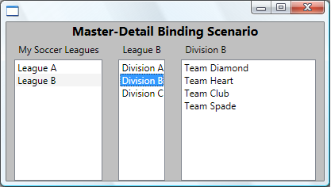

# How to: Use the Master-Detail Pattern with Hierarchical Data
This example shows how to implement the master-detail scenario.  
  
## Example  
 In this example, `LeagueList` is a collection of `Leagues`. Each `League` has a `Name` and a collection of `Divisions`, and each `Division` has a name and a collection of `Teams`. Each `Team` has a team name.  
  
 [!code-xaml[MasterDetail#HowTo1](../../../../samples/snippets/visualbasic/VS_Snippets_Wpf/MasterDetail/VisualBasic/Page1.xaml#howto1)]  
[!code-xaml[MasterDetail#HowTo2](../../../../samples/snippets/visualbasic/VS_Snippets_Wpf/MasterDetail/VisualBasic/Page1.xaml#howto2)]  
  
 The following is a screenshot of the example. The `Divisions` <xref:System.Windows.Controls.ListBox> automatically tracks selections in the `Leagues` <xref:System.Windows.Controls.ListBox> and display the corresponding data. The `Teams` <xref:System.Windows.Controls.ListBox> tracks selections in the other two <xref:System.Windows.Controls.ListBox> controls.  
  
   
  
 The two things to notice in this example are:  
  
1.  The three <xref:System.Windows.Controls.ListBox> controls bind to the same source. You set the <xref:System.Windows.Data.Binding.Path%2A> property of the binding to specify which level of data you want the <xref:System.Windows.Controls.ListBox> to display.  
  
2.  You must set the <xref:System.Windows.Controls.Primitives.Selector.IsSynchronizedWithCurrentItem%2A> property to `true` on the <xref:System.Windows.Controls.ListBox> controls of which the selection you are tracking. Setting this property ensures that the selected item is always set as the <xref:System.Windows.Controls.ItemCollection.CurrentItem%2A>. Alternatively, if the <xref:System.Windows.Controls.ListBox> gets it data from a <xref:System.Windows.Data.CollectionViewSource>, it synchronizes selection and currency automatically.  
  
 The technique is slightly different when you are using [!INCLUDE[TLA2#tla_xml](../../../../includes/tla2sharptla-xml-md.md)] data. For an example, see [Use the Master-Detail Pattern with Hierarchical XML Data](../../../../docs/framework/wpf/data/how-to-use-the-master-detail-pattern-with-hierarchical-xml-data.md).  
  
## See Also  
 <xref:System.Windows.HierarchicalDataTemplate>  
 [Bind to a Collection and Display Information Based on Selection](../../../../docs/framework/wpf/data/how-to-bind-to-a-collection-and-display-information-based-on-selection.md)  
 [Data Binding Overview](../../../../docs/framework/wpf/data/data-binding-overview.md)  
 [Data Templating Overview](../../../../docs/framework/wpf/data/data-templating-overview.md)  
 [How-to Topics](../../../../docs/framework/wpf/data/data-binding-how-to-topics.md)
