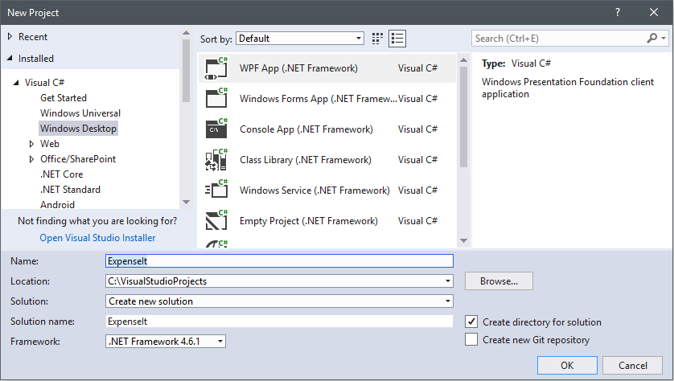
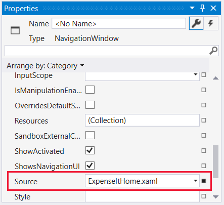
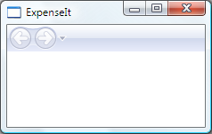
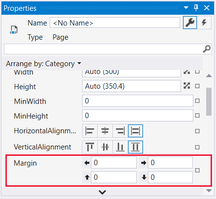
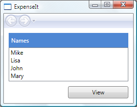
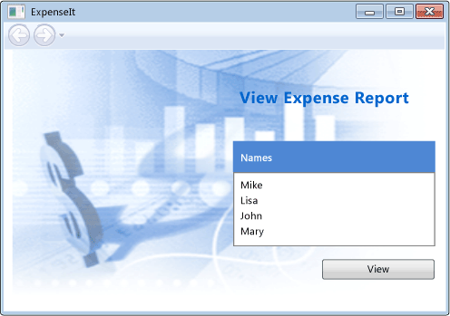
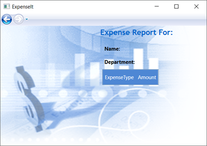
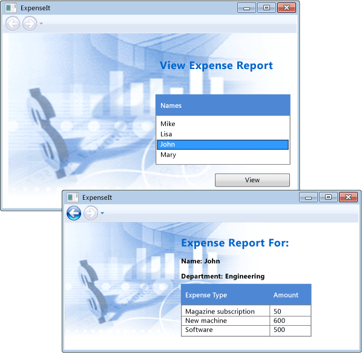

# Walkthrough: My first WPF desktop application

This article shows you how to develop a simple Windows Presentation Foundation (WPF) application that includes the elements that are common to most WPF applications: Extensible Application Markup Language (XAML) markup, code-behind, application definitions, controls, layout, data binding, and styles.

This walkthrough includes the following steps:

- Use XAML to design the appearance of the application's user interface (UI).

- Write code to build the application's behavior.

- Create an application definition to manage the application.

- Add controls and create the layout to compose the application UI.

- Create styles for a consistent appearance throughout an application's UI.

- Bind the UI to data to both populate the UI from data and keep the data and UI synchronized.

By the end of the walkthrough, you'll have built a standalone Windows application that allows users to view expense reports for selected people. The application is composed of several WPF pages that are hosted in a browser-style window.

> [!TIP]
> The sample code that is used to build this walkthrough is available for both Visual Basic and C# at [Introduction to Building WPF Applications](http://go.microsoft.com/fwlink/?LinkID=160008).

## Prerequisites

- Visual Studio 2012 or later

For more information about installing the latest version of Visual Studio, see [Install Visual Studio](/visualstudio/install/install-visual-studio).

## Create the application project

The first step is to create the application infrastructure, which includes an application definition, two pages, and an image.

1. Create a new WPF Application project in Visual Basic or Visual C# named **ExpenseIt**:

   1. Open Visual Studio and select **File** > **New** > **Project**.

      The **New Project** dialog opens.

   2. Under the **Installed** category, expand either the **Visual C#** or **Visual Basic** node, and then select **Windows Classic Desktop**.

   3. Select the **WPF App (.NET Framework)** template. Enter the name **ExpenseIt** and then select **OK**.

      

      Visual Studio creates the project and opens the designer for the default application window named **MainWindow.xaml**.

   > [!NOTE]
   > This walkthrough uses the <xref:System.Windows.Controls.DataGrid> control that is available in the .NET Framework 4 and later. Be sure that your project targets the .NET Framework 4 or later. For more information, see [How to: Target a Version of the .NET Framework](/visualstudio/ide/how-to-target-a-version-of-the-dotnet-framework).

2. Open *Application.xaml* (Visual Basic) or *App.xaml* (C#).

    This XAML file defines a WPF application and any application resources. You also use this file to specify the UI that automatically shows when the application starts; in this case, *MainWindow.xaml*.

    Your XAML should look like this in Visual Basic:

    [!code-xaml[ExpenseIt#1_A](../../../../samples/snippets/visualbasic/VS_Snippets_Wpf/ExpenseIt/VB/ExpenseIt1_A/Application.xaml#1_a)]

    Or like this in C#:

    [!code-xaml[ExpenseIt#1](../../../../samples/snippets/csharp/VS_Snippets_Wpf/ExpenseIt/CSharp/ExpenseIt/App.xaml#1)]

3. Open *MainWindow.xaml*.

    This XAML file is the main window of your application and displays content created in pages. The <xref:System.Windows.Window> class defines the properties of a window, such as its title, size, or icon, and handles events, such as closing or hiding.

4. Change the <xref:System.Windows.Window> element to a <xref:System.Windows.Navigation.NavigationWindow>, as shown in the following XAML:

   ```xaml
   <NavigationWindow x:Class="ExpenseIt.MainWindow"
        xmlns="http://schemas.microsoft.com/winfx/2006/xaml/presentation"
        xmlns:x="http://schemas.microsoft.com/winfx/2006/xaml"
        ...
   </NavigationWindow>
   ```

   This app navigates to different content depending on the user input. This is why the main <xref:System.Windows.Window> needs to be changed to a <xref:System.Windows.Navigation.NavigationWindow>. <xref:System.Windows.Navigation.NavigationWindow> inherits all the properties of <xref:System.Windows.Window>. The <xref:System.Windows.Navigation.NavigationWindow> element in the XAML file creates an instance of the <xref:System.Windows.Navigation.NavigationWindow> class. For more information, see [Navigation overview](../../../../docs/framework/wpf/app-development/navigation-overview.md).

5. Change the following properties on the <xref:System.Windows.Navigation.NavigationWindow> element:

    - Set the <xref:System.Windows.Window.Title%2A> property to "ExpenseIt".

    - Set the <xref:System.Windows.FrameworkElement.Width%2A> property to 500 pixels.

    - Set the <xref:System.Windows.FrameworkElement.Height%2A> property to 350 pixels.

    - Remove the <xref:System.Windows.Controls.Grid> elements between the <xref:System.Windows.Navigation.NavigationWindow> tags.

    Your XAML should look like this in Visual Basic:

    [!code-xaml[ExpenseIt#2_A](../../../../samples/snippets/visualbasic/VS_Snippets_Wpf/ExpenseIt/VB/ExpenseIt/MainWindow.xaml#2_a)]

    Or like this in C#:

    [!code-xaml[ExpenseIt#2](../../../../samples/snippets/csharp/VS_Snippets_Wpf/ExpenseIt/CSharp/ExpenseIt/MainWindow.xaml#2)]

6. Open *MainWindow.xaml.vb* or *MainWindow.xaml.cs*.

    This file is a code-behind file that contains code to handle the events declared in *MainWindow.xaml*. This file contains a partial class for the window defined in XAML.

7. If you are using C#, change the `MainWindow` class to derive from <xref:System.Windows.Navigation.NavigationWindow>. (In Visual Basic, this happens automatically when you change the window in XAML.)

   Your code should look like this:

   [!code-csharp[ExpenseIt#3](../../../../samples/snippets/csharp/VS_Snippets_Wpf/ExpenseIt/CSharp/ExpenseIt/MainWindow.xaml.cs#3)]
   [!code-vb[ExpenseIt#3](../../../../samples/snippets/visualbasic/VS_Snippets_Wpf/ExpenseIt/VB/ExpenseIt1_A/MainWindow.xaml.vb#3)]

   > [!TIP]
   > You can toggle the code language of the sample code between C# and Visual Basic in the **Language** drop-down on the upper right side of this article.

## Add files to the application

In this section, you'll add two pages and an image to the application.

1. Add a new WPF page to the project, and name it *ExpenseItHome.xaml*:

   1. In **Solution Explorer**, right-click on the **ExpenseIt** project node and choose **Add** > **Page**.

   1. In the **Add New Item** dialog, the **Page (WPF)** template is already selected. Enter the name **ExpenseItHome**, and then select **Add**.

    This page is the first page that's displayed when the application is launched. It will show a list of people to select from, to show an expense report for.

2. Open *ExpenseItHome.xaml*.

3. Set the <xref:System.Windows.Controls.Page.Title%2A> to "ExpenseIt - Home".

    Your XAML should look like this in Visual Basic:

    [!code-xaml[ExpenseIt#6_A](../../../../samples/snippets/visualbasic/VS_Snippets_Wpf/ExpenseIt/VB/ExpenseIt1_A/ExpenseItHome.xaml#6_a)]

    Or this in C#:

    [!code-xaml[ExpenseIt#6](../../../../samples/snippets/csharp/VS_Snippets_Wpf/ExpenseIt/CSharp/ExpenseIt2/ExpenseItHome.xaml#6)]

4. Open *MainWindow.xaml*.

5. Set the <xref:System.Windows.Navigation.NavigationWindow.Source%2A> property on the <xref:System.Windows.Navigation.NavigationWindow> to "ExpenseItHome.xaml".

    This sets *ExpenseItHome.xaml* to be the first page opened when the application starts. Your XAML should look like this in Visual Basic:

    [!code-xaml[ExpenseIt#7_A](../../../../samples/snippets/visualbasic/VS_Snippets_Wpf/ExpenseIt/VB/ExpenseIt1_A/MainWindow.xaml#7_a)]

    Or this in C#:

    [!code-xaml[ExpenseIt#7](../../../../samples/snippets/csharp/VS_Snippets_Wpf/ExpenseIt/CSharp/ExpenseIt2/MainWindow.xaml#7)]

   > [!TIP]
   > You can also set the **Source** property in the **Miscellaneous** category of the **Properties** window.
   >
   > 

6. Add another new WPF page to the project, and name it *ExpenseReportPage.xaml*::

   1. In **Solution Explorer**, right-click on the **ExpenseIt** project node and choose **Add** > **Page**.

   1. In the **Add New Item** dialog, the **Page (WPF)** template is already selected. Enter the name **ExpenseReportPage**, and then select **Add**.

    This page will show the expense report for the person that is selected on the **ExpenseItHome** page.

7. Open *ExpenseReportPage.xaml*.

8. Set the <xref:System.Windows.Controls.Page.Title%2A> to "ExpenseIt - View Expense".

    Your XAML should look like this in Visual Basic:

    [!code-xaml[ExpenseIt#4_A](../../../../samples/snippets/visualbasic/VS_Snippets_Wpf/ExpenseIt/VB/ExpenseIt1_A/ExpenseReportPage.xaml#4_a)]

    Or this in C#:

    [!code-xaml[ExpenseIt#4](../../../../samples/snippets/csharp/VS_Snippets_Wpf/ExpenseIt/CSharp/ExpenseIt/ExpenseReportPage.xaml#4)]

9. Open *ExpenseItHome.xaml.vb* and *ExpenseReportPage.xaml.vb*, or *ExpenseItHome.xaml.cs* and *ExpenseReportPage.xaml.cs*.

    When you create a new Page file, Visual Studio automatically creates a *code-behind* file. These code-behind files handle the logic for responding to user input.

    Your code should look like this for **ExpenseItHome**:

    [!code-csharp[ExpenseIt#2_5](../../../../samples/snippets/csharp/VS_Snippets_Wpf/ExpenseIt/CSharp/ExpenseIt2/ExpenseItHome.xaml.cs#2_5)]
    [!code-vb[ExpenseIt#2_5](../../../../samples/snippets/visualbasic/VS_Snippets_Wpf/ExpenseIt/VB/ExpenseIt1_A/ExpenseItHome.xaml.vb#2_5)]

    And like this for **ExpenseReport**:

    [!code-csharp[ExpenseIt#5](../../../../samples/snippets/csharp/VS_Snippets_Wpf/ExpenseIt/CSharp/ExpenseIt/ExpenseReportPage.xaml.cs#5)]
    [!code-vb[ExpenseIt#5](../../../../samples/snippets/visualbasic/VS_Snippets_Wpf/ExpenseIt/VB/ExpenseIt1_A/ExpenseReportPage.xaml.vb#5)]

10. Add an image named *watermark.png* to the project. You can create your own image, copy the file from the sample code, or get it [here](https://github.com/dotnet/docs/blob/master/docs/framework/wpf/getting-started/media/watermark.png).

   1. Right-click on the project node and select **Add** > **Existing Item**, or press **Shift**+**Alt**+**A**.

   2. In the **Add Existing Item** dialog, browse to the image file you want to use, and then select **Add**.

## Build and run the application

1. To build and run the application, press **F5** or select **Start Debugging** from the **Debug** menu.

    The following illustration shows the application with the <xref:System.Windows.Navigation.NavigationWindow> buttons:

    

2. Close the application to return to Visual Studio.

## Create the layout

Layout provides an ordered way to place UI elements, and also manages the size and position of those elements when a UI is resized. You typically create a layout with one of the following layout controls:

- <xref:System.Windows.Controls.Canvas>
- <xref:System.Windows.Controls.DockPanel>
- <xref:System.Windows.Controls.Grid>
- <xref:System.Windows.Controls.StackPanel>
- <xref:System.Windows.Controls.VirtualizingStackPanel>
- <xref:System.Windows.Controls.WrapPanel>

Each of these layout controls supports a special type of layout for its child elements. ExpenseIt pages can be resized, and each page has elements that are arranged horizontally and vertically alongside other elements. Consequently, the <xref:System.Windows.Controls.Grid> is the ideal layout element for the application.

> [!TIP]
> For more information about <xref:System.Windows.Controls.Panel> elements, see [Panels overview](../../../../docs/framework/wpf/controls/panels-overview.md). For more information about layout, see [Layout](../../../../docs/framework/wpf/advanced/layout.md).

In the section, you create a single-column table with three rows and a 10-pixel margin by adding column and row definitions to the <xref:System.Windows.Controls.Grid> in *ExpenseItHome.xaml*.

1. Open *ExpenseItHome.xaml*.

2. Set the <xref:System.Windows.FrameworkElement.Margin%2A> property on the <xref:System.Windows.Controls.Grid> element to "10,0,10,10", which corresponds to left, top, right and bottom margins:

   ```xaml
   <Grid Margin="10,0,10,10">
   ```

   > [!TIP]
   > You can also set the **Margin** values in the **Properties** window, under the **Layout** category:
   >
   > 

3. Add the following XAML between the <xref:System.Windows.Controls.Grid> tags to create the row and column definitions:

    [!code-xaml[ExpenseIt#8](../../../../samples/snippets/csharp/VS_Snippets_Wpf/ExpenseIt/CSharp/ExpenseIt3/ExpenseItHome.xaml#8)]

    The <xref:System.Windows.Controls.RowDefinition.Height%2A> of two rows is set to <xref:System.Windows.GridLength.Auto%2A>, which means that the rows are sized base on the content in the rows. The default <xref:System.Windows.Controls.RowDefinition.Height%2A> is <xref:System.Windows.GridUnitType.Star> sizing, which means that the row height is a weighted proportion of the available space. For example if two rows each have a <xref:System.Windows.Controls.RowDefinition.Height%2A> of "*", they each have a height that is half of the available space.

    Your <xref:System.Windows.Controls.Grid> should now look like the following XAML:

    [!code-xaml[ExpenseIt#9](../../../../samples/snippets/csharp/VS_Snippets_Wpf/ExpenseIt/CSharp/ExpenseIt3/ExpenseItHome.xaml#9)]

## Add controls

In this section, you'll update the home page UI to show a list of people that a user can select from to show the expense report for. Controls are UI objects that allow users to interact with your application. For more information, see [Controls](../../../../docs/framework/wpf/controls/index.md).

To create this UI, you'll add the following elements to *ExpenseItHome.xaml*:

- <xref:System.Windows.Controls.ListBox> (for the list of people).
- <xref:System.Windows.Controls.Label> (for the list header).
- <xref:System.Windows.Controls.Button> (to click to view the expense report for the person that is selected in the list).

Each control is placed in a row of the <xref:System.Windows.Controls.Grid> by setting the <xref:System.Windows.Controls.Grid.Row%2A?displayProperty=nameWithType> attached property. For more information about attached properties, see [Attached Properties Overview](../../../../docs/framework/wpf/advanced/attached-properties-overview.md).

1. Open *ExpenseItHome.xaml*.

2. Add the following XAML somewhere between the <xref:System.Windows.Controls.Grid> tags:

   [!code-xaml[ExpenseIt#10](../../../../samples/snippets/csharp/VS_Snippets_Wpf/ExpenseIt/CSharp/ExpenseIt4/ExpenseItHome.xaml#10)]

   > [!TIP]
   > You can also create the controls by dragging them from the **Toolbox** window onto the design window, and then setting their properties in the **Properties** window.

3. Build and run the application.

The following illustration shows the controls you just created:



## Add an image and a title

In this section, you'll update the home page UI with an image and a page title.

1. Open *ExpenseItHome.xaml*.

2. Add another column to the <xref:System.Windows.Controls.Grid.ColumnDefinitions%2A> with a fixed <xref:System.Windows.Controls.ColumnDefinition.Width%2A> of 230 pixels:

    [!code-xaml[ExpenseIt#11](../../../../samples/snippets/csharp/VS_Snippets_Wpf/ExpenseIt/CSharp/ExpenseIt5/ExpenseItHome.xaml#11)]

3. Add another row to the <xref:System.Windows.Controls.Grid.RowDefinitions%2A>, for a total of four rows:

    [!code-xaml[ExpenseIt#11b](../../../../samples/snippets/csharp/VS_Snippets_Wpf/ExpenseIt/CSharp/ExpenseIt5/ExpenseItHome.xaml#11b)]

4. Move the controls to the second column by setting the <xref:System.Windows.Controls.Grid.Column%2A?displayProperty=nameWithType> property to 1 in each of the three controls (Border, ListBox, and Button).

5. Move each control down a row, by incrementing its <xref:System.Windows.Controls.Grid.Row%2A?displayProperty=nameWithType> value by 1.

   The XAML for the three controls now looks like this:

    [!code-xaml[ExpenseIt#12](../../../../samples/snippets/csharp/VS_Snippets_Wpf/ExpenseIt/CSharp/ExpenseIt5/ExpenseItHome.xaml#12)]

6. Set the <xref:System.Windows.Controls.Panel.Background%2A> of the <xref:System.Windows.Controls.Grid> to be the *watermark.png* image file, by adding the following XAML somewhere between the `<Grid>` and `<\/Grid>` tags:

    [!code-xaml[ExpenseIt#14](../../../../samples/snippets/csharp/VS_Snippets_Wpf/ExpenseIt/CSharp/ExpenseIt5/ExpenseItHome.xaml#14)]

7. Before the <xref:System.Windows.Controls.Border> element, add a <xref:System.Windows.Controls.Label> with the content "View Expense Report". This is the title of the page.

    [!code-xaml[ExpenseIt#13](../../../../samples/snippets/csharp/VS_Snippets_Wpf/ExpenseIt/CSharp/ExpenseIt5/ExpenseItHome.xaml#13)]

8. Build and run the application.

The following illustration shows the results of what you just added:



## Add code to handle events

1. Open *ExpenseItHome.xaml*.

2. Add a <xref:System.Windows.Controls.Primitives.ButtonBase.Click> event handler to the <xref:System.Windows.Controls.Button> element. For more information, see [How to: Create a simple event handler](http://msdn.microsoft.com/library/b1456e07-9dec-4354-99cf-18666b64f480).

    [!code-xaml[ExpenseIt#15](../../../../samples/snippets/csharp/VS_Snippets_Wpf/ExpenseIt/CSharp/ExpenseIt6/ExpenseItHome.xaml#15)]

3. Open *ExpenseItHome.xaml.vb* or *ExpenseItHome.xaml.cs*.

4. Add the following code to the `ExpenseItHome` class to add a button click event handler. The event handler opens the **ExpenseReportPage** page.

    [!code-csharp[ExpenseIt#16](../../../../samples/snippets/csharp/VS_Snippets_Wpf/ExpenseIt/CSharp/ExpenseIt6/ExpenseItHome.xaml.cs#16)]
    [!code-vb[ExpenseIt#16](../../../../samples/snippets/visualbasic/VS_Snippets_Wpf/ExpenseIt/VB/ExpenseIt6/ExpenseItHome.xaml.vb#16)]

## Create the UI for ExpenseReportPage

*ExpenseReportPage.xaml* displays the expense report for the person that's selected on the **ExpenseItHome** page. In this section, you'll controls and create the UI for **ExpenseReportPage**. You'll also add background and fill colors to the various UI elements.

1. Open *ExpenseReportPage.xaml*.

2. Add the following XAML between the <xref:System.Windows.Controls.Grid> tags:

    [!code-xaml[ExpenseIt#17](../../../../samples/snippets/csharp/VS_Snippets_Wpf/ExpenseIt/CSharp/ExpenseIt6/ExpenseReportPage.xaml#17)]

    This UI is similar to *ExpenseItHome.xaml*, except the report data is displayed in a <xref:System.Windows.Controls.DataGrid>.

3. Build and run the application.

    > [!NOTE]
    > If you get an error that the <xref:System.Windows.Controls.DataGrid> was not found or does not exist, make sure that your project targets the .NET Framework 4 or later. For more information, see [How to: Target a Version of the .NET Framework](/visualstudio/ide/how-to-target-a-version-of-the-dotnet-framework).

4. Select the **View** button.

    The expense report page appears. Also notice that the back navigation button is enabled.

The following illustration shows the UI elements added to *ExpenseReportPage.xaml*.



## Style controls

The appearance of various elements is often the same for all elements of the same type in a UI. UI uses [styles](../../../../docs/framework/wpf/controls/styling-and-templating.md) to make appearances reusable across multiple elements. The reusability of styles helps to simplify XAML creation and management. This section replaces the per-element attributes that were defined in previous steps with styles.

1. Open *Application.xaml* or *App.xaml*.

2. Add the following XAML between the <xref:System.Windows.Application.Resources%2A?displayProperty=nameWithType> tags:

    [!code-xaml[ExpenseIt#18](../../../../samples/snippets/csharp/VS_Snippets_Wpf/ExpenseIt/CSharp/ExpenseIt7/App.xaml#18)]

    This XAML adds the following styles:

    - `headerTextStyle`: To format the page title <xref:System.Windows.Controls.Label>.

    - `labelStyle`: To format the <xref:System.Windows.Controls.Label> controls.

    - `columnHeaderStyle`: To format the <xref:System.Windows.Controls.Primitives.DataGridColumnHeader>.

    - `listHeaderStyle`: To format the list header <xref:System.Windows.Controls.Border> controls.

    - `listHeaderTextStyle`: To format the list header <xref:System.Windows.Controls.Label>.

    - `buttonStyle`: To format the <xref:System.Windows.Controls.Button> on ExpenseItHome.xaml.

    Notice that the styles are resources and children of the <xref:System.Windows.Application.Resources%2A?displayProperty=nameWithType> property element. In this location, the styles are applied to all the elements in an application. For an example of using resources in a .NET Framework application, see [Use Application Resources](../../../../docs/framework/wpf/advanced/how-to-use-application-resources.md).

3. Open *ExpenseItHome.xaml*.

4. Replace everything between the <xref:System.Windows.Controls.Grid> elements with the following XAML:

    [!code-xaml[ExpenseIt#19](../../../../samples/snippets/csharp/VS_Snippets_Wpf/ExpenseIt/CSharp/ExpenseIt7/ExpenseItHome.xaml#19)]

    The properties such as <xref:System.Windows.VerticalAlignment> and <xref:System.Windows.Media.FontFamily> that define the look of each control are removed and replaced by applying the styles. For example, the `headerTextStyle` is applied to the "View Expense Report" <xref:System.Windows.Controls.Label>.

5. Open *ExpenseReportPage.xaml*.

6. Replace everything between the <xref:System.Windows.Controls.Grid> elements with the following XAML:

    [!code-xaml[ExpenseIt#20](../../../../samples/snippets/csharp/VS_Snippets_Wpf/ExpenseIt/CSharp/ExpenseIt7/ExpenseReportPage.xaml#20)]

    This adds styles to the <xref:System.Windows.Controls.Label> and <xref:System.Windows.Controls.Border> elements.

## Bind data to a control

In this section, you'll create the XML data that is bound to various controls.

1. Open *ExpenseItHome.xaml*.

2. After the opening <xref:System.Windows.Controls.Grid> element, add the following XAML to create an <xref:System.Windows.Data.XmlDataProvider> that contains the data for each person:

    [!code-xaml[ExpenseIt#21](../../../../samples/snippets/csharp/VS_Snippets_Wpf/ExpenseIt/CSharp/ExpenseIt8/ExpenseItHome.xaml#21)]
    [!code-xaml[ExpenseIt#23](../../../../samples/snippets/csharp/VS_Snippets_Wpf/ExpenseIt/CSharp/ExpenseIt8/ExpenseItHome.xaml#23)]
    [!code-xaml[ExpenseIt#22](../../../../samples/snippets/csharp/VS_Snippets_Wpf/ExpenseIt/CSharp/ExpenseIt8/ExpenseItHome.xaml#22)]

    The data is created as a <xref:System.Windows.Controls.Grid> resource. Normally this would be loaded as a file, but for simplicity the data is added inline.

3. Within the `<Grid.Resources>` element, add the following <xref:System.Windows.DataTemplate>, which defines how to display the data in the <xref:System.Windows.Controls.ListBox>:

    [!code-xaml[ExpenseIt#21](../../../../samples/snippets/csharp/VS_Snippets_Wpf/ExpenseIt/CSharp/ExpenseIt8/ExpenseItHome.xaml#21)]
    [!code-xaml[ExpenseIt#24](../../../../samples/snippets/csharp/VS_Snippets_Wpf/ExpenseIt/CSharp/ExpenseIt8/ExpenseItHome.xaml#24)]
    [!code-xaml[ExpenseIt#22](../../../../samples/snippets/csharp/VS_Snippets_Wpf/ExpenseIt/CSharp/ExpenseIt8/ExpenseItHome.xaml#22)]

    For more information about data templates, see [Data templating overview](../../../../docs/framework/wpf/data/data-templating-overview.md).

4. Replace the existing <xref:System.Windows.Controls.ListBox> with the following XAML:

    [!code-xaml[ExpenseIt#25](../../../../samples/snippets/csharp/VS_Snippets_Wpf/ExpenseIt/CSharp/ExpenseIt8/ExpenseItHome.xaml#25)]

    This XAML binds the <xref:System.Windows.Controls.ItemsControl.ItemsSource%2A> property of the <xref:System.Windows.Controls.ListBox> to the data source and applies the data template as the <xref:System.Windows.Controls.ItemsControl.ItemTemplate%2A>.

## Connect data to controls

Next, you'll add code to retrieve the name that's selected on the **ExpenseItHome** page and pass it to the constructor of **ExpenseReportPage**. **ExpenseReportPage** sets its data context with the passed item, which is what the controls defined in *ExpenseReportPage.xaml* bind to.

1. Open *ExpenseReportPage.xaml.vb* or *ExpenseReportPage.xaml.cs*.

2. Add a constructor that takes an object so you can pass the expense report data of the selected person.

    [!code-csharp[ExpenseIt#26](../../../../samples/snippets/csharp/VS_Snippets_Wpf/ExpenseIt/CSharp/ExpenseIt8/ExpenseReportPage.xaml.cs#26)]
    [!code-vb[ExpenseIt#26](../../../../samples/snippets/visualbasic/VS_Snippets_Wpf/ExpenseIt/VB/ExpenseIt8/ExpenseReportPage.xaml.vb#26)]

3. Open *ExpenseItHome.xaml.vb* or *ExpenseItHome.xaml.cs*.

4. Change the <xref:System.Windows.Controls.Primitives.ButtonBase.Click> event handler to call the new constructor passing the expense report data of the selected person.

    [!code-csharp[ExpenseIt#27](../../../../samples/snippets/csharp/VS_Snippets_Wpf/ExpenseIt/CSharp/ExpenseIt8/ExpenseItHome.xaml.cs#27)]
    [!code-vb[ExpenseIt#27](../../../../samples/snippets/visualbasic/VS_Snippets_Wpf/ExpenseIt/VB/ExpenseIt8/ExpenseItHome.xaml.vb#27)]

## Style data with data templates

In this section, you'll update the UI for each item in the data-bound lists by using data templates.

1. Open *ExpenseReportPage.xaml*.

2. Bind the content of the "Name" and "Department" <xref:System.Windows.Controls.Label> elements to the appropriate data source property. For more information about data binding, see [Data binding overview](../../../../docs/framework/wpf/data/data-binding-overview.md).

    [!code-xaml[ExpenseIt#31](../../../../samples/snippets/csharp/VS_Snippets_Wpf/ExpenseIt/CSharp/ExpenseIt9/ExpenseReportPage.xaml#31)]

3. After the opening <xref:System.Windows.Controls.Grid> element, add the following data templates, which define how to display the expense report data:

    [!code-xaml[ExpenseIt#30](../../../../samples/snippets/csharp/VS_Snippets_Wpf/ExpenseIt/CSharp/ExpenseIt9/ExpenseReportPage.xaml#30)]

4. Apply the templates to the <xref:System.Windows.Controls.DataGrid> columns that display the expense report data.

    [!code-xaml[ExpenseIt#32](../../../../samples/snippets/csharp/VS_Snippets_Wpf/ExpenseIt/CSharp/ExpenseIt9/ExpenseReportPage.xaml#32)]

5. Build and run the application.

6. Select a person and then select the **View** button.

The following illustration shows both pages of the ExpenseIt application with controls, layout, styles, data binding, and data templates applied:



> [!NOTE]
> This sample demonstrates a specific feature of WPF and doesn't follow all best practices for things like security, localization, and accessibility. For comprehensive coverage of WPF and the .NET Framework application development best practices, see the following topics:
>
> - [Accessibility](../../../../docs/framework/ui-automation/accessibility-best-practices.md)
>
> - [Security](../../../../docs/framework/wpf/security-wpf.md)
>
> - [WPF globalization and localization](../../../../docs/framework/wpf/advanced/wpf-globalization-and-localization-overview.md)
>
> - [WPF performance](../../../../docs/framework/wpf/advanced/optimizing-wpf-application-performance.md)

## Next steps

In this walkthrough you learned a number of techniques for creating a UI using Windows Presentation Foundation (WPF). You should now have a basic understanding of the building blocks of a data-bound, .NET Framework application. For more information about the WPF architecture and programming models, see the following topics:

- [WPF architecture](../../../../docs/framework/wpf/advanced/wpf-architecture.md)
- [XAML overview (WPF)](../../../../docs/framework/wpf/advanced/xaml-overview-wpf.md)
- [Dependency properties overview](../../../../docs/framework/wpf/advanced/dependency-properties-overview.md)
- [Layout](../../../../docs/framework/wpf/advanced/layout.md)

For more information about creating applications, see the following topics:

- [Application development](../../../../docs/framework/wpf/app-development/index.md)
- [Controls](../../../../docs/framework/wpf/controls/index.md)
- [Data binding overview](../../../../docs/framework/wpf/data/data-binding-overview.md)
- [Graphics and multimedia](../../../../docs/framework/wpf/graphics-multimedia/index.md)
- [Documents in WPF](../../../../docs/framework/wpf/advanced/documents-in-wpf.md)

## See also

- [Panels overview](../../../../docs/framework/wpf/controls/panels-overview.md)
- [Data templating overview](../../../../docs/framework/wpf/data/data-templating-overview.md)
- [Build a WPF application](../../../../docs/framework/wpf/app-development/building-a-wpf-application-wpf.md)
- [Styles and templates](../../../../docs/framework/wpf/controls/styles-and-templates.md)
